Architecture and Principles
===========================

Lesson 2 Intro
--------------

We'll begin our foray into networking by reviewing the history of the internet and its design
principles. Networking today is an eclectic mix of theory and practice in large part because the
early internet architects set out with clear goals and allowed flexibility in achieving them.

With all that flexibility, does that mean we'll see the rollout of IPv6 soon?

Only in your dreams.

A Brief History of the Internet
---------------------------------

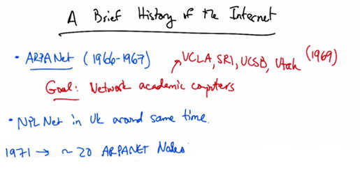

   A Brief History of the Internet — ARPANet (1966-1967), UCLA, SRI, UCSB, Utah (1969).
   Goal: Network academic computers. NPL Net in UK around same time. 1971 → ~20 ARPANET Nodes.

In this lesson we will cover a brief history of the internet. The internet has its roots in the ARPA
Net which was conceived in 1966 to connect big academic computers together. The first
operational ARPA Net nodes came online in 1969 at UCLA, SRI, UCSB, and Utah. Around the
same time, the National Physical Laboratory in the UK also came online. By 1971 there were
about 20 ARPANet Nodes and the first host-to-host protocol. There were two cross country
links, and all of the links were at 50 KBPS.

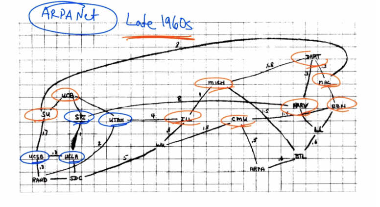

   ARPANet in the late 1960s, as sketched by Larry Roberts. Shows the four original nodes
   (UCLA, SRI, UCSB, Utah) plus well-known players: Berkeley, MAC project at MIT, BBN,
   Harvard, Carnegie-Mellon, Michigan, Illinois, Dartmouth, Stanford, and others.

Here is a rough sketch of the ARPANet as drawn by Larry Roberts in the late 1960s. You can see
the four original Nodes here, as well as some other well known players such as Berkeley, the
MAC project at MIT, BBN, Harvard, Carnegie-Mellon, Michigan, Illinois, Dartmouth, Stanford,
and so forth. This is what the ARPANET looked like in the late 1960s.

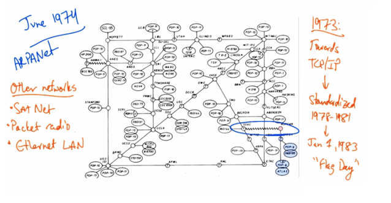

   ARPANet in June 1974 showing expanded network with other networks (Sat Net, Packet radio,
   Ethernet LAN). Right side: 1973 → Towards TCP/IP → Standardized 1978-1981 → Jan 1, 1983
   "Flag Day".

Here's a picture of the ARPANET in June 1974. And you can see not only some additional
networks that have come online, but also a diagram of the machines that are connected at each of
the universities. You can also see a connection here between the ArpaNet and MPLnet. Of
course, the ArpaNet wasn't the only network. There were other networks at the time. Sat Net
operated over satellite. There were packet radio networks, and there were also Ethernet local area
networks. Work started in 1973 on replacing the original network control protocol with TCP/IP
where IP was the Internetwork Protocol and TCP was the Transmission Control Protocol.

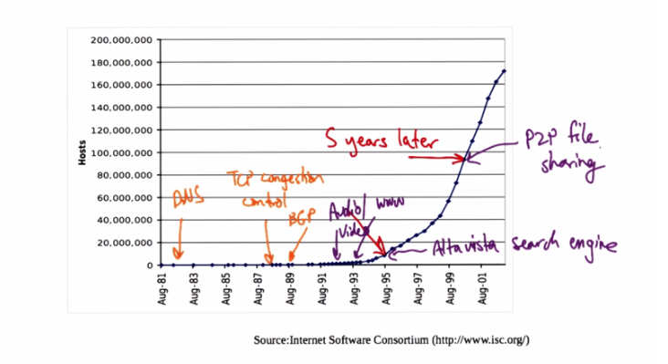

   Internet host growth chart from 1981 to 2001, annotated with milestones: DNS (1982),
   TCP Congestion Control (1988), BGP (1989), Audio/Video streaming (~1992), WWW (1993),
   AltaVista search engine (1995), P2P file sharing (~2000). Shows exponential growth from
   ~1M hosts to 170M+ hosts.

TCP/IP was ultimately standardized from 1978 to 1981 and included in Berkley UNIX in 1981.
And on January 1st, 1983 the internet had one of its flag days, where the ArpaNet transitioned to
TCP/IP. Now the internet continued to grow, but the number of computers on the internet really
didn't start to take off until the mid 90s. You can see here that around August 1995 there were
about 10 million hosts on the internet, and five years later there was an order of magnitude more
hosts on the internet — more than 100 million. During this period the Internet experienced a
number of technical milestones. In 1982 the internet saw the rollout of the domain name system
which replaced the host.txt file containing all the world's machine names with a distributed name
lookup system. 1988 saw the rollout of TCP Congestion Control after the net suffered a series
of congestion collapses. 1989 saw the NSF net and BGP inter-domain routing including support
for routing policy. The 90s, on the other hand, saw a lot of new applications. In approximately
1992 we started to see a lot of streaming media including audio and video. Web was not soon
after, in 1993, which allowed users to browse a mesh of hyperlinks. The first major search
engine was Altavista, which came online in December of 1995, and peer to peer protocols and
applications including file sharing, began to emerge around 2000.

Problems and Growing Pains
---------------------------

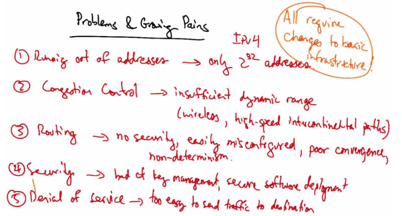

   Problems & Growing Pains — All require changes to basic infrastructure: (1) Running out of
   addresses → only 2^32 addresses (IPv4). (2) Congestion Control → insufficient dynamic range
   (wireless, high-speed intercontinental paths). (3) Routing → no security, easily misconfigured,
   poor convergence, non-determinism. (4) Security → bad key management, secure software
   deployment. (5) Denial of service → too easy to send traffic to destination.

Now, today's internet is experiencing considerable problems and growing pains, and it's worth
bearing some of these in mind and thinking about them, as many of them give rise to interesting
research problems to think about as we work through the material in the course. One of the major
problems is that we're running out of addresses. The current version of the internet protocol,
IPV4, uses 32-bit addresses, meaning that the IPV4 internet only has 2 to the 32 IP addresses, or
about 4 billion IP addresses. Furthermore, these IP addresses need to be allocated hierarchically
and many portions of the IP address space are not allocated very efficiently. For example, the
Massachusetts Institute of Technology has one two fifty sixth of all the Internet address space.
Another problem is congestion control. Now congestion control's goal is to match offered load to
available capacity. But one of the problems with today's congestion control algorithms is that
they have insufficient dynamic range. They don't work very well over slow and flaky wireless
links and they don't work very well over very high speed intercontinental paths. Now, some
solutions exist but change is hard and all solutions that are deployed must interact well with one
another. And deployment in some sense requires some amount of consensus. A third major
problem is routing. Routing is the process by which those on the internet discover paths to take
to reach another destination. Today's interdomain routing protocol, BGP, suffers a number of ills,
including a lack of security, ease of misconfiguration, poor convergence, and non-determinism.
But it sort of works and it's the most critical piece of the internet infrastructure in some sense
because it's the glue that holds all of the internet service providers together. Another major
problem in today's internet is security. Now while we're reasonably good at encryption and
authentication, we are not actually so good at turning these mechanisms on. And we're pretty bad
at key management, as well as deploying secure software and secure configurations. The fifth
major problem is denial of service. And the internet does a very good job of transmitting packets
to a destination even if the destination doesn't want those packets. This makes it easy for an
attacker to overload servers or network links to prevent the victim from doing useful work.
Distributed denial of service attacks are particularly commonplace on today's Internet. Now, the
thing that all of those problems have in common is that they all require changes to the basic
infrastructure, and changing basic infrastructure is really difficult. It's not even clear what the
process is to achieve consensus on changes. So as we work our way through the course, it will be
interesting to see the problems that we encounter in each of these areas, various solutions that
have been proposed, and also to think about ways in which new protocols and technologies can
be deployed. In later parts of the course we'll learn about a new technology called software
defined networking, or SDN. That makes it easier to solve some of these problems by rolling out
new software technologies, protocols, and other systems to help manage some of these issues.

Architectural Design Principles
---------------------------------

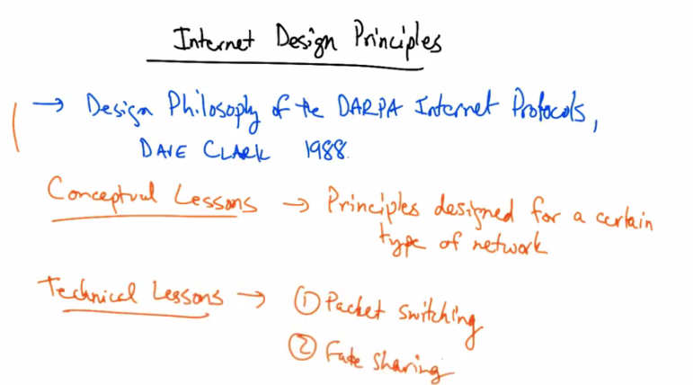

   Internet Design Principles — Design Philosophy of the DARPA Internet Protocols, Dave Clark
   1988. Conceptual Lessons → Principles designed for a certain type of network. Technical
   Lessons → (1) Packet switching, (2) Fate sharing.

In this lecture we will talk about the Internet's original design principles. These design principles
were discussed in the paper reading for today, the Design Philosophy of the DARPA Internet
Protocols, by Dave Clark, dated 1988. The paper has many important lessons, and we will go
through many of them as we revisit many of the design decisions. Before we jump into any
details let's talk about some of the high level lessons. One of the most important conceptual
lessons is that the design principles and priorities were designed for a certain type of network.
And as the internet evolves, we are feeling some of the growing pains of some of those choices.
In the last lesson we talked about a number of the problems and growing pains of the internet.
And it's worth bearing in mind that many of the problems that we are seeing now, are a result of
some of the original design choices. Now that's not to say that some of these design choices are
right or wrong, but rather that they simply reflect the nature of our understanding at the time, as
well as the environment and constraints that the designers faced for the particular network that
existed at that time. Now needless to say, some of the technical lessons from the original design
have turned out to be fairly timeless. One concept is packet switching, which we will discuss in
this lesson. And another is the notion of fate sharing, or soft state, which we will discuss in a
subsequent lesson in the course.

Goal
----

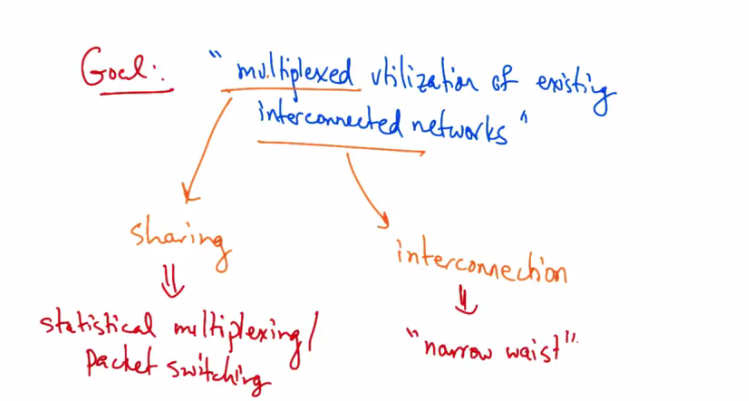

   Goal: "multiplexed utilization of existing interconnected networks" → Sharing →
   statistical multiplexing/packet switching; Interconnection → "narrow waist".

The fundamental design goal of the internet was multiplexed utilization of existing
interconnected networks. There are two important aspects to this goal. One is multiplexing or
sharing. So one of the fundamental challenges that the internet technologies needed to solve was
the shared use of a single communications channel. The second major part of this fundamental
goal is the interconnection of existing networks. These two sub problems had two very important
solutions. Statistical multiplexing, or packet switching, was invented to solve the sharing
problem, and the narrow waist was designed to solve the problem of interconnecting networks.
Let's talk about each of these now in turn. We'll first talk about packet switching.

Packet Switching
----------------

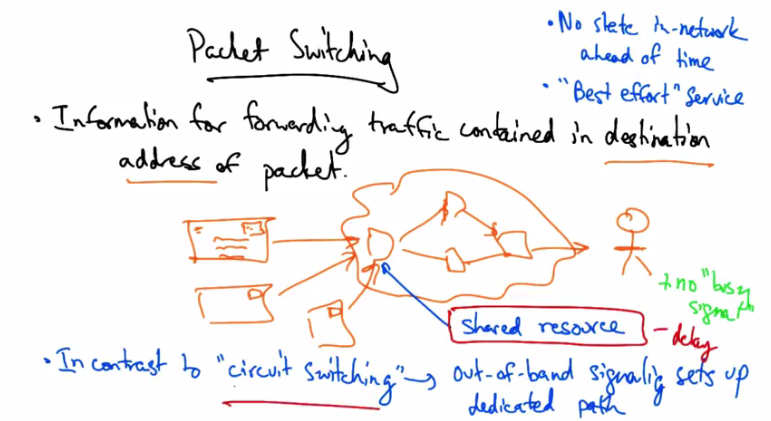

   Packet Switching — Information for forwarding traffic contained in destination address of
   packet. No state in network ahead of time. "Best effort" service. In contrast to "circuit
   switching" → out-of-band signaling sets up dedicated path. Shared resource, no "busy signal",
   variable delay.

In packet switching, the information for forwarding traffic is contained in the destination address
of every datagram or packet. Similar to how you would write a letter and specify the destination
to where you want the letter sent, and that letter might wend its way through multiple
intermediate post offices en-route to the recipient, packet switching works much the same way.
There is no state established ahead of time, and there are very few assumptions made about the
level of service that the network provides. This assumption about the level of service that the
network provides, is sometimes called best effort. So how does packet switching enable sharing?
Just as if you were sending a letter, many senders can send over the same network at the same
time, effectively sharing the resources in the network. A similar phenomenon occurs in packet
switching when multiple senders send network traffic or packets over the same set of shared
network links. Now this is in contrast to the phone network, where if you were to make a phone
call, the resources for the path between you and the recipient are dedicated and are allocated until
the phone call ends. The mode of switching that the conventional phone network uses is called
circuit switching, where a signaling protocol sets up the entire path, out-of-band. So this notion
of packet switching and statistical multiplexing, allowing multiple users to share a resource at the
same time, was really revolutionary. And it is one of the underlying design principles of the
internet that has persisted. Now the advantage of statistical multiplexing of the links and the
network means that the sender never gets a busy signal. The drawbacks include things like
variable delay and the potential for lost or dropped packets. In contrast, circuit switching
provides resource control, better accounting and reservation of resources, and the ability to pin
paths between a sender and receiver. Packet switching provides the ability to share resources and
potentially better resilience properties.

Packet Switching vs Circuit Switching Quiz
-------------------------------------------

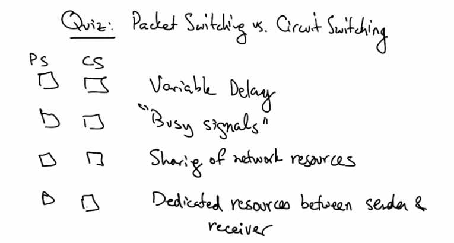

   Quiz: Packet Switching vs. Circuit Switching — PS and CS checkboxes for: Variable Delay,
   "Busy signals", Sharing of network resources, Dedicated resources between sender & receiver.

Let's take a quick quiz on packet switching versus circuit switching. Which of the following are
characteristics of packet switching and circuit switching: variable delay, busy signals, sharing of
network resources like an end-to-end path among multiple recipients, and dedicated resources
between the sender and receiver? Each of these options only has one correct answer.

Packet Switching vs Circuit Switching Solution
------------------------------------------------

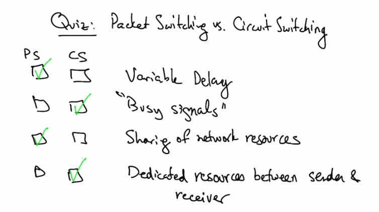

   Solution: Variable Delay → PS (checked). "Busy signals" → CS (checked). Sharing of network
   resources → PS (checked). Dedicated resources between sender & receiver → CS (checked).

Variable delay is a property of statistical multiplexing, or packet switching. Circuit switch
networks can have busy signals. Packet switch networks share network resources. And circuit
switch networks typically have dedicated resources along a path between the sender and receiver.

Narrow Waist
------------

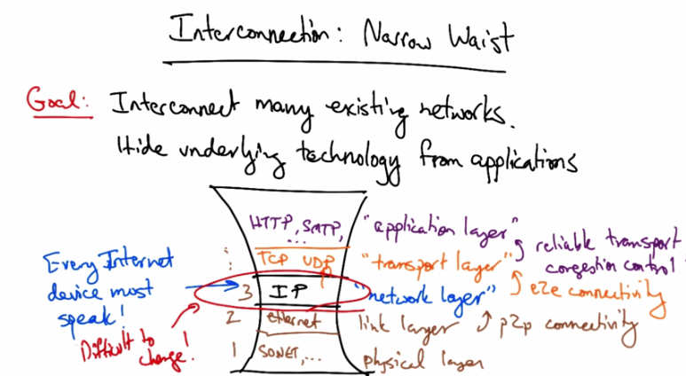

   Interconnection: Narrow Waist — Goal: Interconnect many existing networks. Hide underlying
   technology from applications. Layers: HTTP/SMTP ("application layer"), TCP/UDP ("transport
   layer"), IP ("network layer" layer 3), Ethernet (link layer 2), SONET/... (physical layer 1).
   Every Internet device must speak IP. Difficult to change.

Let's now take a look at the second important fundamental design goal on the internet,
interconnection, and how interconnection is achieved with the design principle called the Narrow
Waist. Let's keep in mind that one of the main goals was to interconnect many existing
networks, and to hide the underlying technology of interconnection from applications. This
design goal was achieved using a principle called the narrow waist. The internet architecture has
many protocols that are layered on top of one another. At the center is an interconnection
protocol called IP, or the internet protocol. Now every internet device must speak IP or have an
IP stack. Given that a device implements the IP stack, it can connect to the internet. This layer of
the network is sometimes called the network layer. Now this layer provides guarantees to the
layers above. On top of the network layer sits the transport layer. The transport layer includes
protocols like TCP and UDP. The network layer provides certain guarantees to the transport
layer. One of those guarantees is end to end connectivity. For example, if a host has an IP
address, then the network layer, or IP, provides the guarantee that a packet with that host
destination IP address should reach the destination with the corresponding address with best
effort. On top of the transport layer sits the application layer. The application layer includes
many protocols that various internet applications use. For example, the web uses a protocol
called the hypertext transfer protocol or HTTP. And mail uses a protocol called SMTP or simple
mail transfer protocol. Transport layer protocols provide various guarantees to the application
layer including reliable transport or congestion control. Now below the network layer we have
other protocols. The link layer provides point-to-point connectivity, or connectivity on a local
area network. A common link layer protocol is Ethernet. Below that, we have the physical layer,
which includes protocols such as sonnet or optical networks and so forth. The physical layer is
sometimes called layer 1. The link layer is sometimes called layer 2 and the network layer is
sometimes called layer 3. We tend to not refer to layers above the network layer by number. The
most critical aspect of this design is that the network layer essentially only has one real protocol
in use, and that's IP. That means that every device on the network must speak IP, but as long as
the device speaks IP it can get on the internet. This is sometimes called IP over anything, or
anything over IP, now the advantage to the narrow waist, as I mentioned, is that it is fairly easy
to get a device on the network if it runs IP, but the drawback is that because every device is
running IP, it's very difficult to make any changes at this layer. However, people are trying to do
so, and later in the course, when we discuss software defined networking, we will explore how
various changes are being made to both the IP layer, and other layers that surround it.

Goals Survivability
--------------------

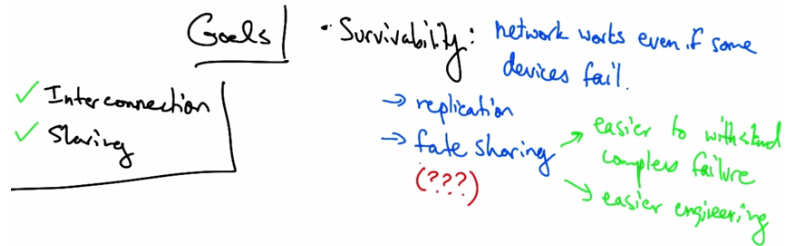

   Goals — Interconnection (checked), Sharing (checked). Survivability: network works even if
   some devices fail → replication → fate sharing (???) → easier to withstand complex failure
   → easier engineering.

So we talked about how the internet satisfies the goals of sharing and interconnection and now
let's talk about some of the other goals that are discussed in the DARPA Design Philosophy
Paper. As we discuss some of these other goals it's worth considering and thinking about how
well the current internet satisfies these other design goals in the face of evolving applications,
threats, and other challenges. One of the goals discussed is survivability, which states that the
network should continue to work if even some devices fail, are comprised, and so forth. There
are two ways to achieve survivability. One is to replicate. So one could keep state at multiple
places in the network, such that when any node crashes there's always a replica or hot standby
waiting to take over for the failure. Another way to design the network for survivability is to
incorporate a concept called fate sharing. Fate sharing says that it's acceptable to lose state
information for some entity, if that entity itself is lost. For example, if a router crashes all of the
state on the router, such as the routing tables, are lost. If we can design the network to sustain
these types of failures, where the state of a particular device shares the fate of the device itself,
then we can withstand failures better. So fate sharing makes it easier to withstand complex
failure scenarios and engineering is also easier. Now it's worth asking whether the current
internet still satisfies the principle of fate sharing. In a subsequent lesson, we'll talk about
network address translation and how it violates the notion of fate sharing. There are other
examples where the current internet's design violates fate sharing and it's worth thinking about
those.

Goals Heterogeneity
--------------------

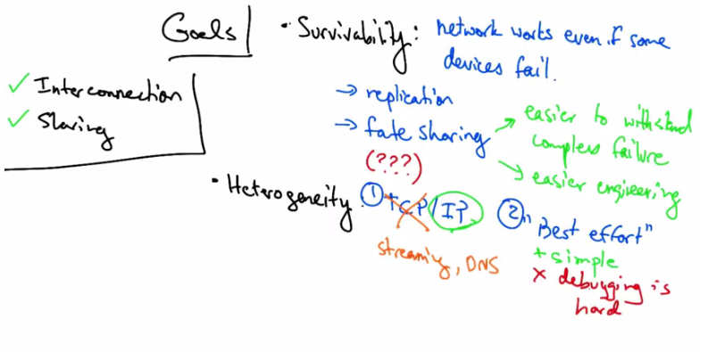

   Goals — Survivability (checked), Heterogeneity: (1) TCP/IP, streaming, DNS; (2) "Best
   effort" — simple but debugging is hard.

The internet supports heterogeneity through the TCP/IP protocol stack. TCP/IP was designed as
a monolithic transport, where TCP provided flow control and reliable delivery, and IP provided
universal forwarding. Now it became clear that not every application needed reliable, in-order
delivery. For example, streaming voice and video often perform well, even if not every packet is
delivered. And the domain name system, which converts domain names to IP addresses, often
also doesn't need completely reliable, in-order delivery. Fortunately, the narrow waste of IP
allowed the proliferation of many different transport protocols, not just TCP. The second way
that the internet's design accommodates Heterogeneity is through a best-effort service model,
whereby the network can lose packets, deliver them out of order, and doesn't really provide any
quality guarantees. It also doesn't provide information about failures, performance, et cetera. On
the plus side, this makes for a simple design, but it also makes certain kinds of debugging and
network management more difficult.

Goals Distributed Management
------------------------------

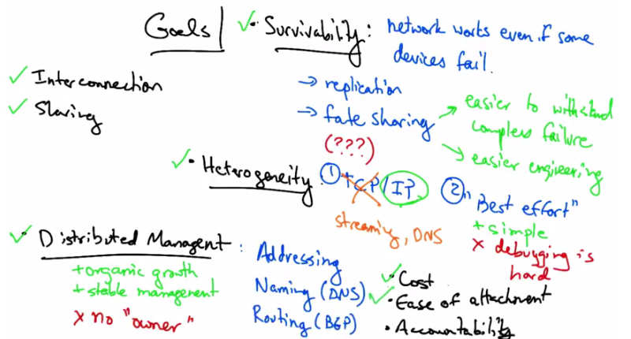

   Goals — Interconnection (checked), Sharing (checked), Survivability (checked),
   Heterogeneity (checked). Distributed Management: Addressing (routing registries), Naming
   (DNS), Routing (BGP) — organic growth, stable management, but no "owner". Cost, Ease of
   attachment, Accountability.

Another goal of the internet was distributed management. And there are many examples where
distributed management has played out. In addressing, we have routing registries. For example,
in North America we have ARIN, or the American Registry for Internet Numbers. And in
Europe that same organization is called RIPE. DNS allows each independent organization to
manage its own names and BGP allows each independently operated network to configure its
own routing policy. This means that no single entity needs to be in charge and thus allows for
organic growth and stable management. On the downside, the internet has no single owner or
responsible party. And as Clark said, some of the most significant problems with the internet
relate to the lack of sufficient tools for distributed management, especially in the area of routing.
In such a network where management is distributed it can often be very difficult to figure out
who or what is causing a problem, and worse, local action such as misconfiguration in a single
local network can have global effects. The other three design goals that Clark discusses are cost
effectiveness, ease of attachment, and accountability. It's reasonable to argue that the network
design is fairly cost effective as is and current trends are aiming to exploit redundancy even
more. For example, we will learn about content distributions and distributed web caches that aim
to achieve better cost effectiveness for distributing content to users. Ease of attachment was
arguably a huge success. IP is essentially plug and play. Anything with a working IP stack can
connect to the internet. There's a really important lesson here, which is that if one lowers the
barrier to innovation, people will get creative about the types of devices and applications that can
run on top of the internet. Additionally, the narrow waist of IP allows the network to run on a
wide variety of physical layers ranging from fiber, to cable, to wireless and so forth.
Accountability, or the ability to essentially, bill, was mentioned in some of the early papers on
TCP/IP but it really wasn't prioritized. Datagram networks can make accounting really tricky.
Phone networks had a much easier time figuring out how to bill users. Payments and billing on
the internet are much less precise, and we'll talk about these more in later lectures.

What's Missing
---------------

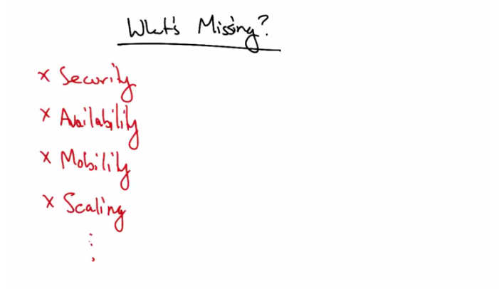

   What's Missing? — Security, Availability, Mobility, Scaling (and more).

It's also worth noting what's missing from Clark's paper. There's no discussion of security.
There's no discussion of availability. There's no discussion of mobility or support for mobility.
And there's also no mention of scaling. There are probably a lot of other things that are missing
and it's worth thinking about on your own, some of the other things that current internet
applications demand, that are not mentioned in Clark's original design paper.

DARPA Paper Quiz
-----------------

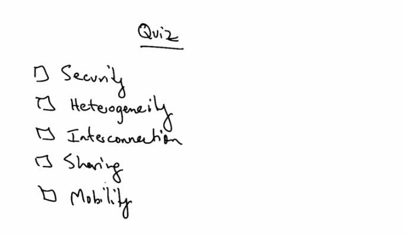

   Quiz — Check all design goals mentioned in Clark's original paper: Security, Heterogeneity,
   Interconnection, Sharing, Mobility.

So as a quick quiz, can you quickly check all of the design goals in the list that were mentioned
in Clark's original design goals paper? Security, support for heterogeneity, support for
interconnection, support for sharing and support for mobility.

DARPA Paper Solution
---------------------

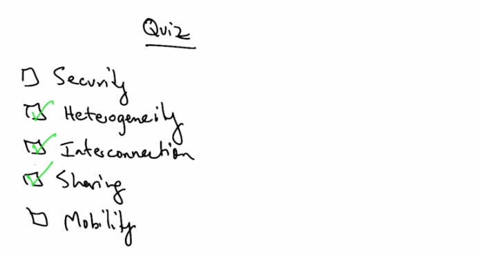

   Solution — Heterogeneity (checked), Interconnection (checked), Sharing (checked). Security
   and Mobility were NOT in Clark's original paper.

Clark's original design goals, paper, mentions the need to support heterogeneity, interconnection
and sharing.

End-to-End Argument
--------------------

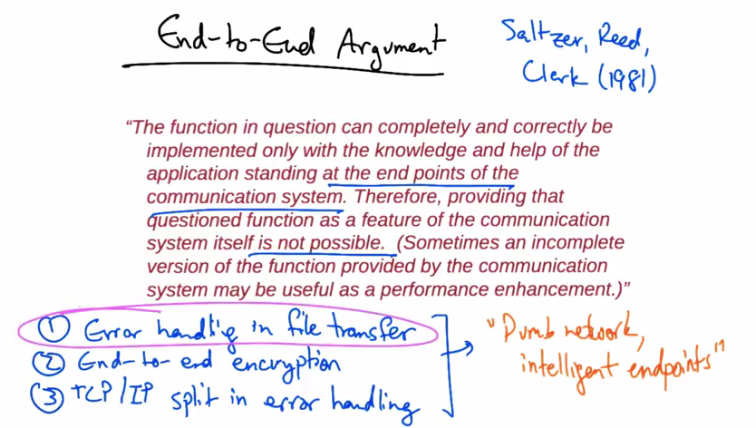

   End-to-End Argument — Saltzer, Reed, Clark (1981). "The function in question can completely
   and correctly be implemented only with the knowledge and help of the application standing at
   the end points of the communication system. Therefore, providing that questioned function as
   a feature of the communication system itself is not possible." Examples: (1) Error handling in
   file transfer, (2) End-to-end encryption, (3) TCP/IP split in error handling. → "Dumb network,
   intelligent endpoints".

In this lesson, we'll cover the End-to-End Argument as discussed in the paper, End-to-End
Arguments in System Design by Saltzer, Reed, and Clark in 1981. In a nutshell, the End-to-End
Argument reads as follows, "The function in question can completely and correctly be
implemented only with the knowledge and application standing at the end points of the
communication system. Therefore, providing that questioned function as a feature of the
communication system itself is not possible." Essentially, what the argument says is that the
intelligence required to implement a particular application on the communication system should
be placed at the endpoints, rather than in the middle of the network. Commonly used examples
of the end-to-end argument include error handling and file transfer, encrypting end-to-end versus
hop-by-hop in the network, and the partition of TCP and IP of error handling, flow control, and
congestion control. Sometimes the end-to-end argument is summarized as, "the network should
be dumb and minimal and the end points should be intelligent." Many people argue that the end-
to-end argument allowed the internet to grow rapidly, because innovation took place at the edge
in applications and services, rather than in the middle of the network, which can be hard to
change sometimes. Let's look at one example of the end-to-end argument, error handling in file
transfer.

File Transfer
-------------

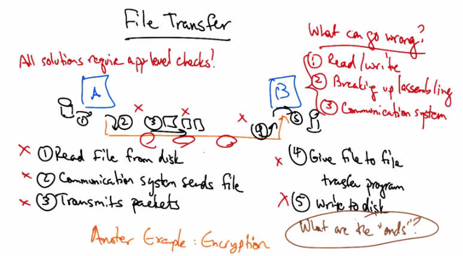

   File Transfer — All solutions require app-level checks! What can go wrong: (1) Read/write,
   (2) Breaking up/assembling, (3) Communication system, (4) Give file to file transfer program,
   (5) Write to disk. Steps: (1) Read file from disk, (2) Communication system sends file,
   (3) Transmits packets, (4) Give file to file transfer program, (5) Write to disk. Another
   example: Encryption. What are the "ends"?

Let's suppose that computer A wants to send a file to computer B. The file transfer program on A
asks the file system to read the file from the disk. The communication system then sends the file,
and finally the communication system sends the packets. On the receiving side, the
communication system gives the file to the file transfer program on B, and that file transfer
program asks to have the file written to disk. So what can go wrong in this simple file transfer
setup? Well, first, reading and writing from the file system can result in errors. There may be
errors in breaking up and reassembling the file. And, finally, there may be errors in the
communication system itself. Now, one possible solution is to ensure that each step has some
form of error checking, such as duplicate copies, redundancy, time out and retry, so forth. One
might even do packet error checking at each hop of the network. One could send every packet
three times. One might acknowledge packet reception at each hop along the network. But the
problem is that none of these solutions are complete. They still require application level
checking. Therefore it may not be economical to perform redundant checks at different layers
and at different places of this particular operation. Another possible solution is an end-to-end
check and retry where the application commits or retries based on the check sum of the file. If
errors along the way are rare, this will most likely finish on the first try. Now, this is not to say
that we shouldn't take steps to correct errors at any one of these stages. Error correction at lower
levels can sometimes be an effective performance booster. And the trade off here is based on
performance, not correctness. So whether or not one should implement additional correctness
checks at these layers depends on whether or not the amount of effort put into the reliability
gains are worth the extra trouble. Another example where the intend argument applies is with
encryption, where keys are maintained by the end applications, and cipher text is generated
before the application sends the message across the network. Now one of the key questions in the
end-to-end argument is identifying the ends. The end-to-end argument says that the complexity
should be implemented at the ends but not in the middle, but the ends may vary depending on
what the application is. So for example, if the application or protocol involves Internet routing,
the ends may be routers, or they might be ISPs. If the application or protocol is a transport
protocol, the ends might be end hosts. So, identifying the ends in the end-to-end argument is
always a thorny question that you have to answer first.

End-to-End Argument Violations
--------------------------------

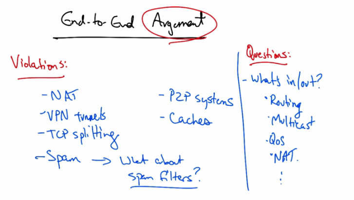

   End-to-End Argument Violations — NAT, VPN tunnels, TCP splitting, Spam → spam filters?,
   P2P systems, Caches. Questions: What's in/out? Routing, Multicast, QoS, NAT.

Now, when talking about the end-to-end argument, it is worth remembering that the end-to-end
argument is just that. It's an argument. Not a theorem, or a principle, or a law. And there are
many things that have come to violate the end-to-end principle. Network address translators,
which we'll talk about in the next lesson, violate the end-to-end argument. VPN tunnels, which
tunnel traffic between intermediate points on a network, violate the end-to-end argument.
Sometimes TCP connections are split at an intermediate node along an end-to-end path,
particularly when the last hop of the end-to-end path is wireless. This is sometimes done to
improve the performance of the connection because loss on the last hop lossy wireless hop may
not necessarily reflect congestion, and we don't necessarily want TCP to react to losses that are
not congestion related. Even spam, in some sense, is a violation of the end-to-end argument. For
e-mail the end user is generally considered to be a human, and by the end-to-end argument, the
network should deliver all mail to the user. Does this mean that spam control mechanisms are in
violation of end-to-end, and if so are these violations appropriate? What about peer to peer
systems where files are exchanged between two nodes on the Internet but are assembled in
chunks that are often traded among peers? What about caches, and in-network aggregation? So,
when considering the end-to-end argument, it's worth asking whether or not the argument is still
valid today and in what cases. There are questions about what's in versus out, certainly, and what
functions belong in the dumb minimal network. For example, routing is currently in the dumb
minimal network. Do we really believe that it belongs? What about multicast? Mobility quality
of service? What about NAT's? And it's worth considering whether the end-to-end argument is
constraining innovation of the infrastructure by preventing us from putting some of the more
interesting or helpful functions inside the network. In the third course, we will talk about
software defined networking, which in some sense reverses many aspects of this end-to-end
argument.

Violation NAT Part 1
---------------------

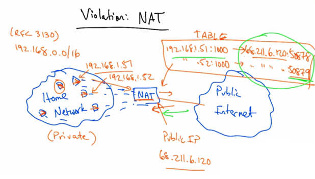

   Violation: NAT — (RFC 3130) Private network 192.168.0.0/16 with devices 192.168.1.51
   and 192.168.1.52 behind NAT box. Public IP 68.211.6.120. NAT TABLE maps private
   address:port to public address:port (e.g. 192.168.1.51:1000 → 68.211.6.120:50878).

A fairly pervasive violation of the end-to-end argument are home gateways, which often perform
something called network address translation. Now on a home network we have many devices
that connect to the network, but when we buy service from our internet service provider we're
typically only given one public IP address. And yet we have a whole variety of devices that we
may want to connect. Now the idea behind network address translation is that we can give each
of these devices a private IP address and there are designated regions of the IP address space that
are for private IP addresses. One of those is 192.168.0.0/16 and there are others, which you can
go read about in RFC 3130. Each one of these devices in the home gets its own private IP
address. The public internet, on the other hand, sees a public IP address which typically is the IP
address provided by the internet service provider. When packets traverse the home router, which
is often running a network address translation process, the source address of every packet is
rewritten to the public IP address. Now when traffic comes back to that public IP address, the
network address translator needs to know which device behind the NAT the traffic should be
sent to. So it uses a mapping of port numbers to identify which device the return traffic should be
sent to in the home network. So the NAT or the network address translator maintains a table that
says packets with the source IP address of 192.168.1.51 and source port 1000 should be rewritten
to a source address of the public IP address and a source port of 50878. Similarly, packets with a
source IP address of 192.168.1.52 and source port of 1000 should be rewritten to the public IP
address and a source port of 50879. Then when traffic returns to the NAT to one of these
addresses the NAT knows that it needs to rewrite the destination address on the return traffic to
the appropriate destination IP address and port that's in the private network. So for outbound
traffic, the NAT device creates a table entry mapping the computer's local IP address and port
number to the public IP address at a different port number and replaces the sending computer's
non-routable IP address with the gateway or the NAT public IP address. It also replaces the
sender's source port with a different source port that allows it to de-mutiplex the packets sent to
this return address and port. For inbound traffic to the home network, the NAT checks the
destination port on the packet, and based on the port, it rewrites the destination IP address and
port to the private IP address in the table before forwarding the traffic to a local device in the
home network.

Violation NAT Part 2
---------------------

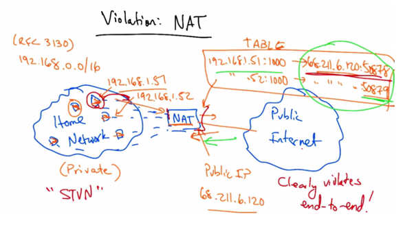

   Violation: NAT — Same diagram as Part 1, labeled "STVN" (STUN). "Clearly violates
   end-to-end!" Machines behind NAT are not globally addressable.

Now the NAT clearly violates the end-to-end principle, because machines behind the NAT are
not globally addressable, or routable, and other hosts on the public Internet cannot initiate
inbound connections to these devices behind the NAT. Now there are ways to get around this,
there're various protocols. One is called STUN, or signaling and tunneling through UDP-enabled
NAT devices. And in these types of protocols, the device sends an initial outbound packet
somewhere, simply to create an entry in the NAT table and once that entry is created we now
have a globally routable address and port to which devices on a public Internet can send traffic.
Now these devices somehow have to learn that public IP address and port that corresponds to
that service and this might be done using DNS for example. It's also possible to statically
configure these tunnels or mappings on your NAT device at home. Needless to say, even with
these types of hacks and workarounds for NAT, it's clear that network address translation is a
violation of the end-to-end principle because by default two hosts on the Internet, one on the
home network and one on the public Internet, cannot communicate directly by default.
