Congestion Control and Streaming
================================

Lesson 1 Intro
--------------

In this section of the course we'll learn about resource control and content distribution. Resource
control deals with handling bandwidth constraints on links. And in this first section, we'll focus
on controlling congestion along links. To learn more about TCP and congestion control, your
Mininet project will explore what happens when congestion control goes wrong.

Congestion Control
------------------

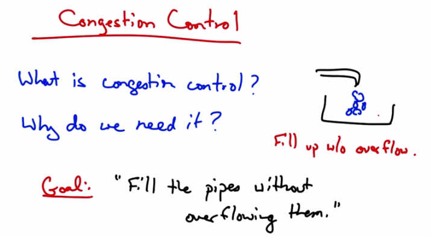

   Congestion Control — What is congestion control? Why do we need it? Goal: "Fill the pipes
   without overflowing them." Diagram shows a bucket filling up without overflow.

Okay, we're starting course two on congestion control and streaming. And we'll first talk about
congestion control. In particular, what is congestion control and why do we need it? Simply put,
the goal of congestion control is to fill the Internet's pipes without overflowing them. So to think
about this in terms of an analogy, suppose you have a sink, and you're filling that sink with
water. Well, how should you control the faucet? Too fast and the sink overflows. Too slow and
you are not efficiently filling up your sink. So what you would like to do is to fill the bucket as
quickly as possible without overflowing. The solution here is to watch the sink. And as the sink
begins to overflow, we want to slow down how fast we're filling it. That's effectively how
congestion control works.

Congestion
----------

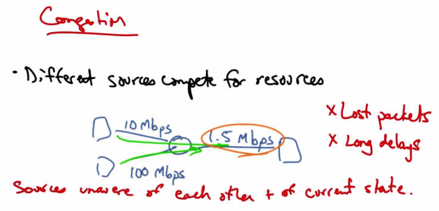

   Congestion — Different sources compete for resources. Example: 10 Mbps and 100 Mbps
   sources share a 1.5 Mbps bottleneck link. Sources unaware of each other and of current state.
   Results: Lost packets, Long delays.

Let's suppose that in a network we have three hosts shown as squares at the edge of the network
that are connected by links with capacities as shown. The two senders on the left can send at
rates of 10 megabits per second and 100 megabits per second, respectively. But the link to the
host on the right is only 1.5 megabits per second. So these different hosts on the left are actually
competing for the same resources inside the network. So the sources are unaware of each other
and also of the current state of whatever resource they are trying to share, in this case, how much
other traffic is on the network. This shows up as lost packets or long delays and can result in
throughput that's less than the bottleneck link, something that's also known as congestion
collapse.

Congestion Collapse
-------------------

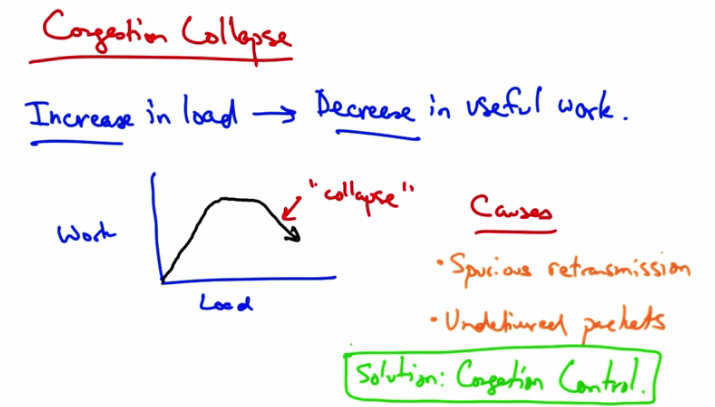

   Congestion Collapse — Increase in load → Decrease in useful work. Graph shows Work vs
   Load: rises then "collapses." Causes: Spurious retransmissions, Undelivered packets.
   Solution: Congestion Control.

In congestion collapse, an increase in traffic load suddenly results in a decrease of useful work
done. As we can see here, up to a point, as we increase network load, there is an increase in
useful work done. At some point, the network reaches saturation, at which point increasing the
load no longer results in useful work getting done. But at some point, actually increasing the
traffic load can cause the amount of work done or the amount of traffic forwarded to actually
decrease. There are many possible causes. One possible cause is the spurious re-transmissions of
packets that are still in flight. So when senders don't receive acknowledgements for packets in a
timely fashion, they can spuriously re-transmit, thus resulting in many copies of the same packets
being outstanding in the network at any one time. Another cause of congestion collapse is simply
undelivered packets, where packets consume resources and are dropped elsewhere in the
network. The solution to spurious re-transmissions is to have better timers and to use TCP
congestion control, which we'll talk about next. The solution to undelivered packets is to apply
congestion control to all traffic. Congestion control is the topic of the rest of this lesson.

Congestion Collapse Quiz
------------------------

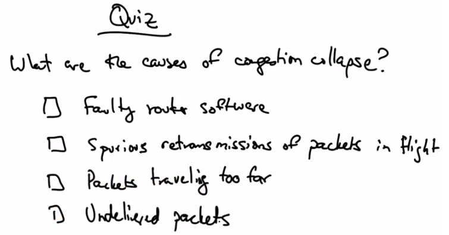

   Quiz — What are the causes of congestion collapse? Options: Faulty router software,
   Spurious retransmissions of packets in flight, Packets traveling too far, Undelivered packets.

Let's take a quick quiz. What are some possible causes of congestion collapse? Faulty router
software? Spurious retransmissions of packets in flight? Packets that are travelling distances that
are too far between routers? Or, undelivered packets? Please check all options that apply.

Congestion Collapse Solution
-----------------------------

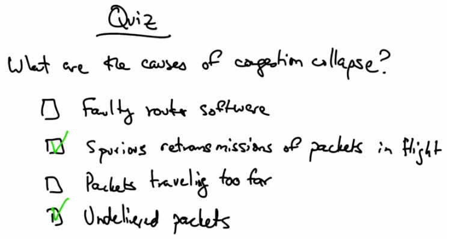

   Quiz Solution — Spurious retransmissions of packets in flight (checked) and Undelivered
   packets (checked) are the causes of congestion collapse.

Congestion collapse is caused by spurious retransmissions of packets in flight and undelivered
packets that consume resources in the network but achieve no useful work.

Goals of Congestion Control
----------------------------

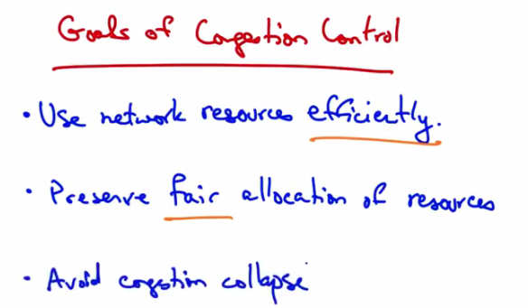

   Goals of Congestion Control — Use network resources efficiently. Preserve fair allocation of
   resources. Avoid congestion collapse.

Congestion control has two main goals. The first is to use network resources efficiently. Going
back to our sink analogy, we'd like to fill the sink as quickly as possible. Fairness, on the other
hand, ensures that all the senders essentially get their fair share of resources. A final goal, of
course, is to avoid congestion collapse. Congestion collapse isn't just a theory, it's actually been
frequently observed in many different networks.

Two Approaches to Congestion Control
--------------------------------------

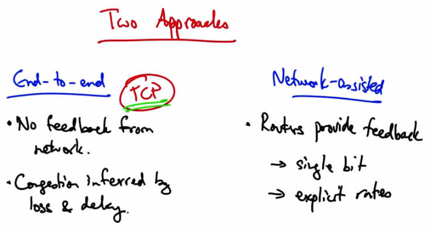

   Two Approaches — End-to-end (TCP): No feedback from network. Congestion inferred by loss
   and delay. Network-assisted: Routers provide feedback → single bit or explicit rates. Goals:
   (1) Efficiency, (2) Fairness.

There are two basic approaches to congestion control: end-to-end congestion control and
network assisted congested control. In end-to-end congestion control the network provides no
explicit feedback to the senders about when they should slow down their rates. Instead,
congestion is inferred typically by packet loss, but potentially, also by increased delay. This is
the approach taken by TCP congestion control. In network assisted congestion control, routers
provide explicit feedback about the rates that end systems should be sending in. So they might
set a single bit indicating congestion, as is the case in TCP's ECN, or explicit congestion
notification extensions, or they might even tell the sender an explicit rate that they should be
sending at. We're going to spend the rest of the lesson talking about TCP congestion control.

TCP Congestion Control
-----------------------

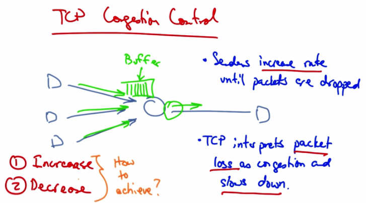

   TCP Congestion Control — Multiple senders (D) feed into a router buffer. Senders increase
   rate until packets are dropped. TCP interprets packet loss as congestion and slows down.
   Two parts: (1) Increase, (2) Decrease — How to achieve?

In TCP congestion control, the senders continue to increase their rate until they see packet drops
in the network. Packet drops occur because the senders are sending at a rate that is faster than the
rate at which a particular router in the network might be able to drain its buffer. So you might
imagine, for example, that if all three of these senders are sending at a rate that is equal to the
rate at which the router is able to send traffic downstream, then eventually this buffer will fill up.
TCP interprets packet loss as congestion. And when senders see packet loss, they slow down as a
result of seeing the packet loss. This is an assumption. Packet drops are not a sign of congestion
in all networks. For example, in wireless networks, there may be packet loss due to corrupted
packets as a result of interference. But in many cases, packet drops do result because some router
in the network has a buffer that has filled up and can no longer hold anymore packets and hence
it drops the packets as they arrive. So senders increase rates until packets are dropped,
periodically probing the network to check whether more bandwidth has become available; then
they see packet loss, interpret that as congestion, and slow down. So, congestion control has two
parts. One is an increase algorithm, and the other is a decrease algorithm. In the increase
algorithm, the sender must test the network to determine whether the network can sustain a
higher sending rate. In the decrease algorithm, the senders react to congestion to achieve optimal
loss rates, delays in sending rates. Let's now talk about how senders can achieve these increase
and decrease algorithms.

Two Approaches to Adjusting Rate
----------------------------------

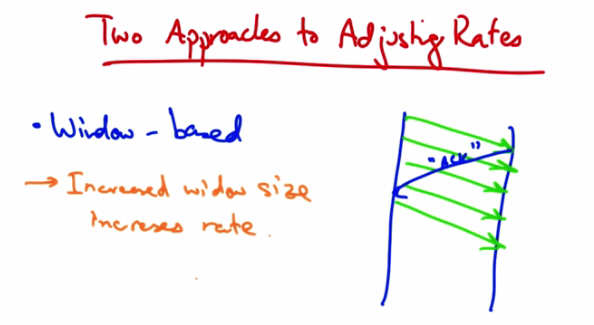

   Two Approaches to Adjusting Rates — Window-based: Increased window size increases rate.
   Diagram shows sender with outstanding packets (window of 4) clocked by ACKs from
   receiver.

One approach is a window based algorithm. In this approach, a sender can only have a certain
number of packets outstanding, or quote, in flight. And the sender uses acknowledgements from
the receiver to clock the retransmission of new data. So let's suppose that the sender's window
was four packets. At this point, there are four packets outstanding in the network. And the sender
cannot send additional packets until it has received an acknowledgement from the receiver.
When it receives an acknowledgment, or an ACK from the receiver, the sender can then send
another packet. So at this point there are still four outstanding or four unacknowledged packets in
flight. In this case if a sender wants to increase the rate at which it's sending, it simply needs to
increase the window size. So, for example, if the sender wants to send at a faster rate, it can
increase the window size from four, to five. A sender might increase its rate anytime it sees an
acknowledgement from the receiver. In TCP, every time a sender receives an acknowledgement,
it increases the window size.

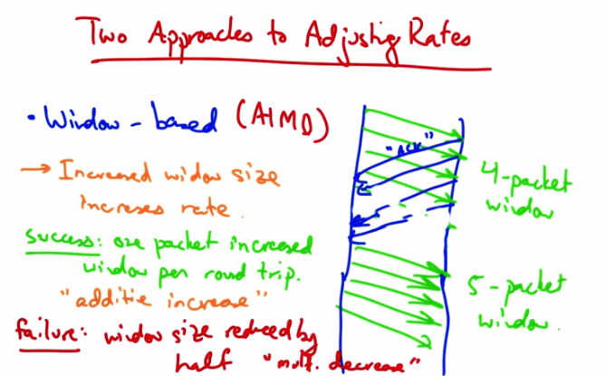

   Two Approaches to Adjusting Rates — Window-based (AIMD). Success: one packet increased
   window per round trip — "additive increase." Failure: window size reduced by half —
   "multiplicative decrease." Shows 4-packet window growing to 5-packet window.

Upon a successful receipt, we want the sender to increase its window by one packet per round
trip. So, for example, in this case if the sender's window was initially four packets, then at the
end of a single round trip's worth of sending, we want the next set of transmissions to allow five
packets to be outstanding. This is called Additive Increase. If a packet is not acknowledged, the
window size is reduced by half. This is called Multiplicative Decrease. So TCP's congestion
control is called additive increase multiplicative decrease, or AIMD.

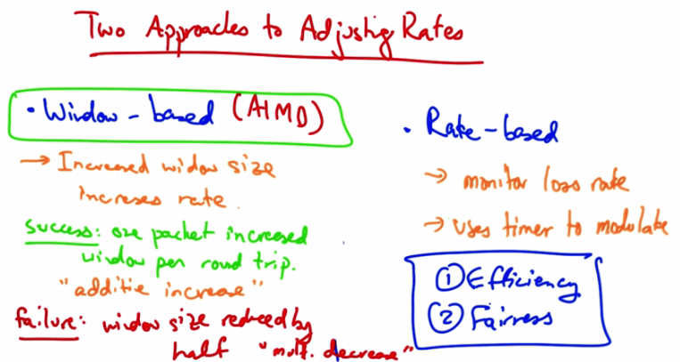

   Two Approaches to Adjusting Rates — Window-based (AIMD) vs Rate-based. Rate-based:
   monitor loss rate, use timer to modulate. Both approaches aim for (1) Efficiency and (2)
   Fairness.

The other approach to adjusting rates is an explicit rate-based congest control algorithm. In this
case the sender monitors the loss rate and uses a timer to modulate the transmission rate.
Window based congestion control, or AIMD, is the common way of performing congestion
control in today's computer networks. In the next lesson we will talk about the two goals of TCP
congestion control further (efficiency and fairness) and explore how TCP achieves those goals.

Window Based Congestion Control Quiz
--------------------------------------

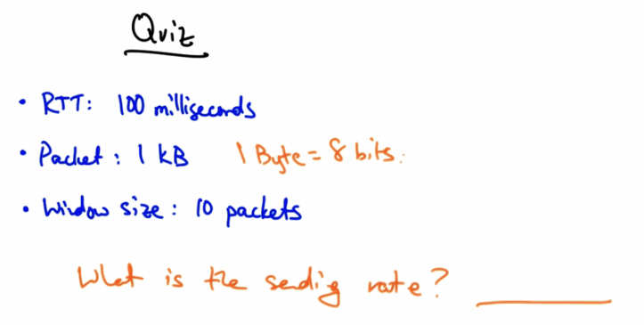

   Quiz — RTT: 100 milliseconds, Packet: 1 kB (1 Byte = 8 bits), Window size: 10 packets.
   What is the sending rate?

Let's have a quick quiz on window based congestion control. Suppose the round trip time
between the sender and receiver is 100 ms, each packet is 1kb, and the window size is 10
packets. What is the rate at which the sender is sending? Please put your answer here in terms of
kilobits per second, keeping in mind that 1 byte is 8 bits.

Window Based Congestion Control Solution
-----------------------------------------

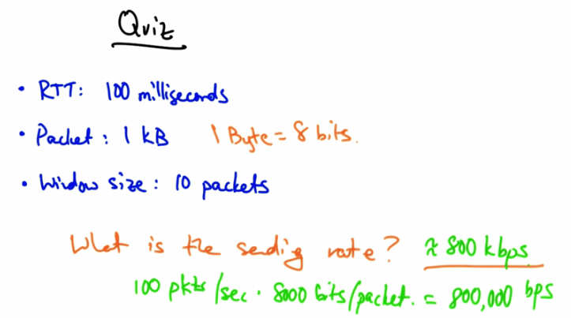

   Quiz Solution — RTT: 100 ms, Packet: 1 kB, Window: 10 packets. Sending rate = 800 kbps.
   Calculation: 100 pkts/sec × 8000 bits/packet = 800,000 bps.

The sending rate of the sender is approximately 800 kbps. With a window size of ten packets and
a round trip time of 100 milliseconds, the sender can send 100 packets per second. With each
packet being one kilobyte, or 8000 bits, that gives us 800,000 bits per second or about 800
kilobits per second.

Fairness and Efficiency in Congestion Control
----------------------------------------------

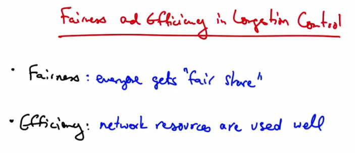

   Fairness and Efficiency in Congestion Control — Fairness: everyone gets "fair share."
   Efficiency: network resources are used well.

The two goals of congestion control are fairness (meaning every sender gets their fair share of
the network resources) and efficiency (meaning that the network resources are used well). In
other words we shouldn't have a case where there are spare capacity or resources in the network,
and senders have data to send, but are not able to send it. So, we'd like the network to be used
efficiently, but we'd also like it to be shared among the senders.

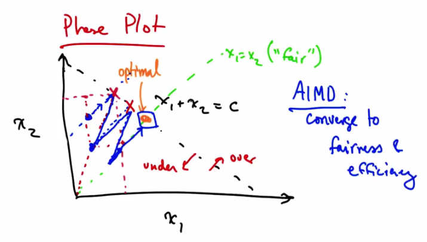

   Phase Plot — x1 + x2 = C (efficiency line) and x1 = x2 (fairness line). AIMD converges to
   fairness and efficiency. Under-utilized region to left; overload to right. Additive increase
   moves parallel to efficiency line; multiplicative decrease moves toward origin improving
   fairness.

We can represent fairness and efficiency in terms of a phase plot, where each axis represents a
particular user, or particular senders' allocation. In this case we just have two users, one and two,
and we represent their allocations with X1 and X2. If the capacity of the network is C, then we
can represent the optimal operating line as X1 + X2 being some constant, C. Anything to the left
of this diagonal line represents under utilization of the network, and anything to the right of the
line represents overload. We can also represent another line, X1 = X2 as some notion of fair
allocation. So the optimal point is where the network is neither under or over utilized, and when
the allocation is fair. So being on this diagonal line represents efficiency, and being on the green
diagonal line represents fairness. We can use the phase plot to understand why senders who use
additive increase multiplicative decrease, converge to fairness. The senders also converge to the
efficient operating point. Let's suppose that we start at the operating point shown in blue. At this
point both senders will additively increase their sending rates. Additive increase results in
moving along a line that is parallel to x1 and x2, since both senders increase their rate by the
same amount. Additive increase will continue until the network becomes overloaded. At this
point the senders will see a loss and perform multiplicative decrease. In multiplicative decrease
each sender decreases its rate by some constant factor of its current sending rate. For example,
suppose each one of these senders decreases its sending rate by half. The resulting operating
point is shown by this second blue dot. Note that that new operating point, as a result of
multiplicative decrease, is on a line between the point on the efficiency line that the centers hit,
and the origin. At this point the sender's will again increase their sending rate along a line that's
parallel to X1 equals X2 until they hit over load again, at which point they will again retreat
towards the origin. You can see that eventually the senders will reach this optimal operating
point through the path that's delineated by the blue line. To think about this a bit more you can
see that every time additive increase is applied, that increases efficiency. Every time
multiplicative decrease is applied that improves fairness because every time we apply
multiplicative decrease, we get closer to this X1 equals X2 line.

AIMD
----

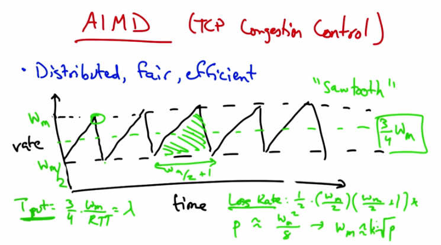

   AIMD (TCP Congestion Control) — Distributed, fair, efficient. "Sawtooth" pattern: rate
   increases (additive) then drops by half at loss. Throughput = 3/4 * w_max / RTT = lambda.

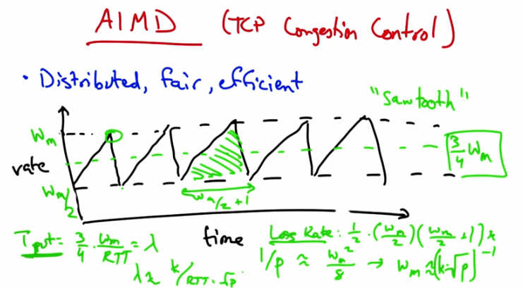

   AIMD sawtooth with formulas — Loss Rate: 1/p ≈ w_m^2/8 → w_m ≈ 2*sqrt(2/p).
   Throughput lambda = (3/4) * w_m / RTT. Throughput inversely proportional to RTT and
   sqrt(loss rate).

The result is the additive increase multiplicative decrease congestion control algorithm. The
algorithm is distributed, meaning that all the senders can act independently, and we've just
shown using the phase plots that it's both fair and efficient. To visualize this sending rate over
time, the sender's sending rate looks roughly as shown. We call this the TCP sawtooth behavior
or simply the TCP sawtooth. TCP periodically probes for available bandwidth by increasing its
rate using additive increase. When the sender reaches a saturation point by filling up a buffer in a
router somewhere along the path, it will see a packet loss, at which point it will decrease its
sending rate by half. You can thus see that a TCP sender sends at a sending rate shown by the
dotted green line that is halfway between the maximum window size at which the sender sends,
and half that rate which it backs off to when it sees a loss. You can see that between the lowest
sending rate and the highest is w_m over 2 plus 1 round trips. Now, given that rate we can
compute the number of packets between periods of packet loss and compute the loss rate from
this. The number of packets sent for every packet lost is the area of this triangle. So the lost rate
is on the order of the square of the maximum window divided by some constant. Now, the
throughput is the average rate, 3 4ths w_max divided by the RTT. Now if we want to relate the
throughput to the loss rate, where we call the loss rate p and the throughput lambda, we simply
need to solve for w_m.

And I'm just going to get rid of the constant. So a loss occurs once for this number of packets, so
the loss rate is simply 1 over that quantity. And then when we solve for w_m and plug in for
throughput, we see that the throughput is inversely proportional to both the round trip time and
the square root of the loss rate.

Additive Increase Quiz
-----------------------

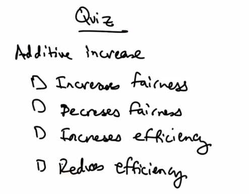

   Quiz — Additive Increase: Increases fairness? Decreases fairness? Increases efficiency?
   Reduces efficiency? (Check all that apply.)

So as a quick quiz, and returning to our phase plot, does additive increase increase or decrease
fairness? And does it increase, or decrease, or reduce, efficiency? Please check all that apply.

Additive Increase Solution
---------------------------

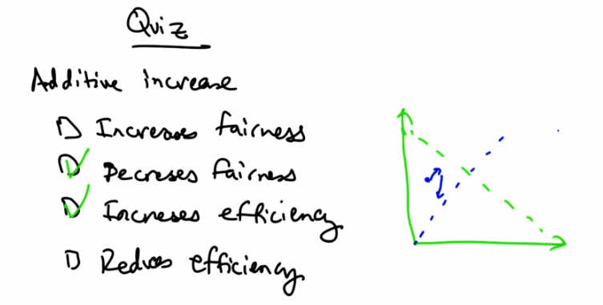

   Quiz Solution — Additive Increase: Decreases fairness (checked) and Increases efficiency
   (checked). Phase diagram shows movement parallel to efficiency line, away from fairness line.

Additive increase increases efficiency because it gets us closer to that efficiency line parallel to
the X1 equals X2 line. It technically also decreases fairness because the centers are both
increasing their rates, so we're relatively further away from this X1 equals X2 line. In contrast,
remember that multiplicative decrease reduces efficiency by moving us further away from this
green dotted line, but it increases fairness by moving us closer to the blue dotted line.

Data Centers and TCP Incast
----------------------------

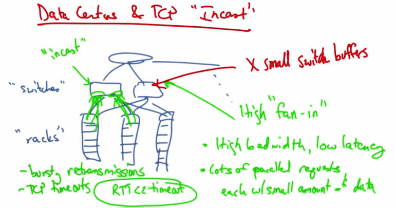

   Data Centers and TCP "Incast" — High "fan-in" with small switch buffers. High bandwidth,
   low latency. Lots of parallel requests each with small amount of data. Results in bursty
   retransmissions and TCP timeouts (RTO << timeout). "Racks" and "switches" shown with
   incast pattern.

We'll now talk about TCP congestion control in the context of modern datacenters. And we'll
talk about a particular TCP throughput collapse problem called the TCP incast problem. A
typical data center consists of a set of server racks, each holding a large number of servers, the
switches that connect those racks of servers, and the connecting links that connect those switches
to other parts of the topology. So the network architecture is typically made up of some sort of
tree and switching elements that progressively are more specialized and expensive as we move
up the network hierarchy. Some of the characteristics of a data center network include a high fan
in. There is a very high amount of fan in between the leaves of the tree and the top of the root
workloads are high bandwidth and low latency, and many clients issue requests in parallel, each
with a relatively small amount of data per request. The other constraint that we face is that the
buffers in these switches can be quite small. So when we combine the requirements of high
bandwidth and low latency for the applications, the presence of many parallel requests coming
from these servers. and the fact that the switches have relatively small buffers, we can see that
potentially there will be a problem. The throughput collapse that results from this phenomenon is
called the TCP Incast problem. Incast is a drastic reduction in application throughput that results
when servers using TCP all simultaneously request data, leading to a gross underutilization of
network capacity in many-to-one communication networks like a datacenter. The filling up of the
buffers here at the switches result in bursty retransmissions that overfill the switch buffers. And
these bursting retransmissions are cause by TCP timeouts. The TCP timeouts can last hundreds
of milliseconds. But the roundtrip time in a data center network is typically less than a
millisecond. Often just hundreds of microseconds. Because the roundtrip times are so much less
than TCP timeouts, the centers will have to wait for the TCP timeout before they retransmit an
application. Throughput can be reduced by as much as 90% as a result of link idle time.

Barrier Synchronization and Idle Time
--------------------------------------

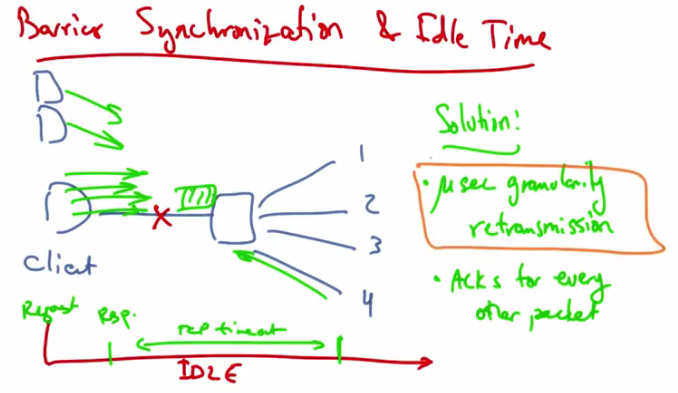

   Barrier Synchronization and Idle Time — Client sends 4 parallel requests; response 4 is
   dropped. Threads 1-3 complete but link is IDLE waiting for TCP retransmit timeout. Solution:
   microsecond-granularity retransmission, ACKs for every other packet.

A common request pattern in data centers today is something called barrier synchronization
whereby a client or an application might have many parallel threads, and no forward progress
can be made until all the responses for those threads are satisfied. For example, a client might
send a synchronized read with four parallel requests. But suppose that the fourth is dropped. At
this point we have a request sent at time zero, then we see a response less than a millisecond
later, and at this point, threads one to three complete but TCP may time out on the fourth. In this
case, the link is idle for a very long time while that fourth connection is timed out. The addition
of more servers in the network induces an overflow of the switch buffer, causing severe packet
loss, and inducing throughput collapse. One solution to this problem is to use fine grained TCP
retransmission timers, on the order of microseconds, rather than on the order of milliseconds.
Reducing the retransmission timeout for TCP thus improves system throughput. Another way to
reduce the network load is to have the client acknowledge every other packet rather than every
packet, thus reducing the overall network load. The basic idea here, and the premise, is that the
timers need to operate on a granularity that's close to the round-trip time of the network. In the
case of a data center that's hundreds of microseconds or less.

TCP Incast Quiz
---------------

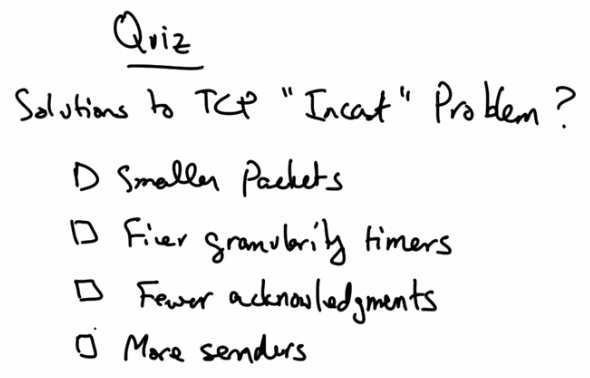

   Quiz — Solutions to TCP "Incast" Problem? Options: Smaller packets, Finer granularity
   timers, Fewer acknowledgments, More senders.

As a quick review what are some solutions to the TCP incast problem? Having senders send
smaller packets? Using finer granularity TCP timeout timers. Having the clients send fewer
acknowledgements or having fewer TCP senders?

TCP Incast Solution
--------------------

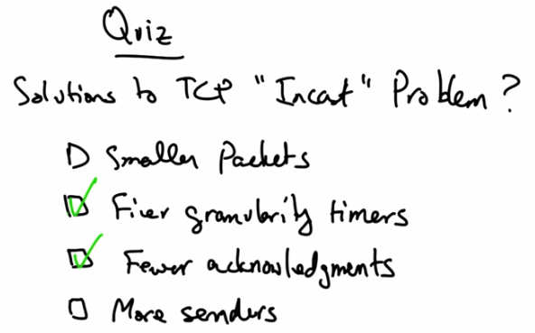

   Quiz Solution — Finer granularity timers (checked) and Fewer acknowledgments (checked)
   are solutions to the TCP Incast problem.

Using finer granularity timers and having the clients acknowledge only every other packet, as
oppose to every packet, are possible solutions to the TCP Incast problem.

Multimedia and Streaming
------------------------

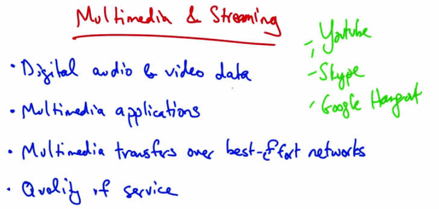

   Multimedia and Streaming — Digital audio and video data. Multimedia applications.
   Multimedia transfers over best-effort networks. Quality of service. Examples: YouTube,
   Skype, Google Hangout.

In this lesson, we'll talk about multimedia and streaming. We'll talk about digital audio and video
data, multimedia applications (in particular, streaming audio and video for playback), multimedia
transfers over a best-effort network (in particular, how to tolerate packet loss delay and jitter),
and quality of service. So we use multimedia and streaming video very frequently on today's
internet. YouTube streaming videos are an example of multimedia streaming as are applications
for video or voice chat such as Skype or Google Hangout. In this lecture we'll talk about the
challenges for streaming these types of applications over best effort networks as well has how to
solve those challenges. We'll also talk about the basics of digital audio and video data. First of
all, let's talk about the challenges for media streaming.

Challenges
----------

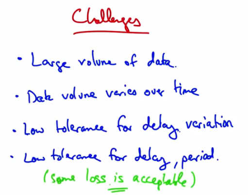

   Challenges — Large volume of data. Data volume varies over time. Low tolerance for delay
   variation. Low tolerance for delay, period. (some loss is acceptable).

One challenge is that, there's a large volume of data. Each sample is a sound or an image and
there are many samples per second. Sometimes because of the way data is compressed, the
volume of data that's being sent may vary over time. In particular, the data may not be set at a
constant rate. But in streaming, we want smooth playout, so the variable volume of data can pose
challenges. Users typically have a very low tolerance for delay variation. Once playout of a
video starts for example, you want that video to keep playing. It's very annoying if once you've
started playing, that the video stops. The users might have a low tolerance for delay period, so in
cases like games or Voice over IP, delay is typically just unacceptable, although users can
tolerate some loss. Before we get into how the network solves these challenges. Let's talk a little
bit about digitizing audio and video.

Digitizing Audio and Video
---------------------------

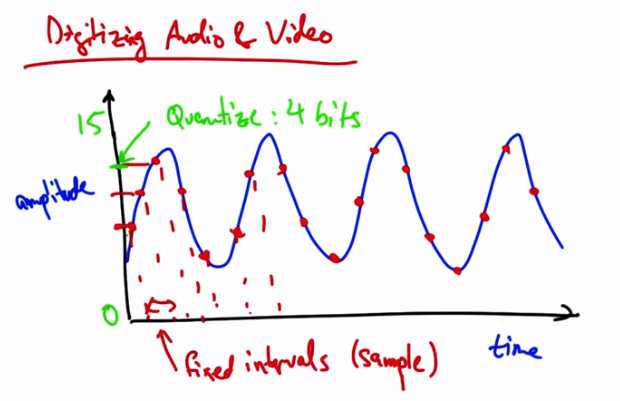

   Digitizing Audio and Video — Analog signal sampled at fixed intervals. Quantize: 4 bits
   (amplitude 0-15). Samples at fixed intervals shown with red dots. Audio/video digitized by
   sampling and quantizing.

Suppose we have an analog audio signal that we'd like to digitize, or send as a stream of bits.
What we can do is sample the audio signal at fixed intervals, and then represent the amplitude of
each sample with a fixed number of bits. For example, if our dynamic range was from 0 to 15,
we could quantize the amplitude of this signal such that each sample could be represented with
four bits.

Digitizing Audio and Video Quiz 1
----------------------------------

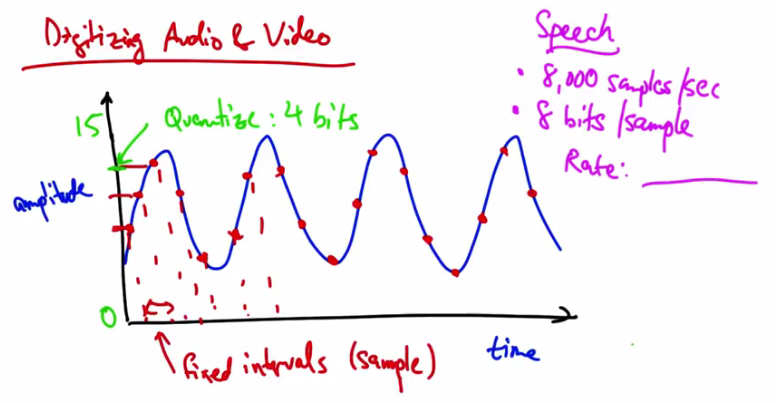

   Quiz 1 — Speech: 8,000 samples/sec, 8 bits/sample. What is the Rate?

Let's take a couple of examples. So with speech you might take 8000 samples per second, and
you might have 8 bits per sample. So what is the sampling rate in this case? Please give your
answer in kilobits per second.

Digitizing Audio and Video Solution 1
---------------------------------------

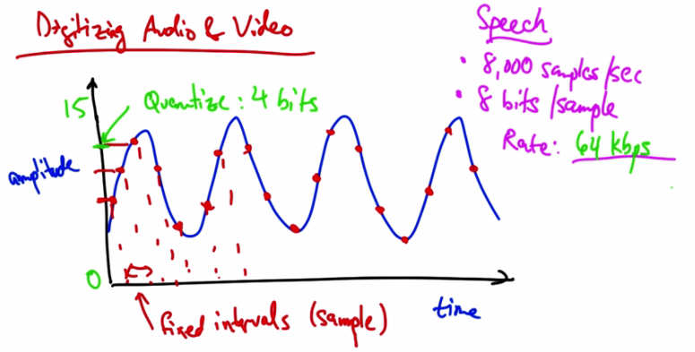

   Solution 1 — Speech: 8,000 samples/sec, 8 bits/sample. Rate: 64 kbps.

At 8,000 samples per second, and eight bits for every sample, the rate of digitized speech would
be 64 kbps, which is a common bit rate for audio.

Digitizing Audio and Video Quiz 2
----------------------------------

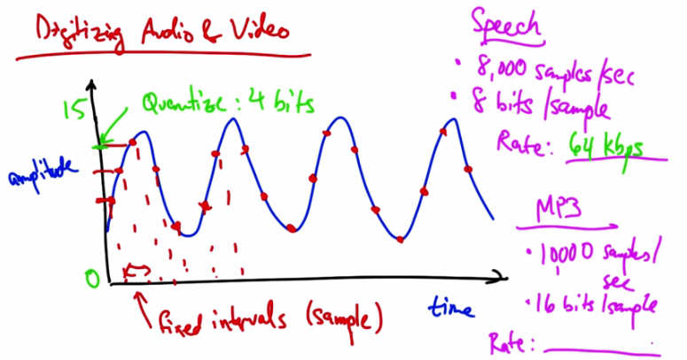

   Quiz 2 — Speech rate: 64 kbps. MP3: 10,000 samples/sec, 16 bits/sample. What is the Rate?

Suppose we have a MP3 with 10,000 samples per second and 16 bits per sample. What's the
resulting rate in this case in kbps?

Digitizing Audio and Video Solution 2
---------------------------------------

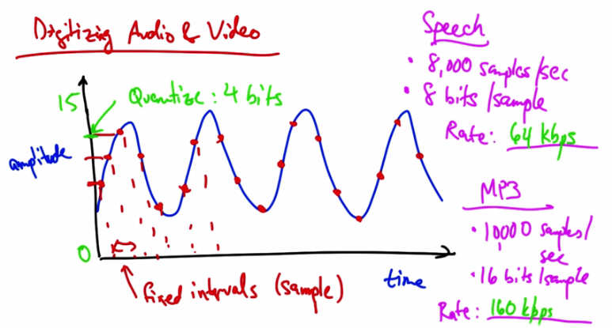

   Solution 2 — MP3: 10,000 samples/sec, 16 bits/sample. Rate: 160 kbps.

The resulting rate in this case is, a 160 kbps.

Video Compression
-----------------

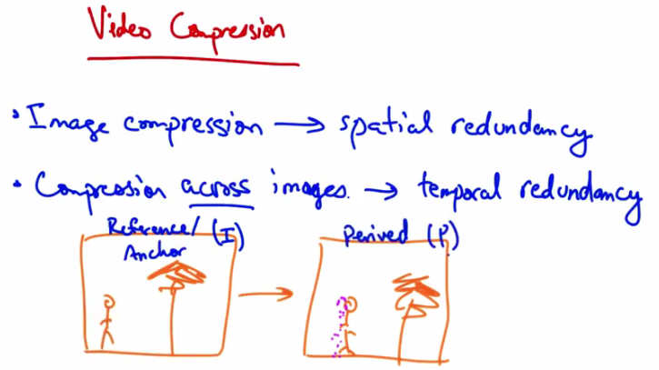

   Video Compression — Image compression → spatial redundancy. Compression across images
   → temporal redundancy. Reference (I) Anchor frame → Derived (P) frame.

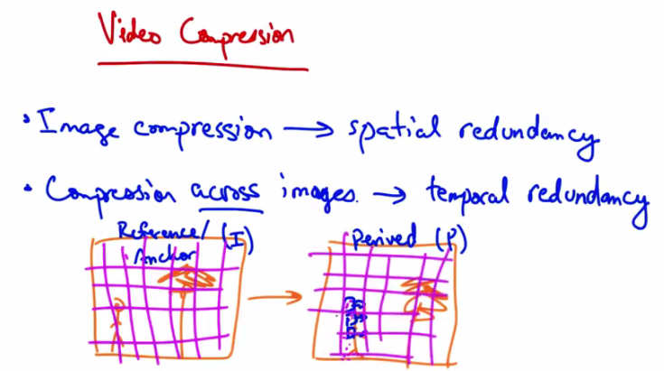

   Video Compression — I frame divided into blocks; P frame is almost the same with a few
   different blocks that can be represented in terms of original I frame blocks plus motion
   vectors.

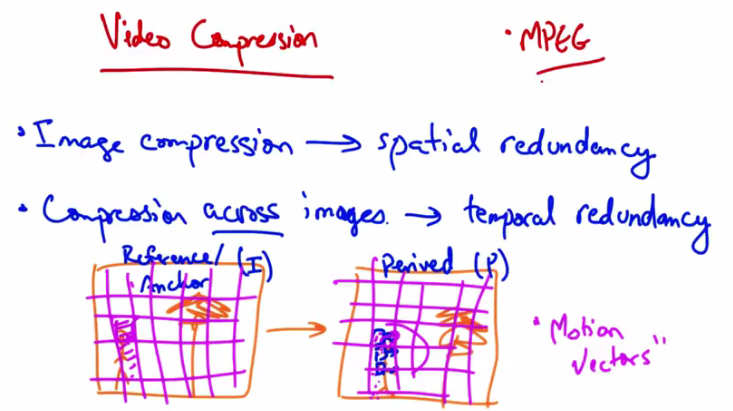

   Video Compression — MPEG. Image compression → spatial redundancy. Compression across
   images → temporal redundancy. Reference (I) / Anchor frame → Derived (P) frame with
   "Motion Vectors."

Video compression works in slightly different ways. Each video is a sequence of images and
each image can be compressed with spatial redundancy, exploiting aspects that humans tend not
to notice. Also there is temporal redundancy. Between any two video images, or frames, there
might be very little difference. So if this person was walking towards a tree, you might see a
version of the image that's almost the same, except with the person shifted slightly to the right.
Video compression uses a combination of static image compression on what are called reference
frames, or anchor frames (sometimes called I frames), and derived frames, sometimes called P
frames. The P frame can be represented as the I frame, compressed.

If we take the I frame and divide it into blocks, we can then see that the P frame is almost the
same except for a few blocks here that can be represented in terms of the original I frame blocks,
plus a few motion vectors.

A common video compression format that's used on the internet is called MPEG.

Streaming Video
---------------

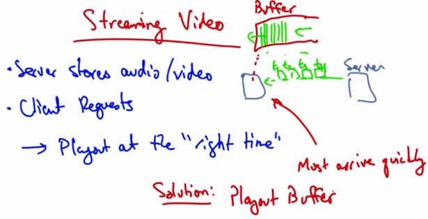

   Streaming Video — Server stores audio/video. Client requests → playout at the "right time."
   Data must arrive quickly. Solution: Playout Buffer. Server sends to client buffer; client plays
   from buffer continuously.

In a streaming video system where the server streams stored audio and video, the server stores
the audio or video files, the client requests the files, and plays them as they download. It's
important to play the data at the right time. The server can divide the data into segments and then
label each segment with a time stamp indicating the time at which that particular segment should
be played, so the client knows when to play that data. The data must arrive at the client quickly
enough, otherwise the client can't keep playing. The solution is to have a client use what's called
a playout buffer, where the client stores data as it arrives from the server, and plays the data for
the user in a continuous fashion. Thus, data might arrive more slowly or more quickly from the
server, but as long as the client is playing data out of the buffer at a continuous rate, the user sees
a smooth playout. A client may typically wait a few seconds before it starts playing the stream to
allow data to be built up in this buffer to account for cases when the server might have times
where it is not sending at a rate that's sufficient to satisfy the client's playout rate.

Playout Delay
-------------

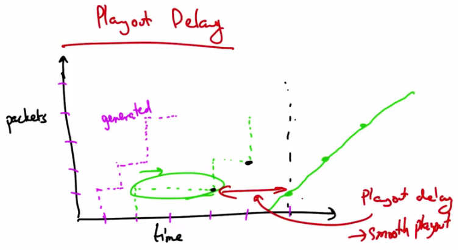

   Playout Delay — Packets generated at fixed rate (dashed), received at varying times due to
   network delay. Playout delay (buffer) → smooth playout. Graph shows packets vs time with
   playout delay marked.

Looking at this graphically, we might see packets generated at a particular rate and the packets
might be received at slightly different times, depending on network delay. These types of delays
are the types that we want to avoid when we playout. So if we wait to receive several packets
and fill the buffer before we start playing, say to here, then we can have a playout schedule that
is smooth regardless of the erratic arrival times that may result from network delays. So this
playout delay or buffering allows the client to achieve a smooth playout. Some delay at the
beginning of the playout is acceptable. Startup delays of a few seconds are things that users can
typically tolerate, but clients cannot tolerate high variation in packet arrivals if the buffer starves
or if there aren't enough packets in the buffer. Similarly, small amount of loss or missing data
does not disrupt the playback, but retransmitting a lost packet might actually take too long and
result in delays or starvation of the playout buffer.

Streaming Quiz
--------------

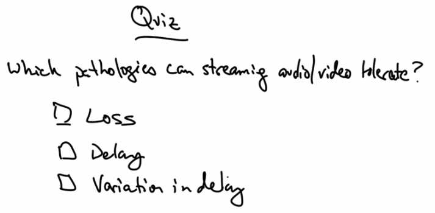

   Quiz — Which pathologies can streaming audio/video tolerate? Options: Loss, Delay,
   Variation in delay.

So as a quick review, which of these pathologies can streaming audio and video tolerate? Packet
loss, delay, variation in delay, or jitter?

Streaming Solution
------------------

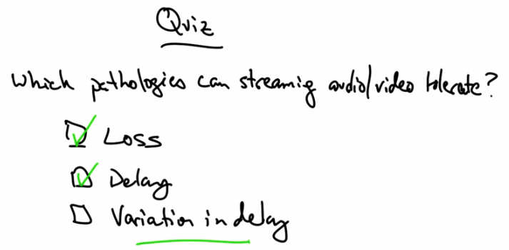

   Quiz Solution — Loss (checked) and Delay (checked) are tolerable. Variation in delay is NOT
   tolerable (underlined).

Some delay at the beginning of a packet stream is acceptable. And similarly, some small amount
of missing data is okay. We can tolerate small amounts of missing data that result in slightly
degraded quality. However, high variation in delay (jitter) is not tolerable as it causes the playout
buffer to starve.
