Content Distribution
====================

Lesson 3 Intro
--------------

We've covered congestion control, which works within network protocols; traffic shaping, which
is a high level network tool; and now we'll look at content distribution, an internet-wide tool that
enables websites and network operators to deliver data quickly and efficiently.

And to wrap up this section of the course, your project will export TCP in its slow start state.

The Web and Caching
-------------------

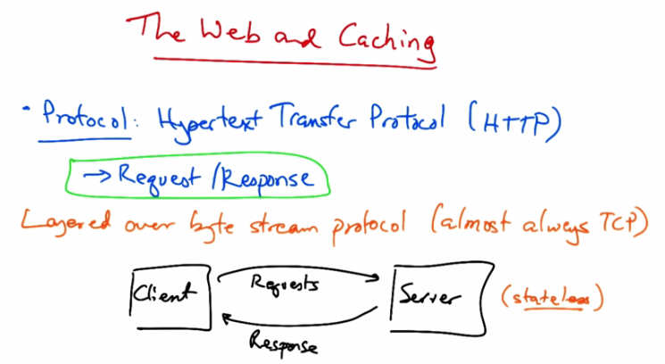

   The Web and Caching — Protocol: Hypertext Transfer Protocol (HTTP), Request/Response,
   layered over byte stream protocol (almost always TCP). Diagram shows Client sending Requests
   to Server (stateless) and receiving Responses.

In this lesson, we'll talk about the web and how web caches can improve web performance. We
will study, in particular, the hyper-text transfer protocol, or HTTP, which is an application layer
protocol to transfer web content. It's the protocol that your web browser uses to request web
pages, and it's also the protocol that the responses (or the web pages, or the objects that are
returned as part of a webpage) are returned to your browser. Your web browser makes requests
for web pages, and the pages and the objects in the page come back as responses. HTTP is
typically layered on top of a byte stream protocol, which is almost always TCP. The client sends
a request to a server asking for web content and the server responds with the content often
encoded in text. The server maintains no information about past client requests. Thus we say the
server is stateless. Let's take a quick look into the format of HTTP requests, and responses.

HTTP Requests
-------------

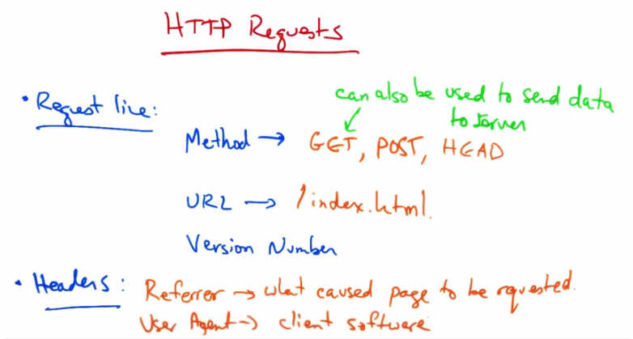

   HTTP Requests — Request line: Method (GET, POST, HEAD — can also be used to send data
   to server), URL (/index.html), Version Number. Headers: Referrer (what caused page to be
   requested), User Agent (client software).

Let's first take a look at the contents of an HTTP Request. First there's the Request Line which
typically indicates first, a method of request, where typical methods get to return the content
associated with the URL; a Post, which sends data to the server; and a Head Request which
returns, typically, only the headers of the Get Response, but not the content. It's worth noting that
a Get Request can also be used to send data from the content to the server. The request line also
includes the URL, which is relative, and may be something like index.HTML, and it also
includes the version number of the HTTP protocol. The request also contains additional headers,
many of which are optional. These include the referrer, which indicates the URL that caused the
page to be requested. For example, if an object is being requested as part of embedded content in
another page, the referrer might be the page that's embedding the content. Another example
header is the user agent, which is the client software that's being used to fetch the page. For
example, you might fetch a page using a particular version of Chrome or Firefox, and the user
agent informs the server which client software is being used.

Example HTTP Request
--------------------

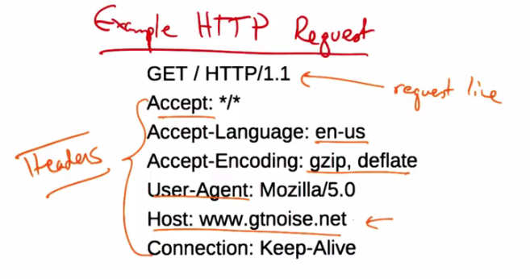

   Example HTTP Request showing: GET / HTTP/1.1 (request line), Headers including
   Accept: */*, Accept-Language: en-us, Accept-Encoding: gzip/deflate,
   User-Agent: Mozilla/5.0, Host: www.gtnoise.net, Connection: Keep-Alive.

Let's take a look at an example HTTP request now. You can see here the request line, and here
are some headers. Accept indicates that the client's willing to accept any content type, that it
would like the content to be returned in English, that it can accept pages that are encoded in
particular compression formats. We talked about the user agents. So in this case, it's a Mozilla
5.0 browser. Here's the host that the request is being made to. This is particularly useful in cases
where a particular web server IP address might be hosting multiple websites on the same server.

HTTP Header Quiz
----------------

   Quiz: Which HTTP header indicates client software? Options: Accept-encoding, GET,
   User-agent, Host.

As a quick quiz, which HTTP header field indicates the client software that's being used to make
the request? Accept encoding, get, user-agent, or host? Please pick the best answer.

HTTP Header Solution
--------------------

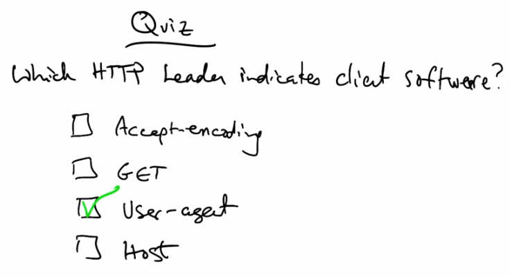

   Quiz solution: User-agent is checked as the correct answer — the user agent field in the
   HTTP request header indicates the client software being used.

The user agent field in the HTTP request header indicates the client software that's being used to
make the request.

HTTP Response
-------------

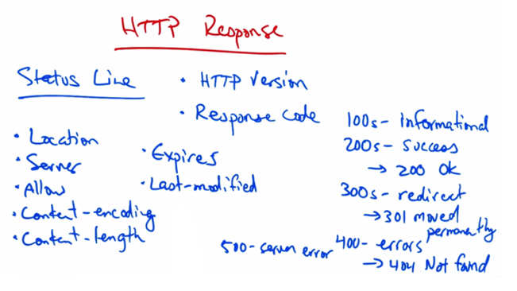

   HTTP Response — Status Line: HTTP Version, Response code (100s=Informational,
   200s=Success → 200 OK, 300s=Redirect → 301 Moved Permanently, 400s=Errors → 404 Not
   Found, 500=Server error). Headers: Location, Server, Allow, Content-encoding,
   Content-length, Expires, Last-modified.

Let's now take a look at the anatomy of an HTTP response. A response includes a status line,
which includes the HTTP version, and a response code, a where the response code may indicate
a number of possible outcomes. 100 response codes are typically informational, 200s indicate
success. So an example 200 response code is a common server response that indicates okay. 300
response codes indicate redirection. For example, a 301 response code indicates that the page has
moved permanently. 400s are errors, a well known one being 404, which is not found, and 500s
indicate server errors. Other headers include the location, which may be used for redirection; a
server, which indicates server software; allow, which indicates the HTTP methods that are
allowed, such as get, head and so forth; content-encoding, which describes how the content is
encoded (for example, if it's compressed); content length, which indicates how long the content
is in terms of bytes; expires, which indicates how long the content can be cached; and last-
modified, which indicates the last time the page was modified.

Example Response
----------------

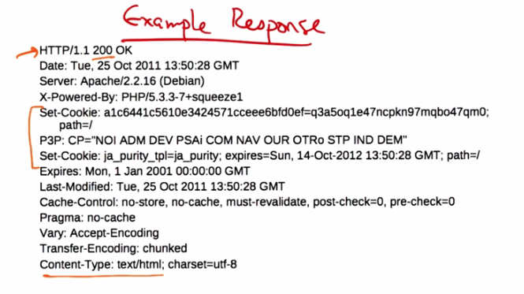

   Example Response showing HTTP/1.1 200 OK with headers including Date, Server,
   Set-Cookie, P3P, Expires, Last-Modified, Cache-Control, Pragma, Vary,
   Transfer-Encoding, and Content-Type: text/html; charset=utf-8.

Let's take a quick look at an example response. Here is the status line indicating the HTTP
version number and a response code, OK; the date the response was sent; the server that served
the request; some cookies that are used to set some state on the client (for example, whether or
not the client is logged in or not); when the page expires; when it was last modified; and some
more instructions about how the page can or cannot be cached. There's also a content type header
to indicate that the response is coming back in HTML format.

Early HTTP
----------

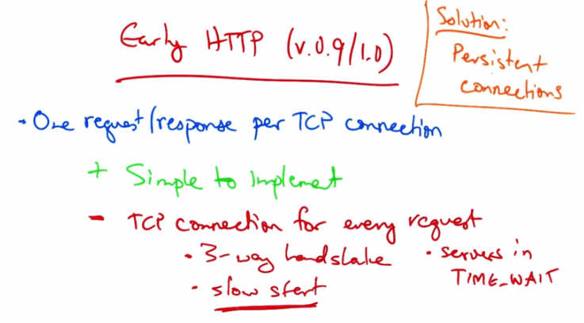

   Early HTTP (v0.9/1.0) — One request/response per TCP connection. Simple to implement (+)
   but TCP connection for every request (-): 3-way handshake, slow start, servers in TIME_WAIT.
   Solution: Persistent connections.

Now, early versions of HTTP actually only had one request or response for every TCP
connection. On the plus side, this is simple to implement. But the main drawback is that it
requires a TCP connection for every request, thereby introducing a lot of overhead and slowing
transfer. First of all, we need a TCP three-way handshake for every request, and TCP must start
in slow start every time the connection opens. This is exacerbated by the fact that short transfers
are very bad for TCP because TCP is always stuck in slow start and never gets a chance to
actually ramp up to steady state transfer. Also, as TCP connections are terminated after every
request is completed, the servers have many connections that are forced to keep TCP connections
in time-wait states until the timers expire, thus resulting in additional resources that the server
needs to keep reserved even after the connections have completed. So a solution to increase
efficiency and account for many of these drawbacks is to use something called persistent
connections.

Persistent Connections
----------------------

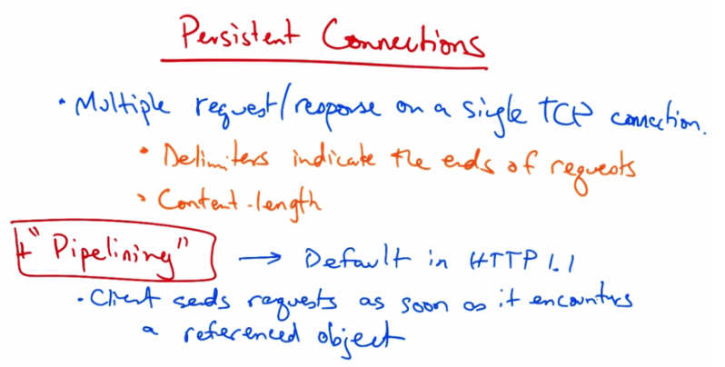

   Persistent Connections — Multiple request/response on a single TCP connection. Delimiters
   indicate the ends of requests; Content-length. Pipelining (default in HTTP 1.1): client sends
   requests as soon as it encounters a referenced object.

In persistent connections, multiple HTTP requests and responses are multiplex onto a single TCP
connection. Delimiters at the end of an HTTP request indicates the end of a request and the
content length allows the receiver to identify how long a response is. So, the server actually has
to know the size of the transfer in advance. Persistent connections can also be combined with
something call pipelining. In pipelining, a client sends the next request as soon as it encounters a
referenced object. So there's as little as one round trip time for all referenced objects before they
began to be fetched. Persistent connections with pipelining is the default behavior in HTTP 1.1.

Caching
-------

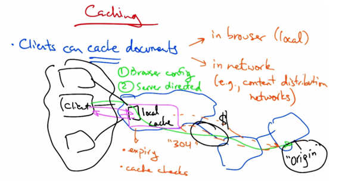

   Caching — Clients can cache documents in browser (local) or in network (e.g., content
   distribution networks). Two types: (1) Browser config, (2) Server directed. Diagram shows
   Client → local cache → origin, with 304 not-modified response, expiry, and cache checks.

To improve performance, clients often cache parts of a webpage. Caching can occur in multiple
places. Your browser can cache some objects locally on your very machine. Caches can also be
deployed in the network. Sometimes your local ISP may have a web cache, and later we'll also
look at how content distribution networks are a special type of web cache that can be used to
improve performance. To see how caching can improve performance, consider the case where
the origin web server may host the content for a particular website, but it's particularly far away.
Now, we already know that TCP throughput is inversely proportional to round-trip times. So, the
further away that this web server is, the slower the web page will load, both because latency is
bigge, and because throughput is lower. If, instead, the client could fetch content from the local
cache, performance could be drastically improved by fetching content from a more nearby
location. Caching can also improve the performance when multiple clients are requesting the
same content. In this case, not only do all of the local clients benefit from the content being
cached locally, but the ISP also saves costs on transit, because it doesn't have to pay to keep
transferring the same content over these expensive links. Instead, it can simply serve the content
to the clients locally. To ensure that clients are seeing the most recent version of a page, caches
periodically expire content, based on the expire setter that we already saw. Caches can also
check with the origin server to see whether the original content has been modified. If the content
has not been modified, the origin server would respond to a cache check request with a 304, or a
not modified, response. Clients can be directed to a cache in multiple ways. One is with browser
configuration. So you can open your browser and explicitly configure the browser to point to a
local cache so that all HTTP requests first are directed to the local cache before the request is
forwarded to the origin. In the second approach, the origin server, or the service hosting the
content, might actually direct your browser to a cache. This can be done with a special reply to a
DNS request.

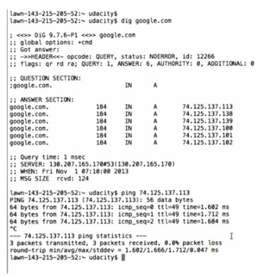

   Terminal output showing DNS lookup for google.com returning multiple IP addresses
   (74.125.137.x), and a ping showing 1-2ms round-trip times indicating a nearby cache server.

We can see these effects, for example, when we do a DNS look up for Google.com. The
response returns a number of IP addresses, and when I ping the IP address, we see that the
resulting IP address is only one millisecond away, which indicates that that server is not far
away, but is in fact very likely on a local network, probably even the Georgia Tech campus
network in this case.

Caching Quiz
------------

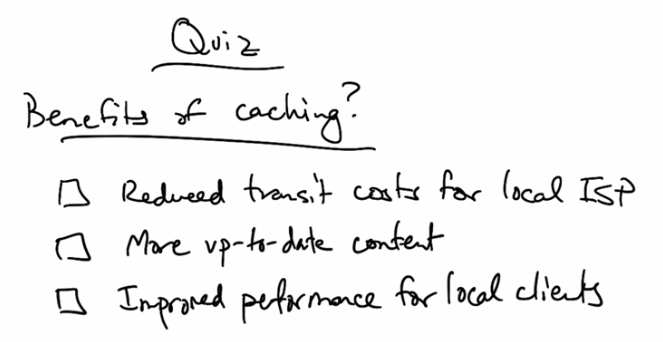

   Quiz: Benefits of caching? Options: Reduced transit costs for local ISP, More up-to-date
   content, Improved performance for local clients.

As a quick quiz, what are some of the benefits of HTTP caching? Reduced transit costs for the
local ISP, more up to date content, or improved performance for local clients? Please check all
that apply.

Caching Solution
----------------

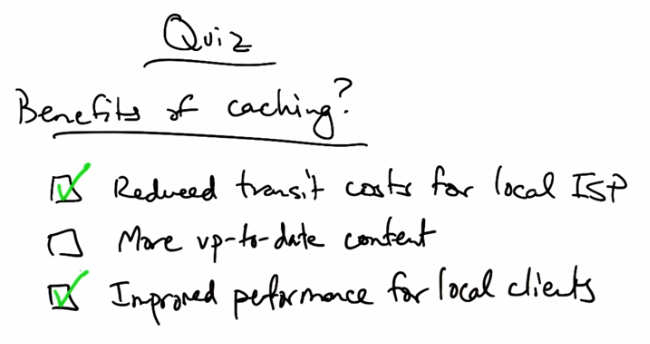

   Quiz solution: Reduced transit costs for local ISP (checked) and Improved performance for
   local clients (checked). More up-to-date content is not checked.

Web caching can reduce transit costs for the local ISP by preventing every HTTP request from
needing to go to the origin server. Because the content's also closer to the client, clients should
also see improved performance.

CDNs
----

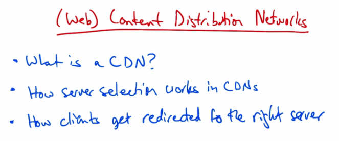

   (Web) Content Distribution Networks — What is a CDN? How server selection works in CDNs.
   How clients get redirected to the right server.

Let's now talk a little bit about web content distribution networks, or CDNs. We'll first talk about
what a CDN is and why a content provider might want to use one. We'll then talk about how
service selection works in CDNs and how clients get redirected to the right server.

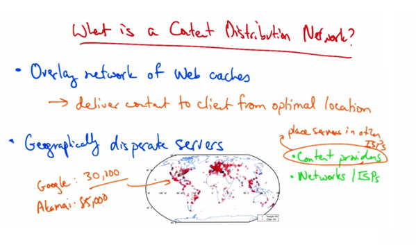

   What is a Content Distribution Network? Overlay network of web caches delivering content
   to client from optimal location. Geographically disparate servers — Google: 30,100 servers,
   Akamai: 85,000 servers. Places servers in other ISPs; Content providers and Networks/ISPs.

So, first of all, what is a content distribution network? It's an overlay network of web caches
that's designed to deliver content to a client from the optimal location. Now, in many cases
optimal means geographically closest, but sometimes optimal is not the geographically closest
cache, and we'll see some examples of when that's the case. CDNs are made of distinct
geographically disparate groups of servers, where each group can serve all the content on the
CDN. These CDNs can often be quite extensive. Here is a global map depicting the deployment
of the Google cache servers around the world, as mapped in a recent project by researchers at the
University of Southern California. As you can see, these Web caches can be quite extensive and
in many cases there's a concerted effort to place caches as close as possible to users. Some CDNs
are owned by content providers such as Google and others are owned and operated by networks
such as Level 3, Limelight, and AT&T. Still others such as Alcamai operate independently. Non
network CDNs, such as Alcamai and Google can typically place servers in other autonomous
systems or ISPs. The number of cache nodes in a large content distribution network can vary. For
example, in the Google Network, the USC researchers found that there were about 30,000 unique
front-end cache nodes. As of about two years ago, the Alcamai Edge platform reported about
85,000 unique caching servers in nearly 1,000 unique networks around the world in 72 countries.

Challenges in Running a CDN
----------------------------

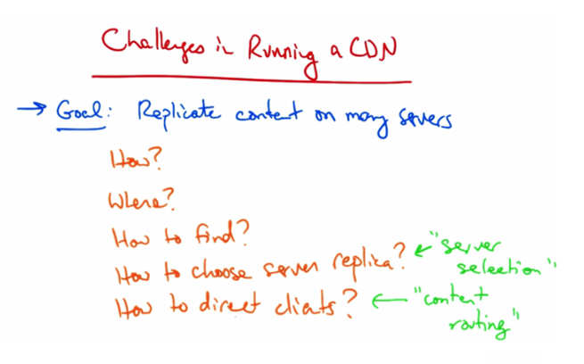

   Challenges in Running a CDN — Goal: Replicate content on many servers. How? Where?
   How to find? How to choose server replica? ("server selection") How to direct clients?
   ("content routing").

Operating a CDN presents many different challenges, and the underlying goal is to replicate
content on many servers so that the content is replicated close to the clients. Yet this leaves many
open questions including, how to replicate the content, where it should be replicated, how clients
should find the replicated content, how to choose the appropriate server replica (or cache) for a
particular client, and how to direct clients towards the appropriate replica once it's selected. This
problem is commonly known as server selection, and this problem is sometimes called content
routing. Let's take a look at each of these problems in a little bit more detail.

Server Selection
----------------

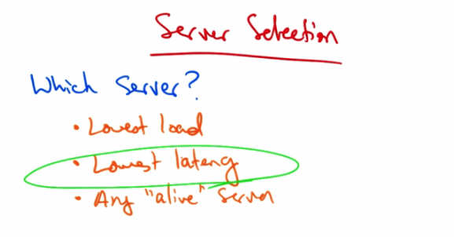

   Server Selection — Which Server? Lowest load, Lowest latency (circled as primary goal),
   Any "alive" server.

The fundamental problem with server selection is determining which server to direct the client
to. One could do this based on a number of criteria, such as the least loaded sever, the one with
the lowest network latency, or simply to any alive server to help provide fault times. Content
distribution networks typically aim to direct clients towards servers that provide the lowest
latency for the reasons that we talked about before, since latency plays a hugely significant role
in the web performance that clients see.

Content Routing
---------------

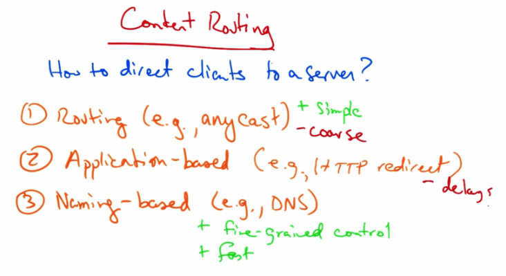

   Content Routing — How to direct clients to a server? (1) Routing (e.g., anycast): simple but
   coarse. (2) Application-based (e.g., HTTP redirect): delays. (3) Naming-based (e.g., DNS):
   fine-grained control, fast.

Content routing concerns how to direct clients to a particular server. One might do this in a
number of ways. One could use the routing system. For example, Anycast. So one could number
all of the replicas with the same IP address and then rely on routing to take the client to the
closest replica based on the routes that the internet routers choose. Routing-based redirection is
simple but it provides the service providers with very little control over which servers the clients
ultimately get redirected to because the redirection is at the whims of internet routing. Another
way to do redirection is application based. For example, by using an HTTP redirect. This is
effective but it requires the client to first go to the origin server to get the redirect in the first
place, increasing latency. The third and most common way that service selection is performed is
as part of the naming system using DNS. In this approach, a client looks up a particular domain
name, such as Google.com, and the response contains an IP address of a nearby cache. Naming
base redirection provides significant flexibility in directing different clients to different server
replicas. So, in summary, routing based redirection is simple but it's very coarse. Application
based routing is also fairly simple but it incurs significant delays which operators really care
about, as well as users. Naming based redirection provides fine-grained control and it's also fast.

Naming Based Redirection
------------------------

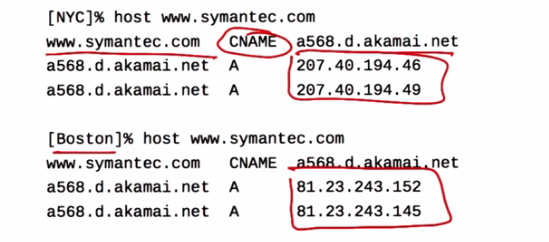

   DNS lookup for www.symantec.com from New York (NYC) and Boston showing CNAME record
   pointing to a568.d.akamai.net, which resolves to different IP addresses (207.40.194.x from
   NYC, 81.23.243.x from Boston) demonstrating location-based DNS redirection.

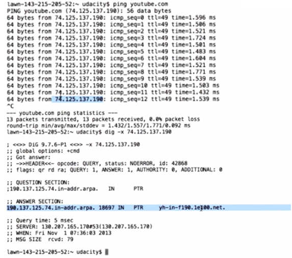

   Ping of youtube.com showing very low latency (1.4-1.7ms), and reverse DNS lookup of the
   IP address showing it resolves to a Google CDN hostname (yh-in-f190.1e100.net).

Let's take a closer look at how naming base redirection works. In the example shown here, I've
looked up symantec.com from two different locations. You can see that when we look up the
domain name, we don't get an A record immediately, but rather we get a CNAME, or a canonical
name, which tells us to look up the following domain name in Alcamai. When we look up that
domain name, we see two corresponding IP addresses. Notice that when we perform the same
look up from Boston, we also get redirected to Alcamai through the CNAME, but we get two
different IP addresses that are presumably more local to the Boston area. So, depending on where
the client looks up the domain name, it receives different IP addresses at different locations in
the network. This is how operators use DNS to redirect clients to nearby replicas.

As another example you can see when I ping youtube.com, I get very low latencies. And when I
do a reverse lookup on this IP address, I in fact see that the content was posted on Google CDN.

CDNs and ISPs
-------------

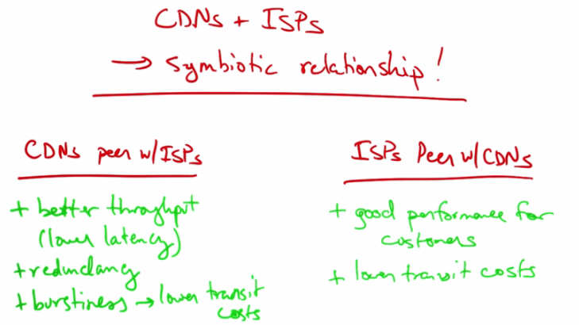

   CDNs + ISPs — Symbiotic relationship! CDNs peer with ISPs: better throughput (lower
   latency), redundancy, burstiness → lower transit costs. ISPs peer with CDNs: good performance
   for customers, lower transit costs.

It turns out that content distribution networks and ISPs have a fairly symbiotic relationship when
it comes to peering relationships. CDNs like to peer with ISPs because peering directly with ISPs
where a customer's located provides better throughput since there are no intermediate AS hops
and network latency is lower. Having more vectors to deliver a content increases reliability, and
during large request events, having direct connectivity to multiple networks where the content is
hosted allows an ISP to spread its traffic across multiple transit links, thereby potentially
reducing the 95th percentile and lowering its transit costs. On the other hand, there are other
good reasons for ISPs to peer with CDNs. First of all, providing content closer to the ISP's
customers allows the ISP to provide the customers with good performance for a particular
service. For example, you could already see that Georgia Tech has placed a Google cache node
in its own network, resulting in very low latencies to Google, and thereby happy customers. You
can imagine that providing good performance to popular services is a major selling point for
ISPs. Another reason that ISPs like to peer with CDNs or host cache nodes locally is to lower
their transit costs. You can imagine that if there are a huge demand for a particular video on
YouTube and all the requests and responses were going over expensive transit links, then the
ISPs cost would be potentially prohibitively high. On the other hand, peering with the CDN, or
hosting a local cache node, prevents all of that traffic from traversing expensive links, thus
reducing costs.

CDNs and ISPs Quiz
------------------

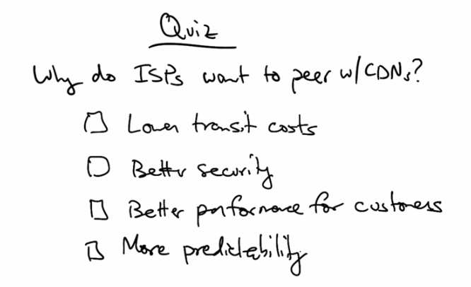

   Quiz: Why do ISPs want to peer with CDNs? Options: Lower transit costs, Better security,
   Better performance for customers, More predictability.

As a quick quiz, why do ISPs want to peer with CDNS? Lower transit costs, better security,
better performance for its customers, or more predictability? Please check all that apply.

CDNs and ISPs Solution
----------------------

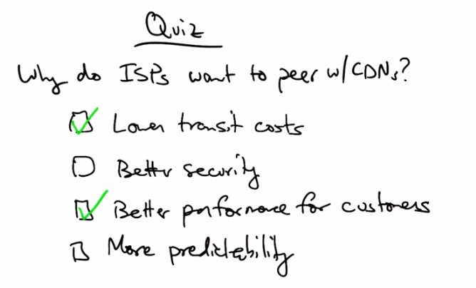

   Quiz solution: Lower transit costs (checked) and Better performance for customers (checked).
   Better security and More predictability are not checked.

ISPs typically want to peer with CDNs to lower the transit costs and to provide better
performance for their customers. CDNs don't inherently provide better security or more
predictability. And, in fact, some ways of redirecting clients to servers may actually reduce
predictability.

Bit Torrent
-----------

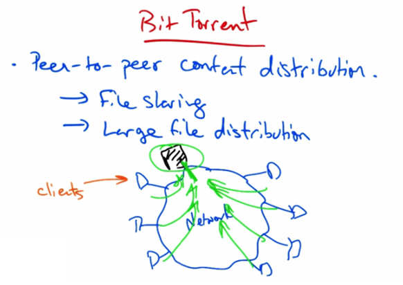

   Bit Torrent — Peer-to-peer content distribution for file sharing and large file distribution.
   Diagram shows clients connected to a network node with multiple peers.

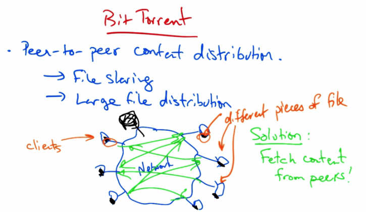

   Bit Torrent with different pieces of file — Solution: Fetch content from peers! Each client
   has different pieces which they trade with other peers to assemble the complete file.

Okay, we're now going to talk about Bit Torrent, which is a peer to peer content distribution
network that is commonly used for file sharing and distribution of large files. Okay, suppose we
have a network with a bunch of clients, all of whom want a particular file and the file might be
particularly big. Now, those clients could all fetch the same file from the source, or the origin.
But the problems with that, of course, are that the origin may be overloaded and the act of
making this request for a large file from the same location on the network may also create
congestion or overload at the network where the content is being hosted.

So, a solution is to fetch content from other peers. Rather than having everyone fetch the content
from the origin, we can take the original file and chop it into many different pieces and replicate
different pieces on different peers in the network, as soon as possible. So the idea is that each
peer is assembling the file, but it's assembling it by picking up different pieces of the file. And
then it can retrieve the pieces that it doesn't have from the remaining peers in the network. By
trading different pieces of the same file, everyone eventually gets the full file. The idea is that
hopefully we'll be able to assemble the entire file at the end by the time all of the clients have
swapped.

Bit Torrent Publishing
----------------------

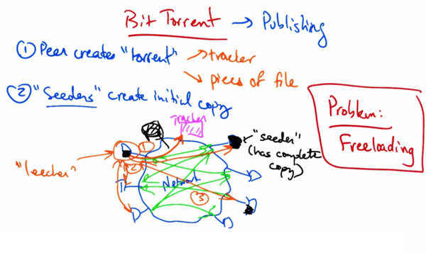

   Bit Torrent Publishing — (1) Peer creates "torrent" tracker (pieces of file). (2) "Seeders"
   create initial copy. Diagram shows tracker, seeder (has complete copy), leechers exchanging
   pieces. Problem: Freeloading.

Bit Torrent has several steps for publishing. First, a peer creates what's called a torrent which
contains metadata about tracker and all of the pieces of the file in question as well as a checksum
for each piece of the file at the time the torrent was created. Now some peers in the network need
to maintain a complete initial copy of the file. Those peers are called seeders. Now to download
a file, a client first contacts the tracker which provides this metadata about the file, including a
list of seeders that contain an initial copy of the file. Next, the client starts to download parts of
the file from the seeder. Once the client starts to accumulate some initial chunks, hopefully those
chunks were different than those that other clients in the network that are also trading the file
have. At this point clients can begin to swap chunks. As clients begin swapping distinct chunks
with one another, the idea is that eventually, after enough swapping, everyone gets a copy of the
complete file. Clients that contain incomplete copies of the file are called leechers. The tracker
allows peers to find each other and it also returns a random list of peers that any particular
leecher can use to swap chunks of the file. Previous, peer to peer file-sharing systems used
similar swapping techniques, but a problem that many of them faced, and which Bit Torrent
solved, is called free-loading, whereby a client might leave the network as soon as it finished
downloading a copy of the file, not providing any benefit to other clients who also want the file.

Solution to Free-riding
-----------------------

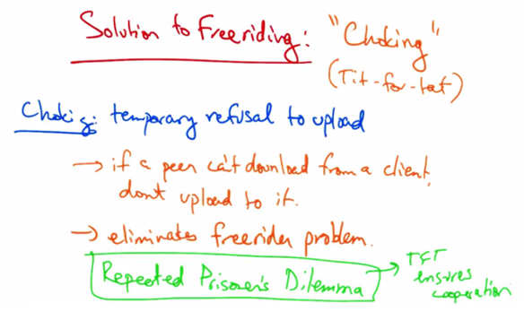

   Solution to Freeriding: "Choking" (Tit-for-tat). Choking: temporary refusal to upload →
   if a peer can't download from a client, don't upload to it → eliminates freerider problem.
   Repeated Prisoner's Dilemma → TFT ensures cooperation.

Bit Torrent's solution to free-riding is called choking, which is a type of game theoretic strategy,
called tit for tat. Choking is a temporary refusal to upload chunks to another peer that is
requesting them. Downloading, of course, occurs as normal. But if a node is unable to download
from any particular peer, it simply doesn't upload to that peer. This ensures that nodes cooperate
and eliminates the free-rider problem. If you're interested in the game theory behind why this
strategy ensures cooperation, I encourage you to go read about the repeated prisoner's dilemma
problem where a tit-for-tat strategy, such as that which is shown here, ensures cooperation
among mutually distrustful parties.

Getting Chunks to Swap
----------------------

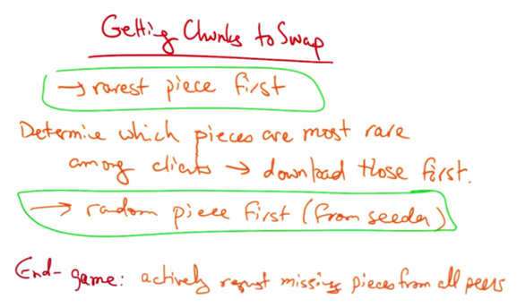

   Getting Chunks to Swap — Rarest piece first: determine which pieces are most rare among
   clients, download those first. Random piece first (from seeder). End-game: actively request
   missing pieces from all peers.

One of the problems that Bit Torrent needs to solve is ensuring that each client gets chunks to
swap with other clients. If all the clients received the same chunks, then no-one would want to
trade with one another and everyone would have an incomplete copy of the file. To solve this
problem, Bit Torrent clients use a policy called rarest piece first. Rarest piece first allows a client
to determine which pieces are the most rare among clients, and download the rarest pieces of the
file first. This ensures that the most common pieces are left till the end to download and that a
large variety of pieces are downloaded from the seeder. Additionally, a client has nothing to
trade and it's important to get a complete piece as soon as possible. Rare pieces are typically
available at fewer peers initially. Downloading a rare piece is initially maybe not a good idea. So
one policy that clients use is to select a random piece of the file and download it from a seeder.
In the end game the client actively requests any missing pieces from all peers, and redundant
requests are cancelled when the missing piece arrives. This ensures that a single peer with the
slow transfer rate doesn't prevent the download from completing.

Distributed Hash Tables
-----------------------

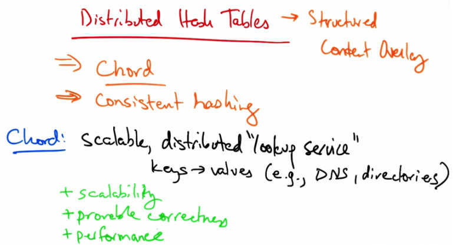

   Distributed Hash Tables → Structured Content Overlay. Chord, Consistent hashing.
   Chord: scalable, distributed "lookup service" — keys → values (e.g., DNS, directories).
   Properties: scalability, provable correctness, performance.

In this lesson we will talk about distributed hash tables, which enable a form of content overlay
called a structured overlay. We'll talk about a particular distributed hash table called Chord and
an underlying mechanism that enables it, called consistent hashing. Chord is a scalable,
distributed lookup service. A lookup service is simply any service that maps keys to values.
Examples of lookup services on the internet include DNS and directory services. Chord has some
desirable properties, including scalability, provable correctness, and reasonably good
performance that's also fairly easy to reason about.

Chord Motivation
----------------

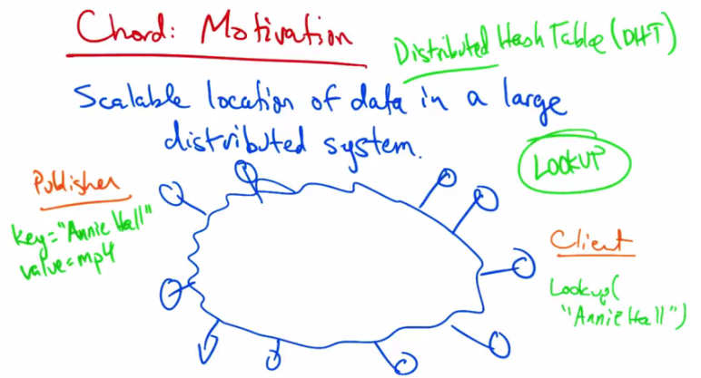

   Chord: Motivation — Distributed Hash Table (DHT). Scalable location of data in a large
   distributed system. Publisher stores key="Annie Hall" value=mp4. Client performs
   Lookup("Annie Hall"). Network nodes distributed around ring perform the lookup.

The main motivation of Chord is scalable location of data in a large distributed system. So a
publisher might want to publish the location of a particular piece of data, such as an MP4 with a
particular name, such as Annie Hall. It needs to figure out where to publish this data in a place
that the client can find it so that when the client performs a look up for Annie Hall, it's directed
to the right location that is hosting the data. The key problem that we need to solve here is look
up and you can see that the function that needs to be provided is just a simple hash table, but the
thing that makes this problem interesting is that the hash table isn't located in one place but that
it's distributed across the network. So what we're trying to build is what's called a distributed
hash table or a DHT. The way that we're going to build this is using a mechanism called
consistent hashing.

Consistent Hashing
------------------

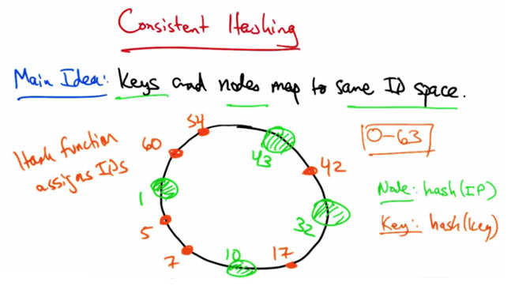

   Consistent Hashing — Main Idea: Keys and nodes map to same ID space (0-63). Hash function
   assigns IDs. Node: hash(IP). Key: hash(key). Ring shows nodes at positions 1, 5, 7, 10, 17,
   32, 42, 43, 54, 60.

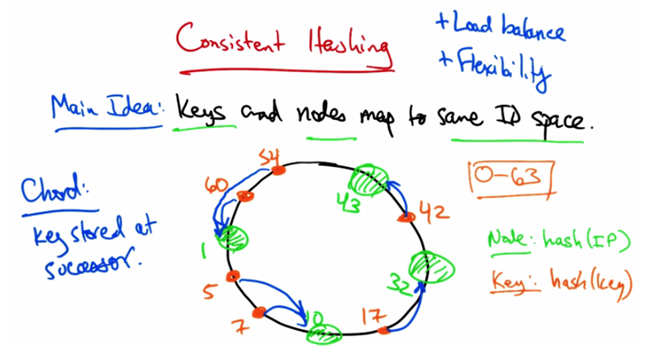

   Consistent Hashing with successor rule — Chord: key stored at successor. Ring diagram
   showing keys mapped to their successor nodes. Properties: load balance, flexibility.

In consistent hashing, the main idea is that the keys and the nodes map to the same ID space. So
what we're going to do is create a metric space, such as a ring, and we'll put nodes on this ring,
and the idea is that these nodes each have some ID. Now the keys should also map to the ID
space. So in this case, just for the sake of example, let's suppose that we have a six bit ID space,
so ID's might range from zero to 63. Now you can see that the nodes have ID's, and the keys also
have ID's in the same space. A consistent hash function will assign the nodes and the keys and
identifier in this space. A hash function such as SHA-1 might be used to assign these identifiers.
In the case of nodes, the ID might be a hash of the IP address. In the case of keys, the ID might
simply just be the hash of a key. Both of these hash operations create ID's that are uniformly
distributed in the ID space. The question now is how to map the key ID's to the node ID's, so that
we know which nodes are responsible for resolving the look ups for a particular key.

The idea in chord is that a key is stored at its successor, which is the node with the next highest
ID. So, for example, the key corresponding to the key ID of 60 would be stored at the node with
the node ID of one, similarly for the key with the key ID of 54. Forty-two would be stored at the
node with the node ID of 43, 17 at the node with 32, seven and five at the node with ID of 10,
and so on. Consistent hashing offers the properties of load balance, because all nodes receive
roughly the same number of keys and flexibility because when a node joins or leaves the
network, only a fraction of the keys need to be moved to a different location. You can actually
prove that the solution is optimal, meaning that the minimal number of keys need to be remapped
to maintain load balance when a node joins or leaves the network.

Implementing Consistent Hashing
--------------------------------

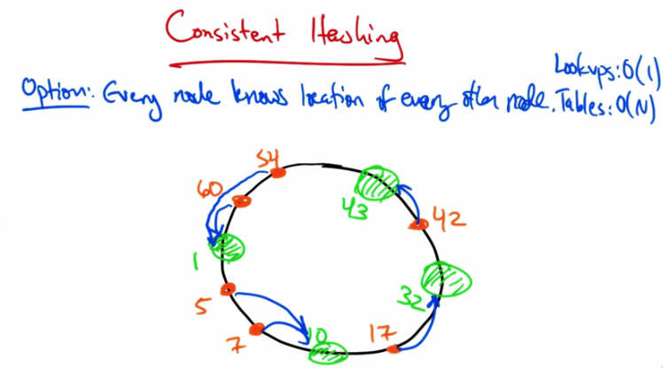

   Consistent Hashing — Option: Every node knows location of every other node. Lookups: O(1),
   Tables: O(N). Ring diagram with blue arrows showing direct lookup paths.

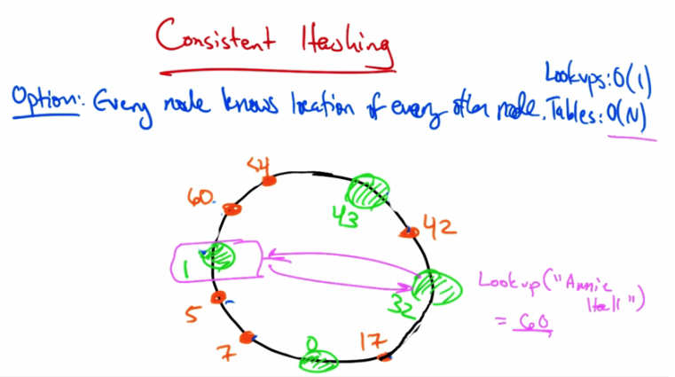

   Consistent Hashing with example — Lookup("Annie Hall") = 60. Node 32 directly resolves
   to node 1 since it knows all other nodes. Lookup is O(1) but table is O(N).

Let's talk a little bit about how to implement consistent hashing. One option is for every node to
know the location of every other node. In this case, lookups are fast. In fact, they are order one,
but the routing tables are large. In particular, because every node needs to know the location of
every other node in the network,, the routing table must be order N, where N is the number of
nodes in the network.

So, for example, if node 32 wanted to look up the location of Annie Hall, that value might hash
to 60, and if every node maintains a routing table entry for every other node, 32 would know that
the key corresponding to ID 60 was located at node one. So the look up, would be order one, but
the table ,would be order N.

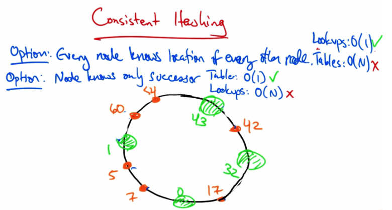

   Consistent Hashing — Two options compared: (1) Every node knows location of every other
   node: Lookups O(1), Tables O(N) ✗. (2) Node knows only successor: Table O(1) ✓,
   Lookups O(N) ✗.

Another option is that each node only knows the location of its immediate successor in the ring.
So, for example, node 32 would know the location of node 43, but of no other node. This results
in a small table, of size order one. But locating the content, as before, would require order N
lookups. So in summary, if every node knows the location of every other node, then lookups
have good performance at the expense of larger tables. If every node only knows its successor,
then routing tables can be small, but every lookup operation is order N.

Finger Tables
-------------

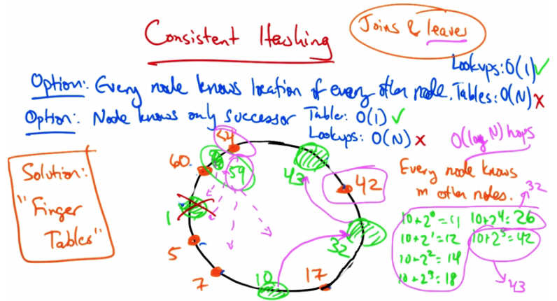

   Consistent Hashing — Finger Tables solution. Every node knows m other nodes (O(log N)
   hops). Node 10 maintains: 10+2^0=11, 10+2^1=12, 10+2^2=14, 10+2^3=18, 10+2^4=26,
   10+2^5=42 → pointing to node 43. Joins & leaves handled.

A solution that provides the best of both worlds is called finger tables, where every node knows
m other nodes in the ring and the distance of the nodes that it knows increases exponentially. So,
for example, node 10 would maintain mappings for 10 plus 2 to the 0, 10 plus 2 to the 1, and so
forth, where finger i Points to the successor of n plus 2i. So finger 0 would point to the successor
of 11, which is 32; Finger 1 would also point to 32 and so forth. Finger 5 would point to 43. Now
every node knows its immediate successor. So what you want to do is find the predecessor for a
particular ID and then ask for the successor of that ID. So let's suppose that node 10 wanted to
look up a key corresponding to the id of 42. It can use the finger tables to find the predecessor of
that node, which in this case, is 32. Its finger tables have the mapping of that nodes location as
well. It then can ask node 32 for its successor. At this point, we can move forward around the
ring looking for the node whose successor's ID is bigger than the ID of the data, which in this
case is node 43. Due to the structure of the finger table, these lookups require order of log n
hops. This results in efficient lookups, order log n messages per look up, and the size the finger
table is order of log n state per node. Another consideration that we have to take into account is
what happens when nodes join and leave the network. When a new node joins, we first have to
initialize the fingers of this new node. Then we must update the fingers of existing nodes so that
they know that they can point to the node with the new ID. And finally, the third step is to
transfer the keys from the successor to the new node. In this case, the key that we must transfer
from the successor, one, is the data with ID of 54. In this case, each node's successor is
maintained and the successor of any particular ID k is always responsible for k. A fallback for
handling leaves is to ensure that any particular node not only keeps track of its own finger table,
but also of the fingers of any successor, so that if a node should fail at any time, then the
predecessor node in the ring also knows how to reach the nodes corresponding to the entries in
the failed nodes finger table.
