Denial of Service
=================

Lecture 11.3: Denial Of Service Attacks

Denial of Service Attacks Overview
------------------------------------

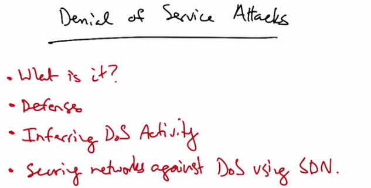

   Denial of Service Attacks — What is it? Defenses, Inferring DoS Activity,
   Securing networks against DoS using SDN.

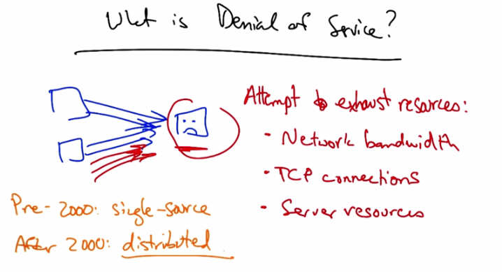

   What is Denial of Service? — Attempt to exhaust resources: Network bandwidth, TCP
   connections, Server resources. Pre-2000: single source. After 2000: distributed.

So in this lesson, we will talk about Denial of service attacks and defenses. We'll talk about what
denial of service attacks are and various defenses. We'll talk about how to infer denial of service
activity, and we'll talk about how to secure networks against denial of service attacks using
Software Defined Networking.

So what is denial of service? Denial of service is simply an attack that attempts to exhaust
various resources. One resource that a Denial of Service attack might exhaust is network
bandwidth. Another is TCP connections. For example, a host might only have a limited number
of TCP connections that it can open to various clients, or the Denial of Service attack might
attempt to exhaust various server resources. For example, this victim might be a web server
running complicated scripts to render web pages, and if the web server suddenly becomes the
target of a bunch of bogus requests, the server may spend a lot of resources rendering pages for
requests that are not legitimate. Before 2000, these Denial of Service attacks were typically
single source. After 2000, with the rise of internet worms as we saw in an earlier lesson, these
attacks could become distributed, effectively being launched from many attackers.

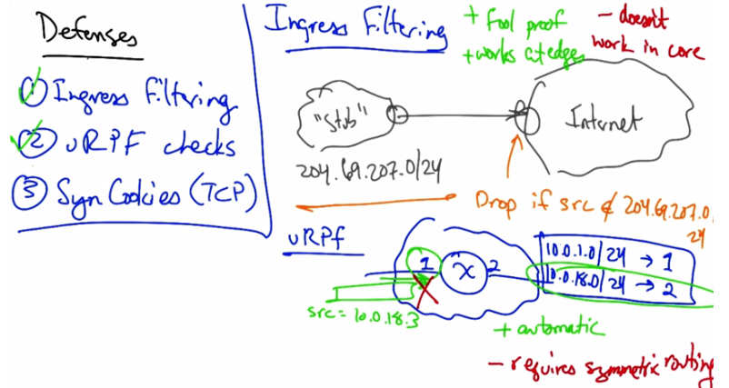

   Defenses — (1) Ingress Filtering: foolproof, works at edges, doesn't work in core.
   (2) URPF checks: automatic but requires symmetric routing.
   (3) Syn Cookies (TCP). Stub network 204.69.207.0/24 shown with drop rule.

Let's talk about three different types of defenses against denial of service attacks. First we have
something called ingress filtering. Then we have something called URPF, or reverse path
filtering checks. And then in the case of an attack on TCP connection resources, we can use
something called TCP syn cookies to defend against Denial of Service. Let's suppose that we
have a stub autonomous system whose IP prefix was 204.69.207.0/24. Now this is a stub
network that has no other networks connected to it and this is the only IP address space that this
network owns. Then, the router that is immediately upstream of that internet service provider can
simply drop all traffic for which the source IP address is not in the IP address range of that
particular network. So this is foolproof and it works at the edges of the internet where it's very
easy to determine the IP address range that's owned by a downstream stub autonomous system.
Unfortunately it doesn't work well in the core, where a particular router might have a lot of
difficulty determining whether packets from a particular source IP address could be allowed on a
particular incoming interface. So the solution that operators try to use in the core is to use the
routing tables to determine whether a packet could feasibly arrive on a particular incoming
interface. So if a router had a routing table that said all packets for 10.0.1.0/24, should be sent
via interface one, and all packets destined for 10.0.18.0/24 should be sent via interface two, then
URPF says if we see a packet for/with a particular source IP address on an incoming interface
that is different than where we would have sent the packet in the reverse direction, then we
should go ahead and drop this packet. So the benefits of URPF is that it's automatic, but the
drawbacks are that it requires symmetric routing. And we know from earlier lessons that routing
in the internet is often asymmetric. Therefore in any situation where asymmetric routing is a
possibility, it is not possible or reasonable to use URPF. So we've talked about ingress filtering
and URPF checks, and let's now talk about the use of Syn cookies to defend against TPC based
denial of service attacks.

TCP 3-Way Handshake Review
---------------------------

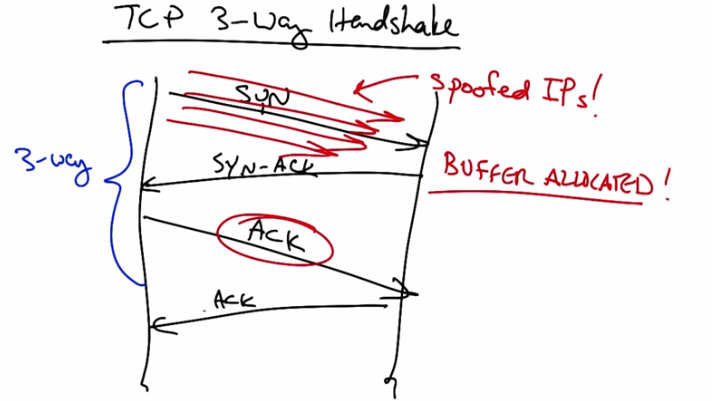

   TCP 3-Way Handshake — 3-way: SYN (from spoofed IPs), SYN-ACK (BUFFER ALLOCATED!),
   ACK. Attacker sends many SYNs from spoofed IPs, forcing server to allocate many buffers.

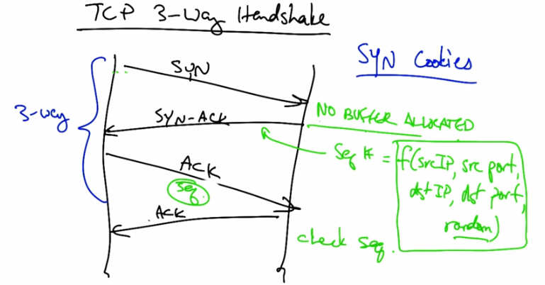

   TCP 3-Way Handshake with SYN Cookies — No buffer allocated. Sequence number =
   f(srcIP, srcPort, dstIP, dstPort, random). Server verifies returning ACK by checking seq#.

So in a typical TCP three-way handshake, the client sends a SYN packet to the server, the server
responds with the SYN-ACK, and the client then returns with an ACK to the SYN-ACK, at
which point the connection is established. The problem in a typical TCP three-way handshake is
that the client can send a SYN and cause the server to allocate a socket buffer for that TCP
connection. But then if the client never returns, the client can force the server to allocate many,
many socket buffers simply by sending a lot of SYNs and never returning. In fact, these could
even be from spoofed IP addresses. So in other words, the client has absolutely no accountability
and no obligation to return to send the final ACK, and yet can cause the server to allocate
resources.

This is a problem, and the solution to this is called SYN cookies. In the TCP SYN cookie
approach, when the server receives a SYN from the client, the server, instead of allocating a
socket buffer for the tuple associated with the connection, the server keeps no state, and instead
picks an initial sequence number for the connection that's a function of the client's IP address and
port, and the server's IP address and port, as well as a random knots to prevent replay attacks. An
honest client that returns can then reply with an acknowledgement with that sequence number in
the packet. The server can check that sequence number simply by rehashing all of the
information that it already has, thereby determining that the acknowledgement here corresponded
to the previous SYN-ACK that it had sent the client without requiring the server to store any
state. Only if the sequence number matches the one picked by the server in the SYN-ACK does
the server actually establish the connection.

TCP SYN Cookie Quiz
---------------------

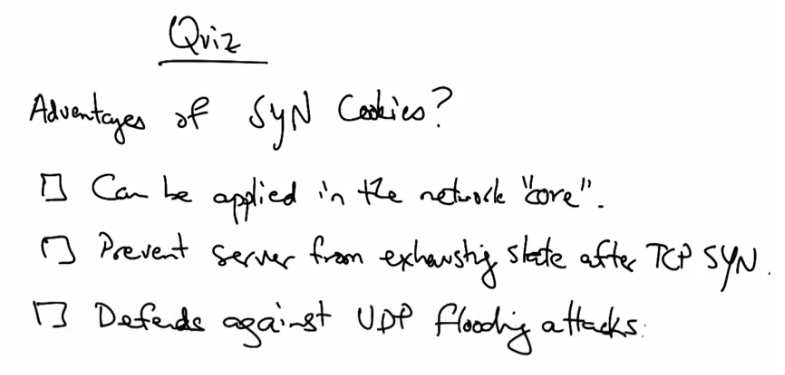

   Quiz: Advantages of SYN Cookies? Can be applied in the network "core", Prevent server
   from exhausting state after TCP SYN, Defends against UDP flooding attacks.

So as a quick quiz, what are some of the advantages of TCP Syn cookies? Is it that they can be
applied to filter traffic in the network core? Is it that they can prevent the server from exhausting
state by setting up socket buffers after receiving a TCP Syn? Or is it that they can defend against
UDP flooding attacks?

TCP SYN Cookie Quiz Answer
----------------------------

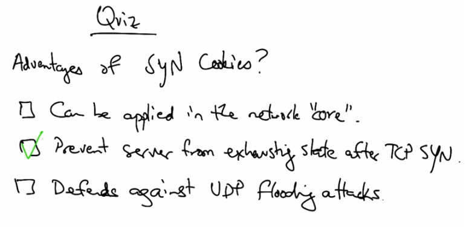

   Quiz Answer: Prevent server from exhausting state after TCP SYN (checked).

TCP SYN cookies can prevent a server from exhausting state after receiving the initial TCP SYN
packet.

Inferring Denial of Service using Backscatter
----------------------------------------------

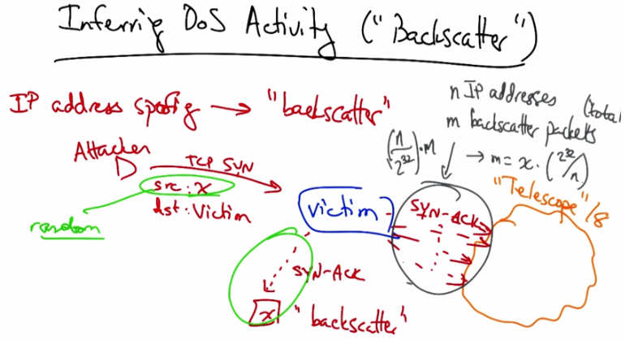

   Inferring DoS Activity ("Backscatter") — IP address spoofing leads to "backscatter".
   Attacker sends TCP SYN with src=random to victim. Victim sends SYN-ACK to random IP.
   "Telescope" /8 monitors N=2^24 addresses. m backscatter packets, total = m * (2^32/N).

Let's talk about how to infer denial of service activity using a technique called backscatter. The
idea behind backscatter is that when an attacker spoofs a source IP address, say on a TCP SYN
flood attack, that the replies to that initial TCP SYN from the victim will go to the location of the
source IP address. This replies to forged attack messages are called "backscatter". Now the
interesting thing about backscatter is that if we can assume that the source IP addresses are
selected by the attacker at random, and we could set up a portion of the network where we could
monitor this back scatter traffic coming back as SYN-ACK replies to forged source IP addresses,
if we assume that these source IP addresses are picked uniformly at random, then the amount of
traffic that we see as back scatter represents exactly a fraction that's proportional to the size of
the overall attack. So, for example, if we monitor N IP addresses and we see M attack packets,
then we expect to see here N over two to the 32 of the total back scatter packets, and hence of the
total attack rate. If we want to compute the total attack rate, we simply invert this fraction. So for
example, in this case, if our telescope were a slash eight, or two to the 24th IP addresses, we
would simply multiply our observed attack rate x by two to the 32 divided by two to the 24 or
255.

Backscatter Quiz
-----------------

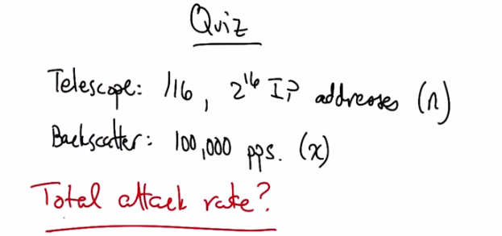

   Quiz: Telescope = 1/16, 2^16 IP addresses (n). Backscatter = 100,000 pps (x).
   Total attack rate?

As a quick quiz, let's suppose that our telescope is monitoring two to the 16th IP addresses. And
let's suppose that in that telescope, we see 100,000 packets per second. What's the total attack
rate?

Backscatter Quiz Answer
------------------------

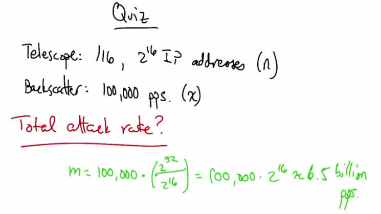

   Quiz Answer: m = 100,000 * (2^32 / 2^16) = 100,000 * 2^16 ~= 6.5 billion pps.

Since we're monitoring one 2 to the 16th of the entire internet, or 1 over 65,535 of the total
internet, we simply need to take the rate that we've observed and invert that. In this case, that rate
would be roughly 6.5 billion packets per second.

Automated Denial of Service Attack Mitigation
----------------------------------------------

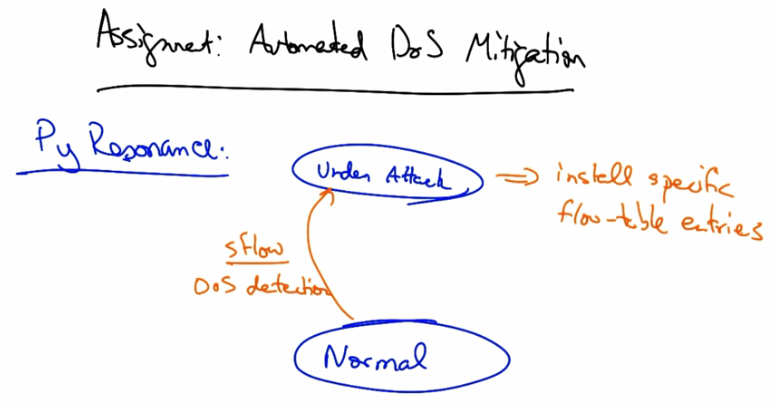

   Assignment: Automated DoS Mitigation — Py Resonance finite state machine transitions
   from Normal state to Under Attack state via sFlow DoS detection, installing specific
   flow-table entries to mitigate the attack.

In the assignment you will use a Pyretic controller to mitigate a DOS attack. We will use an
extension of Pyretic called Py Resonance, which allows for composition of finite state machines
that run various programs depending on the state of the network. Your network will start in a
normal state, but will use an sFlow-based Denial of Service detector to indicate that the network
has come under attack. Your sFlow event will cause the controller to change states, and hence it
will install specific flow-table entries that mitigate the effects of the Denial of Service attack.
The assignment that is spelled out on the home page has links to some more in-depth
descriptions of this particular assignment and your task is writing a Py Resonance application to
mitigate the DOS attack.

