DNS
===

Domain Name System Part 1
--------------------------

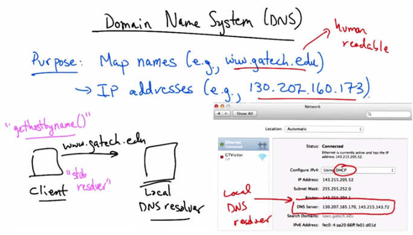

   Domain Name System (DNS) — Purpose: Map names (e.g., www.gatech.edu) → IP addresses
   (e.g., 130.207.160.173). Human readable. "gethostbyname()" call from client → "stub
   resolver" → Local DNS resolver. Network settings screenshot shows DNS Server:
   130.207.165.178, 143.215.143.71.

We'll now have a look at the domain name system or DNS. The purpose of the domain name
system is to map human readable names such as www.gatech.edu to IP addresses such as
130.207.160.173. A name such as this is human readable and much easier to remember and type
than an IP address. But in fact, the IP address is what's needed to send traffic to the intended
destination. So, we need a lookup mechanism that takes a human readable name and maps it to
an IP address. The system that does this is a Domain Name System, or the DNS. The system
roughly works as follows. A client may want to look up a domain name such as
www.gatech.edu. A networked application source code might do so by invoking a function such
as get_host_by_name, which takes as an argument a domain name and returns an IP address. The
client typically has what's called a stub resolver, and that stub resolver takes that name and issues
a query. The stub resolver might have cached the answer or the IP address corresponding to this
name, but if not, the query is sent to what's called a local DNS resolver.

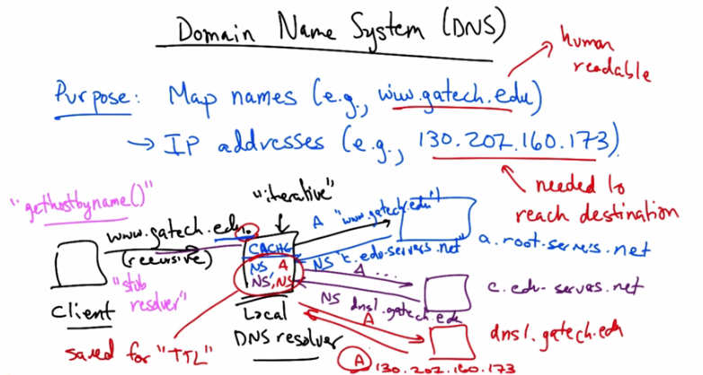

   DNS iterative resolution — "iterative" queries from Local DNS resolver: A query for
   "www.gatech.edu" goes to a.root-servers.net (NS A reply), then c.edu-servers.net (NS A
   reply), then dns1.gatech.edu (A 130.202.160.173). Client issues recursive query; resolver does
   iterative work.

Your local DNS resolver, is typically configured automatically when your host is assigned an IP
address using a protocol called the domain host control protocol or DHCP. In your host
configuration such as this one, you can see that this local host has two local DNS resolvers.
Typically, a client will try the first DNS resolver and if it doesn't receive a response within a
preconfigured timeout, it will try sending the same query to the second local DNS resolver as a
backup. This query is typically issued recursively, meaning the client does not want intermediate
referrals sent back to it. It only wants to hear when it's received the final answer. The local
resolver on the other hand will perform iterative queries. It might have the answer to this
particular query in the cache, in which case it would simply reply with the answer. But let's
suppose for the moment, that nothing is cached. Each fully qualified domain name is presumed
to end with a dot, indicating the root of the DNS hierarchy. Now the IP addresses for the root
servers, or those that are authoritative for the root, may already be configured in the local DNS
resolver. In this case, the resolver may be able to query for the authoritative server for .edu, say
a.rootservers. net. This would be an A record query. The answer might return with what's called
an NS record, which is a referral. In this case the answer might be a referral to the edu servers.
Now the local resolver issues the same query to the edu servers and receives a referral to the
authoritative servers for gatech.edu. Finally the local resolver might query the authoritative name
server for gatech.edu and actually receive an A record indicating the actual IP address that
corresponds to that name.

Domain Name System Part 2
--------------------------

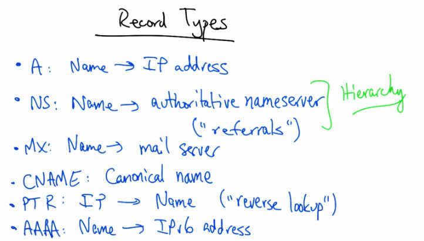

   DNS with caching — Local DNS resolver stores NS and A records in CACHE with TTL
   (Time To Live). NS records cached for each level; A record final answer also cached. Client
   query saved for "TTL" duration. Blue=root, purple=.edu, red=gatech.edu authoritative servers.

Now this process of referrals, as you can see, can be rather slow. A particular DNS query might
thus require round trips to multiple servers that are authoritative for different parts of the
hierarchy. The blue server is authoritative for the root. The purple server is authoritative for .edu
and the red server is authoritative for gatech.edu. Now supposing we wanted to save the extra
time in trouble of these round trip times. This local resolver would typically have a cache that
stores the NS records for each level of the hierarchy as well as the A records. And each of these
answers would be stored or cached for a particular amount a time. Each one these replies has
what's called a time to live or a TTL that indicates how long each of these answers can be saved
before they need to be looked up again. Caching allows for quick responses from the local DNS
resolver, especially for repeated mappings. For example, since everyone is probably looking up
domain names such as google.com it's much faster to keep the answer in cache. So, given
multiple clients trying to resolve the same domain name, the answers can all be resolved in a
local cache. Some queries can reuse parts of this look up. For example, it's unlikely that the
authoritative name server for the root is going to change very often. So that answer might be
kept, or cached, for a much longer period of time. A typical time might be hours or days, or even
weeks. The mapping for a local name, such as www.gatech.edu, on the other hand, might change
more frequently and thus these local TTL's might need to be smaller. Now the most common
type of DNS record is what's called an A record, which maps an IP address to a domain name.
But there are other important record types as well.

Record Types
------------

   Record Types — A: Name → IP address. NS: Name → authoritative nameserver ("referrals")
   [Hierarchy]. MX: Name → mail server. CNAME: Canonical name. PTR: IP → Name ("reverse
   lookup"). AAAA: Name → IPv6 address.

A records map names to IP addresses as we have seen. We have also seen what's called an NS or
a Nameserver record which maps a domain name to the authoritative nameserver for that
domain. So we saw a bunch of NS records in the form of referrals, whereby, if we ask the route
for a mapping of gatech.edu to an IP address, it doesn't specifically know the answer, but it can
issue a nameserver reply or an NS record referring the resolver to a different nameserver that
could be responsible for that part of the domain name space. This allows the domain name
system to be implemented as a hierarchy. Another important DNS record type is an MX record,
which shows the mail server for a particular domain. Occasionally, one name actually is just an
alias for another name. For example, www.gatech.edu actually has a slightly different real name.
The CNAME is basically a pointer from an alias to another domain name that needs to be looked
up. The PTR is another record that we'll look at, and this maps IP addresses to domain names.
For example if you wanted to know the name for a particular IP address, you need to issue a PTR
query. This is sometimes called a reverse lookup. Finally, a AAAA record maps a domain name
to an IPV6 address. Let's take a look at a couple of different examples of domain name lookups
using a command line utility called dig.

DNS Quiz
--------

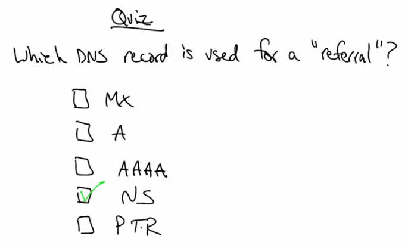

   Quiz — Which DNS record is used for a "referral"? Options: MX, A, AAAA, NS, PTR.

As a quick quiz, which DNS record is used for referral? Is it the MX record? A record? The
Quad A record? The NS record? or the PTR?

DNS Solution
------------

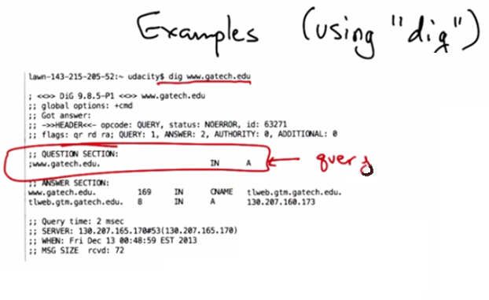

   Quiz Solution — NS is checked. NS record indicates the authoritative name server for a
   particular portion of the domain name space; an NS record reply is a referral.

The NS record indicates the authoritative name server for a particular portion of the domain
name space, and an NS record reply is often referred to as a referral. MX records indicate mail
servers. A records are IP addresses for the domain name. AAAA are for IPv6 addresses, and a
PTR is a name corresponding to an IP address being queried.

Examples (using dig) Part 1
----------------------------

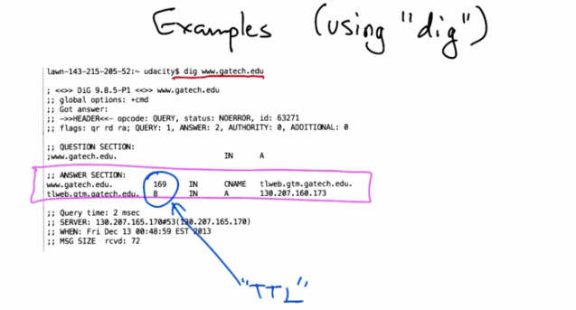

   Examples (using "dig") — dig www.gatech.edu. Question Section: www.gatech.edu IN A
   (query highlighted). Shows the A record query structure.

Here's an example of a lookup for an A record for gatech.edu. You can try this at your own
command line by typing, for example, dig www.gatech.edu. Now there are some interesting
things to note in this trace. Here is our query and you can see that this is an A record query.

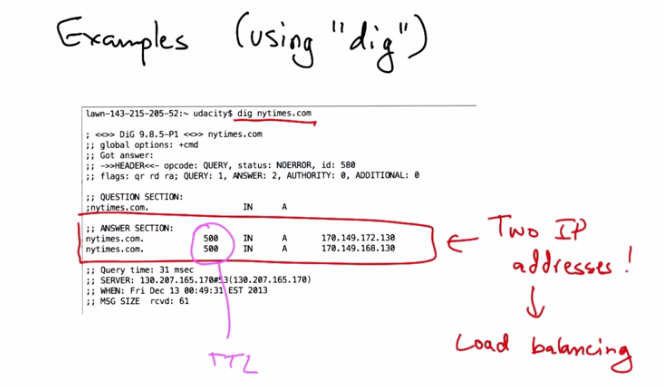

   Examples (using "dig") — Answer Section: www.gatech.edu 169 IN CNAME
   tlweb.gtm.gatech.edu; tlweb.gtm.gatech.edu 8 IN A 130.207.160.173. TTL values (169, 8)
   indicate how long entries can be stored in cache.

Here's our answer. You can see that the answer actually has a CNAME in it, which basically
says, well you asked for gatech.edu but in fact what you really want to ask for is
tlweb.gtm.gatech.edu. So then we issue an A record query for that name, and we ultimately get
the IP address. These numbers here indicate the time to live or the amount of time in seconds that
the entry can be stored in the cache.

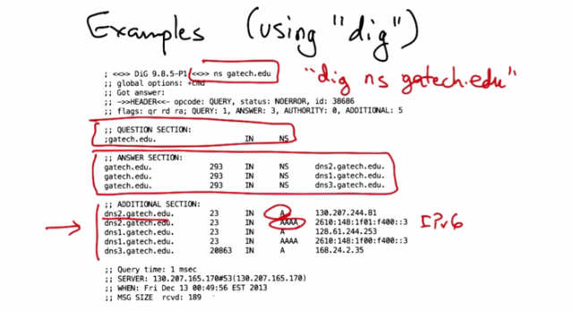

   Examples (using "dig") — dig nytimes.com. Answer Section: nytimes.com 500 IN A
   170.149.172.130 and nytimes.com 500 IN A 170.149.160.130. Two IP addresses! → Load
   balancing. TTL shown.

Here's another example of a DNS lookup from nytimes.com. The interesting thing to note here is
that in response to the A record query, we see two IP addresses. This is typically performed
when a service wants to perform load balancing. So, the client could use either one of these. It
might prefer the first one, but if we issued the same query again, we might actually get these IP
addresses in a different order. Now, again, here you can see the TTL value which indicates how
long these A records can be stored in cache. In a subsequent example, we'll look at other query
types that have much longer TTL values.

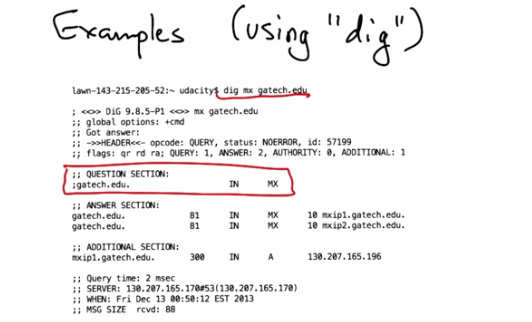

   Examples (using "dig") — "dig ns gatech.edu". Question Section: gatech.edu IN NS. Answer
   Section: gatech.edu 293 IN NS dns2.gatech.edu, dns1.gatech.edu, dns3.gatech.edu.
   Additional section includes A and AAAA (IPv6) records for the name servers.

Here's an example of a query for the NS record for gatech.edu. You can see this output by typing
dig ns gatech.edu. You can see here in the question section, now instead of an A record query we
have an NS record query. And our answer is a bunch of NS records that are dns1, 2, and
3.gatech.edu, any of which could answer authoritatively for sub-domains of gatech.edu. You can
see that in addition to the answer, which return the name servers, we also need the IP addresses
of those name servers, which is returned in the additional section of the answer. You can see here
that we received not only A records for each domain name but also quad A or IPv6 addresses
corresponding to each authoritative name server.

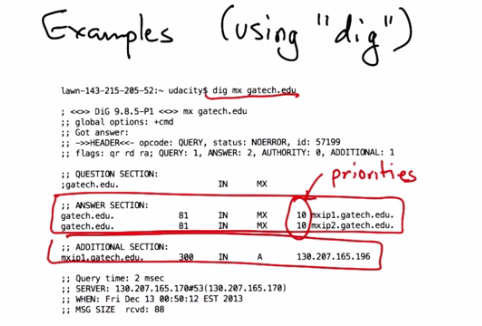

   Examples (using "dig") — dig mx gatech.edu. Question Section: gatech.edu IN MX. Answer
   Section: gatech.edu 81 IN MX 10 mxip1.gatech.edu; gatech.edu 81 IN MX 10
   mxip2.gatech.edu. Additional Section: mxip1.gatech.edu 300 IN A 130.207.165.196.

Here's an example of a query for an MX record or the mail server corresponding to gatech.edu.
Now, here again you can see the question is the MX record and you can see the answer which
returns two mail servers as well as the additional section, which returns an A record indicating
the IP address corresponding to the mail server that was returned in the MX record. In addition
to the TTL, we also have some metrics that indicate priorities that would allow a system
administrator to configure a primary and a backup mail server.

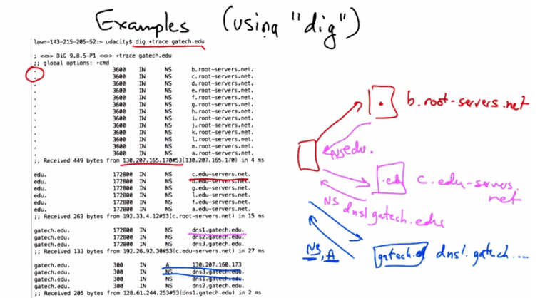

   Examples (using "dig") — dig mx gatech.edu. Answer Section shows both mail servers with
   priority 10 (same priority level highlighted). Additional section: mxip1.gatech.edu 300 IN A
   130.207.165.196.

In this case, the mail servers, just happen to have the same priority level.

Examples (using dig) Part 2
----------------------------

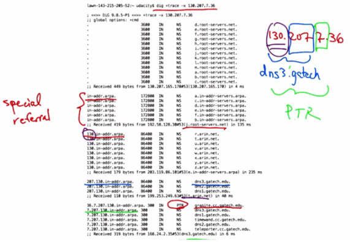

   Examples (using "dig") — dig +trace gatech.edu. Shows full hierarchy: root servers (b.root-
   servers.net etc.) → .edu servers (c.edu-servers.net) NS dns1.gatech.edu → gatech.edu
   authoritative (dns1.gatech.edu). Each level's NS and A records shown with TTL values.

Let's put everything together now by looking at a trace of an entire lookup. Now in the examples
before, we didn't get to see the full lookup hierarchy because we issued a recursive query. But
let's suppose we wanted to see every step of the DNS lookup process. You can do this by using
the trace option in dig. Here you can see exactly what we saw before, which is the local resolver.
In this case, issuing a query to a local resolver and receiving a referral to an authoritative server
for dot which could be any of the following. That query, elicits an answer for the .edu servers
which subsequently issues a referral to the servers that are authoritative for gatech, which
ultimately reply with the appropriate a records as well as the authoritative nameservers for
gatech.edu.

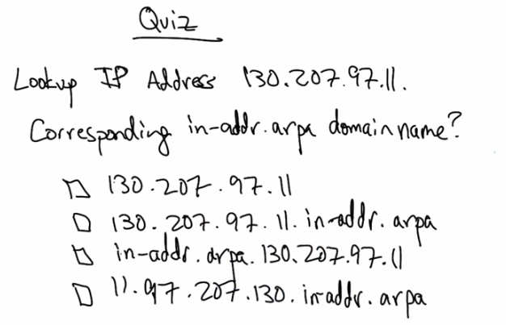

   Examples (using "dig") — dig +trace -x 130.207.7.36. Shows PTR reverse lookup hierarchy:
   root servers → in-addr.arpa (special referral) → 130.in-addr.arpa → 207.130.in-addr.arpa
   → 7.207.130.in-addr.arpa → dns3.gatech.edu PTR record. Annotated: 130.207-7.36,
   dns3.getech, "special referral", PTR.

A final interesting example explores how to map an IP address. back to a name. In this case,
we're ultimately looking for PTR record, which is the name corresponding to this IP address. But
first, what happens is we receive a special referral. When we ask the root servers about this
particular IP address, instead of being referred to a particular .com or .edu domain, we're referred
to a special top level domain called inaddr.arpa, which maintains referrals to authoritative servers
that are maintained by the respective internet routing registries, such as ARIN, RIPE, APNIC
and so forth. So here we see a referral to inaddr.arpa. Subsequently, we see a referral to 130.in-
addr.arpa corresponding to the first octet of the IP address. Next when we ask ARIN about
130.in-addr.arpa we receive another referral, which is to is to 207.130.in-addr.arpa. And because
130.207 is allocated to gatech.edu, ARIN knows that the appropriate referral for this part of the
address space is to DNS 1, 2, or 3.gatech.edu. Next we issue a query for the next part of the
octet. 7.207.130.in-addr.arpa corresponding to the first 3 octets. And now we actually get the
PTR because DNS3.gatech.edu knows the reverse mapping between 130.207.7.36 and the name
for that IP address. So you can see that the PTR records, or those that map IP addresses to names,
are resolved through a special hierarchy through in-addr.arpa at the root followed by a walk
through the regional registries and ultimately, to the domains, such as gatech, that are responsible
for particular regions of the IP address space.

Lookup IP Address Quiz
----------------------

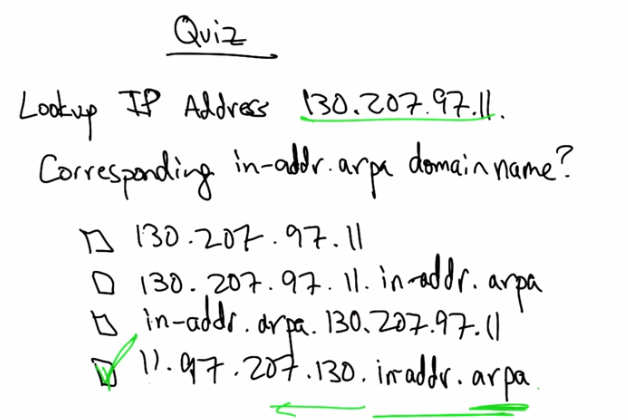

   Quiz — Lookup IP Address 130.207.97.11. Corresponding in-addr.arpa domain name? Options:
   130.207.97.11, 130.207.97.11.in-addr.arpa, in-addr.arpa.130.207.97.11,
   11.97.207.130.in-addr.arpa.

As a quick quiz, suppose we wanted to look up the IP address 130.207.97.11. What is the
corresponding in-addr.arpa domain name? Is it 130.207.97.11? Is it 130.207.97.11.in-addr.arpa?
Is it in-addr.arpa.130.207.97.11? Or is it 11.97.207.130.in-addr.arpa?

Lookup IP Address Solution
--------------------------

The corresponding domain name for the PTR lookup for this IP address is the record
corresponding to 11.97.207.130.in-addr.arpa. Notice that the reversal of the octets in this name
corresponds to a strict traversal of the hierarchy from the highest levels of the hierarchy at
inaddr.arpa to the lower levels, as the IP address moves from higher to lower parts of the
hierarchy.
