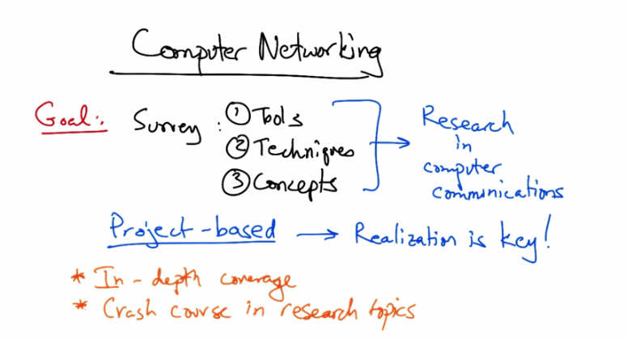
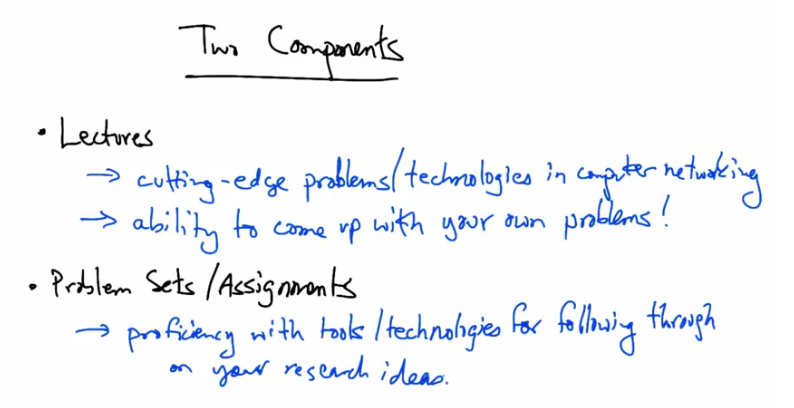
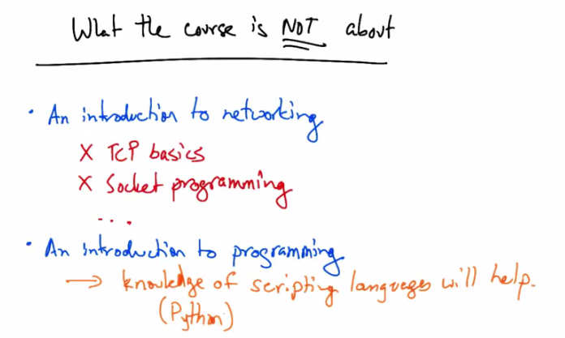
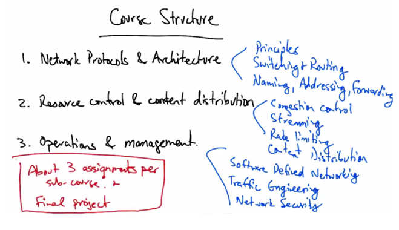

Introduction
============

Welcome to Computer Networking
--------------------------------

Welcome to networking. I'm Nick and I'll be your teacher in this course.

And I'm Josh. Nick and I have prepared a set of fun projects for you to tackle.

We have an awesome course prepared for you. We'll be covering advanced concepts in
networking such as software defined networking (SDN), data center networking (DCN) and
content distribution. You'll complete projects using a state of the art network emulator called
mini-net to understand and explore these advanced concepts leading up to a final project
replicating actual networking research.

Computer Networking
-------------------

   Computer Networking — Goal: Survey Tools, Techniques, and Concepts → Research in computer
   communications. Project-based → Realization is key! In-depth coverage. Crash course in
   research topics.

Welcome to the graduate course on computer networking. The primary goal of this course is to
provide a survey of the necessary tools, techniques, and concepts to perform research in
computer communications. This is a project based course, and there will be significant emphasis
on hands-on experience. In networking, perhaps more than many other subjects, realization is
key. You can read about concepts or techniques in a textbook, but really the most effective way
to learn networking is by doing. So, you'll gain a lot of hands on experience in this course
through the assignments. In comparison to an introductory networking course which you may
have taken, this course will provide more in depth coverage of networking topics, and it will also
offer a crash course in some of the available tools that are now available for performing research
in computer networking. You will gain experience with many of these tools through the project
based assignments in the course.

Two Components
--------------

   Two Components — Lectures: cutting-edge problems/technologies in computer networking,
   ability to come up with your own problems. Problem Sets/Assignments: proficiency with
   tools/technologies for following through on your research ideas.

The course has essentially two components. In the lectures you will learn about cutting edge
research problems in computer networking and you'll also gain the ability to come up with your
own problems. We'll pick up the basics along the way as necessary. In addition to the lectures
there are also a number of problem sets or assignments that you will work through as you work
your way through the course. The problem sets and assignments in the course will give you
proficiency with the tools and technologies that are state of the art in the research community.
That will allow you to follow through on the research ideas that you may come up with as we
work through various topics in the course. There are tons of exciting tools to use, and the
problem sets and assignments will help you gain proficiency with them.

What the Course is NOT About
-----------------------------

   What the course is NOT about — Not an introduction to networking (no TCP basics, no socket
   programming). Not an introduction to programming → knowledge of scripting languages
   (Python) will help.

It's also worth bearing in mind what this course is not about. The course is not an introduction to
networking, so there are a number of basic topics that won't be covered in this course. In
particular, we'll assume that you're already familiar with the basics of things like TCP, Socket
programming, and so forth. Anything that you might have picked up in an introductory
networking course, we are just going to assume as a prerequisite for this course. So before you
proceed, it may be worth revisiting some of your old undergraduate networking course material.
The course is also not providing any introduction to programming. However, many assignments
in the course will make use of some amount of programming. So some knowledge of scripting
languages like Ruby, Python or Perl will certainly be helpful in some assignments. We'll be
making a lot of use of a network emulation toolkit called Mininet, and to use that tool most
effectively, you will certainly want to learn some Python if you don't already know it. Don't
worry if you don't know these languages already, though. There's plenty of time to learn in the
course since the deadlines are fairly spread out. And the assignments aren't focused on
knowledge of programming per say, but rather, the concepts that you are going to realize in the
programming languages.

Course Structure
----------------

   Course Structure — 1. Network Protocols & Architecture (Principles, Switching & Routing,
   Naming, Addressing, Forwarding). 2. Resource Control & Content Distribution (Congestion
   Control, Streaming, Rate Limiting, Content Distribution). 3. Operations & Management
   (Software Defined Networking, Traffic Engineering, Network Security). About 3 assignments
   per sub-course + Final project.

The course is broken into three smaller sub-courses. The first course will cover topics including
architectural principles, switching, routing, naming, addressing, and forwarding. The second part
of the course will cover congestion control, streaming, rate limiting, and content distribution.
And the third part of the course will have modules on software defined networking, traffic
engineering, and network security. There will be about three assignments per sub course, plus a
final project.
