Naming Addressing And Forwarding
================================

Lecture 5: Naming, Addressing & Forwarding
-------------------------------------------

IP Addressing
-------------

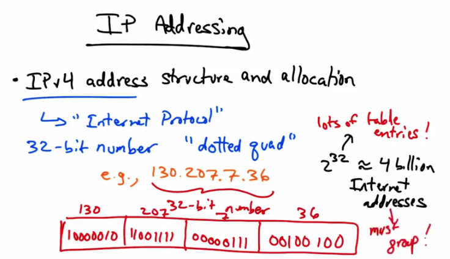

   IP Addressing — IPv4 address structure and allocation. "Internet Protocol" — 32-bit number,
   "dotted quad" notation. Example: 130.207.7.36 = 130 | 207 | 7 | 36 (each 8 bits).
   2^32 ≈ 4 billion Internet addresses. Lots of table entries!

In this lesson we will be covering IP addressing. In particular we will be covering IPv4 address
structure and allocation. IP stands for Internet Protocol, and version four is the version of the
protocol that is widely deployed on the Internet to date. Each IP address is a 32-bit number. And
that 32-bit number is formatted in what is called dotted quad notation. For example, the IP
address for www.cc.gatech.edu, is 130.207.7.36. And this is just a convenient way of writing a
32 bit number. So 130 represents 8 bits, and 207 is another eight bit number, 7 is another eight
bit number, as is 36. This structure allows for two to the 32, or about 4 billion Internet addresses.
Now that sounds like a lot of addresses. As it turns out it's actually not enough, and we're
running out of IP addresses, as I'll discuss in a later lesson. But even if we only had to deal with
two to the 32 Internet addresses, that's still a lot. Think of it if you have to store every single IP
address as an entry in a table. Very quickly that becomes an extremely large table where look-
ups can be slow and the memory required to store such a large table might be expensive. So what
we need is a more concise way of representing groups of IP addresses. There are different ways
to group IP addresses and we'll look at the prevailing method in the next part of the lesson. But
first, let's look at how this was done before 1994.

Pre 1994 Classful Addressing
-----------------------------

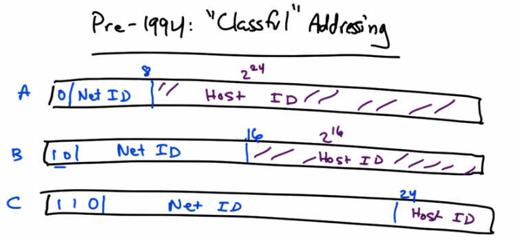

   Pre-1994: "Classful" Addressing — Class A: 0 | Net ID (8 bits) | Host ID (24 bits, 2^24 hosts).
   Class B: 10 | Net ID (16 bits) | Host ID (16 bits, 2^16 hosts). Class C: 110 | Net ID (24 bits)
   | Host ID (8 bits).

Before 1994, addresses was divided into a Network ID portion and a Host ID portion. So if we
take our 32-bits, suppose the first bit is a zero. Note that that's half of all IPv4 address space.
Anything that starts with a 0 is going to be known as a class A address and the next 7 bits will
represent the network ID or the network that owns this portion of address space. The remaining
portion of the address space is dedicated for hosts on that network. In this case, any class A
network can support up to two to the twenty-fourth hosts. Addresses that started with one zero
were designated as class B networks, where the first 16 bits signified the Network ID and the
remaining 16 bits signified the Host ID for that network. Note here that each class B address
range represents about one sixty-five thousandth of all internet address space. So, discounting the
first two bits which indicate that this is a class B network, we have about 2 to the 14th, unique
class B's, each of which can have two to the sixteenth, or 65,000 hosts on each network. Class
C's use the first 24 bits for the net ID and the remaining 8 for host ID. So each class C network
essentially can have only 255 hosts on it.

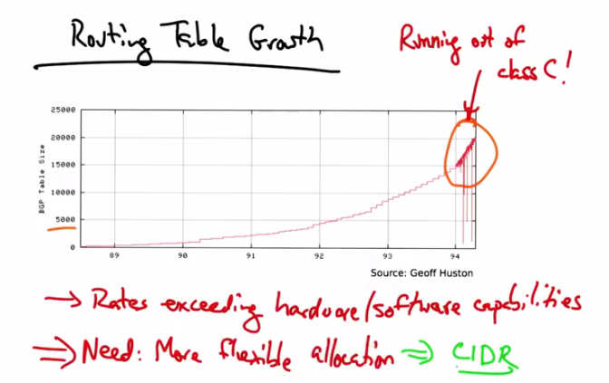

   Routing Table Growth — BGP routing table size from 1989-1994. Running out of class C!
   Rates exceeding hardware/software capabilities. Need: More flexible allocation → CIDR.

This plot shows the BGP routing table size as a function of the year, starting in 1989, and going
up to the internet routing table is quite small. It started at less than 5,000 prefixes. By comparison
now we have about 500,000 IP prefixes in the internet routing table. But we can see in this
period, that internet routing table growth began to accelerate, in particular the growth rates were
exceeding the advances in hardware and software capabilities. And, in particular, we began to
run out of the class C address allocation. There were far more networks that needed just a
handful of IP addresses, such as a class C address space could provide, and yet because only a
certain range of the IP address space could be used for class C addresses we began to run out
fairly quickly. So there began to be a need for more flexible allocation. The solution to this
problem is something called classless interdomain routing, or CIDR. Something that we'll cover
in the next lesson.

IP Addressing Quiz
------------------

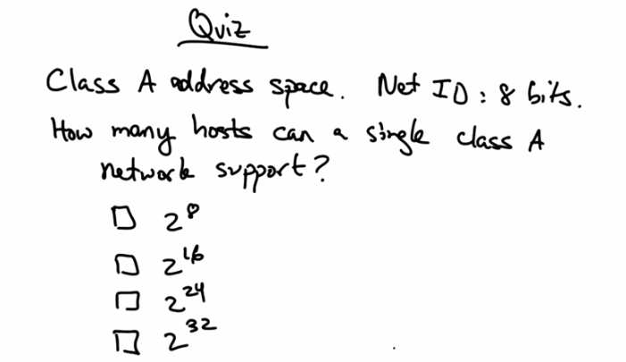

   Quiz — Class A address space. Net ID: 8 bits. How many hosts can a single class A network
   support? Options: 2^8, 2^16, 2^24, 2^32.

As a quick quiz, suppose you have a class A address space which means that the network ID is
eight bits. How many hosts can a single class A network support? Is it to the 2 to the 8th, 2 to the
16th, 2 to the 24th or 2 to the 32nd?

IP Addressing Solution
-----------------------

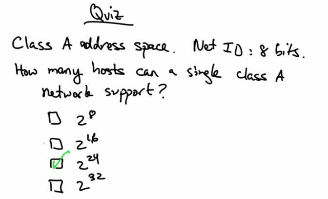

   Solution — 2^24 (checked). Class A has 8-bit Net ID, leaving 24 bits for Host ID.

Each Class A address space has a network ID of 8 bits meaning that there are 24 bits that remain
for the host ID. This means that each Class A network can support up to 2 to the 24th hosts.

IP Address Allocation
----------------------

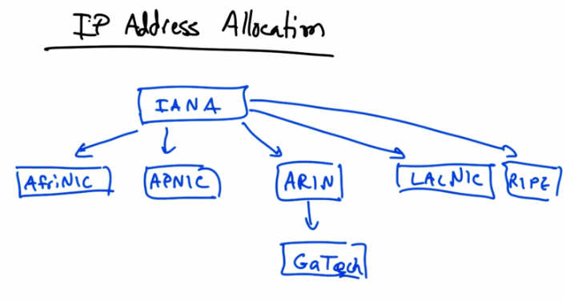

   IP Address Allocation — IANA at top, distributes to regional registries: AFRINIC (Africa),
   APNIC (Asia/Australia), ARIN (North America), LACNIC (Latin America), RIPE (Europe).
   ARIN allocates to organizations like Georgia Tech.

Let's take a look at how IP address space is allocated to Internet service providers. At the top of
the hierarchy is an organization called the Internet Assigned Numbers Authority, or IANA.
IANA has the authority to allocate address space to what are called regional routing registries.
For Africa, the regional registry is called AFRINIC, for Asia and Australia the registry is called
APNIC, for North America, ARIN, for Latin America it's LACNIC, and for Europe it's RIPE.
ARIN in turn allocates address space to individual networks, like Georgia Tech. The address
space across registries is far from even.

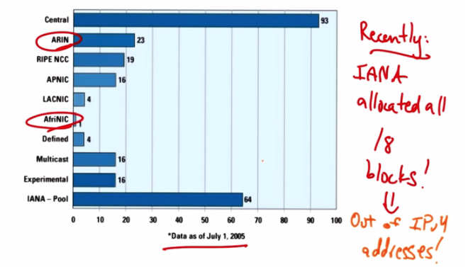

   Bar chart of /8 address block allocations by registry (data as of July 1, 2005). Central: 93,
   ARIN: 23, RIPE NCC: 19, APNIC: 16, LACNIC: 4, AfriNIC: 1, Multicast: 16, Experimental:
   16, IANA-Pool: 64. Recently: IANA allocated all /8 blocks — Out of IPv4 addresses!

Now, this graph is from a journal article that's a little bit dated now, but it gives you an idea of
how many /8 address allocations have been allocated to each of the regional registries. So as of
2005 North America had 23 /8s allocated to it but the entire continent of Africa had only one.
And the recent news is that IANA actually finished allocating all remaining /8 Internet address
blocks, essentially meaning that we're out of IPv4 address space. So when you hear that we're out
of IPv4 addresses, it doesn't mean that you can no longer attach a new device to the Internet.
There are various ways for coping with this pressure on address space. What that means is that
IANA no longer has any more /8 blocks to give to these regional registries.

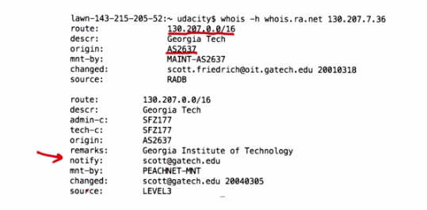

   Whois query result for 130.207.7.36 showing route: 130.207.0.0/16, Georgia Tech, origin
   AS2637. Routing registry entry confirms ownership and autonomous system number.

Querying an IP address using Whois and a routing registry, such as ra.net, will tell you the owner
of that particular prefix. For example, if we run a Whois query on an IP address at Georgia Tech,
it will tell us that that IP address is from a /16 allocation, that Georgia Tech is the owner of the
prefix, and it's associated with this autonomous system number. The routing registry entry also
gives us some additional information, such as who to contact if we need to contact the owner of
this address space.

Classless Interdomain Routing
-------------------------------

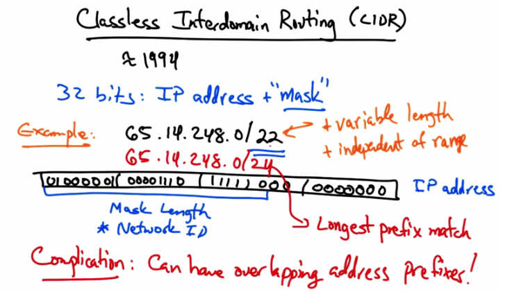

   Classless Interdomain Routing (CIDR) — circa 1994. 32 bits: IP address + "Mask". Example:
   65.14.248.0/22 (variable length, independent of range). 65.14.248.0/24 overlaps with /22.
   Mask Length = Network ID → Longest prefix match. Complication: can have overlapping
   address prefixes!

The pressure on address space usage spurred the adoption of classless interdomain routing or
CIDR which was adopted in 1994. The idea is that instead of having fixed network ID and host
ID portions of the 32 bits, instead, we would simply have an IP address, and what is known as a
mask, where the mask is variable length and indicates the length of the network ID. So, for
example, suppose we have an IP address like 65.14.248.0/22. Well in this case our 32 bits look
like so, but this doesn't tell us how long the network ID and how long the host ID should be. The
/22 indicates the mask length, which says that the first 22 bits should represent the network ID.
Now the key is that this mask can be variable length. And the mask length no longer depends on
the range of IP addresses that are being used. This allows those allocating IP address ranges, to
both allocate a range that's more fitting to the size of the network and also not have to be
constrained about how big the network ID should be depending on where in the IP address space
the prefix is being allocated from. Of course now the complication is that it's possible to have
overlapping address prefixes. For example, 65.14.248.0/24 overlaps with 65.14.248.0/22. The
red prefix is actually a subset of the black one. So supposing these two entries both show up in
an Internet routing table, what are we supposed to do? The solution is actually to forward on
what's called the longest prefix match, meaning that if a routing table has two overlapping entries
that it should forward according to the entry that has the longest prefix, or the longest mask
length. Intuitively that makes sense because the prefix with the longer mask length is more
specific than the prefix with the shorter mask, or the larger prefix.

Longest Prefix Match
---------------------

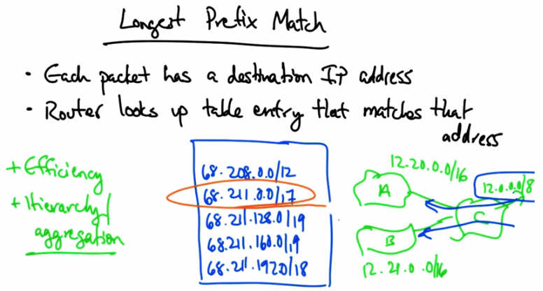

   Longest Prefix Match — Each packet has a destination IP address. Router looks up table entry
   that matches that address. Example table with overlapping prefixes (68.208.0.0/12,
   68.211.0.0/17, 68.211.128.0/19, etc.). Benefits: efficiency, hierarchy/aggregation.

Let's take a closer look at longest prefix match. So each packet has a destination IP address,
which determines where the package should be forwarded next, and a router basically looks up a
table entry that matches that address. So, for example, a forwarding table might have a number
of prefixes in it, and many of these prefixes might be overlapping. But when we see an IP
address, it may match on one or more prefixes in this table, you simply match that IP address to
the entry in the forwarding table with the longest matching prefix. So the benefits of cider and
longest matching prefix are efficiency, since prefix blocks can be allocated on a much finer
granularity than with classful inter-domain routing, and the opportunity for aggregation if two
downstream networks with more specific or longer prefixes, should be treated in the same way
by an upstream network, who might simply aggregate two contiguous shorter prefixes into one
forwarding table entry with a shorter prefix. For example, a benefit for aggregation might exist if
two downstream networks A and B each had slash 16 address space allocated to them. But
upstream, all the traffic always came through the same upstream network, C. If the rest of the
internet only reached A and B via C, then the rest of the internet need only know about C's
address space which might be 12/8. This might allow the upstream network to simply aggregate,
or not announce these more specific prefixes, since they're already covered by the less specific
upstream prefix.

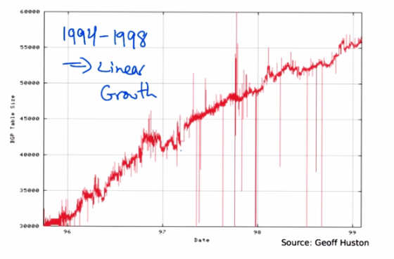

   Routing table growth 1994-1998 showing linear growth after CIDR adoption. Source: Geoff
   Huston. 1994-1998 → Linear Growth (CIDR slows exponential growth).

Now cider had a significant effect on slowing the growth of the internet routing tables from 1994
to 1998. So, from 1994 to 1998, we see roughly linear growth in the number of prefixes in the
internet routing table. Around 2000, fast growth in routing tables resumed.

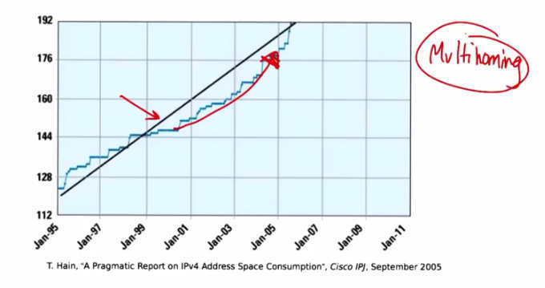

   Routing table growth from Jan-95 to Jan-11. After 1998, growth exceeds linear trend.
   Cause: Multihoming — makes aggregation difficult for upstream providers.

You can see that growth here once again started to pick up a significant contributor to this
growth, was a practice called multi-homing. Multi-homing can actually make it difficult for
upstream providers to aggregate IP prefixes together, often requiring an upstream provider to
store multiple IP prefixes for a single autonomous system. Sometimes those IP prefixes are
contiguous and sometimes they aren't. Let's take a quick look at how multi-homing can stymie
aggregation.

Multihoming Frustrates Aggregation
------------------------------------

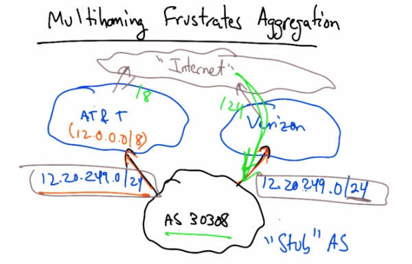

   Multihoming Frustrates Aggregation — Stub AS 30308 gets prefix 12.20.249.0/24 from AT&T
   (12.0.0.0/8). AS 30308 is multihomed to AT&T and Verizon. AT&T cannot aggregate because
   Verizon also advertises the /24 with longest prefix match.

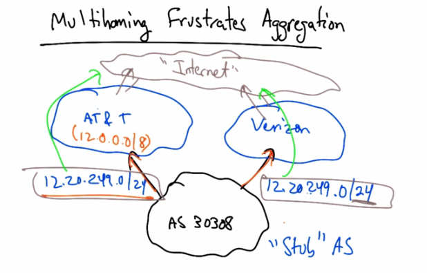

   Multihoming Frustrates Aggregation — Result: both AT&T and Verizon must advertise the
   same /24 to the internet, causing an explosion of /24s in the global routing table.

This example, a stub AS, in this case 30308, might receive IP address space, say, 12.20.249/24,
from one of its providers, such as AT&T, which happens to own 12.0.0.0/8. Now in this case AS
30308 wants to be multihomed. In other words, it wants to be reachable via two upstream
Internet service providers. In this diagram, the two Internet service providers are AT&T and
Verizon. To be reachable by both of these ISPs, AS 30308 has to advertise its prefix, which it
received from AT&T via both AT&T and Verizon. The problem occurs when AT&T and
Verizon want to advertise that prefix to the rest of the internet. Well, unfortunately, although
AT&T might like to aggregate this prefix as I previously described, it can't. If it did, Verizon
would still be advertising the longer /24 via it's upstream link. And because of longest prefix
match, all of the traffic would then arrive via the Verizon link regardless of what AS 30308
wanted to have happened to that incoming traffic.

As a result, both AT&T and Verizon must advertise the same /24 to the rest of the internet. This
results in an explosion of /24s in the global internet routing table. You can imagine, that if a lot
of stub AS's wanted to be multihomed, then suddenly, we've got a lot more /24s in the global
routing table than might otherwise exist without multihoming.

Longest Prefix Match to Control Inbound Traffic
-------------------------------------------------

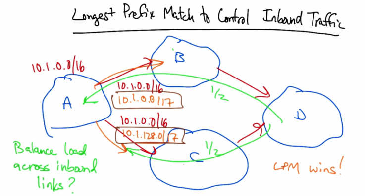

   Longest Prefix Match to Control Inbound Traffic — AS A owns 10.1.0.0/16. Advertises
   10.1.0.0/17 on top link and 10.1.128.0/17 on bottom link to balance inbound load across
   links. LPM wins! Covering /16 ensures reachability if one link fails.

Now in a previous lesson, we looked at how AS path prepending, can be used to control inbound
traffic. As it turns out, longest prefix match can also be used to control inbound traffic. Suppose
that AS A owns 10.1.0.0/16, and it might advertise that prefix out both of its upstream links and
that route might similarly be advertised further upstream. Now of course as we know from a
previous lesson, given the advertisement of one prefix upstream, AS D is going to pick one best
BGP route along which to send traffic back to A. But let's suppose that AS A wanted to balance
that traffic across its incoming links. Well in that case, ASA could actually advertise routes for 2
more specific prefixes, effectively splitting the slash 16 in half, so in addition to advertising
10.1/16, across both links, AS A might advertise 10.1/17 on the top link and 10.1.128.0/17, the
other half of the /16 on the bottom link. Now, if one link fails, the covering /16 will ensure that
the prefix remains reachable by one of the two upstream links. But because longest prefix match
wins, the traffic for 10.1.128 would now traverse the bottom link, and the traffic for 10.1/17
would effectively sending traffic for half of the prefixes along the top path and traffic for the
other half of the prefixes along the bottom path. Although we just explored a perfectly good
reason to deaggregate a contiguous prefix, it turns out that sometimes autonomous systems may
deaggregate larger prefixes unnecessarily.

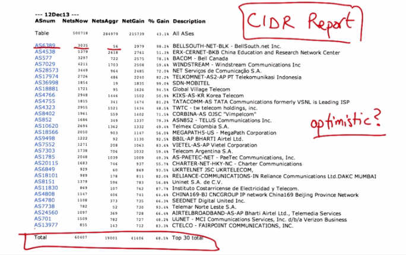

   CIDR Report (weekly report) showing autonomous systems advertising IP prefixes that could
   be aggregated. Top offender AS6389 advertises 3000+ unique prefixes but could use only 56
   with proper aggregation. "Optimistic?"

A report called the CIDR Report, which is released weekly, shows autonomous systems who are
advertising IP prefixes that, at least according to observation, are continuous and could be
aggregated. For example, the top offender for the week of December 12th, 2013, was AS6389.
This single autonomous system is actually advertising more than 3,000 unique IP prefixes. The
CIDR report analysis suggests that with appropriate aggregation, this autonomous system could
instead advertise only 56 unique IP prefixes. Now this might be overly optimistic. As we just
explored, there are perfectly good reasons to deaggregate a contiguous IP prefix into multiple
smaller contiguous IP prefixes. But nonetheless, the report shows that there are probably a lot
more IP prefixes in the Global Internet Routing table than there could be if AS's took full
advantage of aggregation.

CIDR Quiz
---------

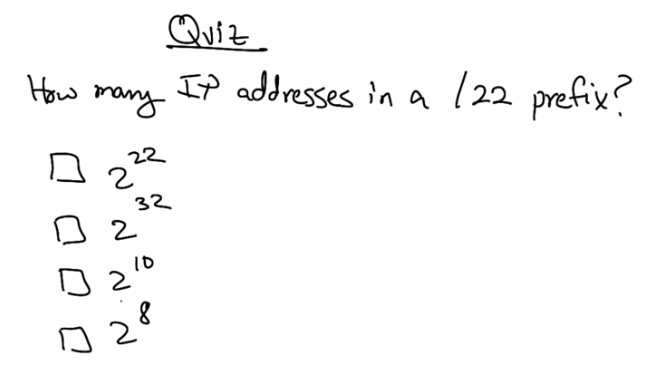

   Quiz — How many IP addresses in a /22 prefix? Options: 2^22, 2^32, 2^10, 2^8.

Let's have a quick quiz about cider. So, how many IP addresses does a /22 prefix represent? Two
to the 22, two to the 32, two to the tenth, or two to the eighth?

CIDR Solution
-------------

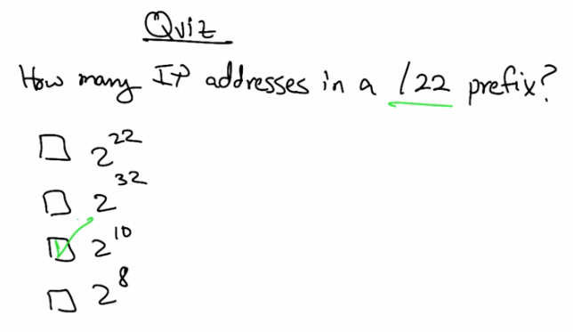

   Solution — 2^10 (checked). /22 means 22-bit network ID, leaving 10 bits for hosts.

The /22 represents the length of the network ID, and the remaining 10 bits are for hosts in that
/22 prefix. So those 10 bits reserved for the host for that /22 mean that this /22 prefix represents 2
to the tenth IP addresses.

Lookup Tables and How LPM Works
---------------------------------

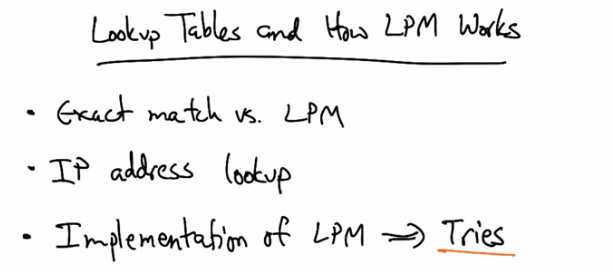

   Lookup Tables and How LPM Works — Exact match vs. LPM. IP address lookup.
   Implementation of LPM → Tries.

Okay, in this lesson, we will explore how lookup tables in routers are designed and how longest
prefix match works; we'll explore exact match versus longest prefix match and when each is
used; we'll explore IP address lookup in more depth; and finally, we'll explore how longest prefix
match is implemented in the form of tries.

Lookup Algorithm Depends on Protocol
--------------------------------------

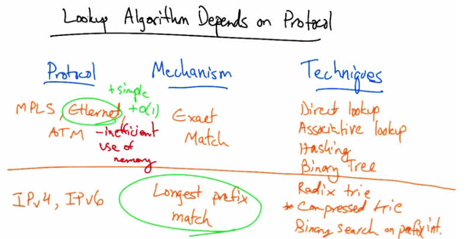

   Lookup Algorithm Depends on Protocol — Protocol | Mechanism | Techniques.
   MPLS, Ethernet, ATM → Exact Match → Direct lookup, Associative lookup, Hashing, Binary
   tree. IPv4, IPv6 → Longest prefix match → Radix trie, Compressed trie, Binary search on
   prefix list.

So, the look up algorithm that a router uses depends on the protocol that it's using to forward
packets, and the look up mechanism might be implemented with a variety of different algorithms
or techniques. For example, MPLS, Ethernet, and ATM use an exact match look up. Exact
matches can be implemented as a direct look up, an associative look up, hashing, or via a binary
tree. IPv4 and IPv6 on the other hand are implemented with what's called longest prefix match.
We've already looked at longest prefix match a little bit in some lessons and, in this lesson we'll
look at it in a bit more detail as well as how it's implemented. It might be implemented as a radix
trie, a compressed trie, which is something that we will look at in this lesson, and it can also be
implemented as a binary search on the prefix intervals. Ethernet based forwarding is based on
exact match of a layer two address which is usually 48 bits long. It's address is global, not just
local to the link. And the range or size of the address is not negotiable. Now 2 to the 48th is far
bigger than 2 to the 12th, therefore, it's not possible to hold all the addresses in the table and use
direct look up. The advantages of exact matches and Ethernet switches is that exact match is
simple and the expected lookup time is small, or O of 1. But the disadvantages include inefficient
use of memory. This potentially results in nondeterministic lookup time if the lookup might
require multiple memory accesses. Lets now take a closer look at longest prefix match.

IP Lookups Find Long Prefixes
-------------------------------

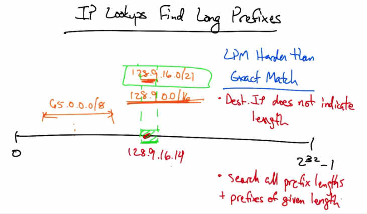

   IP Lookups Find Long Prefixes — Prefix ranges as intervals in 0 to 2^32-1 space. Example:
   65.0.0.0/8, 128.9.0.0/16, 128.9.16.0/21. Address 128.9.16.14 matches longest prefix /21.
   LPM harder than exact match: dest. IP does not indicate length. Must search all prefix lengths.

IP lookups find longest prefixes. Let's suppose that we want to represent a particular IP address
as one point in the space from zero to 2 to the 32 minus 1, or the range of all 32 bit IP addresses.
Each prefix represents a smaller range inside this larger range of 32-bit numbers. Obviously, this
is not to scale. Now these ranges, of course, might be overlapping, as is shown here, and the idea
is that longest prefix match will match the smallest prefix for which the IP address range
overlaps that of the specified IP address. So longest prefix match is harder to perform than exact
match. For one, the destination IP address does not indicate the length of the longest matching
prefix, so some algorithm needs to determine the length of the longest matching prefix, which in
this case is 21. So we somehow need a way to search the space of all prefix lengths, as well as
prefixes of a given length.

LPM in IPv4 Exact Match
------------------------

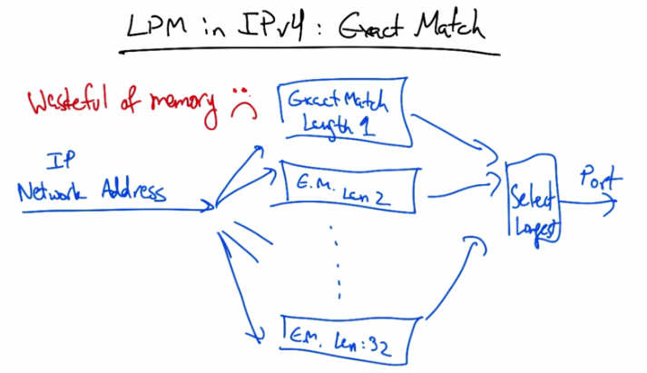

   LPM in IPv4: Exact Match — IP Network Address goes to parallel exact match tables
   (length 1 through length 32). Select longest match → output port. Wasteful of memory.

Suppose, for example, that we wanted to implement longest prefix match for IPv4 using exact
match. Now in this case we might take our network or our IP address, and send it to a bunch of
different exact match tables. And then among the tables that had a match, we would select the
longest, and then forward the packet out the appropriate output port. Of course, this is horribly
inefficient, because we'd have to have tables for each of the 32 links, and every time a packet
arrived, we'd have to send it to each one of these 32 tables. This is extremely wasteful of
memory.

Address Lookup Using Tries
---------------------------

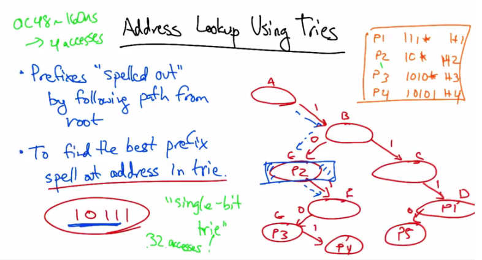

   Address Lookup Using Tries — Single-bit trie. Prefixes: P1=111*, P2=10*, P3=1010*,
   P4=10101*. Example lookup 10111: follow 1-0-1, match at P2. 32 accesses in worst case.
   OC48 requires ~160ns = 4 memory accesses. 32 accesses too slow.

An alternative is to perform address lookups using a data structure called a trie. In a trie, prefixes
are spelled out by following a path from the root. And to find the best prefix, we simply spell out
the address in the trie. For example, let's suppose we had the following table. Such a lookup table
has entries of varying lengths. Let's see how this might be encoded in a trie. In a trie, spelling
out the bit one always takes us to the right, and spelling out the bit zero always takes us to the
left. So to insert one one one star, we'd basically start here. One. One. One. And then we insert
P1, and then we repeat this process. One zero star results in P2. One zero one zero results in P3.
And one zero one zero one results in P4. If we want to insert one one one zero, insertion is easy.
We can simply insert P5 as such. Look ups are easy, so for example let's suppose we want to
look up 10111. Well all we have to do, is spell this out in the trie. So we can follow 1-0-1 and
now, we see that there's no entry for 1011. So, we use the entry of the last node in the tree that
we traverse that has an entry, in this case P2. Now this structure here is what's called a single
bit try. Single bit tries are very efficient. Note that every node in this try exists due to one of the
five folding table entries that we've inserted in the try. So, a single bit trie is a very efficient use
of memory. Updates are also very simple. We saw how easy it was, to insert the entry for P5.
Unfortunately, the main problem is the number of memory accesses that are required to perform
a lookup. For 32 bit address, we can see, that looking up the address in a single bit trie, might
require 32 look ups, in the worst case, one for each bit. So it's each bit in the address requires,
one traversal in the trie, or one memory look up. So this could be very bad. At worst, 32 accesses
in the worst case. To put this in perspective, an OC48 requires a 160 nanosecond lookup, or
simply 4 memory accesses. So 32 accesses, is far too many, especially for high speed links.

Direct Trie
-----------

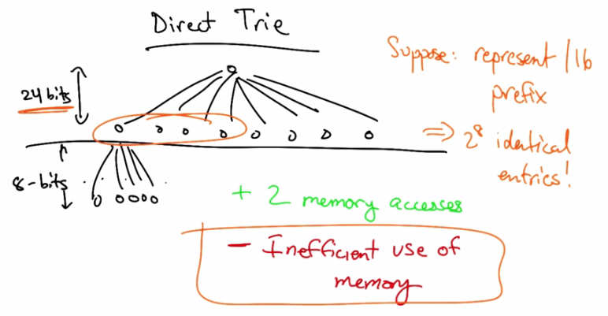

   Direct Trie — Two-level structure: first 24 bits in top level, last 8 bits in second level.
   + 2 memory accesses. - Inefficient use of memory. Suppose: represent /16 prefix → 2^8
   identical entries!

The other extreme, of course, is to use a direct trie where instead of 1 bit per look up we might
have 1 memory access responsible for looking up a much larger number of bits. So, for example,
we might have a two level try where the first memory access is dictated by the first 24 bits of the
address, and the second memory access is dictated by last 8 bits of the address. Now here we can
look up an entry in the forwarding table with just two memory accesses. The problem is that this
structure results in a very inefficient use of memory, unlike the single bit trie. To see why,
suppose that we want to represent a /16 prefix. Well unfortunately we have no way of encoding a
lookup that's just 16 bits. We have to rather encode 2 to the 8th identical entries, corresponding
to the 2 to the 8th /24 prefixes that are contained in that /16, so this is extremely inefficient use
of memory.

Direct Trie Quiz
----------------

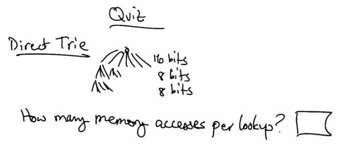

   Quiz — Direct Trie: 16 bits / 8 bits / 8 bits levels. How many memory accesses per lookup?

As a quick quiz, suppose we have a direct trie, and the first level is 16 bits, the next level is eight
bits, and the third level is the final eight bits. In the worst case, how many accesses would be
required per lookup?

Direct Trie Solution
--------------------

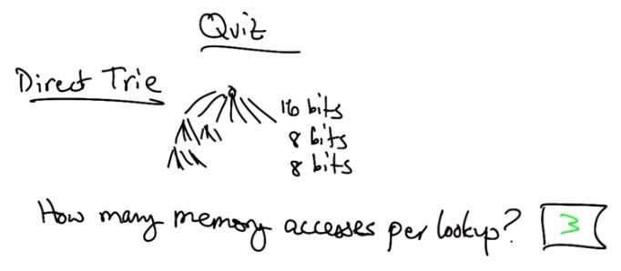

   Solution — 3 memory accesses. The trie has depth of three, so worst case is 3 accesses.

Because the Trie has a depth of three, in the worst case, a look up might require three memory
accesses.

Direct Trie Quiz 2
------------------

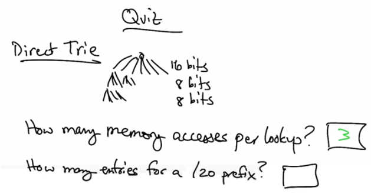

   Quiz — Direct Trie: 16 bits / 8 bits / 8 bits. Memory accesses per lookup: 3. How many
   entries for a /20 prefix?

How many entries, would I need, to represent a /20 prefix?

Direct Trie Solution 2
-----------------------

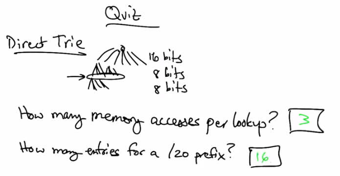

   Solution — 16 entries for a /20 prefix. A /20 prefix = 2^4 = 16 /24s at the 24-bit level.

A /20 prefix is 2 to the 4th, or 16, /24's. And I need to basically represent 16 entries, at the 24 bit
level of the trie, or the second level, and therefore, I'd need 16 entries to represent, a /20 prefix.

Memory Efficiency and Fast Lookup
-----------------------------------

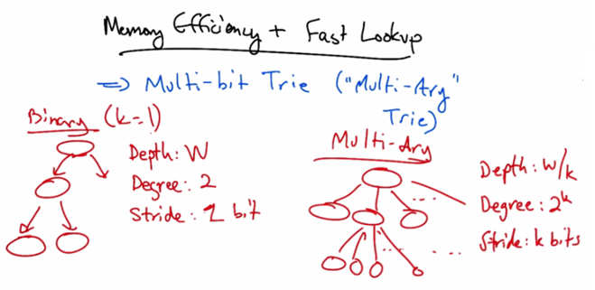

   Memory Efficiency + Fast Lookup → Multi-bit Trie ("Multi-Ary" Trie). Binary (k=1): Depth W,
   Degree 2, Stride 1 bit. Multi-ary: Depth W/k, Degree 2^k, Stride k bits.

To achieve the memory efficiency of a single bit trie with the fast lookup properties of a direct
trie, a compromise is to use what's called a multi-bit trie, or a multi-ary trie. Let's start with a
binary trie, where one bit is resolved at each node. Here, the depth is big W, the degree of each
node is two, and the stride for each lookup is one bit. Now we can generalize this to a multi-ary
trie, where the depth is now W over K if the degree is 2 to the K, and each level resolves K bits.
The binary trie is a simple case of the multi-ary trie, where K equals 1.

4 ary Trie
----------

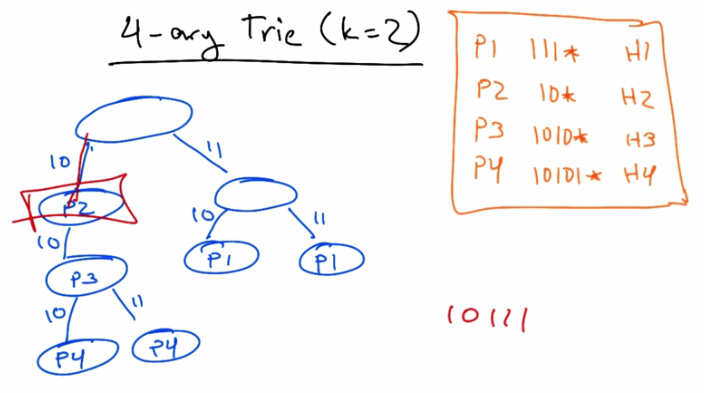

   4-ary Trie (k=2) — Prefixes: P1=111*, P2=10*, P3=1010*, P4=10101*. Each node resolves
   2 bits. Lookup 10111 → spell 10, 1, match P2. Some entries duplicated (P1 in two places).

Let's take a look at the 4-ary trie where k equals 2. Suppose we have the same forwarding table
as before. But now, each node in the trie is responsible for resolving two bits. So if we take one
one, and now we take one star, that's one zero and one one. And now we basically have to put p1
in two places in the tree. One zero star results in just one entry. 1010 star results in two
traversals, and 10101 star again represents two entries, for 101010 and 101011. Now suppose we
want to look up 10111. Again, we can spell this out, 101, and we can see that we get no further
than P2 and again, we match at P2.

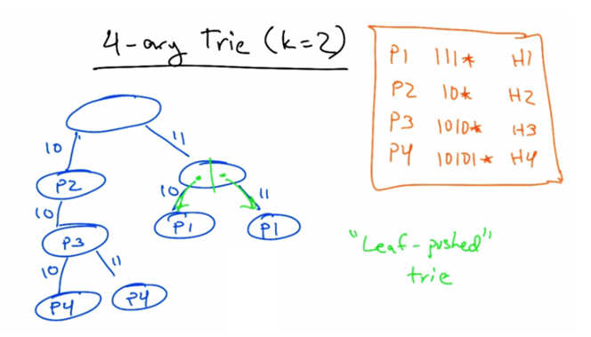

   4-ary Trie (k=2) — "Leaf-pushed" trie. Instead of pointers at internal nodes, push entries
   into left and right children. Saves space by eliminating internal node pointers.

One thing we can do to save space further is create what's called a leaf-pushed trie. In such a
setting, we can save our self some space. Instead of having these pointers, we can push these
entries into the left and right side of this node, respectively.

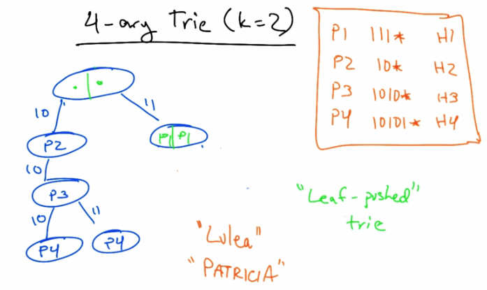

   4-ary Trie (k=2) — Leaf-pushed trie. 10 becomes P1 on left, 11 becomes P1 on right.
   Other optimizations: "Lulea" (3-level trie with bitmap compression), "PATRICIA".

So 10 becomes P1 on the left side and 11 becomes P1 on the right side. There are variety of other
optimization algorithms, including one called Lulea and another called Patricia. Each of them
use the same basic idea that we have explored here, except some of them like Lulea are a three
level trie, and often they use a bitmap to compress out repeated entry such as those that exist
here.

Alternatives to LPM with Tries
--------------------------------

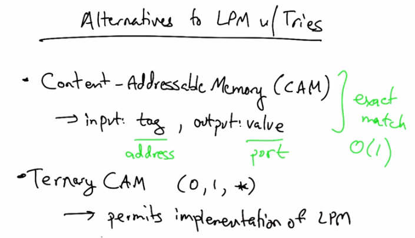

   Alternatives to LPM with Tries — Content-Addressable Memory (CAM): input tag, output
   value (exact match, O(1)). Ternary CAM (0, 1, *): permits implementation of LPM via
   wildcard matching.

Now there are alternatives to implementing longest prefixes match with a trie. One could start
with a content addressable memory or a CAM. Now a CAM is a hardware base route look up
where the input is a tag and the output is a value. So, for example, the tag might be an address
and the value might be the output port. Now the CAM really only supports exact match but it is
an O of 1 lookup. There is something called a ternary CAM, where instead of exact matching in
the tag, you can have 0, 1, or don't care, or a star. The ternary CAM and in particular its support
for a wild card permits an implementation of longest prefix match. One can thus have multiple
matching entries, but prioritize the match according to the longest prefix in the ternary CAM.

NAT and IPv6
------------

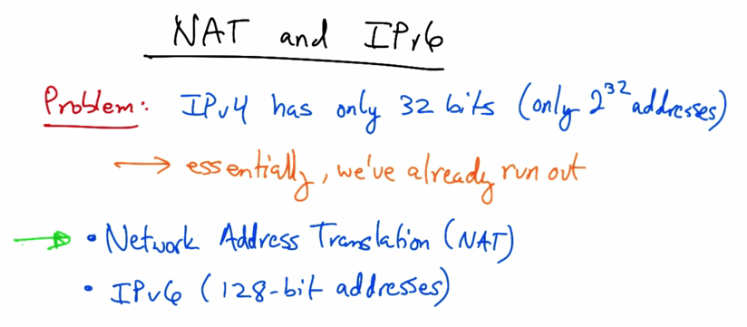

   NAT and IPv6 — Problem: IPv4 has only 32 bits (only 2^32 addresses) → essentially, we've
   already run out. Solutions: Network Address Translation (NAT) and IPv6 (128-bit addresses).

Let's now talk about various problems that resulted from IPv4 and the growth of the internet
routing tables, and two different solutions to internet routing table growth: network address
translation, or NAT, and IPv6. So the main problem that we are seeing is that IPv4 addresses
have only 32 bits, which means that there can only be a total of 2 to the 32 unique IP addresses.
Not only that, as we've seen, IP addresses are allocated in blocks, and fragmentation of this space
can mean that IPv4 addresses can be quickly exhausted. In fact, we've already seen the last slash
eight from IPv4 address space allocated to the registries. So we're well on our way towards
running out of IPv4 addresses. In some sense, you can say that we've essentially already run out.
In this lesson, we're going to look at two solutions: network address translation, or NAT, and
IPv6, whose main feature is 128 bit addresses. Let's first take a look at NAT.

Network Address Translation
-----------------------------

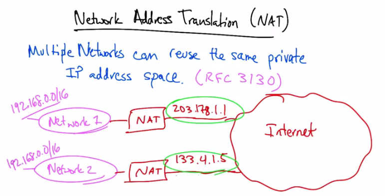

   Network Address Translation (NAT) — Multiple Networks can reuse the same private IP
   address space (RFC 3130). Network 1: 192.168.0.0/16 behind NAT → public IP 203.178.1.1.
   Network 2: 192.168.0.0/16 behind NAT → public IP 133.4.1.5.

NAT allows multiple networks to reuse the same private IP address space. Let's suppose that we
have two networks. These networks might be, for example, homes or they might be larger
networks in regions of the Internet, where IPv4 address space is scarce, for example, in
developing regions. What NAT allows these networks to do is reuse the same portion of internet
address space. For example, a particular, special, private IP address space, is 192.168/16. Other
private IP address space is specified in RFC 3130. Now, obviously these two networks couldn't
coexist on the public Internet, because routers wouldn't know if they got a packet destined for an
IP address in this space, which network the packet should be sent to. What a NAT, or a Network
Address Translator does, is take the private IP addresses that are behind the NAT and translate
those IP addresses to a single, globally visible IP address.

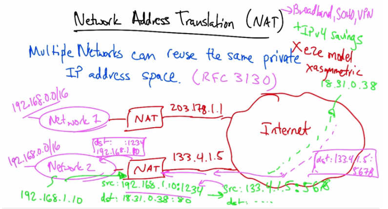

   Network Address Translation (NAT) — With traffic annotations showing source/destination
   rewrites. Benefits: Broadband, SOHO, VPN, IPv4 savings. Drawbacks: breaks end-to-end
   model, asymmetric (18.31.0.38 → can't reach private addresses).

Now, to the rest of the Internet, network one appears to be reachable by a single IP address,
203.178.1.1, and network two is reachable via a single distinct global IP address 133.4.1.5. Now,
a host back here, say 192.168.1.10 might send a packet towards a global internet destination.
Now, the key behind NAT is that this packet has a source port and the NAT is basically going to
take that source IP address and it's going to translate it to a publicly reachable source
IP address and port, and the destination will remain the same. That packet will make its way to a
global destination and the reply will make its way to the globally reachable IP address on the
corresponding port. Now, when that packet with that particular destination IP address and port
reaches the NAT, the NAT has a table that knows the mapping between that public IP address
and port and the private one that it rewrote to generate the corresponding public IP address and
port. So we can simply now rewrite the destination IP address of this packet to the corresponding
private address and port. NATs are popular on broadband access networks, small or home offices
and VPNs. There's a clear savings in IPv4 address space, since there can be many devices in one
of these private networks and the devices that are behind the NAT only use up one
public IP Address. The drawback, of course, is that the end-to-end model is broken. And we
talked about the end-to-end model in a previous lesson and let me just remind you how NAT
breaks it. If the NAT device failed in this instance, for example, the mapping between the private
source IP address and port and the public source IP address and port would be lost, thereby
breaking all active connections for which the NAT is on the path. It's also asymmetric. Under
ordinary circumstances it's rather difficult for a host on the global Internet to reach a device in a
private address space in network one or network two, because by default those devices in these
private networks do not have public globally reachable IP addresses. So, NAT both breaks end-
to-end communication, and it also breaks by directional communication.

IPv4 to IPv6
------------

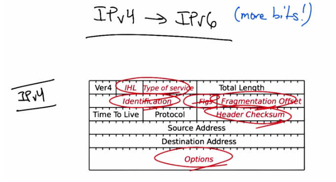

   IPv4 Header — Ver4, IHL, Type of service, Total Length, Identification, Flags, Fragmentation
   Offset, Time To Live, Protocol, Header Checksum, Source Address, Destination Address,
   Options. Red fields are removed in IPv6.

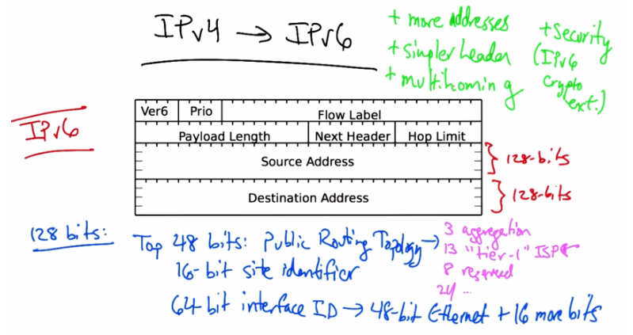

   IPv4 → IPv6 (more bits!) — IPv6 header: Ver6, Prio, Flow Label, Payload Length, Next
   Header, Hop Limit, 128-bit Source Address, 128-bit Destination Address. 128 bits: Top 48
   bits public routing topology, 16-bit site identifier, 64-bit interface ID. Benefits: more
   addresses, simpler header, multihoming, security (IPv6 crypto ext.).

Another possible solution to the IP address space exhaustion problem is to simply add more bits.
This is the gist of the contribution of the IPv6 protocol. Here's a picture of the IPv4 protocol
header, and all of the fields shown in red have basically been removed in IPv6, resulting in both
a much simpler header and addresses that are much larger.

By contrast, here's the IPv6 header. The IPv6 header provides 128 bits for both the source and
destination IP addresses. Now the format of these addresses are as follows. Of the 128 bits, the
top 48 bits are for the public routing topology, and we have a 16-bit site identifier. And finally, a
64-bit interface ID, which effectively has the 48-bit Ethernet address of the interface plus 16
more bits. Now, the top 48 bits can be broken down further. They include top level provider,
something like a tier one ISP, 8 reserve bits, and 24 additional bits. Now, note that there are 13
bits in the top 48 that directly map to the tier one ISP, meaning that addresses are purely
provider-based, thus changing ISPs would require renumbering. IPv6 has many claimed benefits.
There are more addresses, the header is simpler, multihoming is supposedly easier, various
aspects of security are built in, such as the IPv6 crypto extensions. Now despite all of these
benefits, we have yet to see a huge deployment of IPv6 yet.

IPv6 Routing Table Entries
---------------------------

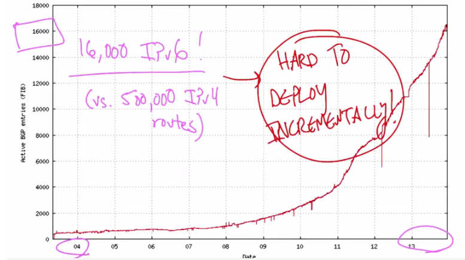

   IPv6 Routing Table Entries — Active BGP entries from 2004 to 2013. Only ~16,000 IPv6
   routes (vs. 500,000 IPv4 routes). "Hard to Deploy Incrementally!"

Now despite all of these benefits, we've yet to see a significant deployment of IPv6. Here you
can see the number of routing table entries for IPv6 routes, as well as the growth over time from
2004 to the end of 2013. What's remarkable is that we only see 16,000 IPv6 routes in the global
routing table. This is not that many considering that there are about 500,000 IPv4 routes in the
global routing table. The problem is that IPv6 is very hard to deploy incrementally. Remember
our discussion of the narrow waist. Everything runs over IPv4 and IPv4 was designed to run over
a variety of physical layers. This common protocol has allowed tremendous growth, but because
everything depends on the narrow waist of IPv4 and because IPv4 is built on top of so many
other types of infrastructure, changing it becomes extremely tricky. Incremental deployment
where part of the internet is running IPv4 and other parts have been upgraded to IPv6 results in
significant incompatibility. There are various incremental deployment options for IPv6.

IPv6 Incremental Deployment
-----------------------------

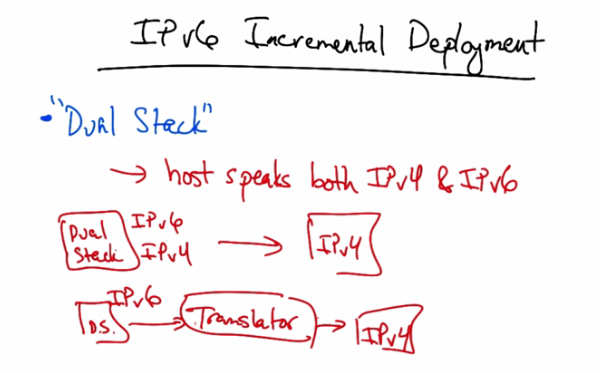

   IPv6 Incremental Deployment — "Dual Stack": host speaks both IPv4 and IPv6. Dual Stack
   host communicates IPv4 with IPv4 hosts, IPv6 with IPv6 hosts. Also: Translator for v4
   compatible IPv6 addresses.

One is what's called a dual stack deployment. In a dual stack deployment a host can speak both
IPv4 and IPv6. It communicates with an IPv4 host using IPv4 and communicates with an IPv6
host using IPv6. What this means is that the dual stack host has to have an IPv4 compatible
address. Either the host has both an IPv4 and an IPv6 address, thus allowing it to speak to an
IPv4 host, or it must rely on a translator which knows how to take a v4 compatible IPv6 address,
and translate it to the v4 address. One possible way of ensuring compatibility of a v6 address
with IPv4, is simply to embed the IPv4 address in 32 bits of the 128 that are allocated for the
IPv6 address.

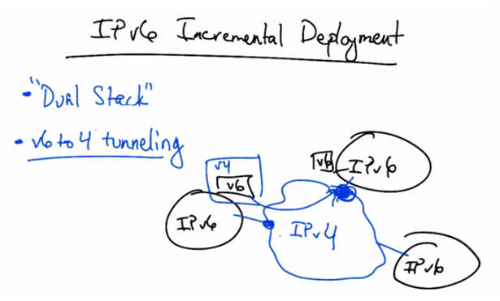

   IPv6 Incremental Deployment — "Dual Stack" + v6 to v4 tunneling. IPv6 islands connected
   through IPv4 network via encapsulation. v6 packet encapsulated in v4 packet at boundary
   gateway, decapsulated on the other side.

Now, a dual stack host configuration or a v4 compatible IPv6 address solves the problem of host
IP address assignment, but it doesn't solve the problem that IPv6 deployments might exist as
islands. For example, multiple independent portions of the Internet might deploy IPv6, but what
if the middle of the network only speaks in routes IPv4? The solution here is to use what's called
6 to 4 tunneling. In 6 to 4 tunneling, a v6 packet is encapsulated in a v4 packet. Now, that v4
packet is routed to a particular v4 to v6 gateway corresponding to the v6 address that lies behind
that gateway. And at this point the outer layer of encapsulation can be stripped, and the v6 packet
can be sent to its destination. This of course, requires the gateways at the boundaries between
the v4 and v6 networks to perform encapsulation of the packet as it enters the v4 only part of
the network, and de-capsulation as the packet enters the v6 island, where the destination host
resides.
