Network Security
================

Lecture 11.0: Network Security

Networking Security Intro
--------------------------

We're on our last stretch of the course with network security. Network security is an extremely
important topic, especially considering high-profile data loss from large companies and
government organizations.

To accompany this section, you'll be building a program in Pyretic that mitigates one of the
specific attacks that we're going to look at in this course.

Need for Network Security
--------------------------

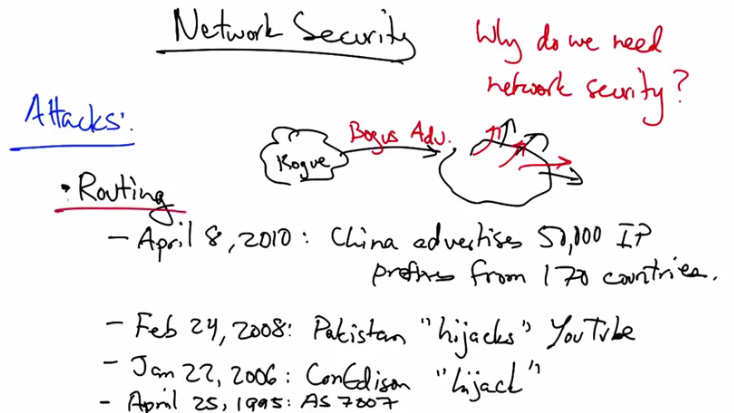

   Network Security — Attacks: Routing. April 8, 2010: China advertises 51,100 IP prefixes
   from 170 countries. Feb 24, 2008: Pakistan "hijacks" YouTube. Jan 27, 2006: ConEdison
   "hijack". April 25, 1995: AS 7007. Bogus Advertisements from a Rogue AS.

We are beginning a lesson on network security. Lets first talk about why we need network
security in the first place. The Internet is actually subject to a wide variety of attacks on various
parts of the infrastructure. One part of the infrastructure that can be attacked is routing. So the
internet's routing protocol, the border gateway protocol, is notorious for being susceptible to
different kinds of attacks. For example, on April 8, 2010, China advertised about 50,000 blocks
of IP address from 170 different countries. The event lasted for about 20 minutes. In this
particular case, the hijack appears to have been accidental because the prefixes were long enough
such that they didn't disrupt existing routes. But the fact that the route advertisements were
allowed to leak in the first place highlights the vulnerability of the border gateway protocol.
Effectively, the border gateway protocol essentially allows any AS to advertise an IP prefix to a
neighboring AS, and that AS will typically just believe that route advertisement and advertise it
to the rest of the internet. These events that occur where an AS advertises a prefix that it does not
own are called route highjacks. And they tend to occur more often than one might expect. In
addition to the event on April 8, 2010, another event in 2008 occurred when Pakistan higjacked
YouTube prefixes, potentially as a botched attempt to block Youtube in the country following a
government order. Unfortunately, the event resulted in disruption of connectivity to YouTube for
people all around the world. In January of 2006 ConEdison accidentally hijacked a lot of transit
networks, including level three Unet and several other large ISPs disrupting connectivity to many
customers. And on April 25th in 1995, one of the more famous route hijack incidents was the
AS7007 incident, where AS7007 advertised all of the IP prefixes on the entire internet as
originating in its own AS, resulting in disruption of connectivity to huge fractions of the Internet.
So we've surveyed some famous or, shall we say, notorious attacks on Internet routing, but
another part of the infrastructure that's vulnerable is naming or the DNS.

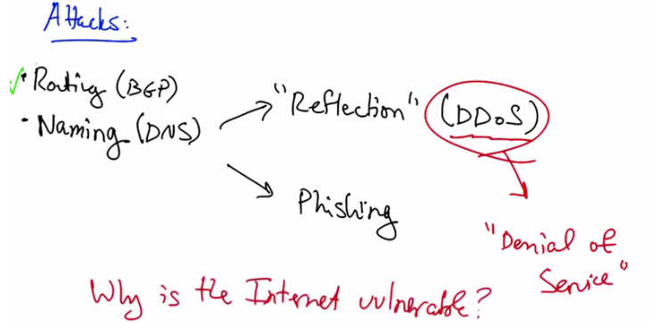

   Attacks: Routing (BGP), Naming (DNS) leading to Reflection (DDoS), Phishing, and
   Denial of Service. Why is the Internet vulnerable?

One very popular and effective means of mounting an attack on the naming system is through
something called reflection. DNS reflection is a way of generating very large amounts of traffic
targeted at a victim in an attack called Distributed Denial of Service, or DDoS attack. Another
type of attack on the naming system is Phishing, whereby an attacker exploits the domain name
system in an attempt to trick a user into revealing personal information, such as passwords on a
rogue website. In general, denial of service attacks are extremely common and can be mounted
in a variety of different ways. DNS reflection is just one way that distributed denial of service
attacks are mounted. We'll explore some others later on in this lesson. It's worth asking why the
internet is so vulnerable to different kinds of attacks.

Internet is Insecure
---------------------

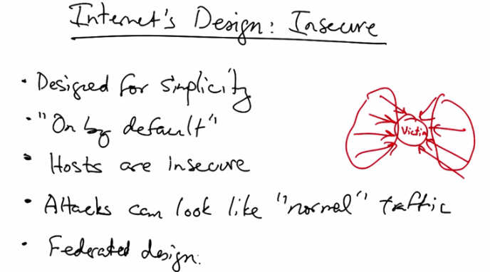

   Internet's Design: Insecure — Designed for simplicity, "On by default", Hosts are insecure,
   Attacks can look like "normal" traffic, Federated design. Diagram showing a victim node
   on a network.

As it turns out, the internet's design is actually fundamentally insecure. Many explicit design
choices have caused the internet to be vulnerable to different types of attacks. The internet was
designed for simplicity, and as a result security was not a primary consideration when the
internet was originally designed. Another aspect of the internet's design is that it's on by default.
In other words, when a host is connected to the internet, it is by default reachable by any other
host that has a public IP address. This means that if one has an insecure host, that host is
effectively wide open to attack by other hosts on the internet. Now, this wasn't a primary design
consideration when the internet consisted of a small number of trusted networks, but as the
internet has continued to grow, this on-by-default design, or the notion that any host should
always be reachable by any other host, has come under fire. Part of the reason that they're on-by-
default model does not work that well is that hosts are insecure. This makes it possible for a
remote attacker to compromise a machine that's connected to the internet and commandeer it for
the purposes of attack. In many cases, an attack might actually just look like normal traffic. For
example, in the case of an attack on a victim web server, every individual request to that web
server might look normal, but the collection of requests together, mounted as part of a distributed
denial of service attack, might add up to a volume of traffic that the server is unable to handle.
Finally, the internet's federated design obstructs cooperation for diagnosis or mitigation. In other
words, because the internet is run by tens of thousands of independently run networks, it can be
very difficult to coordinate a defense against an attack because each of these networks is run by
different network operators, sometimes in completely different countries.

Internet Insecurity Quiz
-------------------------

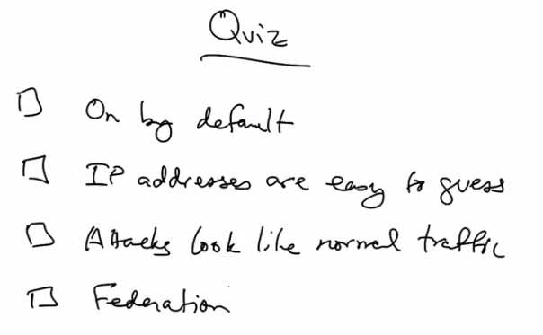

   Quiz: Which of the following make the internet's design fundamentally insecure?
   On by default, IP addresses are easy to guess, Attacks look like normal traffic, Federation.

As a quick quiz, which of the following make the internet's design fundamentally insecure? The
On by default nature of the design? The fact that IP Addresses might be easy for an attacker to
guess? That attacks can look like normal traffic? Or that the internet is actually a federation of
tens of thousands of independently operated networks?

Internet Insecurity Quiz Answer
---------------------------------

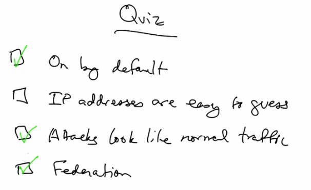

   Quiz Answer: On by default (checked), IP addresses are easy to guess (unchecked),
   Attacks look like normal traffic (checked), Federation (checked).

The fact that the Internet is on by default, that attacks can look like normal traffic, and that the
Internet is in fact federated, collectively make it very difficult to design a secure Internet.

Resource Exhaustion Attacks
----------------------------

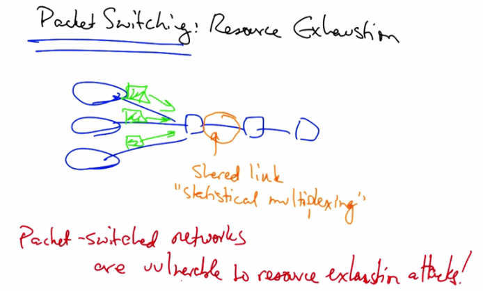

   Packet Switching: Resource Exhaustion — diagram showing multiple senders sharing a link
   via statistical multiplexing. Packet-switched networks are vulnerable to resource exhaustion
   attacks!

Recall from an earlier lesson that one of the internet's fundamental design tenants is packet
switching. In a packet switch network, resources are not reserved and packets are self contained.
Every packet has a destination IP address, and each packet travels independently to the
destination host. In a packet switch network, a link may be shared by multiple senders at any
given time, using statistical multiplexing as we learned in previous lessons. While packet switch
networks have their advantages, in particular it makes it easy to achieve high utilization on a
shared link, packet switch networks also have the drawback that a large number of senders can
overload a network resource, such as a node or a link. Note that circuit switch networks like the
phone network do not have this problem because every connection effectively has allocated,
dedicated resources for that particular connection until it is terminated. So this problem that an
attacker who sends a lot of traffic might exhaust resources is unique to a packet switched
network environment. So packet switched networks are extremely vulnerable to resource
exhaustion attacks. Resource exhaustion attacks a basic component of security known as
availability.

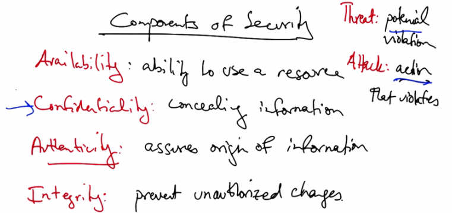

   Components of Security — Availability: ability to use a resource. Confidentiality: concealing
   information. Authenticity: assures origin of information. Integrity: prevent unauthorized
   changes. Threat: potential violation. Attack: action that violates.

Let's take a look at other components of security as well. In addition to availability, we would
like the network to provide confidentiality. For example, if you're performing a sensitive banking
transaction or having a private conversation with a friend, you'd like the Internet to provide some
level of confidentiality. Another component of security is authenticity. Authenticity ensures the
identity of the origin of a piece of information. So, for example, if you're reading a particular
news article, you really may want to know that the article came from the New York Times
website as oppose to from some other place on the internet. Similarly, you might want to know
that that information wasn't modified in flight. That property is called integrity, which prevents
unauthorized changes to information as it traverses the network. Now a security threat is
anything that might potentially cause a violation of one of these properties. An attack, on the
other hand, is an action that results in the violation of one of these security properties. So the
difference between a threat and an attack is simply the difference between a violation that could
potentially occur versus an action that actually results in a violation. Let's look at a couple
example attacks on different components of security. Let's start by looking at an attack on
confidentiality.

Confidentiality and Authenticity Attacks
-----------------------------------------

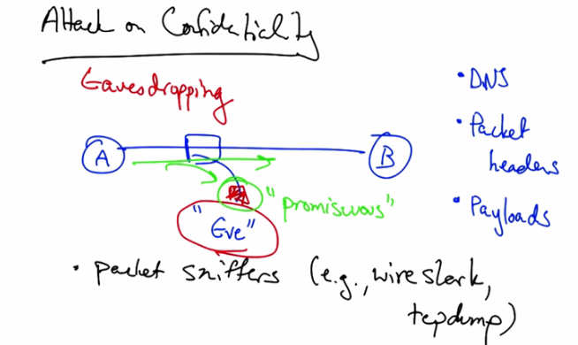

   Attack on Confidentiality — Eavesdropping: Eve in promiscuous mode intercepts packets
   between A and B. Captures DNS queries, packet headers, and payloads. Packet sniffers
   (e.g., Wireshark, tcpdump).

One attack on confidentiality is called eavesdropping, where an attacker, Eve, might gain
unauthorized access to information being sent between Alice and Bob. So, for example, if Alice
and Bob were chatting on instant message, or if Alice sends an email to Bob, the potential exists
(in other words, there's a threat) that Eve might be able to hear that communication. There are
various packet sniffing tools, such as wireshark and tcpdump, that set a machine's networking
interface card into what's called promiscuous mode. If Alice, Bob, and Eve are on the same local
area network, where packets are being flooded (for example, if they were being connected by a
hub that flooded all packets everywhere, or if the learning switch did not have an entry for Alice
or Bob) then Eve might be able to hear some of those packets. If the network interface card is in
promiscuous mode, then Eve's machine will be able to capture some of the packets that are being
exchanged between Alice and Bob. It's worth thinking about how different types of traffic might
reveal important information about communication. For example, the ability to see DNS look-
ups would provide the attacker information about, say, what websites you're visiting. The ability
to capture packet headers might give the attacker information not only about where you're
exchanging traffic, but what types of applications you're using. And the ability to see a full
packet payload would allow an attacker to effectively see every single thing that you are sending
on the network including content you're exchanging with other people, such as private message,
email communication, and so forth.

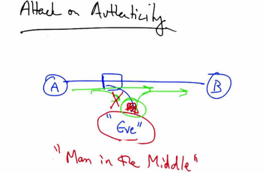

   Attack on Authenticity — Eve intercepts packets between A and B, performing a
   "Man in the Middle" attack, modifying and re-injecting packets.

Given the ability to see a packet, Eve might not only listen to that packet, but might also modify
it and re-inject it into the network, potentially after altering the state of the packet. If additionally
Eve could suppress the original message, let's consider an attack on authenticity. If, in addition to
being able to observe packets that traverse the network, Eve could re-inject packets after having
modified them and suppress Alice's original message, then Eve could effectively impersonate
Alice. This is sometimes called a 'Man in the Middle' attack. Eve could also make it appear as
though this message came from Alice, in which case the attack would be an attack on message
integrity.

Network Attack Quiz
--------------------

   Quiz: A Denial of Service is an attack on which property? Availability, Confidentiality,
   Authenticity, Integrity.

So we've considered attacks on availability, confidentiality, authenticity, and integrity. Let's have
a quick quiz, on these concepts. A denial of service is an attack on what property of internet
security?

Network Attack Quiz Answer
---------------------------

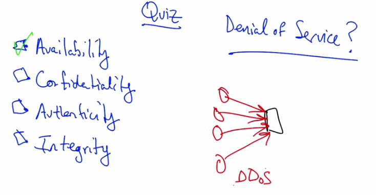

   Quiz Answer: Availability (checked). Denial of Service attack shown with DDoS — multiple
   attackers sending traffic at a victim.

A denial of service attack is an attack on availability. Denial of service attacks typically are an
attempt to overwhelm the network or a network host in some way by consuming its resources. A
common way of launching a denial of service attack is to send a lot of traffic at a victim, often
from many distributed locations. If the attacker is in fact distributed, this is called not just a
denial of service attack, but a distributed denial of service attack.

Negative Impacts of Attacks
----------------------------

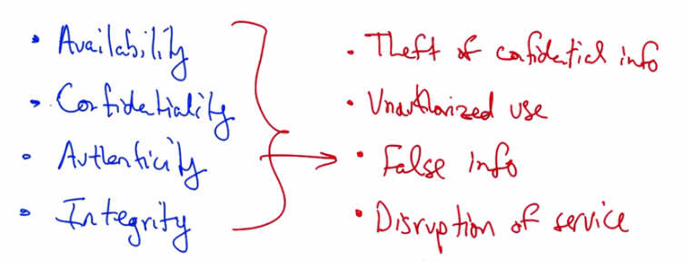

   Negative impacts — Availability, Confidentiality, Authenticity, Integrity lead to:
   Theft of confidential info, Unauthorized use, False info, Disruption of service.

These attacks can have serious negative effects, including theft of confidential information,
unauthorized use of network bandwidth or computing resources, the spread of false information,
and the disruption of legitimate services. All these types of attack are related. They are all very
dangerous and sometimes they come hand in hand. For example, all these attacks are, in some
sense, related to one another, and they can come hand in hand with one another as well.

Routing Security
-----------------

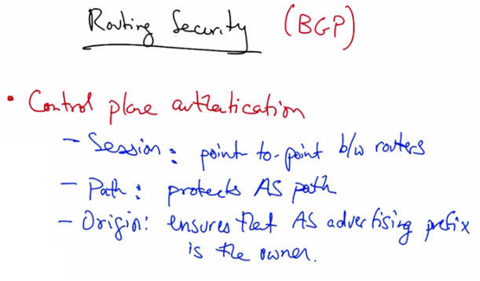

   Routing Security (BGP) — Control plane authentication: Session (point-to-point between
   routers), Path (protects AS path), Origin (ensures that AS advertising prefix is the owner).

Let's now talk about internet routing security or problems involving securing the internet's
routing protocol. We will primarily focus on inter-domain routing or the security of BGP. We
will further focus on control plane security which typically involves authentication of the
messages being advertised by the routing protocol. In particular, the goal of control plane
security, or control plane authentication, is to determine the veracity of routing advertisements.
There are various aspects of the routing protocol that we seek to verify. One is session
authentication, which protects the point-to-point communication between routers. A second type
of control plane authentication is path authentication, which protects the AS path and sometimes
other attributes. Another type of authentication is origin authentication, which protects the origin
AS in the AS path, effectively guaranteeing that the origin AS that advertises a prefix is, in fact,
the owner of that prefix.

BGP Routing Security Quiz
--------------------------

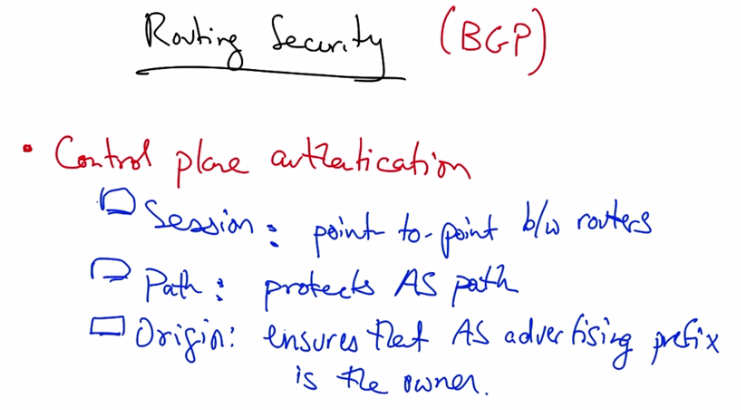

   Quiz: Routing Security (BGP) — A route hijack is an attack on which of the three forms of
   authentication? Session, Path, or Origin?

So as a quick quiz. From last lesson, we talked about route hijacks. A route hijack is an attack on
which of the following three forms of authentication?

BGP Routing Security Quiz Answer
----------------------------------

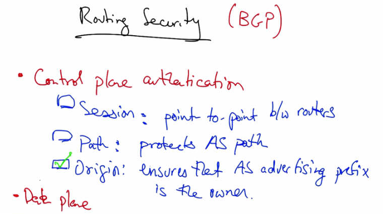

   Quiz Answer: Origin authentication (checked). Also Data plane security noted.

A route hijack is an attack on origin authentication because in a route hijack, the AS that is
advertising the prefix is actually not the rightful owner of that prefix. In addition to control plan
security, we also have to worry about data plan security or determining whether data is traveling
to the intended locations. In general, it can be extremely hard to verify that packets or traffic is
traveling along the intended route to the destination, or that it, in fact, even reaches the intended
destination in the first place. Guaranteeing that traffic actually traverses the advertised route
remains an important open problem in internet security. So how do these attacks on routing
happen in the first place?

Route Attacks
--------------

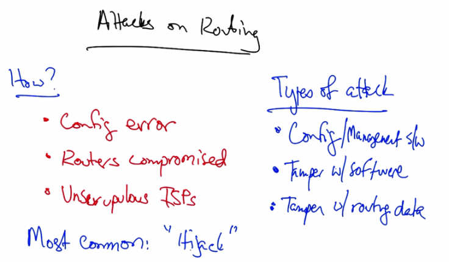

   Attacks on Routing — How: Config error, Routers compromised, Unscrupulous ISPs,
   Most common: "Hijack". Types of attack: Config/Management software, Tamper with
   software, Tamper with routing data.

One possible explanation is simply that the router is misconfigured. In other words, no one
actually intended for the router to advertise a false route, but because of a misconfiguration the
router does so. The AS 7007 attack that we discussed last time was actually the result of a
configuration error. Second, a router might be compromised by an attacker. Once a router is
compromised, the attacker can reconfigure the router to, for example, advertise false routes.
Finally, unscrupulous ISPs might also decide to advertise routes that they should not be
advertising. To launch the attack, an attacker might reconfigure the router, which is typically the
most common way an attacker might launch an attack. The attacker might also tamper with
software, or an attacker could actively modify a routing message. In addition to tampering with
the configuration, the attacker might tamper with the management software that changes the
configuration. And the most common attack is a route hijack attack or an attack on origin
authentication.

Route Hijacking
----------------

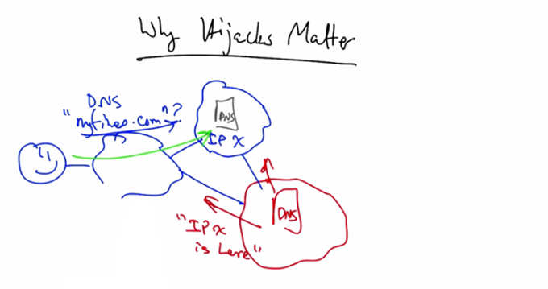

   Why Hijacks Matter — User queries DNS for "mytree.com", gets IP X. Attacker runs rogue
   DNS server and uses BGP to advertise route to IP X prefix.

Let's talk about why hijacks matter. Let's suppose that you would like to visit a particular
website. To do so you first need to issue a DNS query. Now the authoritative DNS server for a
particular domain might be located in a distant network. As we've discussed in previous lessons,
the DNS uses a hierarchy to direct your query to the location of the authoritative name server,
but ultimately that authoritative name server has an IP address, and you use the internet's routing
protocol, the border gateway protocol, to reach that IP address. What if an attacker were running
a rogue DNS server and wanted to hijack your DNS query or to return a false IP address? Well,
the attacker might use BGP to advertise a route for the IP prefix that contains that authoritative
DNS server.

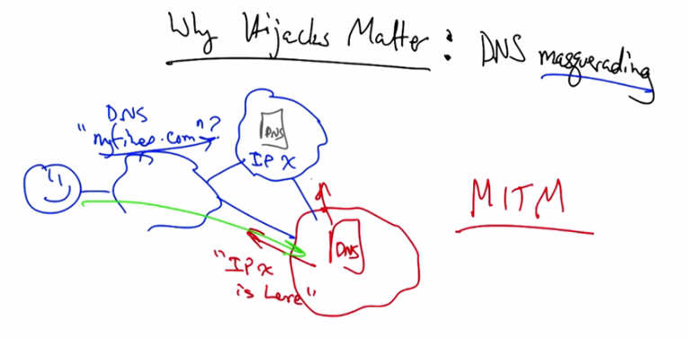

   Why Hijacks Matter: DNS masquerading — Attacker redirects DNS queries to rogue DNS
   server. MITM (Man In The Middle) attack shown.

And suddenly your DNS queries that were previously going to the legitimate server, are instead
redirected to the rogue DNS server. So we might think of this as an attack whereby an attacker
can use the BGP infrastructure to hijack a DNS query, and masquerade as a legitimate service. It
can get even worse than this. Let's now look at how a BGP route hijack can result in a Man in the
Middle attack, whereby your traffic ultimately reaches the correct destination, but the attacker
successfully inserts themselves on the path.

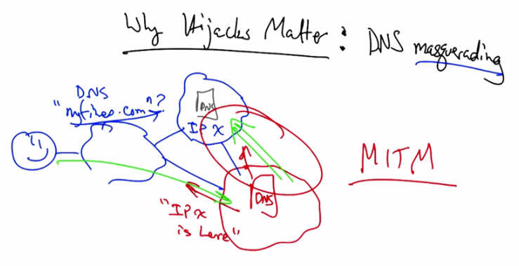

   Why Hijacks Matter: DNS masquerading with full MITM — Traffic routes through attacker
   before reaching legitimate destination, attacker intercepts all traffic.

The problem with this particular route hijack is that all traffic destined for IP X is going to head
for the attacker, even the traffic from the legitimate network. What we'd like to instead have
happened is that traffic for IP X first goes to the hijack location and then goes to the legitimate
location. So the attacker effectively becomes a Man in the Middle. The problem is that we need
to somehow disrupt the routes to the rest of the internet while leaving the routes between the
attacker and the legitimate location intact so that traffic along this path can still head towards the
legitimate AS.

Route Hijacking (cont)
-----------------------

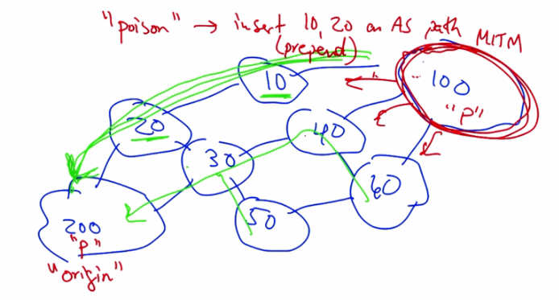

   "Poison" — insert AS 10, 20 in AS path (prepend). AS200 originates prefix P. AS100 seeks
   to become MITM. AS-path poisoning prevents AS10 and AS20 from accepting hijacked route.

Let's suppose that AS200 originates a prefix and that the paths that result from the original BGP
routing are shown in green. Let's now suppose that AS100 seeks to become a man in the middle.
If the original prefix being advertised was P, AS100 could also advertise the prefix P. But we
want to make sure that AS100 maintains a path back to AS200. Now that path already exists, it's
right here. So what we want to do is make sure that neither AS 10 nor AS 20 accept this hijacked
route. The way that we can do that is through a technique called AS-path poisoning. So, if AS
100 advertises a route that includes AS 10 and AS 20 in the AS path, both of these AS's will drop
the announcement because they will think they've already heard the announcement and don't
want to form a loop.

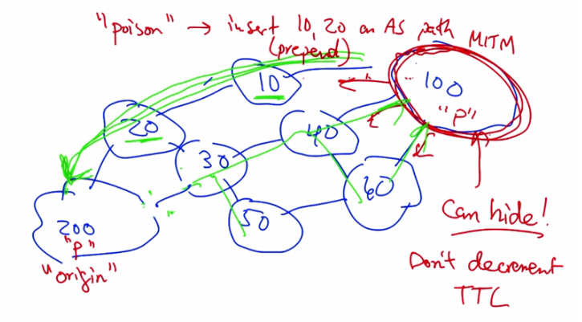

   AS-path poisoning continued — Attacker can hide presence by not decrementing TTL,
   preventing traceroute from revealing the attack path through AS100.

On the other hand, the other AS's on the internet (in other words, every other AS that's not on the
path back from 100 to 200) will switch and now all of the traffic from other AS's enroute to AS
200 will traverse the attacker AS100. Now a trace route might look awfully funny taking this
circuitous route, but actually the attacker can hide its presence even if the sender is running a
trace route. Recall that a trace route simply consists of ICMP time exceeded messages that result
when a particular packet reaches a TTL of 0. Now typically every router along a path will
decrement the TTL at each hop. But if the routers in the attacker's network never decrement the
TTL, then no time exceeded messages would be generated by routers in AS 100. Therefore the
traceroute would never show AS on the path at all. So now that we've talked about the
importance of origin authentication and attacks against it, let's talk a little bit about session
authentication.

Autonomous System Session Authentication
-----------------------------------------

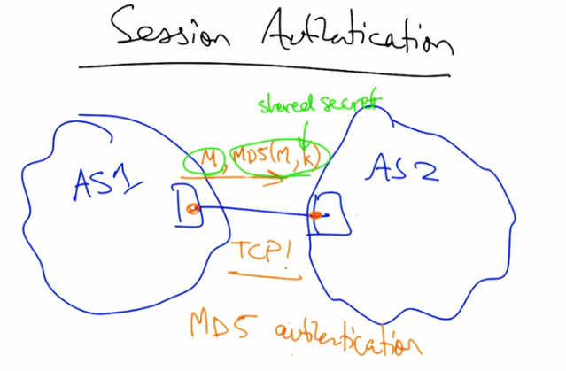

   Session Authentication — AS1 and AS2 share a secret key. Message M sent with MD5(M,k)
   hash over TCP. MD5 authentication ensures BGP session integrity.

Session Authentication simply attempts to ensure that BGP Routing messages sent between
routers between AS's are authentic. Now, this turns out to be a little bit easier than it might
appear, because the session between these routers is a TCP session. Therefore, all we have to do
is authenticate this session. The way that this is done, in practice, is done using TCP's MD5
authentication option. In such a setup, every message exchanged on the TCP connection not only
contains the message, but also a hash of the message with a shared secret key. Now this key
distribution is manual. The operator in AS1 and the operator in AS2, must agree on what the key
is, and typically they do that out of band, for example, by calling each other on the phone and
manually setting that key in the router configuration. But once that key is set, all messages
between this pair of routers is authenticated.

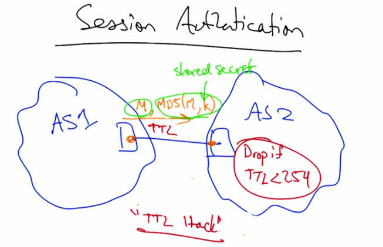

   Session Authentication — TTL Hack: AS1 sends packets with TTL=255. AS2 drops packets
   with TTL < 254. Since eBGP sessions are single hop, remote attackers' packets will have
   lower TTL values.

Another way to guarantee session authentication, is to have AS1 transmit packets with a TTL of
255 and have the receiving AS drop any packet that has a TTL less than 254. Because most
eBGP sessions are only a single hop and attackers are typically remote, it is not possible for the
recipient AS to accept a packet from a remote attacker, because likely that attacker's packets will
have a TTL value of less than 254. This defense is aptly called the TTL hack defense for BGP
Session Authentication.

Origin and Path Authentication
--------------------------------

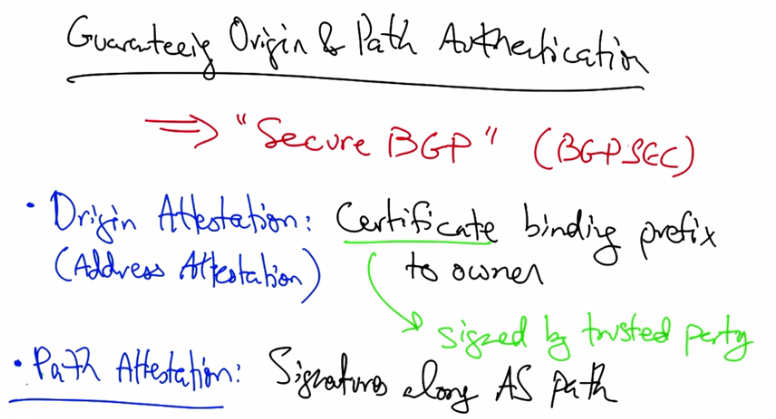

   Guaranteeing Origin and Path Authentication — "Secure BGP" (BGPSEC). Origin
   Attestation: Certificate binding prefix to owner (Address Attestation), signed by trusted
   party. Path Attestation: Signatures along AS path.

Let's return to the problem of guaranteeing origin and path authentication. To guarantee these
properties there is a proposal to modify the existing border gateway protocol to add signatures to
various parts of the route advertisement. This proposal is sometimes called Secure BGP or
BGPSEC. The proposal has two different parts. The first part is an origin attestation, which is a
certificate that binds the IP prefix to the organization that owns that prefix, including the origin
AS. This is sometimes also called an address attestation. Now, this certificate must be signed by
a trusted party. That trusted party might be, for example, a routing registry or the organization
that allocated that prefix to that organization in the first place. The second part of BGPSEC is
what's called a path attestation, which are a set of signatures that accompany the AS path as it is
advertised from one AS to the next. Let's have a closer look at BGPSEC's path attestation and the
types of attacks that it can and cannot prevent.

Autonomous System Path Attestation
------------------------------------

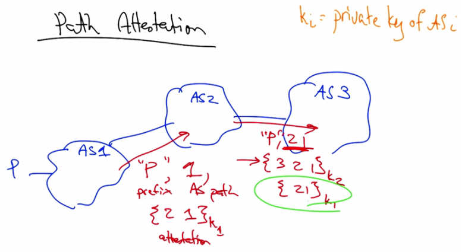

   Path Attestation — k_i = private key of AS_i. AS1 advertises prefix p with AS path "1" and
   attestation signed by k_1. AS2 re-advertises with path "2 1" and attestation signed by k_2.
   AS3 receives path "p, 2, 1" with nested attestations.

Let's assume that we have a path with three ASes, one, two, and three, and that each AS has a
public-private key pair. Let's assume that we have a network with three ASes and that each AS
along the path has a public-private key pair. An AS can sign a message or a route with its own
private key, and any other AS can check that signature with the AS's public key. So let's suppose
that AS1 advertises a route for prefix p. So that route would contain the prefix as well as an
address attestation, which we're not showing. But let's look at the path attestation. As usual, the
BGP announcement would contain the prefix p, and the AS path, which so far is just 1. And,
the path attestation, which is actually the path to 1 signed by the private key of AS1. When AS2
re-advertises that route announcement, it of course advertises the new AS path 2 1. It adds its
own route attestation, 3 2 1, signed by its own private key, and it also includes the original path
attestation signed by AS1. A recipient of a route along this path can thus verify every step of the
AS path. AS3 can use the first part of the path attestation to verify that the path in fact, goes from
AS2 to AS1, and does not contain any other AS's in between.

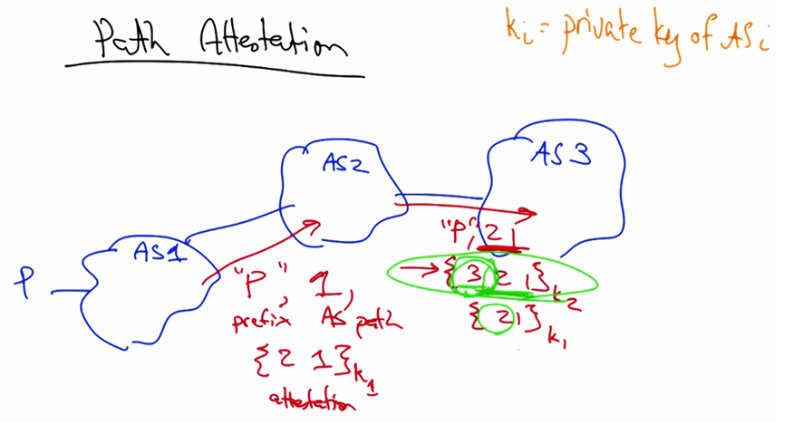

   Path Attestation — AS3 verifies using second part of path attestation that the path between
   it and AS2 does not contain any inserted AS's. Each segment signed to prevent insertion attacks.

It can use the second part of the path attestation to ensure that the path between it, AS3, and the
next hop, is in fact, AS2, and that no other AS's could've inserted themselves on the path
between 2 and 3. This is precisely why the AS signs a path attestation with not only its own part
of the AS path in the path attestation, but also, the hop of the AS that is intended to receive the
BGP route advertisement.

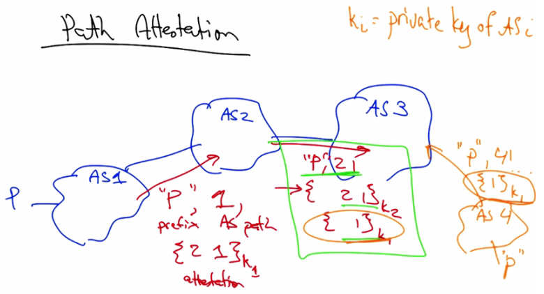

   Path Attestation — AS4 attempts to steal path attestation signed by K1, claiming connection
   to prefix P via AS1 when no such link exists.

To see the importance of this part of the path attestation, suppose, that these AS's were not there
in the path at station. In this case we have a very nice, well-formed BGP route advertisement for
a prefix with the AS path suffix 2 1, and we have each segment signed. So an attacker could, in
fact, take such an announcement and advertise sub strings of this route advertisement as their
own. Thus an attacker, AS4, could claim that it was connected to prefix P via AS1 when in fact
no such link existed simply by stealing or replacing the path attestation 1 that's signed by K1.

   Path Attestation — AS4 cannot forge attestation for path "4 1" signed by AS1's private key
   (k_1). BGPSEC prevents hijacks, path shortening, and modification attacks. Cannot prevent
   suppression or replay.

There's actually no way that AS4 Could forge the path attestation for 1, signed by AS1's private
key because it doesn't own this private key and AS1 never generated a path attestation with this
particular signed path. This is the reason that each AS not only signs a path attestation with its
own AS on the AS path, but also the next AS along the path. This particular mode of signing not
only prevents the type of hijacking that we explored, but it also prevents path shortening attacks.
For example, when AS4 receives the legitimate route to ASP through the path 3 2 1, it would be
impossible for the AS to shorten that advertisement to say 3 because it would somehow have to
generate a path attestation 4 3 1, signed by its own secret key. However, if it did that, the
receiving AS would look for another path attestation with just 3 1 signed by AS3. Yet, such a
path attestation would not actually exist. So, these path attestations can prevent against some
kinds of hijacks (as we've seen), they can prevent against these path shortening attacks, and they
can also prevent against modification of the AS path. However, there are certain attacks that path
attestations cannot defend against. So, if an AS fails to advertise a route or a route withdrawal,
there is no way for the path attestation or BGPSEC to prevent from that kind of attach. Certain
types of replay attacks such as a premature re-advertisement of a withdrawn route also cannot be
defended against and of course, there is no way to actually guarantee that the data traffic travels
along the advertised AS path, which is a significant weakness of BGP that is yet to be solved by
any routing protocol.

DNS Security
-------------

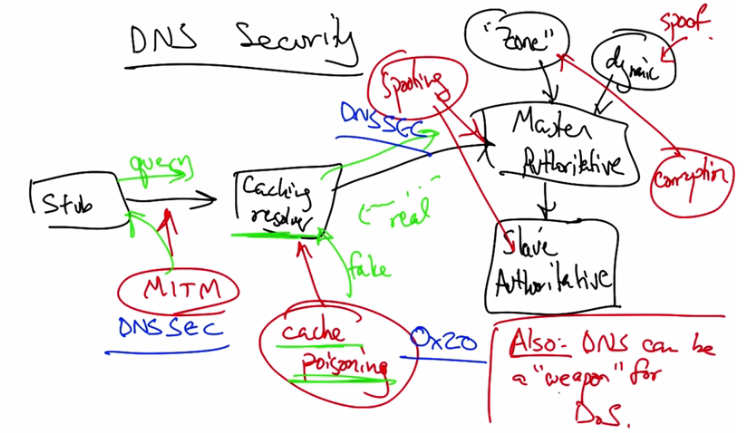

   DNS Security — Architecture showing stub resolver querying caching resolver. Threats include
   MITM, cache poisoning, spoofing, zone file corruption. DNSSEC defends against some attacks.
   DNS can also be a "weapon" for DDoS.

Let's now talk about DNS security. To understand the threats and vulnerabilities of DNS, let's
take a look at the DNS architecture. So we have a stub resolver which issues a query to a caching
resolver. At this point, we could have a man in the middle attack, or an attacker which observes a
query and forges a response. If a query goes further than the local caching resolver, say for
example to an authoritative name server, an attacker could try to send a reply back to that
caching resolver before the real reply comes back to try to poison, or corrupt, the cache with
bogus DNS records for a particular name. This attack is particularly virulent and we will look at
a cache poisoning attack in this lecture. Masters and slaves can both be spoofed. Zone files could
be corrupted. Updates to the dynamic update system could also be spoofed. We will look at some
defenses to cache poisoning, including the OX20 defense, as well as DNSSEC, which can
protect against some of these spoofing and man in the middle attacks. In addition to these
attacks, we'll look at an attack called DNS reflection where the DNS can be used to mount a
large distributed denial of service attack.

Why is DNS Vulnerable
----------------------

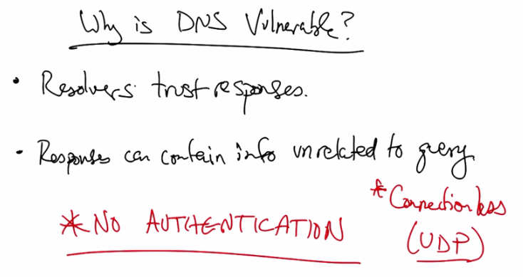

   Why is DNS Vulnerable? — Resolvers trust responses. Responses can contain info unrelated
   to query. No Authentication. Connectionless (UDP).

So why is DNS vulnerable in the first place? So the fundamental reason is that the resolvers that
issue the DNS query trust the responses that are received after they send out a query regardless
of where that response comes from. So sometimes these responses can be forged. When a
resolver sends out a query, it typically generates what's called a race condition. And if the
attacker replies before the legitimate responder, then the resolver is likely to believe the attacker.
DNS responses can also contain additional DNS information that's unrelated to the query. The
fundamental problem is that the basic DNS protocols have no means for authenticating
responses. This allows an attacker to forge responses after a resolver sends a query. A secondary
reason that these types of spoofed replies are possible is that DNS queries are typically
connectionless unlike BGP, where routing messages are transmitted over a reliable TCP
connection. UDP queries are sent over a connectionless UDP connection. Therefore, a resolver
does not have a way of mapping the response that it receives for a query other than the query ID,
which can be forged by the attacker. Let's look at how the combination of the lack of
authentication and the connectionless nature of a DNS query allows the possibility of cash
poisoning.

DNS Vulnerability Quiz
-----------------------

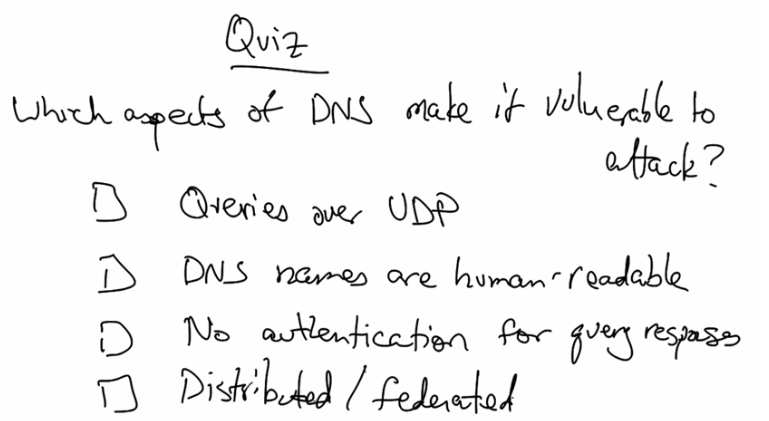

   Quiz: Which aspects of DNS make it vulnerable to attack? Queries over UDP, DNS names
   are human-readable, No authentication for query responses, Distributed/federated.

So as a quick quiz, which aspects of DNS make it vulnerable to attack? The fact that queries are
sent over UDP? The fact that DNS names are human-readable? The fact that responses to DNS
queries are not authenticated? Or, that the DNS is distributed or federated over many
organizations?

DNS Vulnerablitiy Quiz Answer
------------------------------

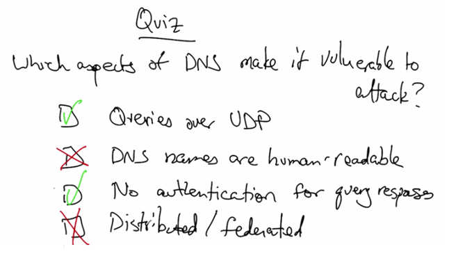

   Quiz Answer: Queries over UDP (checked), DNS names are human-readable (unchecked),
   No authentication for query responses (checked), Distributed/federated (unchecked).

As we discussed, the fact that the queries are sent over a connectionless channel and that there is
no way to authenticate the query responses, makes the DNS vulnerable to various kinds of
spoofing and cache poisoning attacks. The fact that DNS names are human readable does not
make the DNS inherently insecure. Nor does the fact that it's distributed. There are certainly very
well understood ways of securing distributed systems and that does not inherently make DNS
insecure.

DNS Cache Poisoning
--------------------

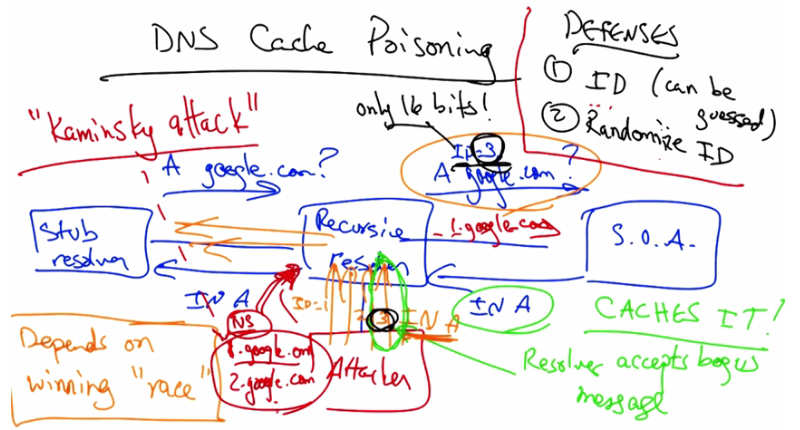

   DNS Cache Poisoning — "Kaminsky attack": Attacker queries A records (e.g., 1.google.com),
   floods recursive resolver with bogus responses containing NS records for entire google.com
   zone. Defenses: Query ID (16 bits, guessable), Randomize ID.

To see how a DNS cache poisoning attack works, consider a network where a stub resolver issues
a query to its recursive resolver, and the recursive resolver in turn sends that A record query to
the start of authority for that domain. Now, in an ideal world, the authoritative name server for
that domain would reply with the correct IP address. If an attacker guesses that a recursive
resolver might eventually need to issue a query for say, www.google.com, the attacker can simply
reply with multiple, specially crafted replies, each with different id's. Although this query has
some query id, the attacker doesn't need to see that query because the attacker can simply flood
the recursive resolver with a bunch of bogus replies, and one of them, in this case the response
with id3, will match. As long as this bogus response reaches the recursive resolver before the
legitimate response does, the recursive resolver will accept this bogus message, and worse, it
caches the bogus message. And DNS, unfortunately, has no way to expunge a message once it
has been cached. So now this recursive resolver will continue to send bogus A record responses
for any query for this particular domain name until that entry expires from the cache. Now
there's several defenses against DNS cache poisoning, which we've already seen one, which is the
query ID. But of course, the query ID can be guessed. The next defense is to randomize the ID.
So rather than having a resolver send queries where the ID's increment in sequence, the resolver
can pick a random ID. This makes the ID tougher to guess, but still, the query ID is only 16 bits,
which still makes it possible for an attacker to flood the recursive resolver with many possible
responses. And, it's likely that with relatively few responses, one of these bogus responses will
match the ID for the real query. Due to the birthday paradox, the success probability for
achieving a collision between the query ID of the query and of the response actually only requires
sending hundreds of replies, not a complete 32,000. Due to the birthday paradox, the probability
that such an attack will succeed, using only a few hundreds of replies, is relatively close to one.
The attacker does not need to send replies with all two to the 16th possible IDs. The success of a
DNS cache poisoning attack not only depends on the ability to reply to a query with a correct
matching ID, but it also depends on winning this race. That is, the attacker must reply to that
query before the legitimate authoritative name server replies. If the bad guy, or the attacker,
loses the race, then the attacker has to wait for that correct cached entry to expire before trying
again. However, the attacker can generate his own DNS query. For example, he could query
one.google.com, two.google.com and so forth. Each one of these bogus queries will generate a
new race. And eventually the attacker will win one of these races for an A record query. But who
cares? Nobody necessarily cares to own one.google.com, or two.google.com. The attacker really
wants to own the entire zone. Well the trick here is that instead of just simply responding with A
records in the bogus replies, the attacker can also respond with NS records for the entire zone of
google.com. So by creating one of these races using an A record query, and then responding not
only with the A record response, but also with the authoritative of the NS record for the entire
zone, the attacker can in fact own the entire zone. This idea of generating a stream of A record
queries to generate a bunch of races and then stuffing the A record responses for each of these
with a bogus authoritative NS record for the entire zone, is what's called the Kaminsky Attack,
after Dan Kaminsky who discovered the attack. The defenses of picking a query ID and
randomizing the ID, help, but remember the randomization is only 16 bits, so let's think about
other possible defenses.

DNS Cache Poisioning Defense
-----------------------------

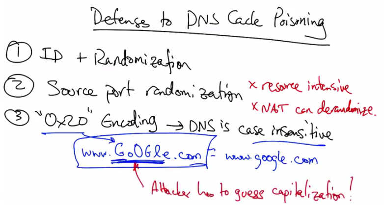

   Defenses to DNS Cache Poisoning — (1) ID + Randomization, (2) Source port randomization
   (resource intensive, NAT can derandomize), (3) "0x20" Encoding: DNS is case insensitive,
   e.g., www.GoOGle.com = www.google.com. Attacker has to guess capitalization!

In addition to having a query ID and randomization of that ID, the resolver can randomize the
source port on which it sends the query, thereby adding an additional 16 bits of entropy to the ID
that's associated with the query. Unfortunately, picking a random source port can be resource
intensive and also a network address translator or a NAT, could derandomize the port. Another
defense is called the 0x20 or the 0x20 encoding, which is based on the intuition that DNS
matching and resolution is entirely case insensitive. So capitalization of individual letters in the
domain name do not affect the answer that the resolver will return. This 0x20 bit, or the bit that
affects whether a particular character is capitalized or in lower case can also be used to introduce
additional entropy. When generating a response to a query such as this one, the query is copied
from the DNS query into the response exactly as it was in the query. The mixed pattern of upper
and lower case letters thus constitutes a channel. If the resolver and the authoritative server can
agree on a shared key, then the resolver and the authoritative are the only ones who know the
appropriate pattern of upper and lower case letters for a particular domain name. Because no
attacker would know the appropriate combination of upper and lower case letters for a particular
domain, it becomes even more difficult for the attacker to inject a bogus reply because not only
would the attacker have to guess the ID, but the attacker would also have to guess the
capitalization sequence for any particular domain name.

DNS Security Quiz
------------------

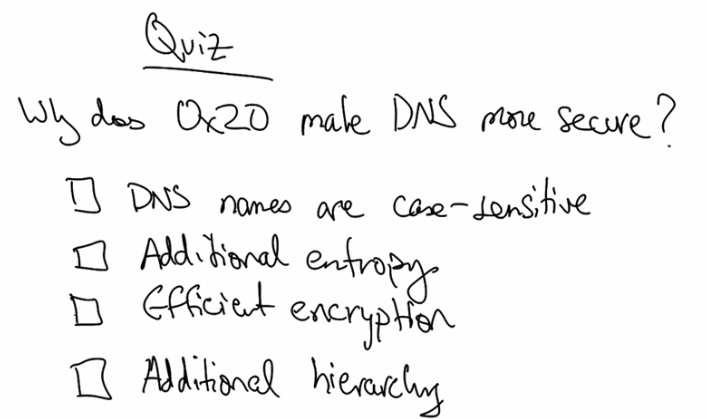

   Quiz: Why does 0x20 make DNS more secure? DNS names are case-sensitive, Additional
   entropy, Efficient encryption, Additional hierarchy.

So why does the 0x20 encoding make DNS more secure? Is it because DNS names are case-
sensitive? Is it because the encoding adds additional entropy to the query? Is it because the
encoding make it easier to encrypt the queries and replies? Or is it because the encoding adds the
requirement for an additional layer of hierarchy into the DNS resolution infrastructure?

DNS Security Quiz Answer
-------------------------

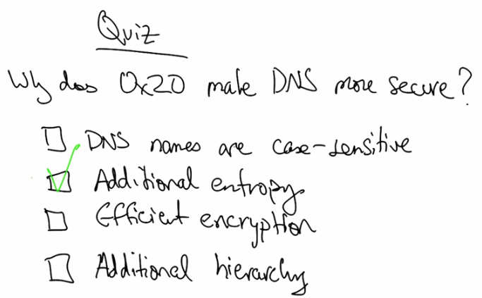

   Quiz Answer: Additional entropy (checked). The 0x20 bit encoding adds additional entropy
   by tweaking capitalization of DNS names.

The 0x20 bit encoding adds additional entropy to the queries that a DNS resolver sends by
tweaking the capitalization on a DNS name in such a way that only the resolver and the
authoritative name server know the particular sequence of upper and lower case letters in the
reply.

DNS Amplification Attacks
--------------------------

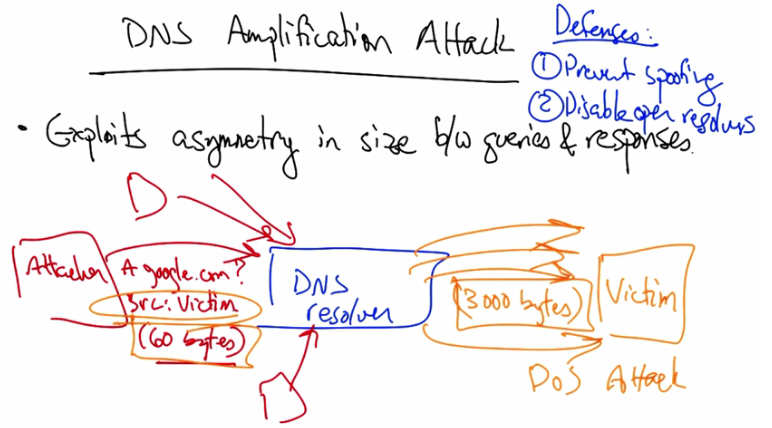

   DNS Amplification Attack — Exploits asymmetry in size between queries and responses.
   Attacker sends 60-byte query to DNS resolver with source IP = victim. Resolver sends
   3000-byte response to victim. Defenses: (1) Prevent spoofing, (2) Disable open resolvers.

Let's look at another attack called the DNS amplification attack. This attack exploits the
asymmetry in size between DNS queries and their responses. So an attacker might send a DNS
query for a particular domain, and that query might only be 60 bytes. In sending the query,
however, the attacker might indicate that the source for this query is some victim IP address.
Thus, the resolver might send a reply which is nearly two orders of magnitude larger to a victim.
So the name of the attack amplification comes from the fact that the query is only 60 bytes and a
reply is considerably larger. So, by simply generating a small amount of initial traffic, the
attacker can cause the DNS resolver to generate a significantly larger amount of attack traffic. If
we start adding other attackers, all of which specify the victim as the source, then all of these
giant replies start heading towards the victim, and we have a denial of service attack on the
victim. Two possible defenses against this attack are to prevent IP address spoofing in the first
place, using, for example, the appropriate filtering rule, or to disable the ability for a DNS
resolver to resolve queries from arbitrary locations on the Internet.

DNSSEC DNS Security
--------------------

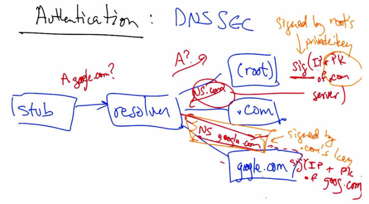

   Authentication: DNSSEC — Stub resolver queries for A record (e.g., google.com). Root signs
   referral to .com with private key. .com signs referral to google.com. Each level provides
   signature and public key of next level, creating a chain of trust.

As we discussed, one of the major reason for DNSs vulnerabilities is a lack of authentication.
The DNSSEC protocol adds authentication to DNS responses simply by adding signatures to the
responses that are returned for each DNS reply. When a stub resolver issues a query, assuming
there is no caching, the query is relayed by the recursive resolver to the root name server, which,
as we know, sends a referral to .com, but this referral includes the signature by the root of the IP
address and the public key of the .com server. As long as this resolver knows the public key
corresponding to the route, it can check the signature and it knows then that the referral is to the
correct IP address for .com. It also now knows the public key corresponding to the .com server.
Thus when the .com server sends the next referral to Google.com, that referral is signed by
.com's private key. But the root has told the resolver the public key corresponding to .com, and
thus the resolver can check that this referral is not bogus and in fact came from the .com server.
Similarly, the .com server will return not only the IP address for Google.com, but also the IP
address and public key for the Google.com authoritative name server so that when Google
returns its answers, the resolver can check the signatures coming from google.com. In other
words, each authoritative name server in the DNS hierarchy returns not only the referral, as it
would with regular DNS, but also a signature containing the IP address for that referral, and the
public key for the authoritative name server that corresponds to that referral. That public key
then allows the resolver to check the signatures at the next lowest level of the hierarchy, until we
finally get to the answer.
