Programming Software Defined Networks
=====================================

SDN Intro
----------

Now that you know that network management is a tough, complicated process, we're going to
take a look at one of the most recent advancements in networking, software defined networking.

Along the way, you're going to complete two exciting projects in Mininet. In the first, you'll
write your own virtual switch. In the second, you'll use a programming language designed for
software-defined networking to create a firewall.

Updates in Software Defined Networks
--------------------------------------

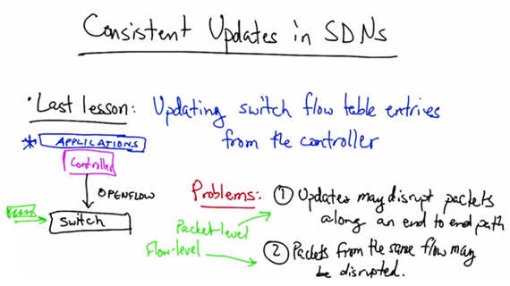

   Consistent Updates in SDNs — Last lesson: Updating switch flow table entries from the
   controller. Applications → Controller → OpenFlow → Switch. Problems: (1) Updates may
   disrupt packets along an end-to-end path. (2) Packets from the same flow may be disrupted.
   Packet-level and flow-level consistency issues.

In this lesson we'll be exploring consistent updates in SDN's. As a reminder from the last lesson,
we looked at how to update switch flow table entries using OpenFlow control commands from
the control. The OpenFlow API, however, does not provide specific guarantees about the level of
consistency that packets along an end-to-end path can experience. So for example, updates to
multiple switches along a path in a network that occur at different times may result in problems
such as forwarding loops. Additionally, if updates to the switches along an end-to-end path occur
in the middle of a flow, packets from the same flow may be subjected to different network states.
These two problems are known as consistency problems. The first problem is known as a packet
level consistency problem, and the second problem is known as a flow level consistency
problem. In this lesson, we will explore these problems in more detail and look at various
approaches to guaranteeing consistent updates in SDNs. To think about consistency properly, we
first need a notion of a high level programming model that sits on top of what we would call the
southbound interface. We'll talk about how to write applications that use the controller interface
that we learned about in the last lesson that can rely on a better notion of consistency than
existing controller platforms currently provide. Let's first think about how we want to program
these applications and what type of abstraction the applications would require from the
underlying control interface.

SDN Programming Introduction
------------------------------

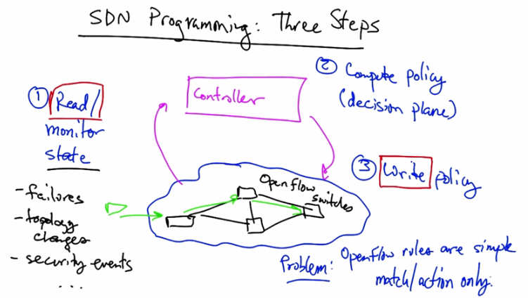

   SDN Programming: Three Steps — (1) Read/monitor state (failures, topology changes, security
   events). (2) Compute policy (decision plane). (3) Write policy. Problem: OpenFlow rules are
   simple match/action only.

Let's consider a network of SDN switches, such as OpenFlow switches, and a controller that is
controlling those switches, and let's assume that we would like to write a program using this
interface. We can think about this programming as proceeding in three steps. The first is that the
controller needs to read or monitor network state, as well as various events that may be occurring
in the network. These events may include failures, topology changes, security events, and so
forth. The second step is to compute the policy based on the state that the controller sees from
the network. This is effectively what we talked about last time, is the role of the decision plane,
in deciding what the forwarding behavior of the network should be, in response to various states
that it reads from the network switches. The third step is to write policy back to the switches by
installing the appropriate flow table state into the switches. Consistency problems can arise in
two steps. First, the controller may read state from the network switches at different times,
resulting in an inconsistent view of the network-wide state, and second, the controller may be
writing policy as traffic is actively flowing through the network, which can disrupt packets along
an end-to-end path or packets that should be treated consistently because they're part of the same
flow. Both reading and writing networks state can be challenging because OpenFlow rules are
simple match action predicates, so it can be very difficult to express complex logic with these
rules. If we want to read state that requires multiple rules, expressing a policy that allows us to
read such a state can be complicated without more sophisticated predicates.

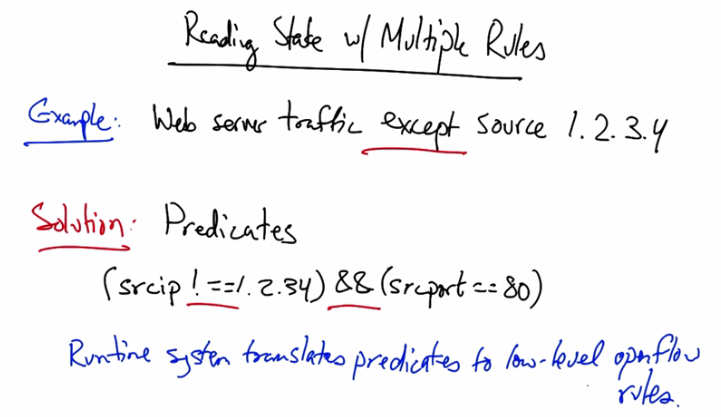

   Reading State with Multiple Rules — Example: Web server traffic except source 1.2.3.4.
   Solution: Predicates (srcip != 1.2.3.4) AND (srcport == 80). Runtime system translates
   predicates to low-level OpenFlow rules.

For example, let's suppose that when we are reading state, we'd like to see all web serving traffic
except for source 1.2.3.4. Simple match action rules do not allow us to express such exceptions.
As a solution to this problem, we need a language primitive that allows us to express predicates.
Here is a simple statement that has several predicates, such as AND and NOT. A runtime system
can then translate these predicates into low-level OpenFlow rules, ensuring that they are installed
atomically and in the right order. Another problem that arises is that switches only have limited
space for rules. It's simply not possible to install all possible rule patterns for every set of flows
that we'd like to monitor.

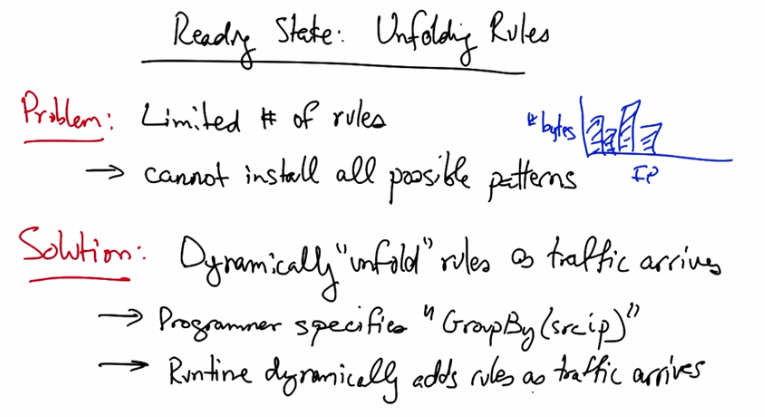

   Reading State: Unfolding Rules — Problem: Limited number of rules, cannot install all
   possible patterns. Solution: Dynamically "unfold" rules as traffic arrives. Programmer specifies
   "GroupBy(srcip)". Runtime dynamically adds rules as traffic arrives.

For example, if we'd like to count the number of bytes for every source IP address and generate a
histogram with the resulting traffic, we would potentially need a flow table entry for every
possible source IP address. It's simply not possible to install all of these possible rules. The
solution is to have the run time system dynamically unfold rules as traffic arrives. A programmer
would specify something like a group by source IP address, and the run time system would
dynamically add open flow rules to the switch as traffic arrives, thereby guaranteeing that there
are only rules in the switch that correspond to active traffic.

Reading Network State
----------------------

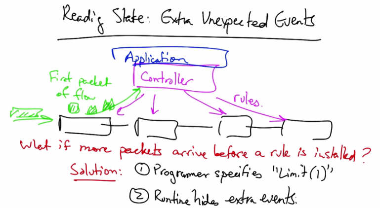

   Reading State: Extra Unexpected Events — First packet of flow goes to controller, controller
   installs rules. Problem: What if more packets arrive before a rule is installed? Solution:
   (1) Programmer specifies "Limit(1)". (2) Runtime hides extra events.

Another problem that arises when reading state is that extra, unexpected events may introduce
inconsistencies. A common programming idiom is that the first packet goes to the controller and
once the controller figures out what policy to apply for that flow, the controller then installs rules
in the switches, in the network, corresponding to that flow. What if more packets should arrive at
the switch before the controller has a chance to install rules for that flow? At this point, multiple
packets may reach the controller, but the application it is running on top of the controller may not
need or want to see these additional packets. So, the solution is to have the programmer specify
by a high level language a limit of one, indicating that the application should only see the first
packet of the flow and that the subsequent packet should be suppressed. The runtime system then
hides the extra events.

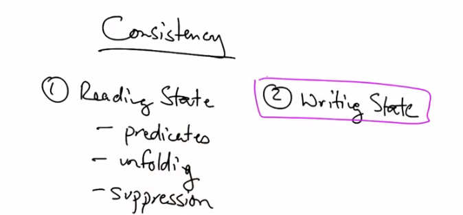

   Consistency — (1) Reading State: predicates, unfolding, suppression. (2) Writing State
   (highlighted as next topic).

So to remind you where we are, we talked about problems with consistency when reading state
from the network, and we talked about three approaches to helping guarantee consistency when
reading state: predicates, rule unfolding, and suppression. And let's now talk about primitives
that can help maintain consistency when writing state.

Writing Network Policy
-----------------------

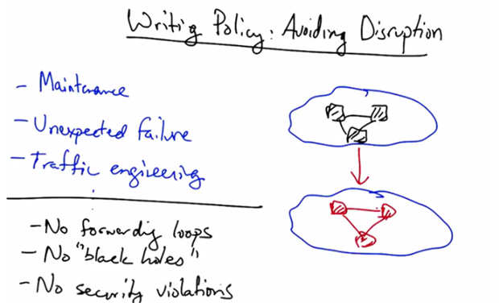

   Writing Policy: Avoiding Disruption — Reasons for policy updates: Maintenance, Unexpected
   failure, Traffic engineering. Need to maintain: No forwarding loops, No "black holes", No
   security violations.

There are many reasons that a controller might want to write policy to change the state and the
network switches, including maintenance, unexpected failure, and traffic engineering. Any of
these network tasks involve or require updating state in the network switches, and when that state
transition happens, we want to make sure that forwarding remains correct and consistent. In
particular, we would like to maintain the following invariance. There shouldn't be any
forwarding loops and there shouldn't be any black holes whereby a router or switch receives a
packet and doesn't know what to do with it. There also shouldn't be cases where traffic is going
where it shouldn't be allowed to go because of the network being in an inconsistent state.

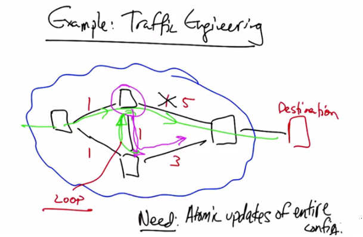

   Example: Traffic Engineering — Network with link weights 1, 3, 5. Current path shown in
   green. If top switch state updated before bottom switch, a forwarding loop forms. Need: Atomic
   updates of entire configuration.

Let's now consider an example of what might happen when policies are written to the network if
they're written in an inconsistent fashion. Let's consider a case where we have a network that is
performing shortest routing to some destination, and the link weights are as shown here in the
figure. Traffic in the network would flow along the path shown in green. Let's suppose now that
an operator wants to change the network state to shift traffic off of this link. He could do so by
updating the link weight. In doing so, the new shortest path from this top router would be as
follows. But, what if the state in the top switch occurred before the state in the bottom switch
could be updated? In this case, we would have a potential forwarding loop. Traffic would
proceed to the bottom switch. But the bottom switch would still have the old network state and
would continue to forward traffic to the top switch, resulting in a forwarding loop. If rules are
installed along a path out of order, packets may reach a switch before the new rules do. So, in
this type of model we would have to think about all possible packet and event orderings to
ensure that consistent behavior resulted. So we need atomic updates of the entire configuration.

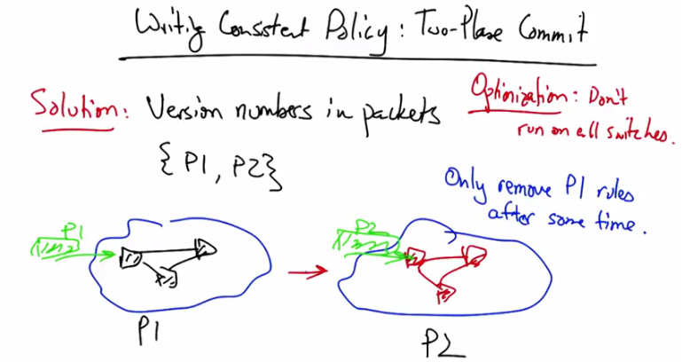

   Writing Consistent Policy: Two-Phase Commit — Solution: Version numbers in packets {P1,
   P2}. Network transitions from old policy (P1) to new policy (P2). Optimization: Only remove
   P1 rules after some time, don't run on all switches.

The solution to this problem is to use a two phase commit so that packets are either subjected to
the old configuration on all switches, or to the new configuration on all switches. But packets
aren't subjected to the new policy on some switches and the old policy on others. The idea is to
tag the packet on ingress so that the switches maintain copies of both P1 and P2 for some time.
When all switches have received rules corresponding to the new policy, then incoming packets
can be tagged with P2. After some time, when we're sure that no more packets with P1 are being
forwarded through the network, we can only then remove the rules corresponding to policy P1.
Now, the naive version of two-phase commit, requires doing this on all switches at once, which
essentially doubles the rule space requirements since we have to store the rules for both P1 and
P2. We can limit the scope of the two phase commit by only applying this mechanism on
switches that involve the affected portions of the traffic or the affected portions of the topology.

Inconsistent Policy Write Quiz
--------------------------------

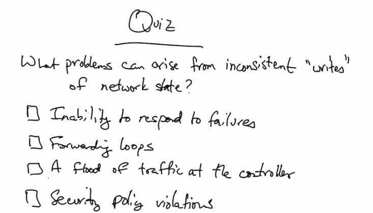

   Quiz: What problems can arise from inconsistent "writes" of network state? Options: Inability
   to respond to failures, Forwarding loops, A flood of traffic at the controller, Security policy
   violations.

So here's a quick quiz. What types of problems can arise from inconsistent applications of
writing policy? Inability to respond to failures, forwarding loops, a flood of traffic at the
controller, or security policy violations?

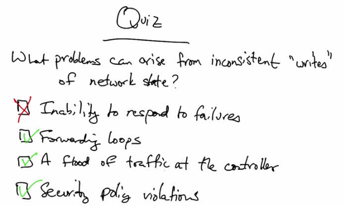

   Quiz solution: Inability to respond to failures (NOT checked), Forwarding loops (checked),
   A flood of traffic at the controller (checked), Security policy violations (checked).

Inconsistent writes can result in forwarding loops or security policy violations where traffic ends
up going to parts of the network where it shouldn't go as a result of inconsistent switch state. The
ability to respond to failures is orthogonal to consistency. A flood of traffic at the controller
technically involves problems with reading state in a consistent fashion. But since there also
involves a step where the controller writes state to the switches while packets are still arriving at
the controller, I would consider that answer to be correct as well.

Coping With Inconsistency Quiz
--------------------------------

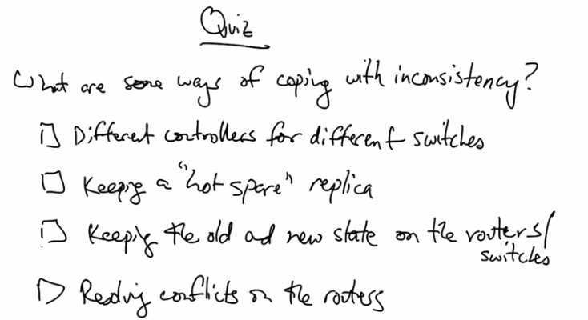

   Quiz: What are some ways of coping with inconsistency? Different controllers for different
   switches, Keeping a "hot spare" replica, Keeping the old and new state on the routers/switches,
   Relying on conflicts on the routers.

What are some approaches to coping with inconsistency? Running different controllers for
different switches? Keeping a "hot spare" replica that has a complete view of the network state?
Keeping the old and new state on the routers and switches and switching over only when all of
the switches have received the new state? Or relying on the routers themselves to resolve the
conflict?

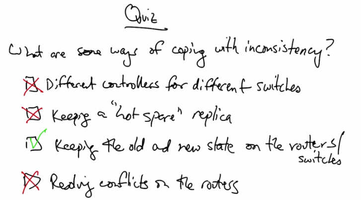

   Quiz solution: Different controllers for different switches (NOT checked), Keeping a "hot
   spare" replica (NOT checked), Keeping old and new state on routers/switches (checked),
   Relying on conflicts on the routers (NOT checked).

In this case, there is only one correct answer, which is keeping the old and new state on the
routers and switches. This is the two-phase commit approach that we talked about. Running
different controllers for different switches could obviously result in an inconsistent state, since
each of those controllers may be making independent decisions. Keeping a "hot spare" replica
does no good if the replica also writes state inconsistently to the network. And resolving conflicts
on the routers also doesn't work because no router has a complete view of the network state.

Network Virtualization
-----------------------

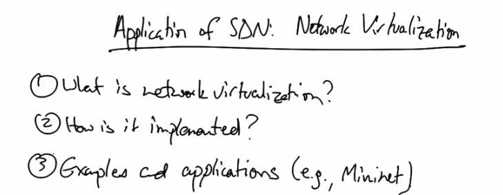

   Application of SDN: Network Virtualization — (1) What is network virtualization? (2) How
   is it implemented? (3) Examples and applications (e.g., Mininet).

Let's now talk about an application of software defined networking, which is network
virtualization. So we'll talk first about what network virtualization is, then we'll talk about how
it's implemented, and then we'll talk about some examples and applications, such as Mininet.

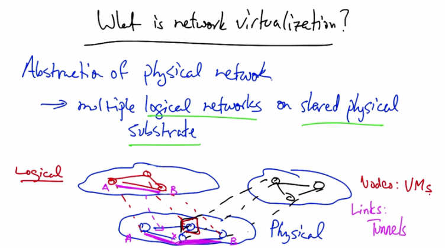

   What is network virtualization? Abstraction of physical network → multiple logical networks
   on shared physical substrate. Logical networks on top of Physical network. Nodes: VMs,
   Links: Tunnels.

So network virtualization is simply an abstraction of the physical network, where multiple
logical networks can be run on the same underlying shared physical substrate. For example, a
logical network might map a particular network topology onto the underlying physical topology.
And there might be multiple logical networks that map onto the same physical topology. And
these logical networks might actually share nodes and links in the underlying physical typology,
but each logical network has its own view as if it were running its own private version of the
network. Now you can see from this picture that the nodes in the physical network need to be
shared or sliced. So the nodes in the physical topology might be virtual machines. Similarly, a
single link in the logical topology might map to multiple links in the physical topology. The
mechanism to achieve these virtual links is typically through tunneling. So a packet that's
destined from A to B in the logical topology, might be encapsulated in a packet that's destined
for node X first, before the packet is decapsulated and ultimately sent to B.

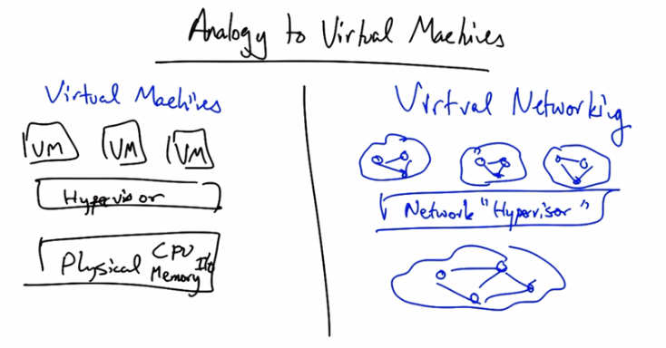

   Analogy to Virtual Machines — Virtual Machines: VMs run on Hypervisor on Physical
   CPU/Memory/IO. Virtual Networking: Virtual networks run on Network "Hypervisor" on
   physical network.

It may also be easy to understand virtual networking as an analogy to virtual machines, which
you may be familiar with already. So in a virtual machine environment, we have virtual
machines where a hypervisor arbitrates access to the underlying physical resources, providing to
each virtual machine the illusion that it's operating on its own dedicated version of the hardware.
Similarly, with virtual networking, a network hypervisor of sorts arbitrates access to the
underlying physical network to multiple virtual networks, providing the illusion that each virtual
network actually has its own dedicated physical network.

Why Use Network Virtualization
--------------------------------

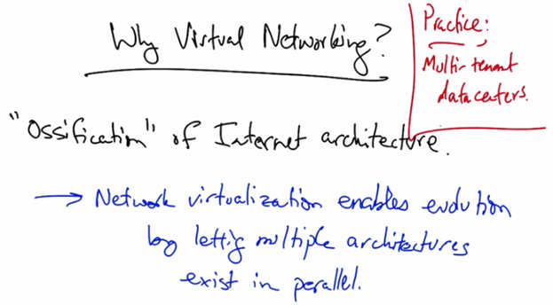

   Why Virtual Networking? "Ossification" of Internet architecture → Network virtualization
   enables evolution by letting multiple architectures exist in parallel. Practice: Multi-tenant
   datacenters.

One of the main motivations for the rise of virtual networking was the "ossification" of the
internet architecture. In particular because the internet protocol was so pervasive, it made it very
difficult to make fundamental changes to the way the underlying internet architecture operated.
There was a lot of work on overlay networks in the 2000's, but one size fits all network
architectures were very difficult to deploy. So rather than try to replace existing network
architectures, network virtualization was intended to allow for easier evolution. In other words,
network virtualization enables evolution because we didn't have to pick a winner for a
replacement for IP. We could instead let multiple architectures exist in parallel. Now, this was
sort of a green field view of why virtual networking was potentially a good idea. In practice,
network virtualization has really taken off in multi-tenant data centers where there may be
multiple tenants or applications running on a shared cluster of servers. Well known examples of
this include Amazon's EC2, Rack Space, and things like Google App Engine. Large service
providers such as Google, Yahoo, and so forth, also use network virtualization to adjust the
resources that are devoted to any particular service at a given time.

Network Virtualization Quiz
-----------------------------

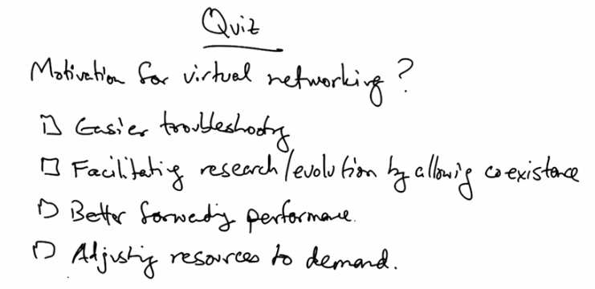

   Quiz: Motivation for virtual networking? Options: Easier troubleshooting, Facilitating
   research/evolution by allowing coexistence, Better forwarding performance, Adjusting
   resources to demand.

So what are the motivations for network virtualization or virtual networks that we've discussed?
Easier troubleshooting? Facilitating research and evolution by allowing coexistence of
production networks with experimental ones? Better forwarding performance? And adjusting the
resources of the network as demands change? Please check all that apply.

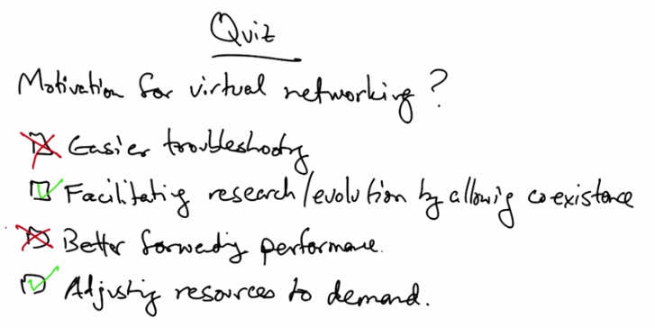

   Quiz solution: Easier troubleshooting (NOT checked), Facilitating research/evolution by
   allowing coexistence (checked), Better forwarding performance (NOT checked), Adjusting
   resources to demand (checked).

As we discussed, virtual networks can facilitate research in evolution by allowing experimental
networks to coexist with production networks. Because the networks are virtual, they can be
scaled up and down, adjusting the resources that are devoted to any one particular service as
demands change. We discuss this in the context of production networks, such as Google and
Yahoo. Virtual networks are not inherently easier to troubleshoot, nor do they necessarily
provide better forwarding performance. In fact, forwarding performance may be worse, due to
the additional level of indirection that has been added.

Network Virtualization Uses SDN
---------------------------------

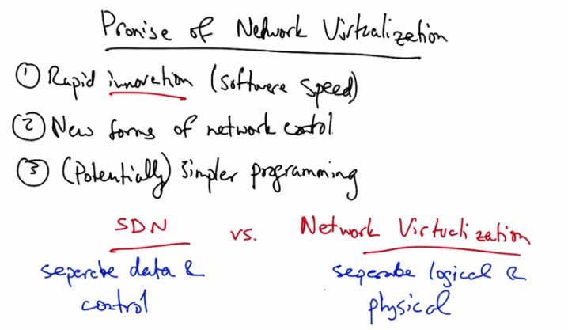

   Promise of Network Virtualization — (1) Rapid innovation (software speed). (2) New forms
   of network control. (3) (Potentially) simpler programming. SDN: separate data and control.
   Network Virtualization: separate logical and physical.

Some of the promised benefits of Network Virtualization are more rapid innovation since
innovation can proceed at the rate at which software evolves rather than on hardware
development cycles, allowing for new forms of network control and potentially simplifying
programming. It is important to make a distinction between Network Virtualization and
Software-Defined Networking. Network Virtualization is arguably one of the first killer
applications for SDN. And in some sense, SDN is a tool for implementing Network
virtualization. But the two are not one and the same. Remember the defining tenant of SDN is
the separation of the data and control plane, whereas the defining tenant of Network
virtualization is to separate the underlying physical network from the logical networks that lie on
top of it. So SDN can be used to simplify many aspects of Network virtualization. But it does not
inherently obstruct the details of the underlying physical network.

Characteristics of Network Virtualization Quiz
------------------------------------------------

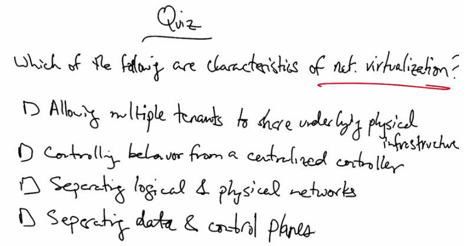

   Quiz: Which of the following are characteristics of network virtualization? Allowing multiple
   tenants to share underlying physical infrastructure, Controlling behavior from a centralized
   controller, Separating logical and physical networks, Separating data and control planes.

So which of the following are characteristics of network virtualization, but not necessarily
characteristics of SDN? Allowing multiple tenants to share underlying physical infrastructure?
Controlling behavior from a logically centralized controller? Separating logical and physical
networks? Or separating data and control planes? Again, please feel free to check all that apply.

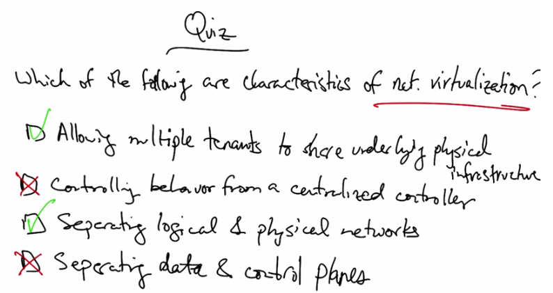

   Quiz solution: Allowing multiple tenants to share underlying physical infrastructure (checked),
   Controlling behavior from a centralized controller (NOT checked), Separating logical and
   physical networks (checked), Separating data and control planes (NOT checked).

Network virtualization can allow multiple tenants to share the underlying physical infrastructure.
And it also separates logical and physical networks. The other two options are defining
characteristics of software defined networking, but not of network virtualization.

Design Goals for Network Virtualization
-----------------------------------------

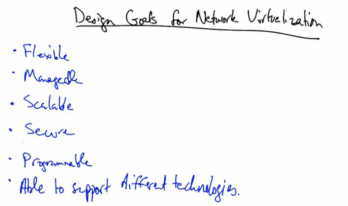

   Design Goals for Network Virtualization — Flexible, Manageable, Scalable, Secure,
   Programmable, Able to support different technologies.

So virtual networks have various design goals. It should be flexible, able to support different
topologies, routing, and forwarding architectures, and independent configurations. They should
be manageable. In other words, they should separate the policy that a network operator is trying
to specify from the mechanisms of how those policies are implemented. They should be scalable,
maximizing the number or coexisting virtual networks. They should be secure by isolating the
different logical networks from one another. They should be programmable, and they should be
heterogeneous in the sense that they should support different technologies.

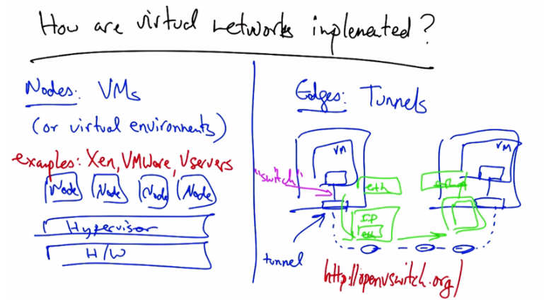

   How are virtual networks implemented? Nodes: VMs (or virtual environments, e.g. Xen,
   VMware, VServers) on Hypervisor/HW. Edges: Tunnels. Diagram shows VMs connected
   through switches with IP tunnels to other VMs. See

So virtual networks have two components, nodes and edges. The physical nodes themselves must
be virtualized. One possible way of virtualizing a node is a virtual machine. A more lightweight
way of virtualizing a node is using a virtual environment such as a VServer or a Jail. The
hypervisor, or whatever technology is enabling the virtual environment, can effectively slice the
underlying physical hardware to provide the illusion of multiple guest nodes or multiple virtual
nodes. Examples of node virtualization include virtual machine environments such as Xen or
VMware, or what's called OS level virtualization or virtual environments, such as Linux
Vservers. Now, in a virtual network, we need to connect these virtual machines. Each virtual
machine or virtual environment has its own view of the network stack. And we may want to
provide the appearance that these nodes are connected to one another over a Layer two topology,
even if they are in fact separated by multiple IP hops. One possible way of doing that is to
encapsulate the Ethernet packet as it leaves the VM on the left in an IP packet. The IP packet can
then be destined for the IP address of the machine on the right, and when the packet arrives at
this machine, the host can decapsulate the packet and pass the original Ethernet packet to the VM
or the virtual environment that's residing on that physical node. Each one of these physical hosts
may, in fact, host multiple virtual machines or virtual environments, which creates the need for a
virtual switch that resides on a physical host. This virtual switch provides the function of
networking virtual machines together over a virtual layer two topology. The Linux bridge is an
example of a software switch that can perform this type of function. Open Vswitch is another
example of software that performs this type of glue function. You can see more information
about Open Vswitch on the URL provided here.

Virtualization in Mininet
--------------------------

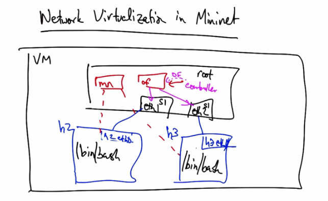

   Network Virtualization in Mininet — VM contains mn (Mininet), tap interfaces, root controller,
   and switch S1. Hosts h2 and h3 each have their own network namespace with /bin/bash
   processes and eth interfaces.

The Mininet tool we have been using in the course is actually an example of network
virtualization. We are in fact running an entire virtual network on your laptop. When you start
Mininet using the MN script, each host in the virtual network is a bash process with its own
network name space. A network name space is kind of like a virtual machine except it's a lot
more lightweight. It's in fact called OS Level Virtualization. So, each one of these virtual nodes
has its own view of the network stack as shown here with these interfaces. But it has a shared file
system and it's not, in fact, running its own independent virtual machine. The root namespace
manages the communication between these distinct virtual nodes, as well as the switch that
connects these nodes in the topology that you set up. Virtual Ethernet pairs are assigned two
name spaces. For example, S1 eth1 is assigned to an interface in H2's network name space. And
S1 eth2 is assigned to a network name space in H3's virtual network name space. The OpenFlow
switch effectively performs forwarding between the interfaces in the network. But because the
interfaces are paired, we get the illusion of sending traffic between h2 and h3. When we make
modifications to the OpenFlow switch via the controller, we're in fact doing that in the root name
space.

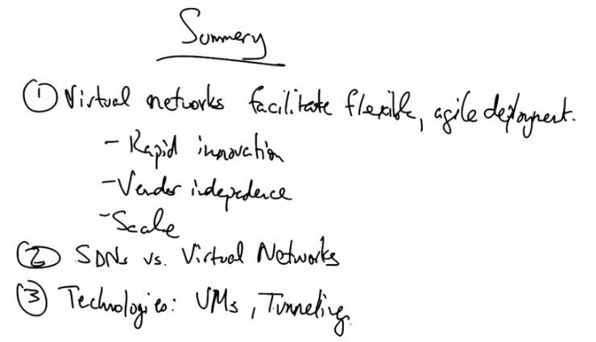

   Summary — (1) Virtual networks facilitate flexible, agile deployment: Rapid innovation,
   Vendor independence, Scale. (2) SDNs vs. Virtual Networks. (3) Technologies: VMs, Tunneling.

In summary, virtual networks facilitate flexible, agile deployment, by enabling rapid innovation
at the pace of software, vender independence, and scale. We talked about the distinction between
SDN's and virtual networks, as well as various technologies that enable virtual networks, such as
virtual machines for creating virtual nodes and tunneling for creating virtual links.

SDN Programming Difficulty
---------------------------

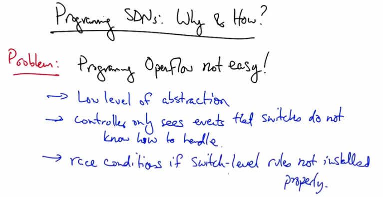

   Programming SDNs: Why and How? Problem: Programming OpenFlow not easy! Low level of
   abstraction. Controller only sees events that switches do not know how to handle. Race
   conditions if switch-level rules not installed properly.

In this lesson we'll talk about the why and how of programming SDNs. Unfortunately,
programming OpenFlow is not easy. It offers only a very low level of abstraction in the form of
match action rules. The controller only sees events that switches don't know how to handle, and
there can be race conditions if switch level rules are not installed properly, as we've already seen
in the lesson on consistent updates.

SDN Programming Interface
--------------------------

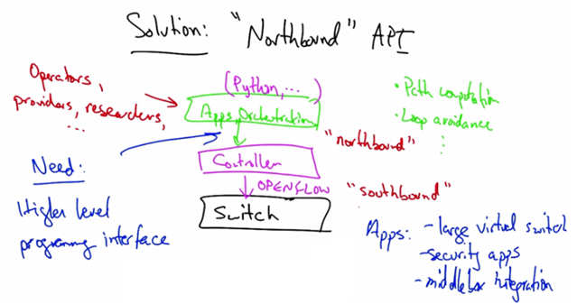

   Solution: "Northbound" API — Operators, providers, researchers write Apps in high-level
   languages (Python, ...). Apps talk to Controller via "northbound" API. Controller speaks
   OpenFlow "southbound" to Switch. Apps: large virtual switch, security apps, middlebox
   integration. Path computation, Loop avoidance.

The solution to this is to provide some kind of northbound API, which is a programming
interface that allows applications and other kinds of orchestration systems to program the
network. So where we have at the low-level the controller updating state in the switch using
OpenFlow flow modification rules, we may have applications or orchestration systems that need
to perform more sophisticated tasks, such as path computation, loop avoidance, and so forth.
But we need a higher-level programming interface that allows these applications to talk to the
controller so the application isn't writing low-level OpenFlow rules, but rather is expressing what
it wants to have happen in terms of higher-level behaviors without regard to such things as
whether or not the rules are being installed in a consistent, and correct fashion. Various people
may write these applications including network operators, service providers, researchers, and
really anyone who wants to develop capabilities on top of OpenFlow. The benefits of such a
northbound API are vendor independence, as well as the ability to quickly modify or customize
control through various popular programming languages. The idea is that these applications
might be written in high-level programming languages, such as Python, and wouldn't actually
have to perform low-level switch modifications, but rather could express policies in terms of
much higher-level abstractions. Examples of such applications include the implementation of a
large virtual switch abstraction, security applications, and services that may need to integrate
traffic processing with middle boxes. This programmatic interface is called the northbound API
and currently there's no standard for the northbound API, as there is for the southbound API in
OpenFlow. But we'll look at various APIs in programming languages that each compile to
OpenFlow rules that are installed on switches across the network.

Frenetic Language
------------------

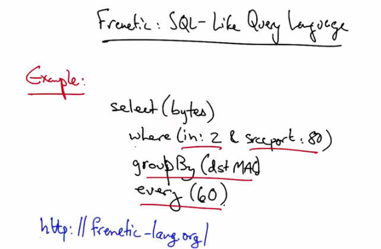

   Frenetic: SQL-Like Query Language — Example: select(bytes) where(in: 2 and srcport: 80)
   groupBy(dstMAC) every(60). See

One example of a programming language that sits on top of such a north-bound API is Frenetic,
which is an SQL-like query language. For example, Frenetic would allow a programmer to count
the number of bytes, grouped by destination Mac address, and report the updates to these
counters every 60 seconds. The "group by" statement allows a grouping of counts by the
destination mac address. "Where" allows restrictions to only count traffic coming from a web
server coming in on a particular port, and "every" specifies that the results of this query should
only be returned every 60 seconds. More information about Frenetic is available at frenetic-
lang.org. And in the course, we'll actually going to use a language called Pyretic that is based on
the same underlying theory as Frenetic, except that it's embedded in Python.

Overlapping Network Policies
------------------------------

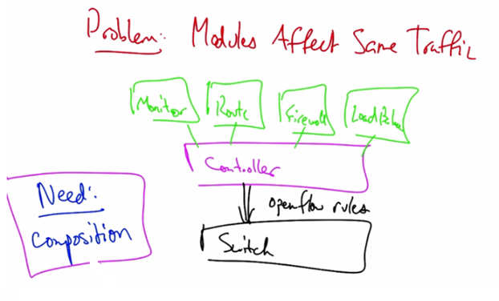

   Problem: Modules Affect Same Traffic — Monitor, Route, Firewall, LoadBal modules all feed
   into Controller → OpenFlow rules → Switch. Need: Composition.

One issue with programming at this higher level of abstraction is that an operator might write
multiple modules, each of which effects the same traffic. For example, an operator might write
an application that monitors traffic. Another one that specifies how routing should take place,
another that involves the specification of firewall rules And yet another that balances traffic load
across the links in the network. Ultimately, all of these applications, or modules, must be
combined into a single set of OpenFlow rules that together achieve the network operator's overall
goal. For this, we need composition operators, or ways that specify how these individual
modules should be combined or composed into a single coherent application. Let's now talk
about two different ways to compose policies.

Composing Network Policies with Pyretic
-----------------------------------------

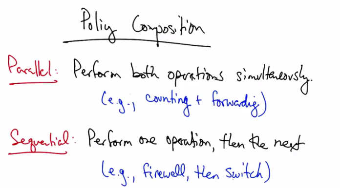

   Policy Composition — Parallel: Perform both operations simultaneously (e.g., counting +
   forwarding). Sequential: Perform one operation, then the next (e.g., firewall, then switch).

One way of composing policies is to perform both operations simultaneously. For example, one
might want to forward traffic but also count how much traffic is being forwarded. Both of those
operations can be performed in parallel. Another way of composing policies is in sequence.
Sequential composition performs one operation then the next. For example, we might want to
implement a firewall, and whatever traffic makes it though the firewall might then be subjected
to the switching policy.

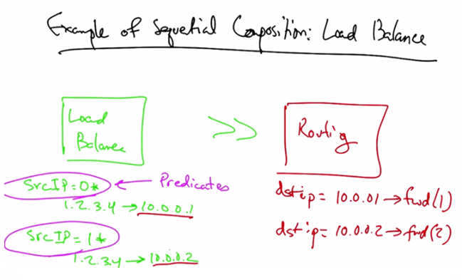

   Example of Sequential Composition: Load Balance >> Routing — Load Balancer uses
   predicates: SrcIP=0* → 1.2.3.4 → 10.0.0.1; SrcIP=1* → 1.2.3.4 → 10.0.0.2. Routing:
   dstIP=10.0.01 → fwd(1); dstIP=10.0.0.2 → fwd(2).

One example of sequential composition, might be a load balancer. In this example, a policy
might take some traffic coming from half of the source IP addresses and rewrite that to one
server replica, and take the other half of the traffic and rewrite it to the other replica. After the
load balancer rewrites the destination IP address, we need a routing module to forward the traffic
out the appropriate port on the switch. In this case, we've used sequential composition to first
apply a load balance policy that rewrites the destination IP address based on the source IP
address where the traffic is coming from and sequentially apply a routing policy that forwards
the traffic out the appropriate port depending on the resulting destination IP address after that
rewrite has taken place. Notice that we can use predicates to specify which traffic traverses
which modules. Those predicates can apply specific actions based on things like the input port
and the packet header fields. The ability to compose policies in this fashion allows each module
to partially specify functionality without having to write the policy for the entire network. This
leaves some flexibility so that one module can implement a small bit of the network function,
leaving some functions for other modules. This also allows for module re-use, since a module
need not be tied to a particular network setting. For example, in this particular example where
we've applied that load balancer followed by routing, the load balancer spreads traffic across the
replicas without regard to the underlying network paths that traffic takes once those destination
IP addresses are rewritten.

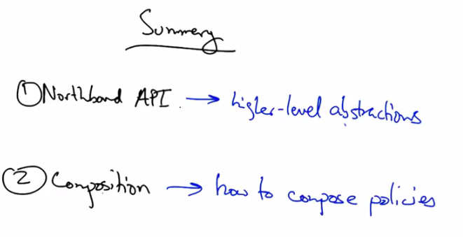

   Summary — (1) Northbound API → higher-level abstractions. (2) Composition → how to
   compose policies.

In summary, we've covered two concepts. One is the notion of a Northbound API, which sits on
top of an SDN controller and provides and exposes higher level abstractions that allows the
operator or programmer to write policies without regard to how OpenFlow rules eventually get
installed. We've also talked about two different composition operators. Parallel composition and
sequential composition, which specify how individual simpler policies can be composed to
implement more complex network applications, thus allowing different SDN control programs to
independently perform tasks on the same traffic.

Pyretic Language
-----------------

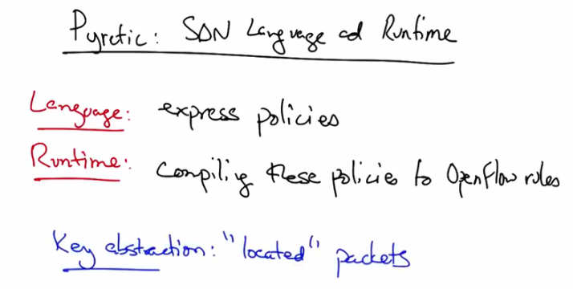

   Pyretic: SDN Language and Runtime — Language: express policies. Runtime: compiling these
   policies to OpenFlow rules. Key abstraction: "located" packets.

In this lesson we will look at Pyretic which is an SDN language and run time that implements
some of the composition operators that we discussed in the last lesson. The language is a way of
expressing these high level policies, and the run time provides the function of compiling these
policies to the OpenFlow rules that eventually are installed on the switches. One key abstraction
in Pyretic is the notion of located packets, the idea that we can apply a policy based on a packet
and its location in the network, such as the switch at which that packet is located or the port on
which that packet arrives.

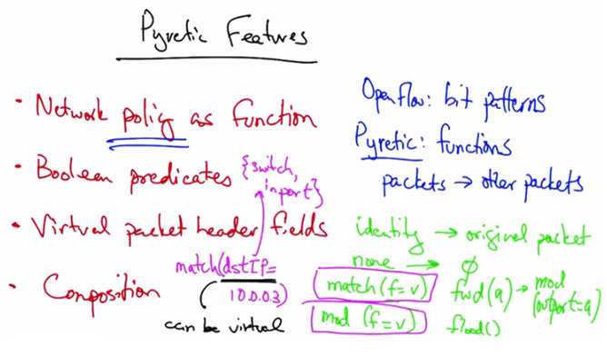

   Pyretic Features — Network policy as function (OpenFlow: bit patterns; Pyretic: functions
   packets → other packets). Boolean predicates {switch, inport}. Virtual packet header fields.
   Composition: match(dstIP=10.0.0.3) can be virtual. Functions: none/drop, match(f=v),
   mod(f=v), fwd(q), flood().

Pyretic offers several features. The first is the ability to take as input a packet and then return
packets at different locations in the network. This effectively allows the implementation of
network policy as a function that simply takes packets and returns other packets at different
locations. The second feature of Pyretic is the notion of Boolean predicates. Unlike OpenFlow
rules which do not permit the expression of simple conjunctions such as AND and OR, or
negations like NOT, Pyretic allows the expressions of policies in terms of these predicates.
Pyretic also provides the notion of virtual package header fields. Which allows the programmer
to refer to packet locations and also to tag packets so that specific functions can be applied at
different portions of the program. Pyretic also provides composition operators, such as parallel
and sequential composition, which we discussed in the last lesson. The notion of network policy
as a function contrasts with the OpenFlow style of programming. In OpenFlow, policies are
simply bit patterns, in other words, match statements for which matching packets are subject to a
particular action. These types of policies can be particularly difficult to reason about. In contrast,
in Pyretic, policies are functions that map packets to other packets. Some example functions in
Pyretic include the identify function, which returns the original packet; none or drop, which
returns the empty set; match, which returns the identity if the field f matches the value v and
returns none or drop otherwise; mod, which returns the same packet with the field f set to v;
forward, which is simply syntactic sugar on mod to say that the output port field in the packet
should be modified to the parameter specified; and flood, which returns one packet for each port
on the network spanning tree. In OpenFlow, packets either match on a rule or they simply fall
through to the next rule. So, OR, NOT, etc, can be tough to reason about. In contrast, Pyretic's
match function outputs either the packet or nothing, depending on whether the predicate is
satisfied. For example, we could apply a match statement that says match destination IP equals
10.0.0.3. and this function would take packets as input and only return packets that satisfy this
particular predicate. In addition to the standard packet header fields, Pyretic offers the notion of
virtual packet header fields, which is a unified way of representing packet metadata. In Pyretic,
the packet is nothing more than a dictionary that maps a field name such as the destination IP
address to a value. Now, these field names could correspond to fields in an actual packet header.
But they can also be virtual. For example, we could provide a match statement based on a switch,
indicating that we only want to return packets that are located at a particular switch or on the
input port, indicating that we only want to see packets whose attributes match a particular input
port. The match function matches on this packet meta-data and the mod function can modify this
meta-data.

Composing Network Policies with Pyretic
-----------------------------------------

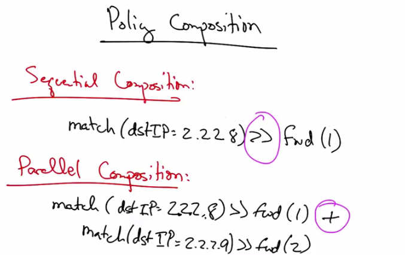

   Policy Composition — Sequential Composition: match(dstIP=2.2.2.8) >> fwd(1). Parallel
   Composition: match(dstIP=2.2.2.8) >> fwd(1) + match(dstIP=2.2.2.9) >> fwd(2).

Pyretic enables the notion of both sequential and parallel composition as we've discussed in
previous lessons. For example, we could match all packets for a particular destination IP address
and send them or forward them out a particular output port. The double greater than sign shown
here is the way of expressing sequential composition in Pyretic. Parallel composition allows two
policies to be applied in parallel. In this example, we match on a particular destination IP address
and subsequently forward the traffic out Output Port one. In Parallel, we apply a different set of
policies that match on a different source IP address and output the packets on a different output
port. In Pyretic, the plus operator performs parallel composition of policies.

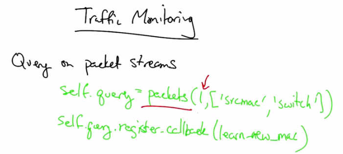

   Traffic Monitoring — Query on packet streams. self.query = packets(1, ['srcmac', 'switch']).
   self.query.register_callback(learn_new_mac). The packets query shows first packet per unique
   (srcmac, switch) pair.

Pyretic allows an operator to construct queries which allow the program to see packet streams.
For example, the packets query allows the operator to see packets arriving at a particular switch
with a particular source MAC address. The one parameter here indicates that we only want to see
the first packet that arrives with a unique source MAC address and switch. We can then register
callbacks for these packet streams that are invoked to handle each new packet that arrives for that
query.

Dynamic Policies in Pyretic
-----------------------------

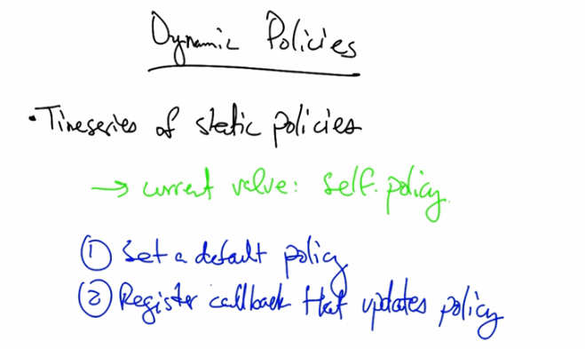

   Dynamic Policies — Timeseries of static policies. Current value: self.policy. (1) Set a default
   policy. (2) Register callback that updates policy.

Dynamic policies are policies whose forwarding behavior can change. They are represented as a
time series of static policies. The current value of the policy at any time is self dot policy. A
common programming idiom in Pyretic is to set a default policy and then register a call back that
updates that policy. In the assignment, you will create a similar topology that you created in the
pox assignment, but we will now use pyretic to implement a simple switch and firewall. In
pyretic every first packet with a new source MAC address at the switch is read by a query. The
policy is updated with a new predicate every time a new mapping between a MAC address and
an output port is learnt. In the assignment, you also create a dynamic firewall policy, register a
callback to check the rules, and sequentially compose your firewall policy with a learning switch,
thus provided as part of the pyritic distribution.

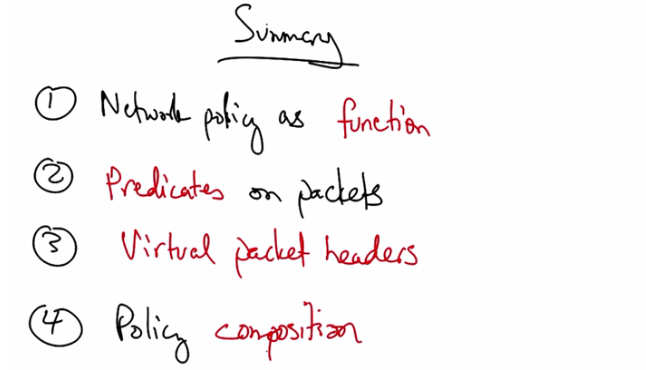

   Summary — (1) Network policy as function. (2) Predicates on packets. (3) Virtual packet
   headers. (4) Policy composition.

In summary, we've covered four key concepts in Pyretic. Network policy as a function, predicates
on packets for expressing complex match conditions, virtual packet headers as a unified way of
representing packet metadata including location information, and policy composition with both
parallel and sequential operators.
