Rate Limiting and Traffic Shaping
==================================

Lesson 2 Intro
--------------

TCP congestion control responds to interpreted network events like packet loss, but does not
provide a high-level control mechanism for congestion. In this section, we'll look at traffic
shaping and network measurement, which are important tools for operating the network.

Traffic Classification and Shaping
------------------------------------

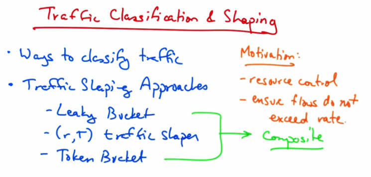

   Traffic Classification and Shaping — Ways to classify traffic. Traffic Shaping Approaches:
   Leaky Bucket, (r,T) traffic shaper, Token Bucket. Motivation: resource control, ensure flows
   do not exceed rate. Composite shaper combines approaches.

In this lesson we will talk about traffic classification and shaping. We'll first talk about different
ways to classify traffic, then we'll talk about different traffic shaping approaches, then we'll talk
about a traffic shaper called a leaky bucket traffic shaper, then we'll talk about an (r, T) traffic
shaper. Then we'll talk about a token bucket traffic shaper, and finally, we'll talk about how to
combine a token bucket shaper with a leaky bucket shaper to build what's called a composite
shaper. The motivation here is to control network resources and ensure that no traffic flow
exceeds a particular pre-specified rate.

Source Classification
---------------------

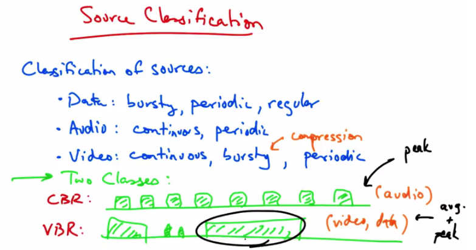

   Source Classification — Data: bursty, periodic, regular. Audio: continuous, periodic.
   Video: continuous, bursty, periodic (compression). Two Classes: CBR (constant bit rate,
   audio) — uniform packets. VBR (video, data) — variable with avg and peak rates.

Traffic sources can be classified in a number of ways. Data traffic might be bursty, it might be
weakly periodic, or it might also be regular. Audio traffic is typically continuous and strongly
periodic. Video traffic is continuous, but it's often bursty due to the nature of how video is often
compressed, as we saw in a previous lecture, and it may also be periodic. Typically, we think of
taking these sources and classifying them into two kinds of traffic. One is a constant bit rate
source or a CBR source. In a constant bit rate source of traffic, traffic arrives at regular intervals,
and packets are typically the same size as they arrive, resulting in a constant bit rate of arrival.
Audio is an example of a constant bit rate source. Many other sources of traffic are variable bit
rate or VBR. Video and data are often variable bit rate. Typically when we shape CBR traffic,
we shape it according to a peak rate. Variable bit rate traffic is shaped according to both an
average rate, and a peak rate, where the average rate might actually be a small fraction of the
peak rate. You can see that at certain times the peak rate might well exceed the average rate.
Let's now talk about how to perform traffic shaping in a number of different ways.

VBR Quiz
--------

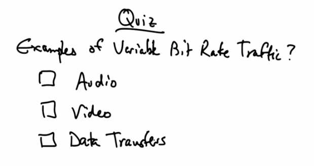

   Quiz — Examples of Variable Bit Rate Traffic? Options: Audio, Video, Data Transfers.

So what are some examples of variable bit rate traffic? Audio streams, Video streams, or Data
Transfers? Please check all that apply.

VBR Solution
------------

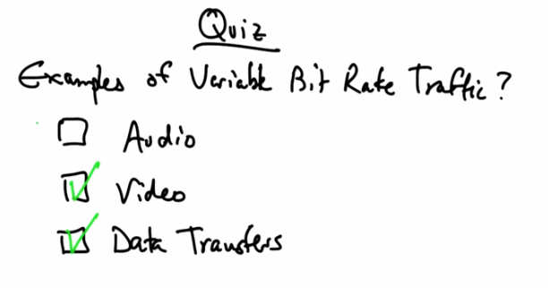

   Quiz Solution — Video (checked) and Data Transfers (checked) are examples of variable bit
   rate traffic. Audio tends to be constant bit rate.

Video streams and data transfers can be variable bit rate or bursty. Audio tends to be constant bit
rate with each packet being of a small, fixed packet size.

Leaky Bucket Traffic Shaping
------------------------------

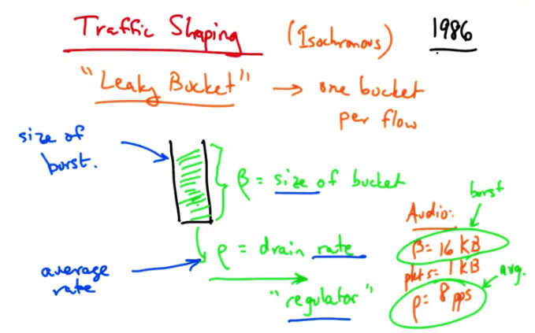

   Traffic Shaping (Isochronous) 1986 — "Leaky Bucket" → one bucket per flow. beta = size of
   bucket (burst size). rho = drain rate ("regulator"). Audio example: beta=16 KB (burst),
   pkt size=1 KB (avg), rho=8 pps.

One way of shaping traffic is with what's called a Leaky Bucket Traffic Shaper, where each flow
has its own bucket. In a Leaky Bucket Traffic Shaper, data arrives in a bucket of size beta and
drains from the bucket at rate rho. The parameter rho controls the average rate. Data can arrive
faster or slower into the bucket, but it cannot drain at a rate faster than rho. Therefore, the
maximum average rate that traffic can be sent is this smooth rate, rho. The size of the bucket
controls the maximum burst size that a sender can send for a particular flow. So even though the
average rate cannot exceed rho, at times, the sender might be able to send at a faster rate, as long
as the total size of the burst does not exceed the size of the bucket. Or does not overflow the
bucket. The leaky bucket allows flows to periodically burst, and the regulator at the bottom of
the leaky bucket ensures that the average rate does not exceed the drain rate of the bucket. For
example, for an audio application one might consider setting the size of the bucket to be 16
kilobytes. So packets of one kilobyte would then be able to accumulate a burst of up to 16
packets in the bucket. The regulator's rate of eight packets per second, however, would ensure
that the audio rate would be smooth to an average rate not to exceed 8 kilobytes per second or
64KBps. Setting a larger bucket size can accommodate a larger burst rate. Setting a larger value
of rho can accommodate or enable a faster packet rate. The leaky bucket traffic shaper was
developed in 1986 and soon to follow was a technique called (r, T) traffic shaping.

(r, T) Traffic Shaping
-----------------------

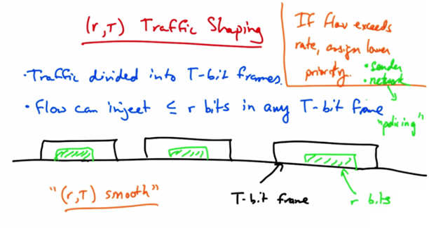

   (r,T) Traffic Shaping — Traffic divided into T-bit frames. A flow can inject <= r bits in any
   T-bit frame. "(r,T) smooth" traffic. If flow exceeds rate, assign lower priority at sender or
   network ("policing").

In (r, T) traffic shaping, traffic is divided into T-bit frames, and a flow can inject less than or
equal to r bits in any T-bit frame. If the sender wants to send more than one packet of r bits, it
simply has to wait until the next T-bit frame. A flow that obeys this rule has what is known as an
(r, T) smooth traffic shape. In the case of (r, T) smooth traffic shaping, one cannot send a packet
that's larger than r bits long. Unless T is very long, the maximum packet size may be very small.
So the range of behaviors is typically limited to fixed rate flows. Variable flows have to request
data rates that are equal to the peak rate, which is incredibly wasteful if you have to configure the
shaper such that the average must support whatever peak rate the variable rate flow may send.
The (r, T) traffic shaper is slightly relaxed from a simple leaky bucket because rather than
sending one packet every time unit, the flow can send a certain number of bits every time unit.
Now there's a question of what to do when a flow exceeds a particular rate. And typically what's
done is that if a flow exceeds its rate, the excess packets in that flow are given a lower priority,
and if the network is heavily loaded or congested, the packets from a flow that exceeds a rate
may be preferentially dropped. Priorities might be assigned at the sender, or at the network. At
the sender, the application may mark its own packet, since the application knows best which
packets may be less important. In the network, the routers may mark packets with a lower
priority, which is sometimes called policing.

Shaping Bursty Traffic Patterns (Token Bucket)
------------------------------------------------

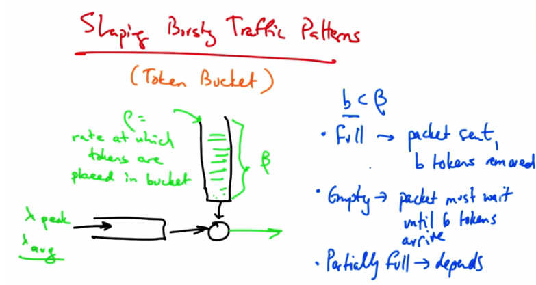

   Shaping Bursty Traffic Patterns (Token Bucket) — rho = rate at which tokens placed in
   bucket. beta = capacity of bucket. Traffic arrives at lambda_avg and lambda_peak. b < beta:
   if Full → packet sent, b tokens removed. Empty → packet must wait until b tokens arrive.
   Partially full → depends.

Sometimes we may want to shape bursty traffic patterns allowing for bursts to be sent on the
network, but still ensuring that the flow does not exceed some average rate. For this we might
use what's called a token bucket. In a token bucket, Tokens arrive in a bucket at a rate rho, and
beta is again the capacity of the bucket. Now, traffic may arrive at an average rate lambda_average,
and a peak rate lambda_peak. Traffic can be sent by the regulator as long as there are tokens in the
bucket. To consider the difference between a token bucket and a leaky bucket, consider sending
a packet of size b That's less than beta. If the token bucket is full, the packet is sent, and b tokens
are removed. If the bucket is empty though, the packet must wait until b tokens drip into the
bucket. If the bucket is partially full, well, then it depends. If the number of tokens in the bucket
exceed little b, then the packet is sent immediately. Otherwise we have to wait until there are
little b tokens in the bucket before we can send the packet.

Token Bucket vs Leaky Bucket
------------------------------

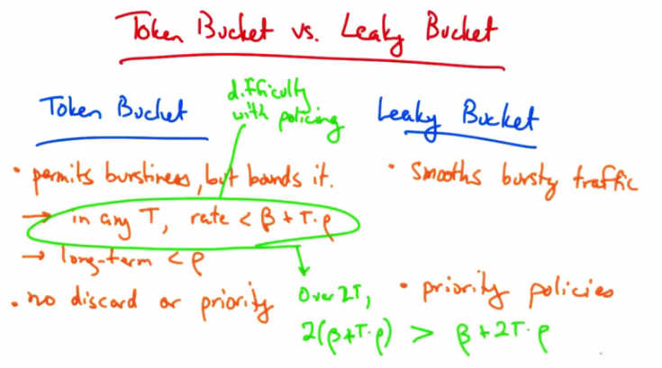

   Token Bucket vs. Leaky Bucket — Token Bucket: permits burstiness but bounds it. In any T,
   rate < beta + T*rho. Long-term < rho. No discard or priority. Difficulty with policing.
   Leaky Bucket: smooths bursty traffic. Priority policies. Over 2T: 2(beta+T*rho) > beta+2T*rho.

Let's compare the difference between a token bucket and a leaky bucket. The token bucket
permits traffic to be bursty, but it bounds it by the rate rho. On the other hand, a leaky bucket
simply forces the bursty traffic to be smoothed. The bound in a token bucket is as follows. If our
bucket size is beta, then we know that in any interval T, then the rate is always less than beta,
that is, the maximum number of tokens that can be accumulated in the bucket, plus the rate at
which tokens accumulate, times that time interval. We also know that the long term rate will
always be less than rho. Token buckets have no discard or priority policies, whereas leaky
buckets typically implement priority policies for flows that exceed the smoothing rate. Both are
relatively easy to implement, but the token bucket is a little bit more flexible since it has some
additional parameters that we can use to configure burst size. One of the limitations of token
buckets is the fact that in any traffic interval of length T, the flow can send beta plus T times rho
tokens of data. If a network tries to police the flows by simply measuring their traffic over
intervals of length T, the flow can cheat by sending this amount of data in each interval.
Consider, for example, an interval of twice this length. Well, if the flow can send beta plus T
times rho in each interval, then over 2T the flow can consume 2 times beta plus tau times rho
tokens. But actually this is greater than how much the flow is actually supposed to be able to
send which is beta plus 2T times rho. So policing traffic being sent by token buckets is actually
rather difficult. So, token buckets allow for long bursts, and if the bursts are of high priority
traffic, they are difficult to police and may interfere with other high priority traffic. So there's
some need to limit how long a token bucket sender can monopolize the network.

Policing With Token Buckets
-----------------------------

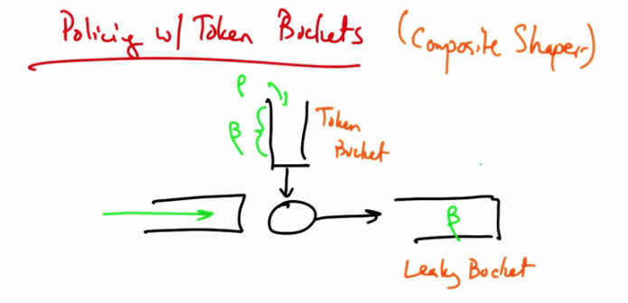

   Policing with Token Buckets (Composite Shaper) — Token Bucket (rho, beta) feeds into
   Leaky Bucket (beta) regulator. Combination allows good policing with controlled burst size.

So, to apply policing to Token Buckets, what's often done is to use what's called a Composite
Shaper, which is to combine a Token Bucket Shaper with a Leaky Bucket. The combination of
the Token Bucket Shaper with the Leaky Bucket Shaper allows for good policing. Confirming
that the flow's data rate does not exceed the average data rate allowed by the smooth Leaky
Bucket is easy, but, the implementation is more complex since each flow now requires two
counters and two timers. One timer and one counter for each bucket.

Token Bucket Shaper Quiz
-------------------------

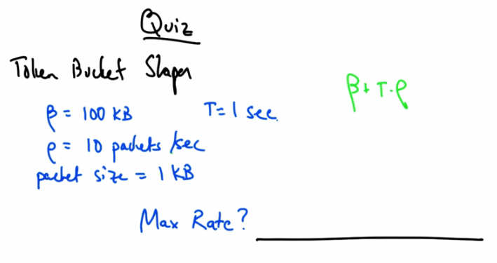

   Quiz — Token Bucket Shaper: beta = 100 kB, T = 1 sec, rho = 10 packets/sec, packet size
   = 1 kB. Max Rate? Formula: beta + T*rho.

So as a quick quiz, suppose that we have a token bucket shaper, and suppose that the size of the
bucket is 100 kilobytes, that rho is ten packets per second, and that packets are one kilobyte.
Assume also that we are talking about an interval of one second. Remember than in any given
interval, a flow can never send more than beta plus tau times rho bits of data. Please give your
answer in kilobits per second. Keeping in mind that one byte is eight bits.

Token Bucket Shaper Solution
------------------------------

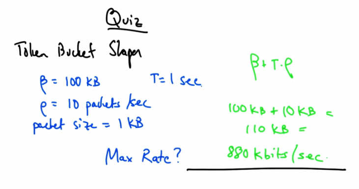

   Quiz Solution — beta = 100 kB, T = 1 sec, rho = 10 packets/sec (= 10 KB/sec). Max Rate =
   100 kB + 10 kB = 110 kB = 880 kbits/sec.

So the maximum rate would be 100 kilobytes times 1 second plus 10 packets per second times
10 kilobytes, or 110 kilobytes, which is 880 kilobits in one second.

Power Boost
-----------

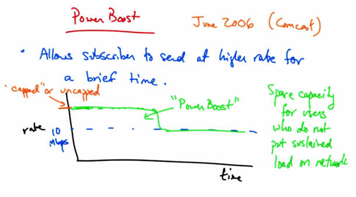

   Power Boost (June 2006, Comcast) — Allows subscriber to send at higher rate for a brief
   time. "capped" or "uncapped." Rate shows 10 Mbps sustained with "Power Boost" burst
   above. Spare capacity for users who do not put sustained load on network.

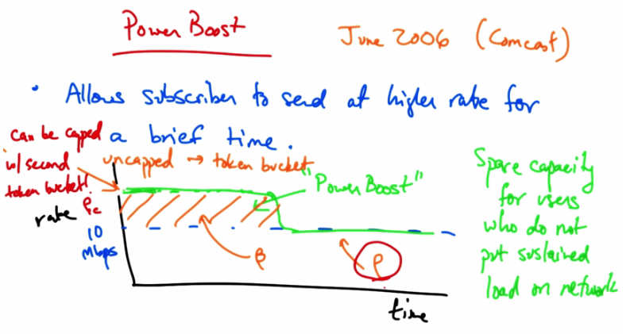

   Power Boost token bucket diagram — Can be capped (w/ second token bucket) or uncapped
   (token bucket only). Shows rate Pc, sustained rate 10 Mbps, bucket size beta, and time axis.
   Spare capacity for light users.

In this lesson we'll talk about Power Boost which is a traffic shaping mechanism that was first
deployed in commercial broadband networks in June 2006 by Comcast. The Power Boost allows
a subscriber to send at a higher rate for a brief period of time. So if you subscribed at a rate of ten
megabits per second, then Power Boost might allow you to send at a higher rate for some period
of time before being shaped back to the rate at which you were subscribed at. So, Power Boost
targets the Spare Capacity in the network for use by subscribers who don't put a sustained load
on the network. There are two types of Power Boosts. If the rate at which the user can achieve
during this burst window is set to not exceed a particular rate. Then we say that the policy is
capped Power Boost, otherwise the policy, or the shaping, is called uncapped Power Boost. Now
in the uncapped setting, the configuration is simple and as we described in the last lesson. The
area here is the Power Boost bucket size. That's the maximum amount of traffic that can be sent
that exceeds the sustained rate. The maximum sustained traffic rate is simply Rho, as we've
defined it before.

Now suppose that we wanted to cap the rate that the sender could send during the power boost
window. Well all we need to do in that case is to simply apply a second token bucket with
another value of Rho. That token bucket limits the peak sending rate for Power Boost eligible
packets to the rate Rho C, where Rho C is larger than Rho. Remember that this value of Rho also
affects how quickly tokens can refill in the bucket, so it also plays the role in the maximum rate
that can be sustained during a power boost window.

Calculating Power Boost Rates
------------------------------

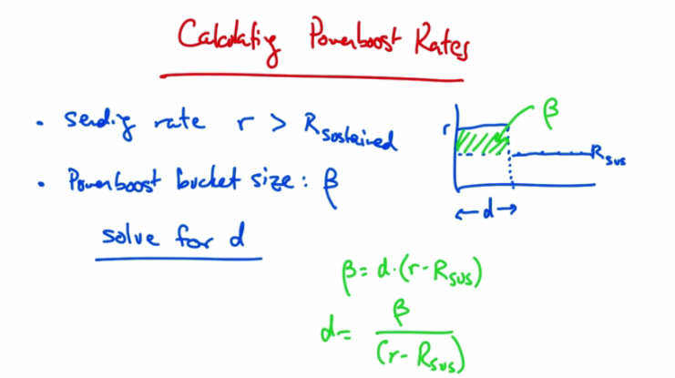

   Calculating Power Boost Rates — Sending rate r > R_sustained. Power boost bucket size: beta.
   Solve for d (duration). beta = d * (r - R_sus). Therefore d = beta / (r - R_sus). Diagram
   shows shaded region of excess sending above R_sus.

Suppose that a sender is sending at some rate r, which is bigger than the sustained rate R that
they are allowed to be sending it, and suppose that our bucket size is beta. Then how long can a
sender send at the rate r that exceeds the sustained rate? In other words, what is the value of d?
We know that the bucket size, beta, as shown in the shaded green area, is simply d times r minus
the sustained rate R. So a sender can send at the rate, little r, that exceeds the sustained rate, R,
for beta divided by r minus R sustained. Now based on what we've learned here, let's just take a
quick quiz.

Power Boost Quiz
----------------

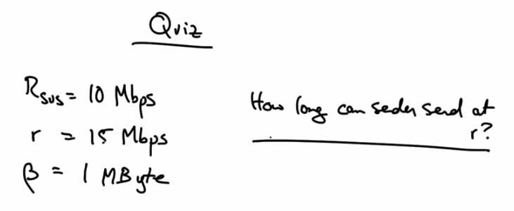

   Quiz — R_sus = 10 Mbps, r = 15 Mbps, beta = 1 MByte. How long can sender send at r?

Suppose that the sustained rate that a subscriber subscribes to is ten megabits per second, but
they like to burst at a rate of fifteen megabits per second. Suppose that the bucket size is one
megabyte or eight megabits. How long can the sender send at the higher rate? Please give your
answer in decimal form in seconds.

Powerboost Solution
--------------------

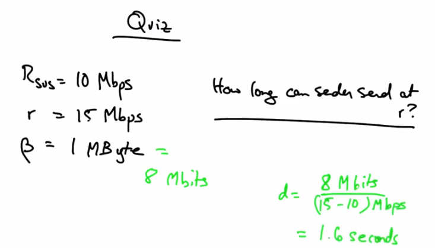

   Quiz Solution — R_sus = 10 Mbps, r = 15 Mbps, beta = 1 MByte = 8 Mbits. d = 8 Mbits /
   (15-10) Mbps = 1.6 seconds.

One megabyte is eight megabits, and from our previous calculation, we know that the duration
should be eight megabits, over five megabits per second, or 1.6 seconds.

Examples of Powerboost
-----------------------

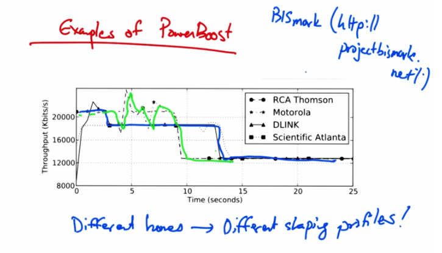

   Examples of PowerBoost — Bismark (http://projectbismark.net/). Graph shows throughput
   (Kbits/s) vs Time (seconds) for four different cable modems (RCA Thomson, Motorola,
   DLINK, Scientific Atlanta). Different homes → Different shaping profiles!

In the Bismark Project at Georgia Tech, which you can go check out at http://projectbismark.net,
we've done some measurements of Comcast Power Boosts in different home networks. Here are
some real world examples of Power Boost's traffic shaping profile in four different home
networks, each with a different cable modem as shown in the caption. You can see that different
homes exhibit different shaping profiles. Some have a very steady pattern whereas others have a
more erratic pattern. Interestingly you can see in some cases that there appear to be two different
tiers of higher throughput rates.

Effects on Latency
------------------

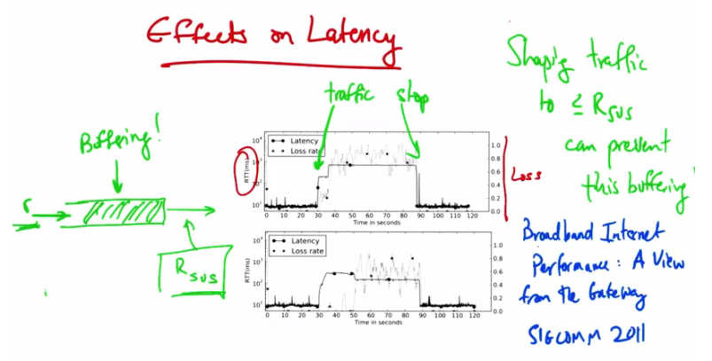

   Effects on Latency — Traffic stop/start with shaping. Two graphs show Latency and Loss
   rate vs Time (seconds) for two users. Shaping traffic to <= R_sus can prevent this buffering.
   Reference: "Broadband Internet Performance: A View from the Gateway" SIGCOMM 2011.
   Buffering! indicated when r > R_sus fills buffers.

Power Boost also has effect on the latency that uses perceive, as well as the loss rate. Here we've
shown Power Boost latency effect for two different users. The latency is shown in terms of round
trip time in milliseconds and the loss rates are shown on the right side of the Y axis. Latencies
are also shown in a log scale. In this particular experiment, we start sending traffic here and we
stop sending traffic here, in both cases. We can see that, even though power boost allows you to
just send at a higher traffic rate, actually users may experience high latency and loss over the
duration that they're sending at a higher rate. The reason for this is that the access link may not
be able to support the higher rate. So if a sender can only send at R sustained for an extended
period of time but is allowed to burst at a rate r for some shorter period of time, then buffers may
fill up and the resulting buffers may introduce additional delays in the network since packets are
being buffered up rather than dropped. TCP senders can continue to send at higher rates, such as
little r, without seeing any packet loss even though the access link may not be able to send at that
higher rate. As a result, packets buffer up and users see higher latency over the course of the
power boost interval. To solve this problem, you might imagine instead that a sender might
shape it's rate never to exceed the sustained rate, big R. If it did this, then it could avoid seeing
these latency effects. So, certain senders who are more interested in keeping latency under
control than they are in sending at bursty volumes, may wish to run a traffic shaper in front of a
power boost enabled link. So shaping traffic to a rate of less than this sustained rate R can
prevent this buffering. More details about power boost and the experiments that we've run to
keep latency under control in its presence are available in a paper we wrote called Broadband
Internet Performance, A View from the Gateway. Which appeared in Sigcomm 2011.

Buffer Bloat
------------

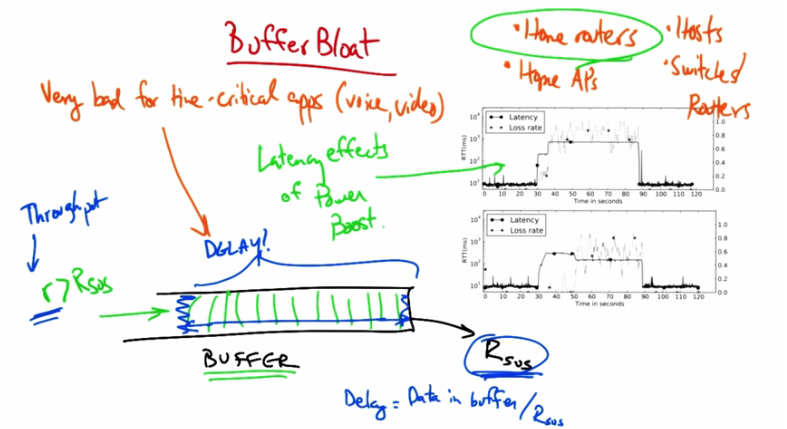

   Buffer Bloat — Very bad for time-critical apps (voice, video). Throughput r > R_sus fills
   large BUFFER draining at R_sus. Delay = Data in buffer / R_sus. Occurs in home routers,
   home APs, hosts, switches, routers. Latency effects of Power Boost shown.

In this lesson, we will talk just briefly about buffer bloat. We saw an example of buffer bloat in
the last lesson where we explored the latency effects of power boost. In the example we
explored, the sender could send at a rate r that was bigger than the sustained rate R without
seeing packet loss. Now if there's a buffer in the network that can support this higher rate, what
we'll see is that buffer will start filling up with packets. But this buffer can still only drain at the
sustained rate R. So even though the sender might be able to send at a faster rate for a brief
period of time in terms of throughput, all of those packets that the sender sent at that faster rate
are queued up in line waiting to be sent. As these packets are waiting in this buffer, they'll see
higher delays than they would see if they simply arrived at the front of the queue and could be
sent immediately. The delay that the packet will see in the buffer is the amount of data in the
buffer divided by the rate that the buffer can drain. These large buffers can introduce delays that
ruin the performance for time-critical applications such as voice and video. These large buffers
actually show up all over the place: in home routers, in home WiFi devices or access points, in
hosts on device drivers, and also in switches and routers. Let's take an example of buffer bloat
that we observed in home routers as part of the Bismarck study that I described in the last lesson.

Buffer Bloat Example
--------------------

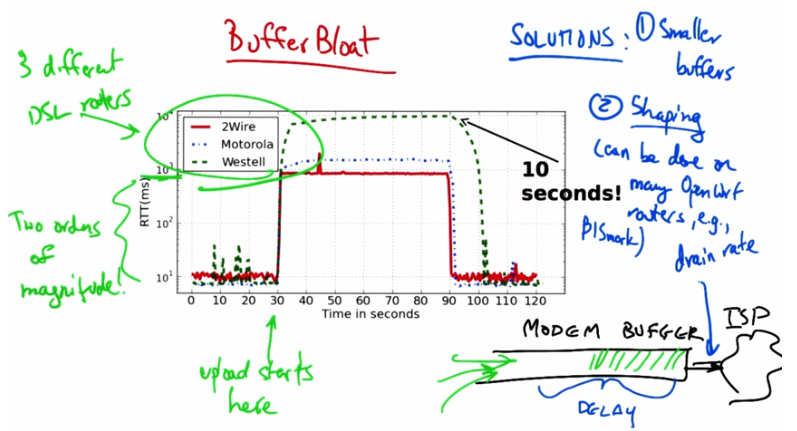

   Buffer Bloat Example — 3 different DSL routers (2Wire, Motorola, Westell). RTT (ms) vs
   Time (seconds). Upload starts at ~30 sec → latency jumps two orders of magnitude (up to 10
   seconds!). Modem Buffer + ISP delay shown. Solutions: (1) Smaller buffers, (2) Shaping
   (drain rate, BISmark routers).

In the example we've shown here, we have three different DSL routers. The y axis shows the
round trip time, or the latency to a nearby server in milliseconds, and is again shown in a log
scale. We started an upload at the time 30 seconds shown on the plot. Now you can see that
different modems experience a huge increase in latency when we start this upload. Some of them
experience a latency of as much as one second, up from a typical latency of about ten
milliseconds. One particular modem saw a round trip latency of as high as ten seconds during
uploads. Now to remind you what's going on here, is that the modem itself has a buffer. Your
ISP may be upstream of that buffer, and your access link may be draining that buffer at a certain
rate. TCP senders in your home will send until they see lost packets, but if the buffer's large, the
senders won't actually see those lost packets until this buffer has already filled up. The senders
continue to send at increasingly faster rates until they see a loss. As a result, packets that are
arriving at this buffer see increasing delays, and senders continue to send at faster rates, because
without packet loss they don't have a signal to slow down. There's several solutions to the buffer
bloat problem. One is obviously to use smaller buffers, but given that we have a lot of deployed
infrastructure, simply reducing the buffer size in deployed routers, modems, switches, home Wi-
Fi devices, and so forth, is a tall order. The other thing that we can do is to use the traffic shaping
methods that we have learned about. Consider that the buffer drains at a particular rate, which in
this case is the rate of the uplink to the ISP. If we shape traffic such that traffic coming into the
access link never exceeds the uplink that the ISP has provided us, then the buffer will never fill.
Thus, by shaping traffic at the home router such that the rate that traffic is sent to the ISP never
exceeds the rate of the uplink, the modem buffer will never actually fill up. This type of shaping
can be done on many open WRT capable routers, including the Bismark routers that we've
developed here at Georgia Tech.

Network Measurement
--------------------

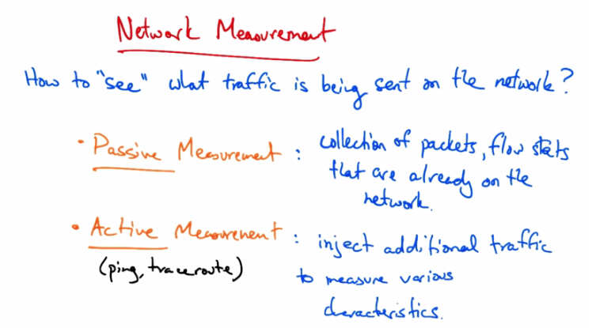

   Network Measurement — How to "see" what traffic is being sent on the network? Passive
   Measurement: collection of packets, flow stats already on the network. Active Measurement
   (ping, traceroute): inject additional traffic to measure various characteristics.

In this lesson we'll be talking about network measurement, or how to see what traffic is being
sent on the network. There are two types of network measurement. One is passive measurement.
In passive measurement we collect packets, flow statistics, and so forth, of traffic that is already
being sent on the network. So, this might include packet traces, flow statistics, or application
level logs. In active measurement, we inject additional traffic into the network to measure
various characteristics of the network. So we've seen some examples of active measurement
already, such as in the previous lessons where we actively sent traffic on the network to measure
speeds of downloads. Other common active measurement tools include those such as ping, and
traceroute. Ping is often used to measure the delay to a particular server, and traceroute is often
used to measure the network level, or the IP level path between two hosts on the network.

Why Measure
-----------

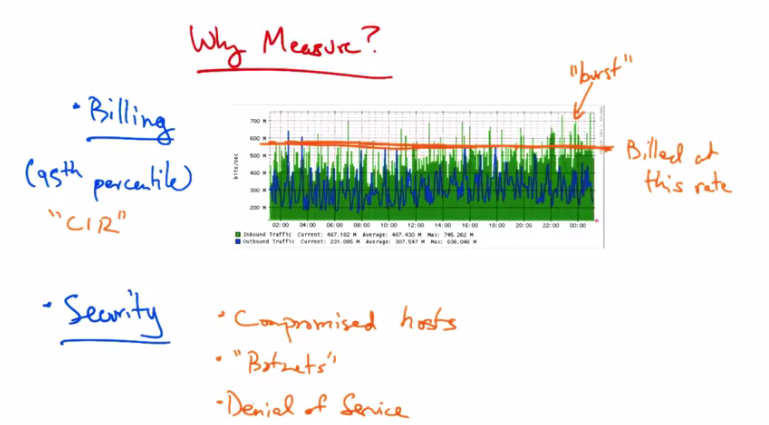

   Why Measure? Billing (95th percentile) "CIR" — Graph shows inbound/outbound traffic
   volume on GT campus link with 95th percentile billing line. Security: Compromised hosts,
   "Botnets", Denial of Service.

So why do we want to measure the traffic on the network? One reason might be billing. So for
example, we might want to charge a customer based on how much traffic they've sent on a
network. In order to do so, we need to passively measure how much traffic that customer is
sending. Here's an example of measurements of inbound and outbound traffic volumes on a link
on the Georgia Tech campus network. The Y axis is shown in bits per second, and the X axis is
the time of day. Now, a user might be billed based on how much traffic they send on the
network. A common mode of billing is called 95th Percentile billing, where a customer pays for
what's called a committed information rate, or CIR, and throughput is measured every five
minutes. The customer, then, may be billed on the 95th percentile of these five minute samples.
So if we were to bill on the 95th percentile of inbound traffic, we might approximate that 95th
percentile by the orange line I've drawn here. And the customer might be billed at this rate, even
though they're allowed to sometimes burst at higher rates. Another common reason to measure is
security. For example, network operators may want to know the type of traffic that's being sent
on the network so they can detect rogue behavior. A network operator may want to measure
traffic on the network to detect compromised hosts or the presence of Botnets or Denial of
Service attacks, two phenomena that we'll talk about later on in the course. For the rest of this
lesson, since we focused a lot on performance measurement already, I will mainly focus on
passive traffic data measurement.

How to Measure (Passively)
---------------------------

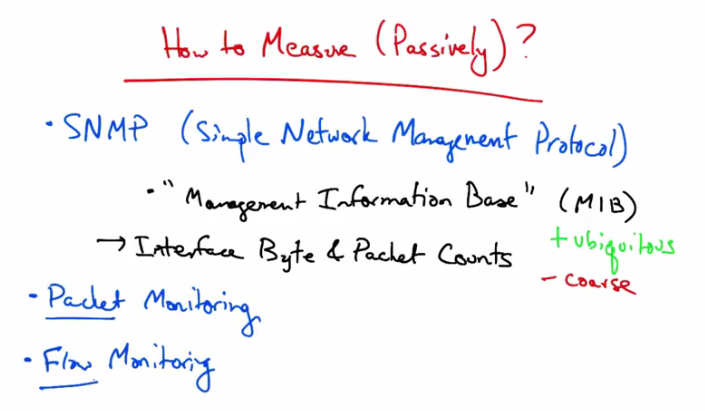

   How to Measure (Passively)? SNMP (Simple Network Management Protocol) — "Management
   Information Base" (MIB) → Interface Byte and Packet Counts. + ubiquitous, - coarse. Packet
   Monitoring. Flow Monitoring.

Let's talk about how to perform passive Network Traffic Management. One way to do this is
using the Packet and Byte Counters provided by the Simple Network Management Protocol.
Many network devices provide what's called a Management Information Base, or a MIB that can
be polled or queried for particular information. One common use for SNMP is to poll a particular
Interface on a Network Device for the number of Bytes or Packets that it sent. By periodically
polling, we can then determine the rate at which Traffic is being sent on a link by simply taking
the difference in these Packet and Byte Counters over particular intervals. The advantage of
SNMP is that it's fairly ubiquitous. It's supported on essentially all Networking Equipment and
there are many products for polling and analyzing SNMP data. On the other hand, it's fairly
coarse and you cannot express complex queries on the data. It's coarse in the sense that because
we are just polling Byte or Packet Counts on the Interface, we can't ask specific questions such
as how much traffic has been sent by a particular host or by a particular flow. Two other ways to
measure passively are by monitoring at a packet granularity, whereby monitors can see full
packet contents or at least headers, or at a flow level where a monitor may see specific statistics
about individual flows in the network. Let's now talk a little bit about packet and Flow
Monitoring.

Packet Monitoring
-----------------

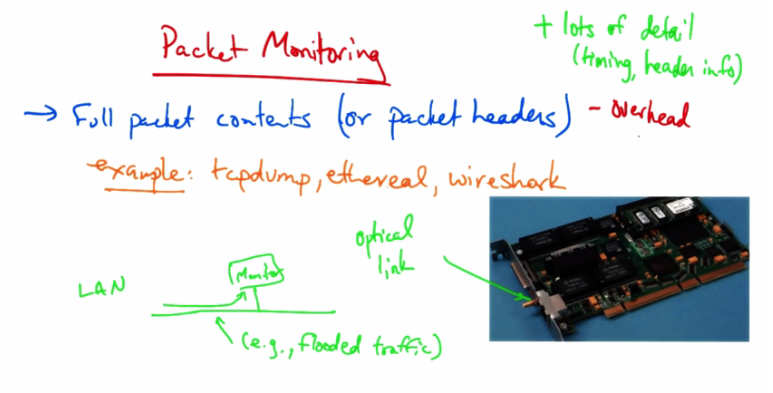

   Packet Monitoring — Full packet contents (or packet headers) - Overhead. Examples:
   tcpdump, ethereal, wireshark. LAN → Monitor on optical link (e.g., flooded traffic). Hardware
   monitoring card shown. + lots of detail (timing, header info). - Overhead.

So in packet monitoring, a monitor might see the full packet contents, or at least the packet
headers that traverse a particular link. Common ways of performing packet monitoring that you
may have tried yourself include tcpdump, ethereal, or wireshark. And in some of the exercises,
you'll get a chance to explore packet monitoring with one of these tools. Sometimes packet
monitoring is performed using expensive hardware that can be mounted in servers alongside the
router that forward traffic through the network. In these cases, an optical link in the network is
sometimes split so that traffic can be both sent along the network and sent to the monitor. Even
though packet monitoring sometimes requires this expensive hardware on very high speed links,
what you do when you run tcpdump or wireshark or ethereal is essentially the same thing. Your
machine acts as a monitor on the local area network. And if any packets happen to be sent
towards your network interface, the network interface records those packets. Now on a switch
network, you wouldn't see many packets that weren't destined for your own mac address. But on
a network where there's a lot of traffic being flooded, you might see quite a bit more traffic
destined for an interface that you're using to monitor. So the advantages of packet monitoring is
that it provides lots of detail. You can see timing information and information in the packet
headers. Unfortunately, a disadvantage is that it's fairly high overhead. It is very hard to keep up
with high speed links and often requires a separate monitoring device such as the monitoring
card that we've shown here. What if we are happy with a little less detail than packet monitoring
can provide, but we can't afford its overhead? In that case, there is actually another approach that
we can use called flow monitoring.

Flow Monitoring
---------------

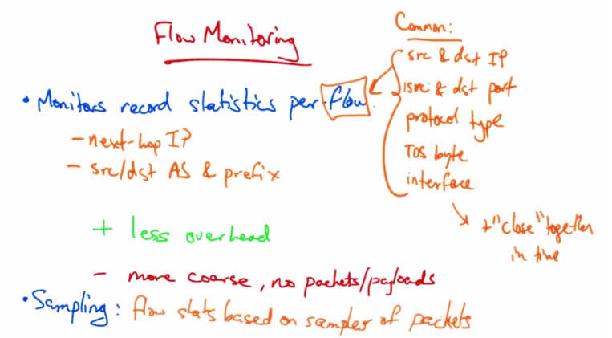

   Flow Monitoring — Monitors record statistics per flow. Common fields: src and dst IP, src
   and dst port, protocol type, TOS byte, interface. Also: next-hop IP, src/dst AS and prefix.
   + less overhead. - more coarse, no packets/payloads. Sampling: flow stats based on samples
   of packets.

In flow monitoring, a monitor which might actually be running on the router itself, records
statistics per-flow. A flow consists of packets that share a common source and destination IP
address, source and destination port, protocol type, TOS byte, and interface on which the packets
arrive. A flow monitor can then record statistics for a flow that's defined by the group of packets
that share these features. The flow records may also contain additional information, such as the
next hop IP address and other information related to routing, such as the source and destination
AS on which those packets appear to be coming from and going to, based on the routing tables,
as well as the prefix that those packets matched in the routing table. Flow monitoring is much
less overhead than packet monitoring, but it's also much more coarse than packet monitoring
because the monitor does not see individual packets or payloads. Therefore, it's impossible to get
certain information from flow monitoring such as packet timing information. In addition to
grouping packets into flows based on the fact that they share common elements in their headers,
typically packets are grouped into flows if they occur close together in time. So, for example, if
packets that share common sets of header fields do not appear for a particular time interval, such
as 15 or 30 seconds, the router simply declares the flow to be over, and sends a flow record to the
monitor based on the group of packets that it's seen up to that point. Sometimes, to reduce
monitoring overhead, flow level monitoring may also be accompanied with sampling. Sampling
builds flow statistics based only on samples of the packets. So, for example, flows may be
created based on one out of every ten or 100 packets, or a packet might be sampled with a
particular probability and flow statistics might only be tabulated based on the packets that end up
being sampled randomly from the total set of packets.

Passive Traffic Monitoring Quiz
---------------------------------

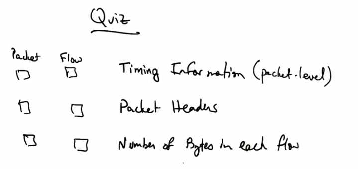

   Quiz — Which passive traffic monitoring method (Packet or Flow) can provide: Timing
   Information (packet-level), Packet Headers, Number of Bytes in each flow? Check all that
   apply.

So as a quick review, which of the following passive traffic monitoring methods, packet or flow
sampling, can provide the following information? Timing information about packets, packet
headers, and the number of bytes that each flow sends? Please check all boxes that apply.

Passive Traffic Monitoring Solution
-------------------------------------

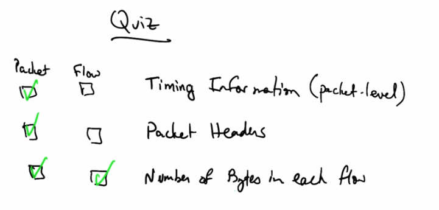

   Quiz Solution — Timing Information: Packet only (checked). Packet Headers: Packet only
   (checked). Number of Bytes in each flow: Both Packet and Flow (checked). Only packet
   monitoring provides timing and header detail; both provide byte counts per flow.

Only packet monitoring can provide timing information on a packet level, or packet headers. But
both methods can actually provide the number of bytes in each flow. By definition, flow records
record the number of bytes in each flow as an aggregate statistic, but if you had packet-level
information, you could, of course, compute the statistic yourself.
