Router Design Basics
====================

Router Design
-------------

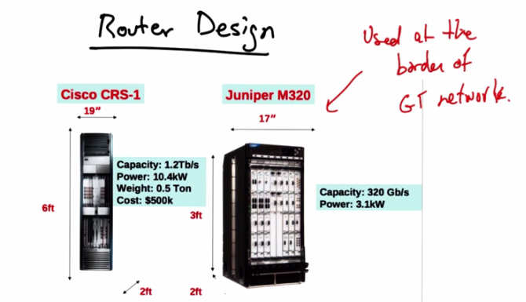

   Router Design — Cisco CRS-1 (left, 6ft tall, 19" wide, Capacity 1.2 Tb/s, Power 10.4 kW,
   Weight 0.5 Ton, Cost $500k) and Juniper M320 (right, 17" wide, 3ft, Capacity 320 Gb/s,
   Power 3.1 kW), used at the border of the GT network.

In this lesson, we will cover the design of big, fast, modern routers. Here's a picture of two
modern router chassis. On the left, we have a picture of the Cisco CRS-1, and on the right, we
have a picture of the Juniper M320. The M320 has for some time been used at the border of the
Georgia Tech network between Georgia Tech and the rest of the Internet.

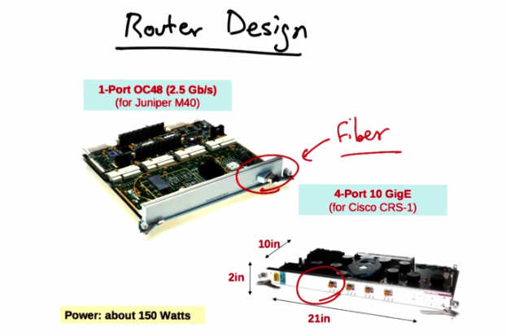

   Router Design — Line cards: 1-Port OC48 (2.5 Gb/s) for Juniper M40 (fiber), and 4-Port
   10 GigE for Cisco CRS-1. Power: about 150 Watts. Cards are approximately 10in x 21in x 2in.

Here's a picture of a couple of line cards that go into these chassis. These kind of look like
network interface cards, except the ports are special. Instead of terminating Ethernet, these ports
terminate high capacity fiber links. As you can see, these cards are actually a whole lot bigger
than your typical network interface card as well. And, as a result, these chassis are often
anywhere from three to six feet tall, and can fill up an entire rack.

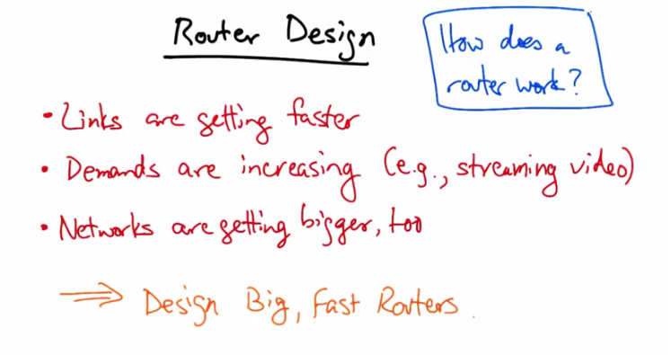

   Router Design motivation notes — Links are getting faster. Demands are increasing (e.g.,
   streaming video). Networks are getting bigger, too. => Design Big, Fast Routers. How does a
   router work?

There's a significant need for big, fast routers. Links are getting faster. Traffic demands are also
increasing, particularly with the rise of demanding applications, such as streaming video.
Networks are getting bigger too, in terms of the number of hosts, routers, and users. So there's a
perennial need to design big, fast routers, particularly in Internet backbone networks. The rest of
this lesson will focus on how a router works, in particular, how it goes from the process of taking
a packet as input and sending it on to where it needs to go. The Internet's routing protocols, of
course, are responsible for populating the forwarding tables on a router. But once those tables are
populated, the router still has the hard job of taking a packet as input and ultimately getting it to
the appropriate output port, so that the traffic can proceed en route to the destination.

Basic Router Architecture
-------------------------

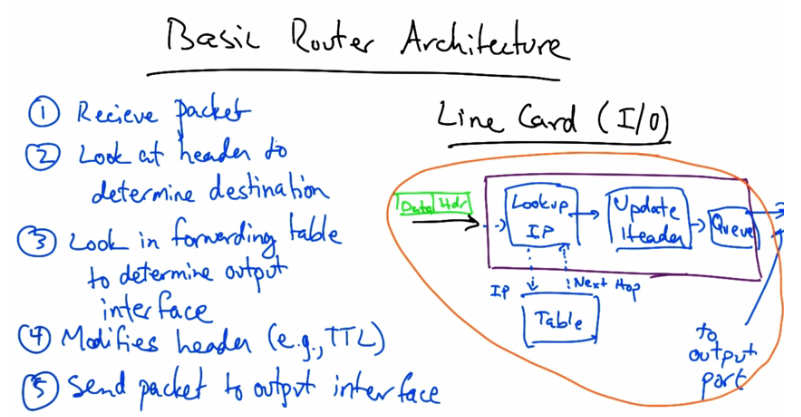

   Basic Router Architecture — Line Card (I/O): (1) Receive packet, (2) Look at header to
   determine destination, (3) Look in forwarding table to determine output interface, (4) Modifies
   header (e.g., TTL), (5) Send packet to output interface. Components: Datagram, Lookup IP,
   Update Header, Queue, IP Next Hop Table, to output port.

Let's take a look at a generic router architecture. As a summary of basic router function, a router
receives a packet. It then looks at the packet header, to determine the packet's destination. It
looks in the forwarding table to determine the appropriate output interface for the packet. It
modifies the packet header, such as decrementing the time to live field and updating the IP
header check sum appropriately. And finally, it sends the packet to the appropriate output
interface. The basic I/O component of a router architecture is the line card, which is the interface
by which a router sends and receives data. When a packet arrives, the line card looks at the
header to determine the destination, and then it looks in the forwarding table to determine the
output interface. It then updates the packet header and finally sends the packet to the appropriate
output interface. Now this drawing shows just a single line card. But in fact, when the packet is
sent to the output interface, it must traverse the router's interconnection fabric, to be sent to the
appropriate output port.

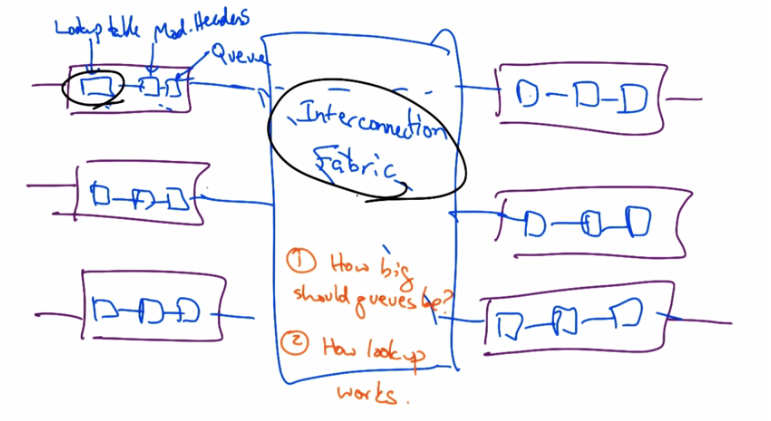

   Router architecture with multiple line cards connected via Interconnection Fabric. Each line
   card has Lookup Table, Mod. Headers, and Queue. Questions noted: (1) How big should queues
   be? (3) How lookup works.

So in fact, we can zoom out from that depiction of a single line card, and what we have is a
bunch of line cards that are all connected via an interconnection fabric. Each of these line cards
has a lookup table, the capability to modify headers, and a queue, or buffer, for packets as they
enter and leave the line card. In other lessons we talk about several important questions such as
how big queues should be and how lookup works. In the rest of this lesson, I'll discuss important
decisions in router design such as the placement of lookup tables on each line card and the
design of the interconnection fabric.

Each Line Card Has Own Forwarding Table Copy
---------------------------------------------

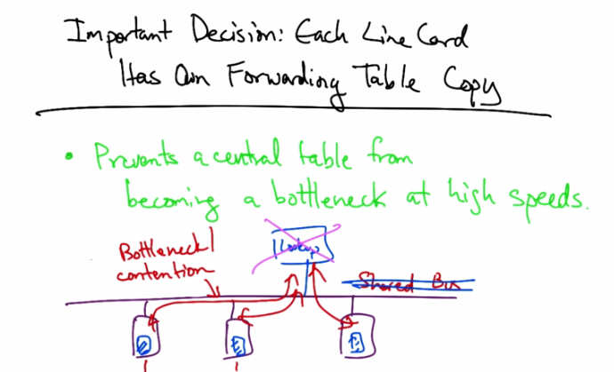

   Important Decision: Each Line Card Has Own Forwarding Table Copy — Prevents a central
   table from becoming a bottleneck at high speeds. Bottleneck/contention shown with Lookup
   and Shared Bus architecture that was replaced.

One important decision in the design of the modern routers was to place a copy of the forwarding
table on each line card in the router. Well, this introduces some complications in making copies
of the forwarding table. Doing so prevents a central table on the router from becoming a
bottleneck at high speeds. Consider an alternative where the router has only one copy of the
forwarding table. In that case all of the line cards would need to be performing look ups on a
central table which involves communication across the back plane as well as many more look
ups against a central table. So while distributing the forwarding table across line cards prevents a
central table from becoming a bottleneck, early router architectures did not place the look up
table on each line card. And as a result, when packets arrived at an individual line card, they
would induce a look up in a shared buffer memory which could be accessed over a shared bus.
But this shared bus, of course, introduces a bottleneck, as well as contention between the
different line cards that may be all performing lookups to the same shared memory. The solution,
of course, was thus to remove the shared memory and instead place copies of the forwarding
table on each line card. In summary, an important innovation in the design of these router was to
eliminate the shared bus and place the look up table on individual line bus.

Decision Crossbar Switching
----------------------------

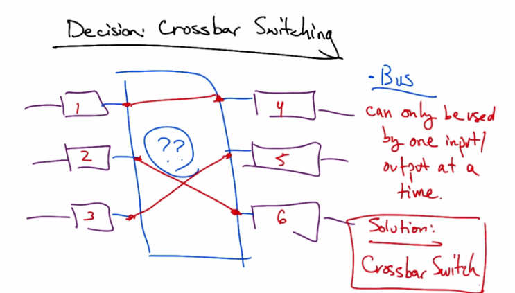

   Decision: Crossbar Switching — Bus can only be used by one input/output at a time. Crossbar
   Switch allows inputs 1→4, 2→6, 3→5 simultaneously (shown with crossing lines for
   non-conflicting pairs). Solution: Crossbar Switch.

The second important decision is the design of the interconnect, or how the line cards should be
connected to one another. Now one possibility is to use a shared bus. But the disadvantage of a
bus for the interconnect is that it can only be used by one input-output combination in any single
time slot. What we'd like to do is enable input output pairs that don't compete to send traffic from
input to output during the same time slot. For example, one should be able to send one to four,
two to six and three to five, all in the same time slot. The solution to this problem is to create
what's called a crossbar switch, or sometimes is also called a switched backplane.

Crossbar Switching
------------------

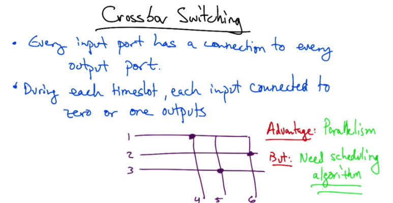

   Crossbar Switching — Every input port has a connection to every output port. During each
   timeslot, each input connected to zero or one outputs. Grid shows inputs 1, 2, 3 connected
   to outputs 4, 5, 6. Advantage: Parallelism. But: Need scheduling algorithm.

In crossbar switching every input port has a connection to every output port, and during each
time slot, each input is connected to zero or one outputs. The crossbar is often depicted as
follows. So if one wants to send to four, we could connect the input to the output in that time
slot, and now this row and this column is occupied. But we could connect two to six and three to
five in the same time slot without introducing contention. So the advantage of this design is that
it can exploit parallelism by allowing multiple packets to be forwarded across the interconnect in
parallel. But of course we also need proper scheduling algorithms to ensure fair use of the
crossbar switch. Let's take a quick look at what this algorithm needs to achieve.

Switching Algorithm: Maximal Matching
--------------------------------------

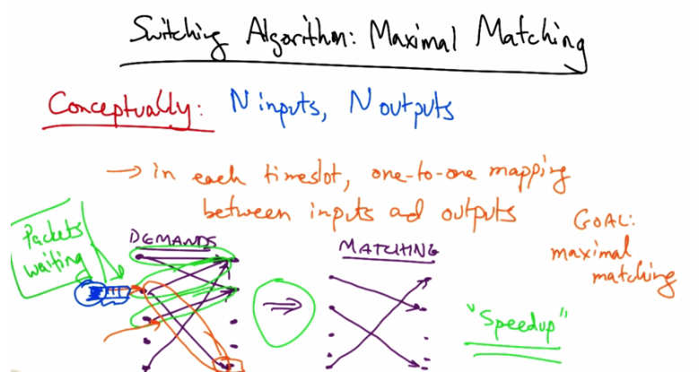

   Switching Algorithm: Maximal Matching — Conceptually: N inputs, N outputs. In each
   timeslot, one-to-one mapping between inputs and outputs. Goal: maximal matching. Packets
   waiting (Demands) are matched via the crossbar ("Speedup").

We'd like the cross bar switching algorithm to achieve what's called a maximal matching.
Conceptually we have a router with n inputs and n outputs, but of course the inputs are also
outputs. It's just easier to think about the inputs and the outputs being separate when we talk
about the switching problem. Now in each time slot we would like to achieve a one-to-one
mapping between inputs and outputs, which is a matching. And our goal is that the matching
should be maximal. So in a particular time slot, we might have a certain set of traffic demands,
or traffic at certain input ports, that is destined for certain output ports. And our goal is, given
these demands to produce a matching that is maximal and fair. Now, given demands for a
particular time slot and the resulting matching, notice that certain demands were not satisfied.
These packets that arrived at inputs must wait until the next time slot to be forwarded to the
appropriate output port, because they couldn't be matched in the same time slot as those shown
here. Remember that there must be exactly a one-to-one matching between any inputs and
outputs in a particular time slot. Most router crossbars have a notion of speedup whereby
multiple matchings can be performed in the same time slot. So, for example, if the line cards are
running at, say, ten gigabits per second, then running the interconnect twice as fast would allow
matchings to occur twice as fast, as packets would arrive on the inputs or be forwarded from the
outputs. It is thus common practice to run the interconnect at a higher speed than the input and
output ports. Just speeding up the interconnect does not solve all problems. Note, for example,
that in this set of demands we have packets arriving at this input port destined for this output
port, but if there's only a single queue at this input, the packets that are destined for the output
port circled in orange, might actually be blocked behind a set of packets that are destined for
other output ports. So even if we could induce a speed up at the interconnect, certain packets
may be blocked in the queue by packets ahead of them destined for other output ports.

Head of Line Blocking
---------------------

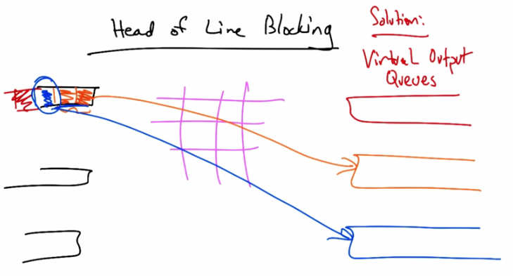

   Head of Line Blocking — Orange packets at the front of one queue block other packets from
   being matched to different output ports. Solution: Virtual Output Queues.

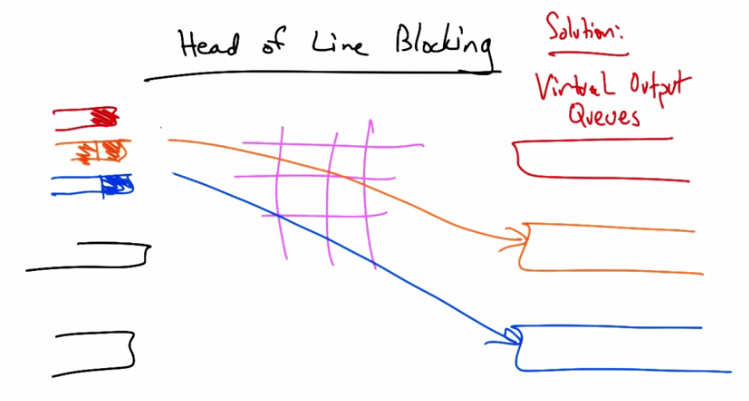

   Head of Line Blocking — With Virtual Output Queues (one queue per output port), packets
   destined for different outputs can be matched independently in the same timeslot.

For example, if we have packets arriving in this queue destined for the orange queue, at the front
of the queue, then even with the speed up, there may be packets that are sufficiently far behind in
the queue that they're waiting behind the orange packets. What we'd like to be able to do is
perform matchings to allow these packets to be sent to the output ports, and not have to wait for
the entire queue to be drained of packets destined for the orange output port.

A solution is to create virtual output queues, where instead of having a single queue at the input,
we have one queue per output port. This prevents packets at the front of the queue that are
destined for a particular output port from blocking packets that could otherwise be matched to
other output queues in earlier timeslots.

Scheduling and Fairness
-----------------------

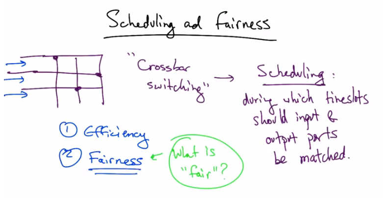

   Scheduling and Fairness — Crossbar switching requires scheduling: during which timeslots
   should input and output ports be matched? Two goals: (1) Efficiency, (2) Fairness — What is
   "fair"?

Let's now talk about scheduling and fairness. And when we talk about, in a crossbar switch, the
process of matching input ports to output ports, the decision about which ports should be
matched in any particular time slot is a process called scheduling. There are two important goals
in scheduling. One is efficiency, which is to say that if there is traffic at inputs destined for
output ports, the crossbar switch should schedule inputs and outputs so that traffic isn't sitting
idle at the input ports if some traffic could be sent to the available output ports. Another
consideration in scheduling is fairness, which is to say that given demands at the inputs, we want
to make sure that each queue at the input is scheduled fairly for some definition of fairness. Now,
defining fairness is tricky. And there are multiple possible definitions of fairness. Here, we'll
look at an important fairness definition called max min fairness.

Max Min Fairness
----------------

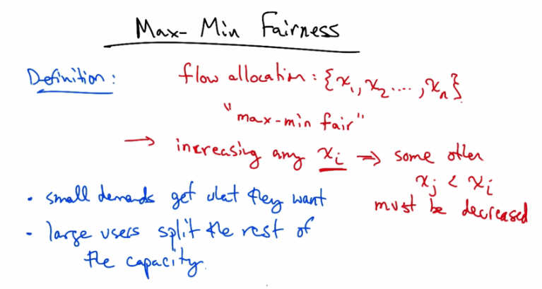

   Max-Min Fairness — Definition: flow allocation {x1, x2, ..., xn}. "max-min fair" means
   increasing any xi implies some other xj < xi must be decreased. Small demands get what they
   want; large users split the rest of the capacity.

Now, to define max-min fairness, let's first assume that we have some allocation of rates across
flows x_i. Now, we say that this allocation is max-min fair if increasing any rate x_i implies that
some other x_j that is smaller than x_i must be decreased to accommodate for the increase in x_i.
So in other words, the allocation is max-min fair if we can't make any one of these flow rates
better off without making some flow rate worse off, that's already worse than the flow rate x_i.
So the upshot results in small demands getting exactly what they asked for, and the larger
demands splitting the remaining capacity among themselves equally. More formally, we perform
this procedure as follows. We allocate resources to users in order of increasing demand. No user
receives more than what they requested. And users that still have unsatisfied demands, split the
remaining resources.

Max Min Fairness Example
------------------------

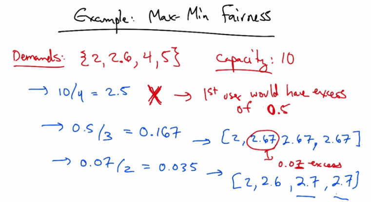

   Example: Max Min Fairness — Demands: {2, 2.6, 4, 5}, Capacity: 10. 10/4 = 2.5 (1st user
   excess 0.5). 0.5/3 = 0.167 → [2, 2.67, 2.67, 2.67]. 0.07/2 = 0.035 excess → [2, 2.6, 2.7,
   2.7].

Let's consider an example for max-min fair allocation. Let's suppose that we have a link with
capacity ten and four demands: 2, 2.6, 4, and 5. Now, obviously the demands exceed capacity.
So we need to figure out a way of allocating rates to each of these demands that is max-min fair.
First, note that 10 divided by 4 is 2.5. But this is not a good solution, because the first user only
needs 2. So the first user would have an excess of .5 under this allocation. So what we want to do
is take this excess of .5 and divide it among the remaining 3 users, whose demands have not yet
been fulfilled. This would yield an allocation of 2, 2.67, 2.67, and 2.67. But now user two has an
excess of 0.07, so we take that excess, divide it among the remaining 2, and that gives us our
final max-min fair allocation. Note that this is called max-min fairness, because it maximizes the
minimum share to each user whose demand is not fully serviced. In this case, the 3rd and 4th
users.

Max Min Fairness Quiz
---------------------

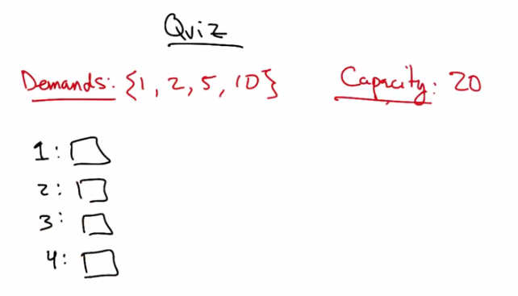

   Quiz — Demands: {1, 2, 5, 10}, Capacity: 20. Fill in allocations for users 1, 2, 3, 4.

As a quick quiz, let's try doing a max min fair allocation. Suppose that we have demands of one,
two, five, and ten, and link, whose rate is 20. Please give the max-min fair allocation across
these four users.

Max Min Fairness Solution
-------------------------

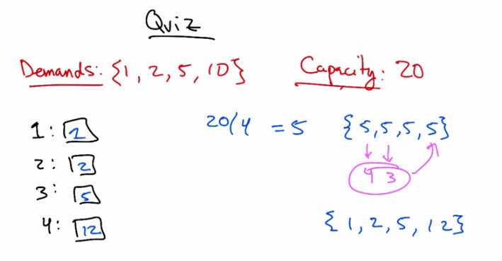

   Quiz Solution — Demands: {1, 2, 5, 10}, Capacity: 20. 20/4 = 5 → {5,5,5,5}. Users 1 and 2
   satisfied (excess 4+3=7). Remaining 2 users split: {1, 2, 5, 12}.

To compute the max min fair allocation, we take 20 and we divide it by 4, which yields 5. But
the first user only needs one, which yields an excess of four. The second user only needs two,
which yields an excess of three. So in this case the max min fair allocation is easy. We simply
take this excess of seven and give it to the only user whose demand is not yet satisfied, resulting
in the max min fair allocation of one, two, five, and twelve.

How to Achieve Max Min Fairness
---------------------------------

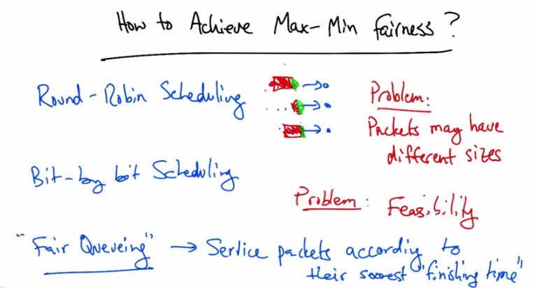

   How to Achieve Max-Min Fairness? Round-Robin Scheduling (problem: packets may have
   different sizes). Bit-by-bit Scheduling (problem: Feasibility). "Fair Queuing" — Service
   packets according to their soonest "finishing time."

Now, how do we achieve max-min fairness? One approach is via round robin scheduling, where
given a set of cues, the router simply services them in order. The problem here is that packets
may have different sizes. So if the first queue had a huge packet, and the second queue had a
little packet, and the third queue had a medium sized packet, then servicing these queues in order
obviously isn't fair. Because the first queue would effectively get more of its fair share, because
its packet just happened to be bigger. An alternative is to use bit by bit scheduling, where during
each time slot, each queue only has one bit serviced. This, of course, is perfectly fair, but the
problem is feasibility. How do we service one bit from a queue? A third alternative is called Fair
Queuing, which achieves max-min fairness by servicing packets according to the soonest
finishing time. A Fair Queuing algorithm computes the virtual finishing time of all candidate
packets, which are the packets at the head of all non-empty flow queues. Based on these virtual
finishing times, Fair Queuing compares the finishing times of each queue and services the queue
with the minimum finishing time. So the queue whose packet has the minimum virtual finishing
time is serviced.
