Routing
=======

Lesson 4 Intro
--------------

With your head wrapped around routing we'll now take a look at the nuts and bolts that make
routing possible: naming, addressing and forwarding.

And you'll start your first significant Mininet project. In the project you'll investigate switched
buffer sizing which can have an important effect on network performance.

Internet Routing
----------------

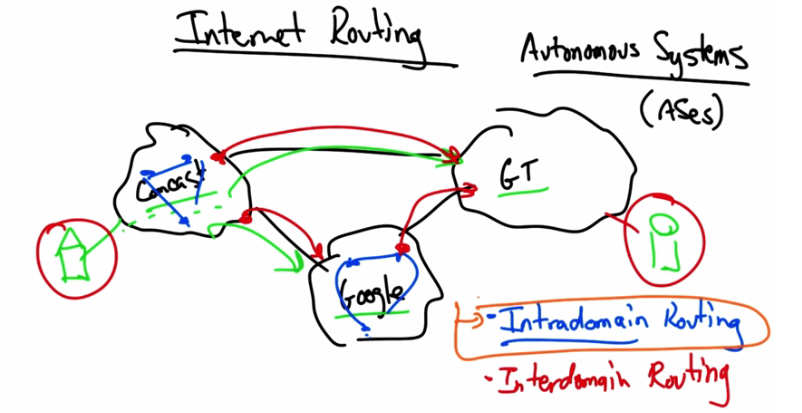

   Internet Routing — Autonomous Systems (ASes): Comcast, GT (Georgia Tech), Google.
   Intradomain Routing (within AS) and Interdomain Routing (between ASes).

The next few lessons will cover internet routing. Contrary to what you might think, the internet is
not a single network, but rather a collection of tens of thousands of independently operated
networks, or autonomous systems, sometimes simply called ASes. Networks such as Comcast,
Georgia Tech, and Google, are different types of autonomous systems. An autonomous system
might be internet service provider, a content provider, a campus network, or any other
independently operated network. Now when you're sitting at home on Comcast and trying to
reach content in Google or Georgia Tech, your traffic actually traverses multiple autonomous
systems. This process of internet routing actually involves two distinct types of routing. One is
intradomain routing, which is the process by which traffic is routed inside any single
autonomous system. The other is interdomain routing, which is the process of routing traffic
between autonomous systems. So computing a path between a node in an ISP like Comcast and
another node in a network like Georgia Tech's involves computation of both intradomain paths
and interdomain paths. In this part of the lesson we'll look at intradomain routing. Then we'll
study interdomain routing, as well as the business relationships that make interdomain routing so
complicated. So let's jump into our study of intradomain routing and topology.

AS Quiz
-------

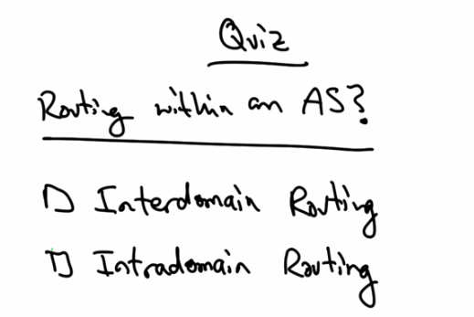

   Quiz — Routing within an AS? Options: Interdomain Routing, Intradomain Routing.

As a quick quiz, which of the following types of routing protocols are responsible for routing
within an autonomous system?

AS Solution
-----------

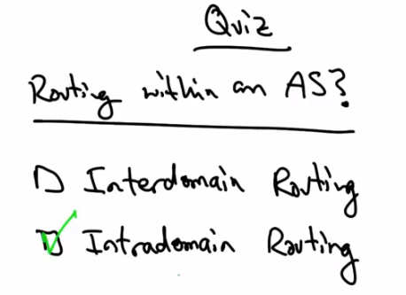

   Solution — Intradomain Routing (checked). Routing within an AS is intradomain routing.

Intradomain routing protocols are responsible for routing within an autonomous system.
Interdomain routing protocols, on the other hand, are responsible for routing traffic between
autonomous systems.

Intra AS Topology
-----------------

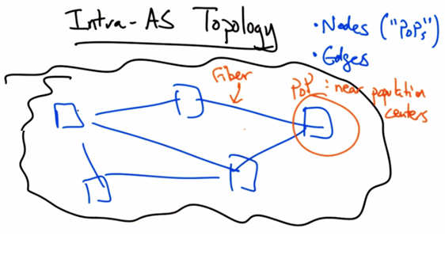

   Intra-AS Topology — Nodes ("PoPs") and Edges. Fiber connections between PoPs (Points of
   Presence). PoP: near population centers.

Before we jump into intradomain routing, let's take a look at what a topology might look like
inside a single autonomous system. A topology inside an AS consists of nodes and edges that
connect them. The nodes are sometimes called points of presence, or PoPs. A PoP is typically
located in a dense population center, so that it can be close to the PoPs of other providers for
easier interconnection and also close to other customers for cheaper backhaul to customers that
may be purchasing connectivity from this particular AS. The edges between pops are typically
constrained by the location of fiber paths, which for the sake of convenience typically parallel
major transportation routes such as railroads and highways.

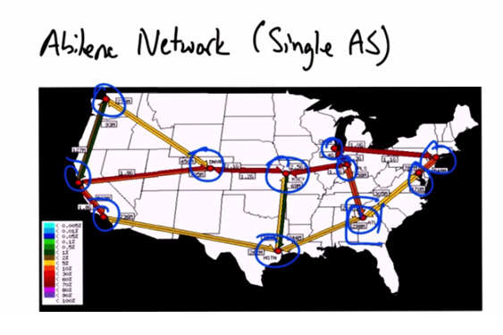

   Abilene Network (Single AS) — US map showing the Abilene research network with PoP
   locations connected by fiber links. Georgia Tech connects at the Atlanta PoP.

Here's an example of a single AS topology which is the Abilene Network, which is a research
network in the United States. Each of these locations would be considered a PoP, and each of
these PoPs may have one or more edges between them. Georgia Tech is an autonomous system
that connects at the Atlanta PoP of the Abilene Network.

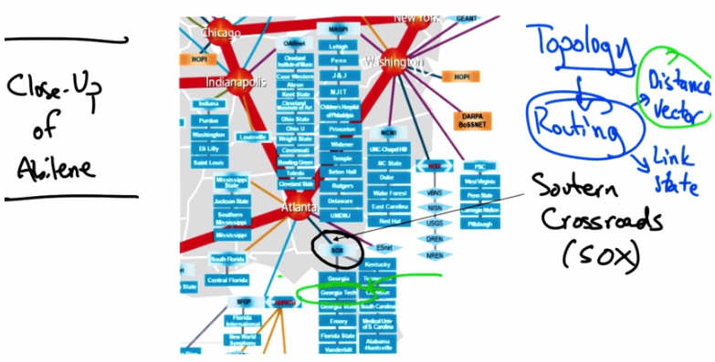

   Close-Up of Abilene in the southeastern US showing connections to universities near Atlanta,
   and Southern Crossroads (SOX) internet exchange point. Topology → Routing types: Distance
   Vector, Link State.

Here's a close up of the Abilene Network in the south eastern U.S. The Abilene network
connects to other universities in the southeast near Atlanta and an internet exchange point called
SOX, or southern crossroads. Now, thus far we've just talked about the topology of an
autonomous system, which essentially defines the graph. The next step is to compute paths over
that topology, a process called routing. Routing is the process by which nodes discover where to
forward traffic so that it reaches a certain node. There are two types of intradomain routing. One
is called distance vector, and the other is called link state. In the rest of this lesson we'll explore
the two different types of intradomain routing and the advantages and disadvantages of each of
them. Let's first take a look at distance vector routing.

Distance Vector Routing
-----------------------

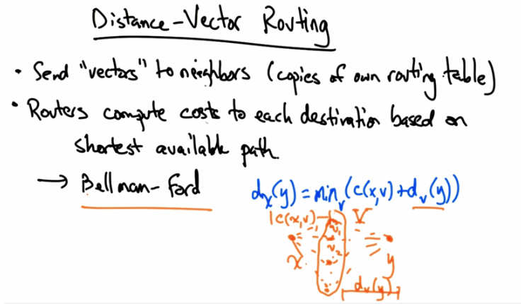

   Distance-Vector Routing — Send "vectors" to neighbors (copies of own routing table).
   Routers compute costs to each destination based on shortest available path. → Bellman-Ford:
   d_x(y) = min_v(c(x,v) + d_v(y)).

In distance vector routing, each node sends multiple distance vectors to each of its neighbors,
essentially amounting to copies of its own routing table. Routers then compute costs to each
destination in the topology based on shortest available path. Distance vector routing protocols are
based on the Bellman-Ford algorithm. A node X's forwarding table is based on the solution to the
following equation. Suppose that node X is trying to find a shortest cost route to node Y. In this
case node X is trying to find a path through some intermediate node, V, that minimizes the cost
between X and V, and the already known shortest cost path between V and Y. Again, the
solution to this equation for all destinations, Y, in the topology is X's forwarding table. Let's now
take a look at distance vector routing by way of example.

Example of Distance Vector Routing 1
--------------------------------------

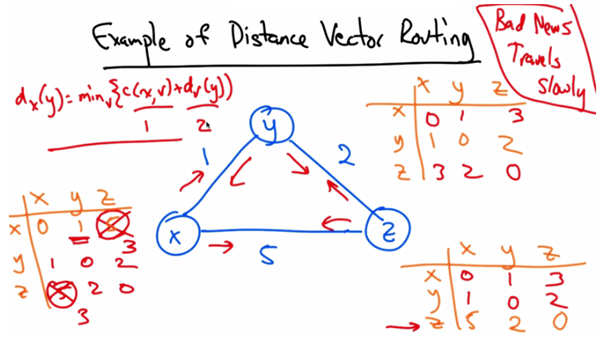

   Example of Distance Vector Routing — Three-node network (x, y, z) with edge costs.
   Formula d_x(y) = min_v(c(x,v) + d_v(y)). Initial distance tables shown. "Bad News Travels
   Slowly" annotation.

Let's suppose that we have a three node network with the costs on the edges as shown. Initially,
each node has a single distance vector representing the shortest path cost to each other incident
node in the graph. For example, the distance between x and x is obviously zero. And the shortest
known distance between x and y from x's perspective is the direct path. Similarly, the
shortest known distance between x and z to x at the outset is five because all it knows is the
direct path. Note that a shorter path between x and z exists via y, but x simply doesn't know
about it yet. Now in distance vector routing, every node send its vectors to every other adjacent
node. And each node then updates its routing table according to the Bellman-Ford equation. Let's
look at what happens when node x learns of y's distance vectors. Well in this case, the distance
from x to z will be computed as the minimum of the sums of all distances to z through any
intermediate node. So the cost between x and y is one, and the distance between y and z as
discovered by y's distance vector is two. Therefore, x can update its shortest cost distance to z as
three. Similarly, x will receive a distance vector from z, five two zero, but of course, when it uses
the Bellman-Ford equation to update its distances, again the distance between z and x will be
updated from five to three. We can repeat this exercise at other nodes, as they receive distance
vectors from other nodes in the topology, and quickly, every node in the network has a complete
routing table. Now when costs decrease, the network converges quickly, but one problem is that
when failures occurs, bad news can actually travel slowly.

Example of Distance Vector Routing 2
--------------------------------------

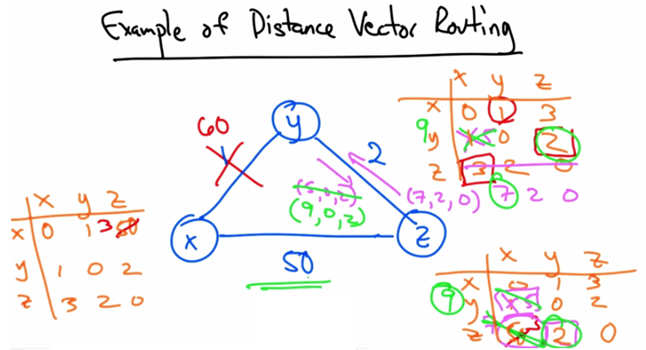

   Example of Distance Vector Routing — Cost between x and y increases from 1 to 60. Tables
   show the count-to-infinity problem as y and z keep updating each other's distances upward.

Let's look at a different example. So for the sake of illustration, I've increased the cost between x
and z to 50, and now everyone starts with a different set of initial distance vectors. Now
eventually, after running the distance vector protocol, we would see the tables converge as such.
Let's suppose that the cost of the link between x and y suddenly increased from 1 to 60. Well
now in this case, y would need to update its view of the shortest path between y and x. Now it's
no longer one, but it's not 60 either. To see why let's go back to our Bellman-Ford equation. We
can see that y thinks it can get to z with a cost of two, and that z can get to x with a cost of three.
So in fact it's going to update this entry from one to five. Then it will tell it's neighbor z its new
distance vector. In other words, that now its distance to x is no longer one but five. At this point,
z needs to re-compute it's shortest path to x. Now, it knows that it can get to y with a cost of two
but it thinks still that y can get to x with a cost of five. Therefore, this entry is no longer three but
seven. And now z sends its new distance vector back to y. Y then updates it's distance vector for
z and this process continues. So, then y thinks it is now nine units away from x. So z has to do
this all over again and now z thinks that its shortest path is two plus nine or 11. Now this process
repeats of course until z finally realizes that it has a shorter path of 50 directly through x after
this counting up process exceeds the value of 50.

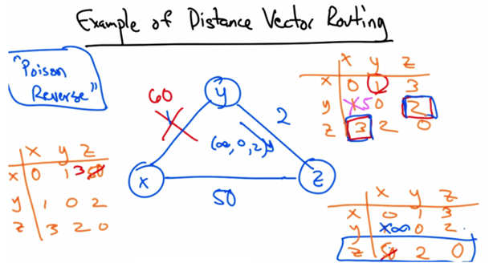

   Example of Distance Vector Routing — "Poison Reverse": y advertises infinity to z for
   destination x when y routes through z. This prevents the count-to-infinity loop.

This problem is called the count to infinity problem, and the solution is called poison reverse.
The idea here is that if y must route through z to get to x in its table, as it did here, then y
advertizes an infinite cost for the destination x to z. So instead of sending five, zero, two, y
would send infinity, zero, two. This would thus prevent z from routing back through y, and
immediately, it would choose the shortest path to x, of path cost 50.

Routing Information Protocol
------------------------------

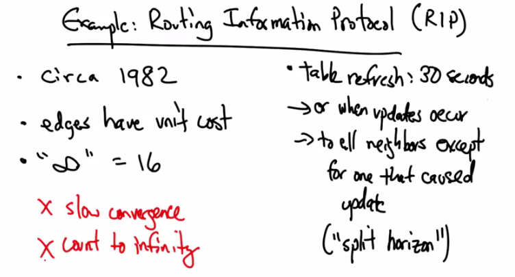

   Example: Routing Information Protocol (RIP) — Circa 1982. Edges have unit cost. "infinity" =
   16. Table refresh: 30 seconds, or when updates occur, to all neighbors except for one that
   caused update ("split horizon"). Problems: slow convergence, count to infinity.

An example of a distance vector routing protocol is the routing information protocol or RIP. The
first version of RIP was defined in 1982 where edges had unit cost, and infinity for the count to
infinity problem was 16. Table refreshes occur every 30 seconds and when an entry changes, it
sends a copy of that update to all of its neighbors except for the one that induced the update. This
rule is sometimes called the split horizon rule. The small value for infinity ensures that the count
to infinity doesn't take very long and every round has a time out limit of 180 seconds which is
basically reached when a router hasn't received an update from a next hop for six 30 second
periods. In practice, when a router or link fails in RIP, things can often take minutes to stabilize.
So because of problems such as slow convergence and count to infinity, protocol designers look
to other alternatives.

Link State Routing
-------------------

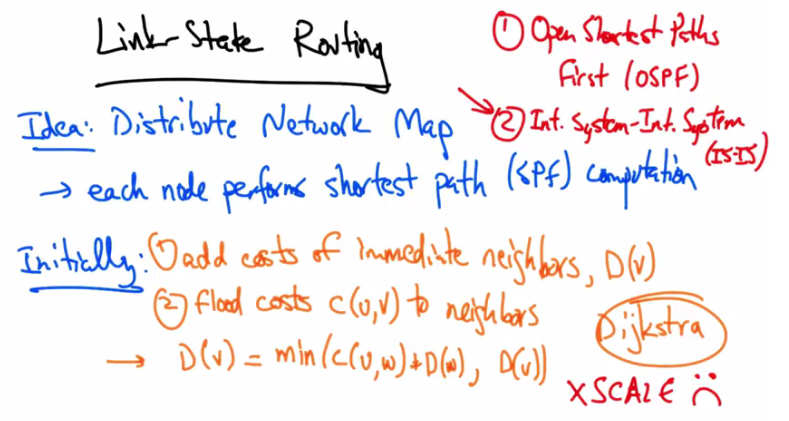

   Link-State Routing — Idea: Distribute Network Map → each node performs shortest path (SPF)
   computation. Initially: (1) add costs of immediate neighbors D(v), (2) flood costs c(u,v) to
   neighbors → D(v) = min(c(u,w)+D(w), D(v)). Dijkstra algorithm. Does not scale (n^3).
   Examples: OSPF (Open Shortest Paths First), IS-IS.

The prevailing alternative and the one that is used in most operational networks today is link
state routing. In link state routing, each node distributes a network map to every other node in the
network and then each node performs a shortest path computation between itself and all other
nodes in the network. So, initially each node adds the cost of its immediate neighbors, D(v), and
every other distance to a node that is infinite. Then each node floods the cost between nodes u
and v to all of its neighbors. And the distance to any node v becomes the minimum of the cost
between u and w plus the cost to w, or the current shortest path to v. The shortest path
computation is often called the Dijkstra shortest path routing algorithm. Two common link state
routing protocol are open shortest paths first or OSPF and intermediate system- intermediate
system or IS-IS. In recent years, IS-IS has gained increasing use in large internet service
providers and is the more commonly used link state routing protocol in large transit networks
today. One problem with link state routing is scale. The complexity of a link state routing
protocol grows as n cubed where n is the number of nodes in the network.

Coping with Scale Hierarchy
-----------------------------

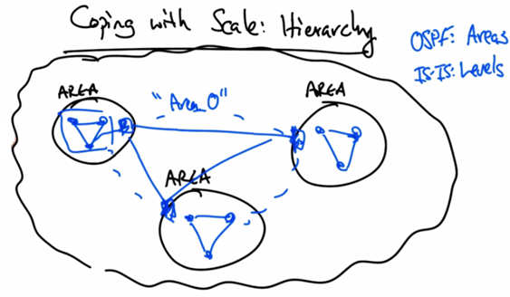

   Coping with Scale: Hierarchy — OSPF: Areas; IS-IS: Levels. Backbone "Area 0" with multiple
   other areas connecting to it. Area zero routers do shortest path across backbone; other areas
   compute independently.

One way of coping with scale is to introduce hierarchy. OSPF has a notion of areas, and IS-IS
has an analogous notion of levels. In a backbone network, the network's routers may be divided
into levels, or areas, and the backbone itself may have its own area. In OSPF, the backbone area
is called area zero, and each area in the backbone that's not in area zero has an area zero router.
The area zero routers perform shortest path computations and the routers in each of the other
areas independently perform shortest path computations. Now paths are computed by computing
the shortest path within an area, or, if the path must leave an area, it's computed by stitching
together the shortest path to the area zero backbone router, and then the shortest path across area
zero followed by another intra-area shortest path.

Interdomain Routing
--------------------

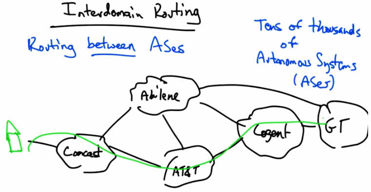

   Interdomain Routing — Routing between ASes (Abilene, Comcast, AT&T, Cogent, GT).
   Tens of thousands of Autonomous Systems (ASes).

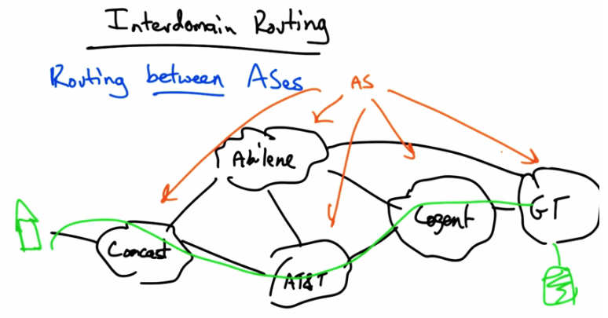

   Interdomain Routing — Each AS advertises reachability by sending route advertisements
   (orange arrows showing route announcements propagating between ASes).

We're now moving on to cover interdomain routing or routing between ASes. Recall that internet
routing consists of routing between tens of thousands of independently operated networks, or
autonomous systems. Each of these networks operates in their own self-interest and have
independent economic and performance objectives, and yet they must cooperate to provide
global connectivity so that when you're sitting at home, you can retrieve content that might be
hosted at the Georgia Tech network.

Now, each independently operated network is called an autonomous system, or AS. And each
AS advertises reachability to some destination by sending what are called route advertisements
or announcements.

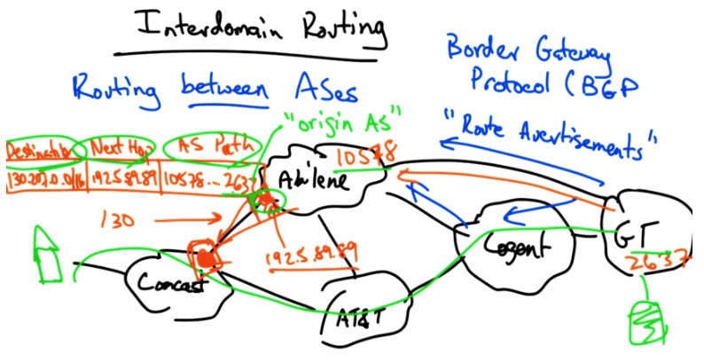

   Interdomain Routing — Border Gateway Protocol (BGP) "Route Advertisements". Table shows:
   Destination (130.207.0.0/16), Next Hop (192.5.89.89), AS Path (10578 → 2637). Origin AS
   is 2637 (Georgia Tech).

The protocol that ASes use to exchange these route advertisements is called the Border Gateway
Protocol, or simply, BGP. A route advertisement has many important attributes, but for now, let's
just talk about three. Now a router here, let's say on the Comcast network, might receive a route
advertisement, typically from its neighboring AS. That route advertisement might contain a
destination prefix, such as the IP prefix for Georgia Tech. Then it might contain what's called a
next hop IP address, which is the IP address of the router that the Comcast router must send
traffic to, to send traffic along that route. Typically that next hop IP address is the IP address for
the first router in the neighboring network. And the Comcast router knows how to reach that next
hop IP address because its border router and the border router in the neighboring AS are on the
same subnet. Typically this might be a /30 subnet, therefore this IP address is reachable from
Comcast's border. A third important attribute is what's called the AS path, which is a sequence of
what are called AS numbers that describe the route to the destination. Now strictly speaking, the
AS path is nothing more than the sequence of ASes that the route traversed to reach the recipient
AS. So for example, Georgia Tech's AS number is 2637 and Abilene's is 10578 so the AS path
that Comcast would hear if it received a route advertisement from Abilene for Georgia Tech,
would be 10578 followed by 2637. So in the remainder of the lesson we'll look at other BGP
route attributes. But these are essentially the three most important because they describe how to
stitch together an interdomain path to a global destination. So we have the destination IP prefix
for the destination that a router might want to send traffic to; the next hop, which is the IP
address for the router for the next hop along the path; and finally, the AS path, which is the
sequence of ASes that the route traversed en route to the AS that's hearing the announcement.
The last AS number on the AS path is often called the origin AS, because that is the AS that
originated the advertisement for this IP prefix. In this case, the origin AS is 2637, or Georgia
Tech, because it is the AS that originated the announcement for this prefix.

Interdomain Routing 2
----------------------

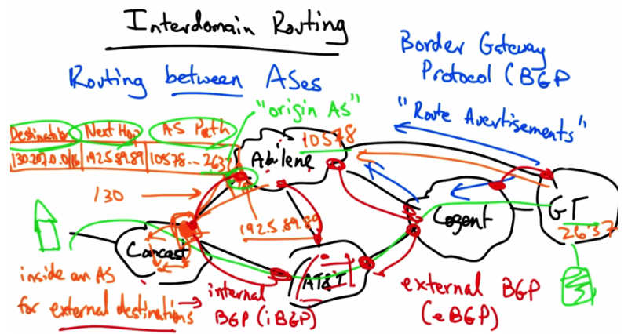

   Interdomain Routing — Border Gateway Protocol. Shows eBGP (external BGP) between
   border routers of adjacent ASes, and iBGP (internal BGP) distributing routes inside an AS
   for external destinations.

Now thus far, we've talked about interdomain routing BGP, or the border gateway protocol, as
consisting of route advertisements solely between border routers of adjacent autonomous
systems. In fact, this is a specific type of BGP called external BGP, or eBGP. But in fact, as we
know, each one of these autonomous systems has routers of its own, inside. Those routers also
need to learn routes to external destinations. The protocol that is used to transmit routes inside an
autonomous system for external destinations, is called internal BGP or iBGP. Okay, so to review,
external BGP is responsible for transmitting routing information between border routers of
adjacent ASes about external destinations. And internal BGP is responsible for disseminating
BGP route advertisements about external destinations to routers inside any particular AS. Note
the distinction between iBGP and an intra-domain routing protocol or an IGP.

IGP vs iBGP
-----------

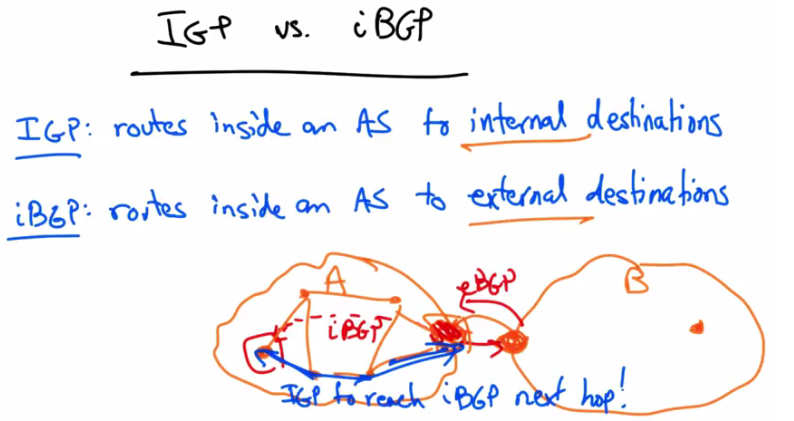

   IGP vs. iBGP — IGP: routes inside an AS to internal destinations. iBGP: routes inside an AS
   to external destinations. Diagram: AS A with iBGP between border routers; eBGP to AS B.
   IGP used to reach iBGP next hop.

The IGP or the intra-domain routing protocol, disseminates routes inside an AS to internal
destinations whereas iBGP or internal- border gateway protocol, disseminates routes inside an
AS to external destinations. So let's suppose that a router inside AS A is trying to reach a
destination inside AS B. AS A would learn the route via eBGP and the next hop of course, at this
router, would be the border router at B. And now a router inside autonomous system A would
learn the route to B via iBGP. Now the BGP next stop, would be the border router. And so, this
router inside AS A, needs to use the IGP, to reach the iBGP next hop.

Protocol Quiz
-------------

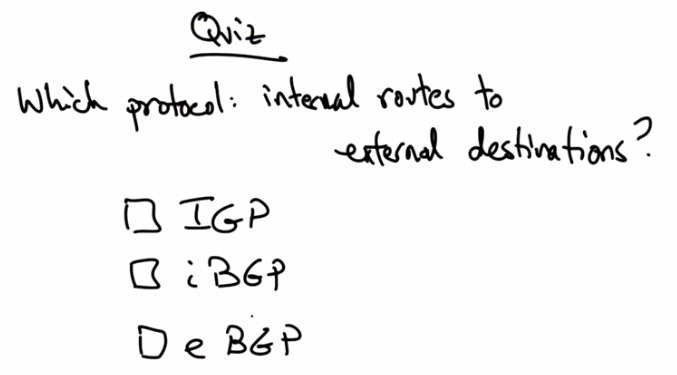

   Quiz — Which protocol: internal routes to external destinations? Options: IGP, iBGP, eBGP.

So as a quick quiz, which routing protocol is responsible for disseminating routes inside an AS to
external destinations? Is it the IGP? Is it iBGP. Or is it eBGP?

Protocol Solution
-----------------

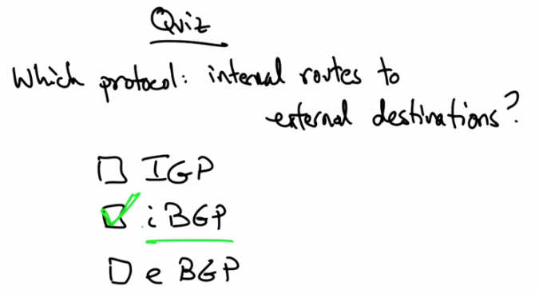

   Solution — iBGP (checked). iBGP is responsible for disseminating routes inside an AS about
   destination IP prefixes outside that AS.

iBGP is responsible for disseminating routes inside an AS about destination IP prefixes that are
located outside that AS. The iBGP next hop is typically a next hop IP address that is reachable
via the ASes intradomain routing protocol, or IGP.

BGP Route Selection
--------------------

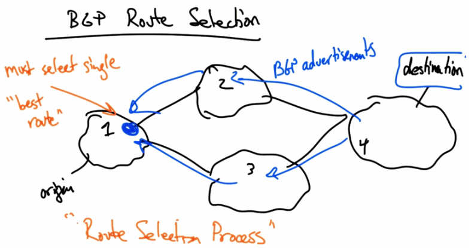

   BGP Route Selection — AS 1 (origin) can reach destination (AS 4) via AS 2 or AS 3. Must
   select single "best route". "Route Selection Process".

Let's now take a quick look at BGP route selection. It is often the case that a router on a
particular autonomous system might learn multiple routes to the same destination. In this case, a
router on autonomous system one, might learn a route to a destination in AS4 via both AS2 and
AS3. In this situation. The router in AS one must select a single best route to the destination
among the choices. The selection among multiple alternatives is known as the BGP route
selection process. Let's now take a quick look at that process.

BGP Route Selection Process
-----------------------------

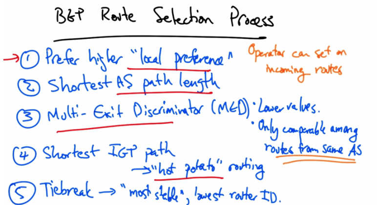

   BGP Route Selection Process — (1) Prefer higher "local preference" (operator can set on
   incoming routes). (2) Shortest AS path length. (3) Multi-Exit Discriminator (MED): lower
   values, only comparable among routes from same AS. (4) Shortest IGP path → "hot potato"
   routing. (5) Tiebreak → "most stable", lowest router ID.

The first step in the BGP route selection process is to prefer a route with the higher local
preference value. The local preference value is simply a numerical value that a network operator
in the local AS can assign to a particular route. This attribute is purely local. It does not get
transmitted between autonomous systems, so it is dropped in eBGP route advertisements. But it
allows a local network operator the ability to explicitly state that one route should be preferred
over the other. Among routes with equally high local preference values, BGP prefers routes with
shorter AS path length. The idea is that a path might be better if it traverses a fewer number of
autonomous systems. The third step involves comparison of multiple routes advertised from the
same autonomous system. The multi-exit discriminator (MED) value allows one AS to specify
that one exit point in the network is more preferred than another. So lower MED values are
preferred, but this step only applies to compare routes that are advertised from the same
autonomous system. Because the neighboring AS sets the MED value on routes that it advertises
to a neighbor, MED values are not inherently comparable across routes advertised from different
ASes. Therefore this step only applies to routes advertised from the same AS. Fourth, BGP
speaking routers inside an autonomous system will prefer a BGP route with a shorter IGP path
cost to the IGP next up. The idea here is that if a router inside an autonomous system learns two
routes via iBGP then it wants to prefer the one that results in the shortest path to the exit of the
network. This behavior results in what is called "hot potato" routing, where an autonomous
system sends traffic to the neighboring autonomous system via a path that traverses as little of its
own network as possible. Finally, if there are multiple routes with the highest possible local
preference, the shortest AS path and the shortest IGP path, the router uses a tiebreak to pick a
single breaking route. It might be the most stable, or the route that's been advertised the longest.
But often, to induce determinism, operators typically prefer that this tie breaking step is
performed based on the route advertisement from the router with the lowest router ID, which is
typically the neighboring router's IP address.

Local Preference
----------------

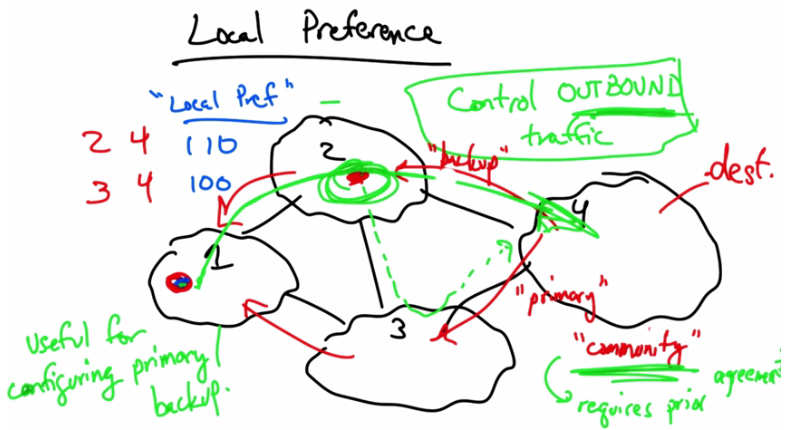

   Local Preference — AS 1 router learns two routes to destination (AS 4): via AS path 2-4
   (local pref 110) and via AS path 3-4 (local pref 100). Higher local pref 110 wins → traffic
   goes via AS 2. Useful for configuring primary/backup. BGP community can affect neighbor's
   local pref.

Now, a router in AS1 might learn two routes to a destination, one via the AS path 2-4 and the
other via the AS path 3-4. Local preference, or simply, local pref, allows an operator to configure
the router to assign different preference values to each of the routes that it learns. The default
local preference value is 100. But if the operator prefers that this router select the path through
AS two, it can configure the router to set a higher local preference for that route such as 110.
This results in this router selecting the route through AS two and sending traffic to the
destination in AS four via AS two. In this way an operator can adjust local preference values on
incoming routes to control outbound traffic or to control how traffic leaves its autonomous
system en route to a destination. This is extremely useful in configuring primary and back up
routes. For example, here the route though AS two might be the primary route, and the route
through AS three, is the backup route. Now typically, as I mentioned, local preference is used to
control outbound traffic. But sometimes autonomous systems can attach what's called a BGP
community to a route to affect how a neighboring autonomous system sets local preference. A
community is nothing more but a fancy jargon word for a tag on a route. So let's suppose that AS
four wanted to control inbound traffic by affecting how AS two or AS three set local preference.
In this case, let's suppose that AS two wanted traffic to arrive via AS three, its primary, rather
than by AS two, its backup. In this case, AS two might advertise its BGP routes with primary
and backup communities. The backup community value might cause a router in AS two to adjust
its local preference value, thus affecting how AS two's outbound traffic choices are made. So,
again local preference is used to control outbound traffic, in this case AS two's outbound traffic
decision. But the use of a BGP community on the route advertisement can sometimes be used to
cause a neighboring AS to make different choices regarding it's outbound traffic, thereby,
allowing an AS to specify a primary or back up path for incoming traffic. This type of
arrangement requires prior agreement.

Multiple Exit Discriminator
-----------------------------

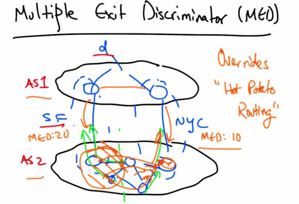

   Multiple Exit Discriminator (MED) — AS1 and AS2 connect in SF (MED:20) and NYC
   (MED:10). AS1 wants traffic to enter via NYC. MED overrides "Hot Potato Routing".

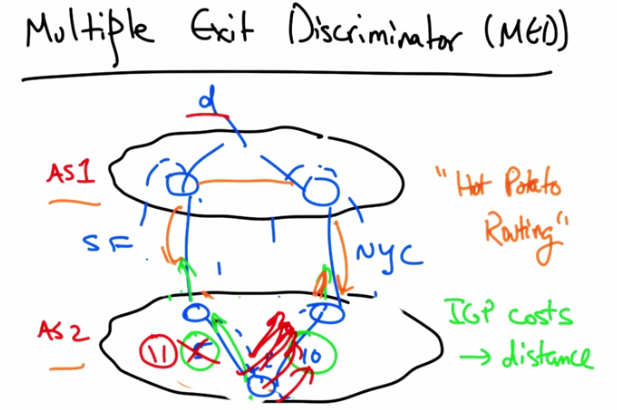

   Multiple Exit Discriminator (MED) — Without MED, hot potato routing prevails: routers in
   AS2 pick egress with lowest IGP path cost. With MED, NYC (MED:10) wins over SF (MED:20).

Let's suppose that two autonomous systems connect in two different cities, San Francisco and
New York. Let's further suppose that AS 1 wants traffic to destination d to enter via New York
City, rather than via the peering link in San Francisco. Well, remember that all things being
equal, routers inside AS 2 will select the BGP route with the shortest IGP path cost to the next
hop, resulting in hot potato routing. So some routers will select the San Francisco egress, and
other routers might select the New York egress. To override this default hot potato routing
behavior, AS1 might advertise its BGP routes to AS2 with MED values. For example, if the
MED value on the route learned at the border router in New York was 10, and the MED value
from the route learned from the router in San Francisco was 20, then instead of performing hot
potato routing, all of these routers that would ordinarily be closer to the San Francisco egress,
would instead pick the route learned via the New York egress because the preference for a lower
MED value comes before the preference for a next hop with the lower IGP path process. So all
of these routes would instead be carried over AS 2's backbone network and exit via New York.
Thus MED overrides hot potato routing behavior allowing an AS to explicitly specify that it
wants another neighboring AS to carry the traffic on its own backbone network, rather than
dumping the traffic at the closest egress and forcing traffic across the neighbor's backbone.
MEDs are typically not used in conventional business relationships, but they're sometimes used,
for example, if AS 1 does not want AS2 free riding on AS 1's backbone network. So effectively
MED allows AS 1 to say, yes, I will connect or peer with you, but it is your job to carry the
traffic long distances across the country.

In the absence of MED overriding any behavior, typically what will happen is a router inside AS
2 would learn multiple routes via internal BGP to different egress points for the same destination
d, and it would simply pick the next hop, or the egress router with the lowest IGP path cost, in
this case, 5. It's very common practice to set these IGP costs in accordance with distance, or
propagation delay, thus resulting in routers inside the AS picking shorter paths. Now one
problem with this notion of hot potato routing is that a very small change in IGP path cost can
result in a lot of BGP routing changes. Remember that it's probably not just one destination that's
being routed through the San Francisco egress, but maybe tens of thousands of routes. So a
single IGP path cost change can result in rerouting of tens of thousands of IP prefixes in BGP.
People have looked at various ways to improve the stability of BGP routing by decoupling the
IGP and the BGP in this part of the route selection process.

Interdomain Routing Business Models
-------------------------------------

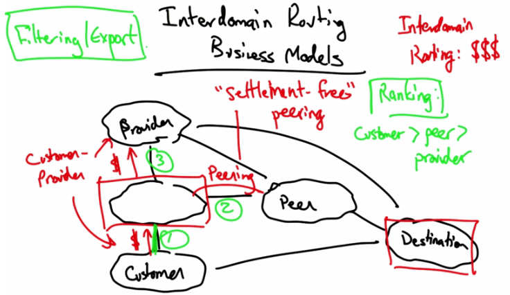

   Interdomain Routing Business Models — "Settlement-free" peering. Customer-Provider
   relationship ($ flows from customer to provider). Ranking: Customer > Peer > Provider.
   Routes through Customer (1), Peering (2), Provider (3).

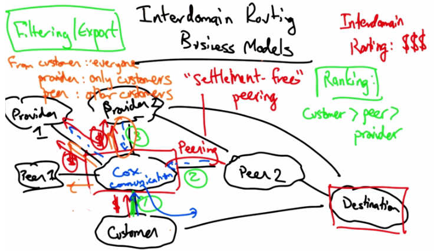

   Interdomain Routing Business Models — Filtering/Export decisions for Cox Communications
   with Provider 1, Provider 2, Peer 1, Peer 2, Customer. From customer: advertise to everyone.
   From peer: advertise only to customers. From provider: advertise only to customers.

So now we're going to look at Interdomain Routing Business Models. So the one thing to
remember about interdomain routing is that it's really all about routing money. Let's consider this
AS that wants to send traffic to a particular destination. Well, in the internet there are two
different types of business relationships: a customer-provider business relationship, where
money flows from customer to provider regardless of the direction that traffic flows; the other
type of business relationship is a peering relationship where an AS can exchange traffic with
another AS free of charge. This is sometimes also called settlement-free peering. So already you
can see given three possible ways to reach the destination. This AS is first going to prefer a route
through its customer, because regardless of the direction of traffic on this link, money is always
flowing from the customer. The peering link is the second most preferable because it's free. And
the least preferable route is through the provider, because the AS has to pay money every time it
sends traffic on this link. This leads to the basic rules of preference in interdomain routing, where
customer routes are preferred over peer routes, which are in turn preferred over provider routes.

The other consideration that an AS has to make is filtering, or export decisions. In other words,
given that an AS learns a route from its neighbor, to whom should it re-advertise that route? To
understand filtering and export decisions, let's add a couple more AS's to the graph. Let's add
another peer, and let's add another provider. Let's call this AS in the middle of the picture Cox
Communications. This ISP might have smaller regional customers and it might also buy transit
connectivity from other providers. Now let's suppose that this AS learns routes to a destination
via its customer, its peer, and its provider. Now we already have established that it would prefer
the customer route, so that it can make money by sending traffic to that destination. But what
about filtering decisions? Well, routes that are learned from a customer, Cox of course would
want to re-advertise to everyone else, because the more people use that route, the more money
Cox makes. Therefore a route that's learned from a customer, gets advertised to everybody else.
On the other hand, a route that's learned from a provider, if it were actually selected, would of
course, only be advertised to customers. It wouldn't make any sense to take a route like this and
advertise it to another provider. The reason, of course, is that money is flowing in the direction of
the providers. So any route that's learned from a provider would never be advertised to another
provider, because it would result in Cox essentially becoming a transit provider between two of
its own providers and paying them both for the privilege of carrying that traffic. So routes
learned from a provider would only ever be advertised to other customers. And similarly, routes
from peers would only be advertised to other customers, not to other peers or other providers. So
to summarize, interdomain routing has both ranking rules, where, given multiple choices, an AS
might prefer a customer route over a peer route over a provider route. And then, given that it
selected a particular route from either a customer, a provider, or a peer, it makes different
decisions about where to re-advertise that route to other neighboring ASes. Now as it turns out, if
every AS in the internet followed these rules exactly, then routing stability is guaranteed. Now
you might wonder, isn't routing stability guaranteed already? And it turns out that it isn't.

Interdomain Routing Can Oscillate!
------------------------------------

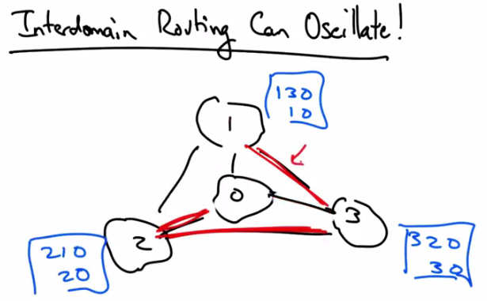

   Interdomain Routing Can Oscillate! — 4-AS topology. AS 0 in center; AS 1 prefers path 1-3-0,
   AS 2 prefers path 2-1-0, AS 3 prefers path 3-2-0 (clockwise). Each AS prefers the longer
   clockwise path over the direct path.

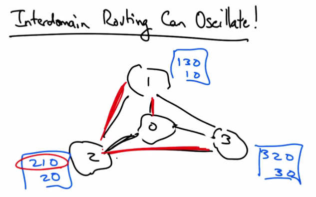

   Interdomain Routing Can Oscillate — AS 3 switches to 3-2-0, breaking AS 1's preferred path.
   AS 1 must switch back to direct path. Oscillation continues indefinitely.

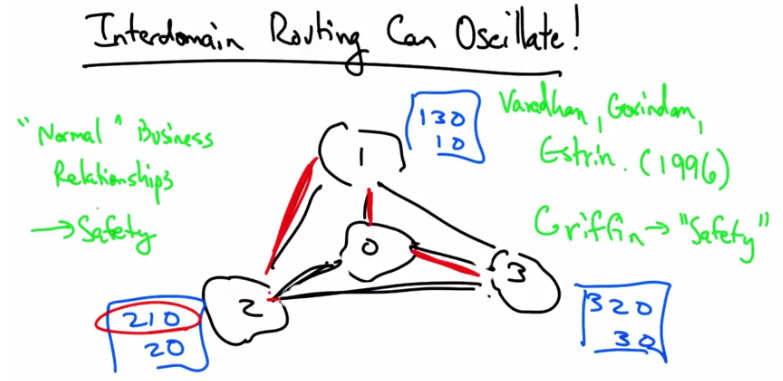

   Interdomain Routing Can Oscillate — "Normal" Business Relationships → Safety.
   Varadhan, Govindan, Estrin (1996). Griffin → "Safety". BGP correctness property.

In fact, interdomain routing can oscillate indefinitely. To see why, consider the following 4 AS
topology, where each AS specifies preferred paths, presumably via local preference. So each AS
prefers the AS in the clockwise direction, rather than the shorter, direct path. Now it's pretty easy
to see that there's no stable solution. Let's suppose that we started off with everybody selecting
the direct path. Well, in this case, any one of these ASes would notice that it has a more preferred
path. So for example, AS 1 would see that because AS 3 has picked the direct path, then, in fact,
it could prefer a situation where oscillations can occur indefinitely. Similarly, here now AS 3
sees that it has a more preferred path, 3 2 0, so it might switch to that.

In doing so, it breaks AS 1's path. 1 3 0 no longer works. So AS1 has to switch back to its less
preferred direct path, but now we're in the same situation all over again because now AS2's
preferred path becomes available via 1, so AS 2 now reroutes, and AS 3's most preferred path, 3
2 0, no longer works so it must switch to the direct path.

Now, it's very easy to see that this oscillation continues ad infinitum. This particular pathology
was first discovered by Varadhan, Govindan, and Estrin, in a paper called persistent route
oscillation in interdomain routing, in 1996. Later, Tim Griffin formalized this pathology and
derived conditions for stability. Those stability conditions came to be known as a BGP
correctness property called safety. It turns out that if ASes follow the ranking and export rules
that we discussed, that safety is guaranteed. But, there are various times when those rules are
violated. Business relationships, such as regional peering and paid peering, can occasionally
cause those conditions to be violated. So as it turns out, to this day, BGP is not guaranteed to be
stable in practice, and many common practices result in the potential for this type of oscillation
to occur.
