Software Defined Networking
===========================

Operations and Management Overview
------------------------------------

Welcome to the final third of the course. In the first section, you reviewed the basic building
blocks of the internet, and in the second section, you learned how networks deal with large
amounts of network traffic. In the final section, you'll learn how network operators manage their
networks. More importantly, these topics will introduce you to the forefront of networking
research.

That's right. We're going to cover software defined networking, traffic engineering, and network
security. Let's get started.

Network Management Overview
-----------------------------

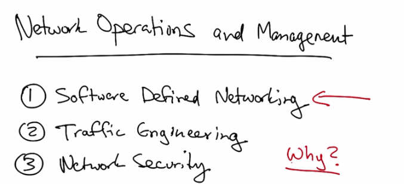

   Network Operations and Management — (1) Software Defined Networking (highlighted),
   (2) Traffic Engineering, (3) Network Security. Why?

Welcome to the third course in CS 6250 where we will be discussing network operations and
management. This segment in the course has three lessons. The first lesson is focused on
software-defined networking and its role in making network operations and management easier.
The second module covers traffic engineering, which is the process by which network operators
reconfigure the network to balance traffic demands across the network. The third lesson covers
network security. We will start with a lesson on Software Defined Networking. But, before we
jump into the details, I'd like to motivate, a little bit — why? In particular, I plan to tell you about
the role of network operators in running the network.

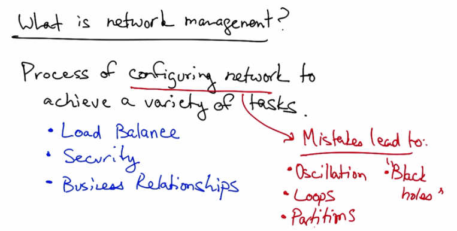

   What is network management? Process of configuring network to achieve a variety of tasks:
   Load Balance, Security, Business Relationships. Mistakes lead to: Oscillation, Loops,
   Partitions, Black holes.

So what is network management? Network management is the process of configuring the
network to achieve a variety of tasks. Network configuration achieves a variety of tasks
including balancing traffic load across the network, achieving various security goals, and
satisfying business relationships that may exist between the network that's being configured and
neighboring networks, such as the network's upstream Internet service provider. A key aspect to
network management is configuring the network. Unfortunately, if the network is not configured
correctly, many things can go wrong. Configuration mistakes can lead to problems such as
persistent oscillation, whereby routers can't agree on a route to a destination; loops, where
packets get stuck in between two or more routers and never actually make it to the destination;
partitions, whereby the network is split into two or more segments that are not connected; and
black holes, where packets reach a router that does not know what to do with the packet and
drops it as opposed to sending it on to its ultimate destination.

Why is Configuration Hard
--------------------------

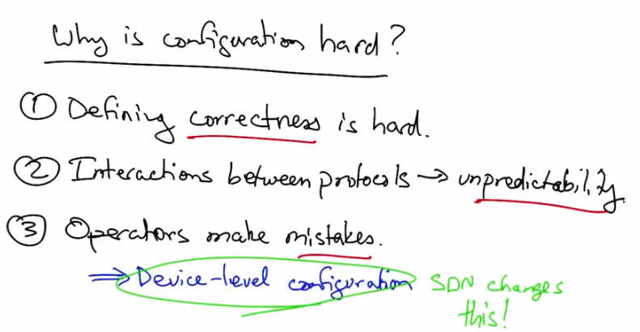

   Why is configuration hard? (1) Defining correctness is hard. (2) Interactions between
   protocols → unpredictability. (3) Operators make mistakes → Device-level configuration.
   SDN changes this!

So why is configuration hard to get right? First, it's difficult to define what we mean by correct
behavior in the first place. Second, the interactions between multiple routing protocols can lead
to unpredictability. Furthermore, each autonomous system on the internet is independently
configured, and the interaction between the policies of these autonomous systems can lead to
unintended, or unwanted behavior. The third reason that configuration is hard is that operators
simply make mistakes. Configuration is difficult, and network policies are very complex.
Furthermore, Network configuration has historically been distributed across hundreds or more
network devices across the network, where each device is configured with vendor-specific low-
level configuration. We'll see in the first part of this course how Software Defined Networking or
SDN changes this by centralizing the network's configuration in a logically centralized
controller.

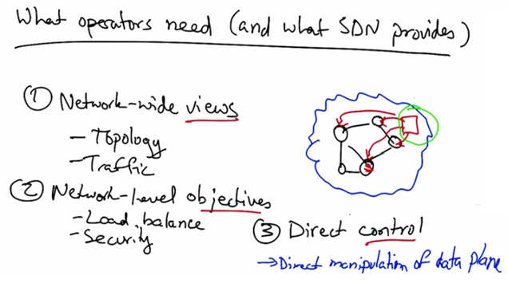

   What operators need (and what SDN provides) — (1) Network-wide views: Topology, Traffic.
   (2) Network-level objectives: Load balance, Security. (3) Direct control → Direct manipulation
   of data plane.

At a very high level, Software Defined Networking provides exactly the primitives that operators
need to run the network better. In particular, SDN provides operators three things. The first is
network-wide views of both topology and traffic. The second is the ability to satisfy network
level objectives such as those that we talked about before including load balance, security, and
other high level goals. The third thing that software defined networking provides (that network
operators need) is direct control. In particular, rather than requiring network operators to
configure each device individually with indirect configuration, SDN allows an operator to write a
control program that directly affects the data plane. So rather than having to configure each
device individually and guess or infer what might happen, software-defined networking allows a
network operator to express network level objectives and direct control from a logically
centralized controller.

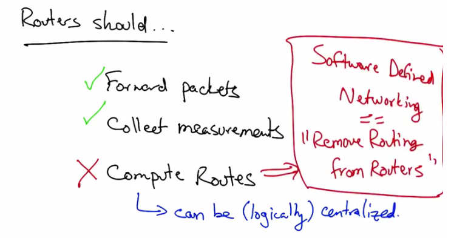

   Routers should: Forward packets (check), Collect measurements (check), Compute Routes (X)
   → can be (logically) centralized. Software Defined Networking == "Remove Routing from
   Routers".

So to make network operations easier, routers should forward packets since router hardware is
specialized to forward traffic at very high rates. They should collect measurements such as traffic
statistics and topology information. But, on the other hand, there's no reason that a router should
have to compute routes. Although conventionally routing has operated as a distributed
computation of forwarding tables, the computation doesn't inherently need to run on the routers.
Rather, the computation could be logically centralized and controlled from a centralized control
program. This logical centralization is the fundamental tenant of SDN. So a simple way of
summing up Software Defined Networking is simply to remove routing from the routers, and
perform that routing computation at a logically centralized controller. Now of course, SDN has
evolved to incorporate a much broader range of controls than simply routing decisions, and we'll
talk about the range of control that SDN controllers enable in today's networks throughout this
lesson.

Software Defined Networking
-----------------------------

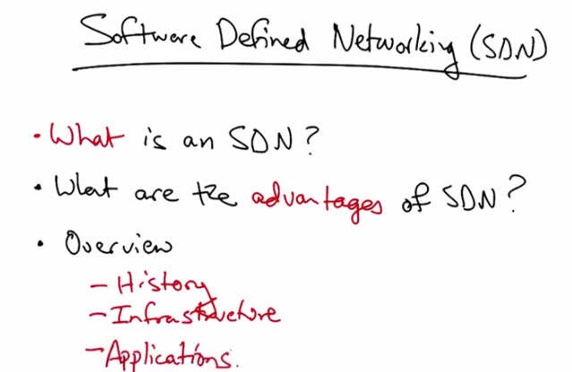

   Software Defined Networking (SDN) — What is an SDN? What are the advantages of SDN?
   Overview: History, Infrastructure, Applications. Data Plane: Forward traffic. Control Plane:
   Compute routing tables. Today: Control + Data on routers. SDN: (1) Logically centralized
   control, (2) Network-wide control.

Let's start with a brief overview of Software Defined Networking, or SDN. We'll first start by
defining SDN, and in particular we'll talk about what is a Software Defined Network. Then we'll
talk about what are the advantages of SDN over a conventional network architecture. We'll
overview the history of SDN, the infrastructure that supports it (in particular how SDNs are
designed and built), and the applications of SDN. Specifically, what they can be used for and
how they can be used to simplify various network management tasks.

Perhaps the best way to understand what an SDN is, is to compare it to the behavior of today's
networks. Today's networks have two functions. The first is the Data Plane, whose task it is to
forward packets to their ultimate destination. But in order for the Data Plane to work, we also
need a way of computing the state that each of these routers has that allows the routers to make
the right decision in forwarding traffic to the destination. The state that lives in each of these
routers that allows the routers to make these decisions about how to forward packets are called
routing tables. It's the job of the network's Control Plane to compute these routing tables. In
conventional networks, the Control and Data Plane both run on the routers that are distributed
across the network. In an SDN, the Control Plane runs in a logically centralized controller.
Additionally, the controller typically controls multiple routers across the network and often, the
control program exerts control over all the routers in the network, thus facilitating network-wide
control. These two characteristics are the defining features of a Software Defined Network. The
separation of data and control allows a network operator to build a network with commodity
devices, where the control resides in a separate control program. This re-factoring allows us to
move from a network where devices are vertically integrated (making it very tough to innovate)
to a network where the devices have open interfaces that can be controlled by software, thus
allowing for much more rapid innovation.

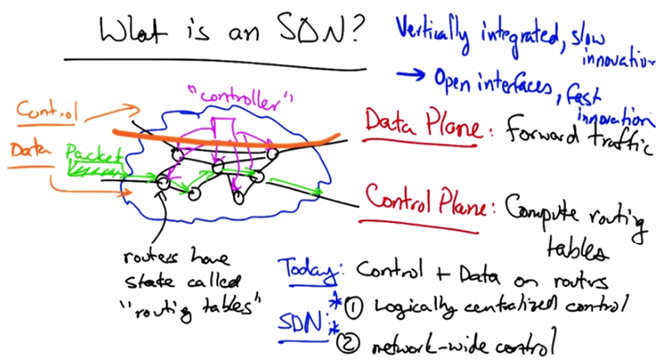

   SDN: A Brief History — Pre-2004: Distributed configuration. 2004: RCP (BGP only).
   2005: 4D (Decision, Dissemination/Discovery, Data). 2008: OpenFlow (cheap switches from
   open chipsets).

Let's survey a brief history of SDN. Previous to 2004, configuration was distributed, leading to
buggy and unpredictable behavior. Around 2004, we had the idea to control the network from a
logically centralized high level program. That logically centralized controller focused on the
border gateway protocol and was called the routing control platform, or RCP. In 2005,
researchers generalized the notion of the RCP for different planes. The decision plane, which
computed the forwarding state for devices in the network; the data plane, which forwarded traffic
based on decisions made by the decision plane; and the dissemination and discovery planes,
which provide the decision plane the information that it needs to compute the forwarding state
which ultimately gets pushed to the data plane. Around 2008, these concepts effectively hit the
mainstream through a protocol called OpenFlow. OpenFlow's intellectual roots are with the RCP
and 4D, but OpenFlow was made practical when merchant silicon vendors opened their APIs, so
that switch chipsets could be controlled from software. So suddenly there was an emergence of
cheap switches that were build based on open chip sets that could be controlled from software.
This development effectively allowed us to decouple the control plane and the data plane in
commodity switching hardware.

Advantages of SDN
------------------

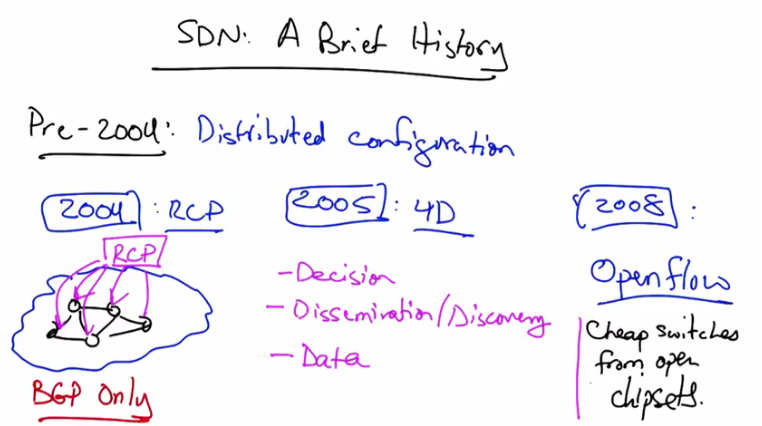

   Advantages of SDN — (1) Coordination, (2) Evolve, (3) Reasoning — all from Separate
   Control plane => Apply CS techniques (PL, software engineering).

SDN has many advantages over conventional networks. It's easier to coordinate behavior among
a network of devices, the behavior of the network is easier to evolve, and it's also easier to reason
about. These characteristics are all rooted in the fact that the control plan is separate from the
data plane. Having a separate control plane or control program allows us to provide conventional
cs techniques to old networking problems. So, whereas before it was incredibly difficult to
reason about or debug a network's behavior, if the network behavior is now controlled by a
logically centralized control program, we can use techniques from programming languages or
software engineering to help us reason about the behavior of the network.

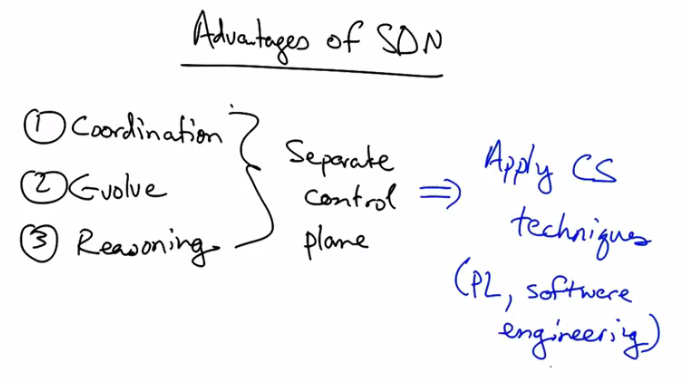

   Infrastructure — Control Plane: Software Program (Python, C). Data Plane: Programmable
   Hardware. Controller sends control commands via OpenFlow to "switch".

As far as SDN's infrastructure is concerned, the Control Plane is typically a software program
written in a high level language, such as Python or C. On the other hand, the Data Plane is
typically programmable hardware that's controlled by the control plane. The controller effects the
forwarding state that's in the switch using control commands. Open flow is one standard that
defines a set of control commands by which the controller can control the behavior of one or
more switches.

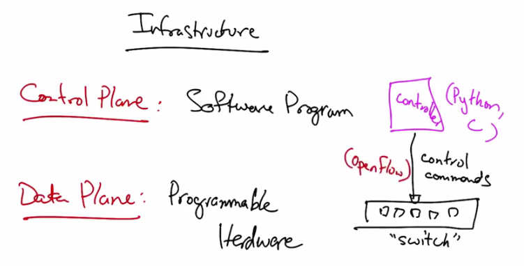

   SDN Applications — Data centers, Backbone networks, Enterprise networks (this course),
   Internet Exchange Points (IXPs), Home Networks.

SDN has many applications including data centers, wide area backbone networks, enterprise
networks, internet exchange points (or IXPs), and home networks. Later modules in this course
will explore how software defined networks can solve network management problems in some of
these areas. In this course we will focus in particular on the first three applications.

Control Plane Operations
-------------------------

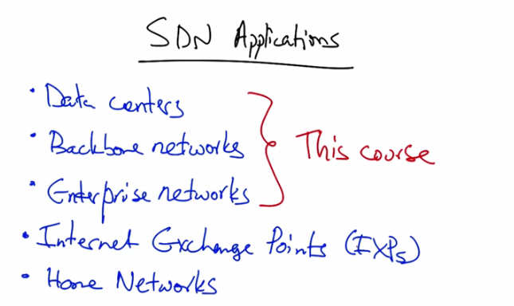

   Quiz: Examples of control plane operations? Computing a forwarding path that satisfies a
   high-level policy, Computing a shortest path routing tree, Rate-limiting traffic, Load balancing
   traffic based on hash of source IP, Authenticating a user's device based on MAC address.

So as a quick quiz, which of the following are examples of control plane operations? Computing
a forwarding path that satisfies some high-level policy such as an access control policy?
Computing a shortest path routing tree? Rate-limiting traffic so that the overall sending rate
doesn't exceed a certain throughput? Load balancing traffic based on a hash of the packet
source IP address? Or authenticating a user's device based on its MAC address? Please check all
options that apply.

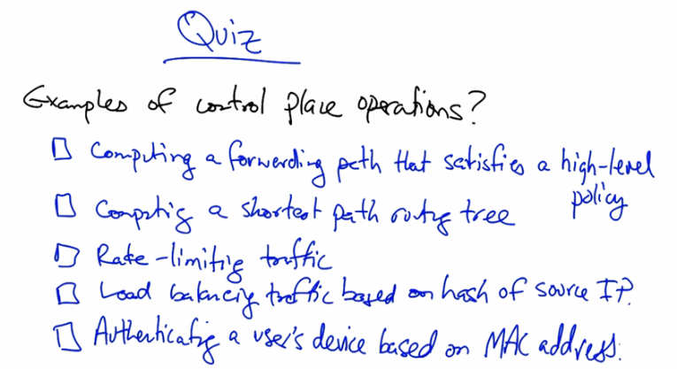

   Quiz solution: Computing a forwarding path (checked), Computing shortest path routing tree
   (checked), Rate-limiting traffic (NOT checked), Load balancing based on hash of source IP
   (NOT checked), Authenticating a user's device based on MAC address (checked).

The job of the Control Plane is to compute the state that ultimately ends up in the data plane. So
computing a forwarding path that satisfies a high-level policy is something that the Control Plane
would do. The Control Plane can also compute shortest path routing trees. And it might make
decisions about whether or not a user's device should be allowed to send traffic or not based on
that device's MAC address. Rate-limiting is something that is typically done in the data plane,
and the load-balancing example that we have listed here is such that a router or a switch would
make decisions in the data plane based on a hash of the source IP address. So all of the decisions
are being made at forwarding time, not by a centralized high-level program.

Separating Data and Control
-----------------------------

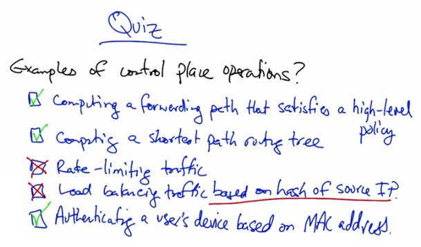

   Control and Data Planes — Control Plane: Logic that controls forwarding behavior. Examples:
   routing protocols, configuration for network middleboxes. Routing protocol computes paths
   to forwarding table entries. Data Plane: Forward traffic according to control plane logic.
   Examples: forwarding, switching.

Let's quickly review the difference between the Control plane and the Data plane. The control
plane is the logic that controls forwarding behavior. Examples of control plane functions include
routing protocols as well as logic for configuring network middle boxes. Now, a routing protocol
might compute shortest paths or a topology, but ultimately, the results of such computations must
be installed in switches that actually do the forwarding. The forwarding table themselves and
specifically the actions associated with forwarding traffic according to the Control plane logic is
what constitutes the data plane. So examples of data plane functions include forwarding packets
at the IP layer and doing things like switching at layer two. So, to reiterate, routing protocol
functions that compute the paths are control plane functions, whereas the act of actually taking a
packet on an input port and forwarding it to an output port, is a data plane function.

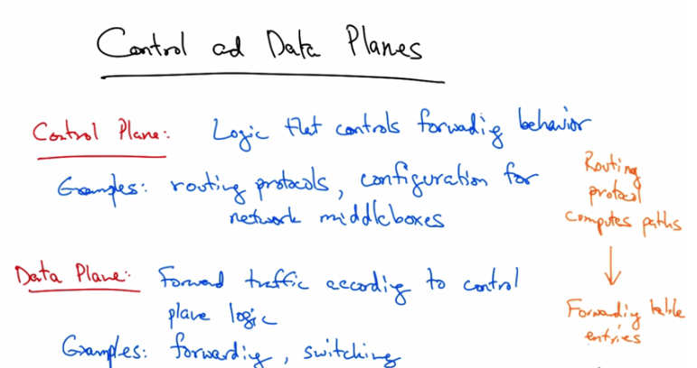

   Why is separating data and control a good idea? (1) Independent evolution: software and
   hardware can evolve independently. (2) Control from high-level program: debug/check
   behavior more easily.

So why is separating the data and control planes a good idea? The first reason is independent
evolution and development. Thus, software control of the network can evolve independently of
the network hardware. The second reason that separating data and control plane is a good idea is
the opportunity to control the network behavior from a high-level software program. Controlling
the network from a high-level program in theory allows network operators to debug and check
network behavior more easily than in the status quo where network behavior is determined by
the distributed low level configuration across hundreds of switches and routers.

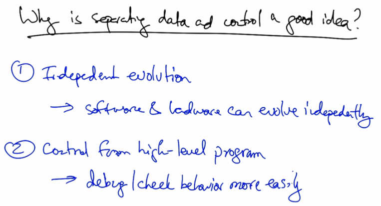

   Opportunities — (1) Data centers: VM migration. (2) Routing: More control over decision
   logic. (3) Enterprise networks: Security. (4) Research: Coexistence with production.

The separation of data and control provides opportunities for better network management in data
centers by facilitating such network tasks as virtual machine migration to adapt to fluctuating
network demands. In Routing, the separation of data and control provides more control over
decision logic. In Enterprise networks, SDN provides the ability to write security applications
such as applications that manage network access control. In Research networks, the separation of
data and control effectively allows us to virtualize the network, so that research networks and
experimental protocols can co-exist with production networks on the same underlying network
hardware.

Reasons for Separating Data and Control
-----------------------------------------

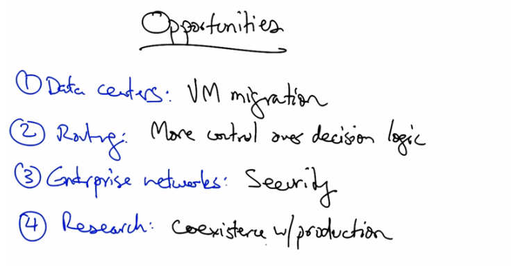

   Quiz: Reasons for separating data and control? No single point of failure?, Ability to scale to
   much larger networks?, Independent evolution of data and control plane?, Separating vendor
   hardware from control logic?, Easier reasoning about network behavior?

So as a quiz, what are some of the reasons for separating the control and data planes?
Eliminating a single point of failure? Ability to scale to much larger networks? Independent
evolution of the data and control plane? Separating vendor hardware from control logic? Or ease
of reasoning about network behavior? Please check all options that apply.

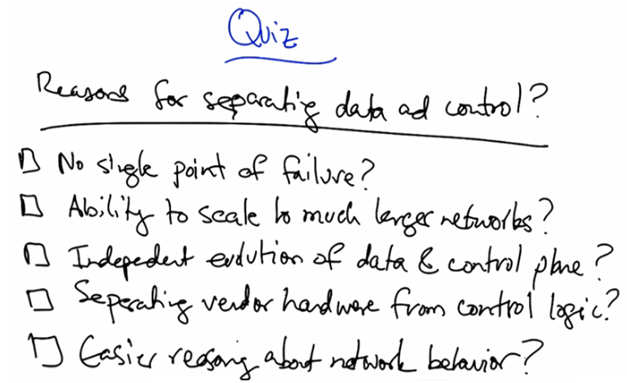

   Quiz solution: No single point of failure (NOT checked), Ability to scale (NOT checked),
   Independent evolution of data and control plane (checked), Separating vendor hardware from
   control logic (checked), Easier reasoning about network behavior (checked).

Separating the data and control plane can allow for independent evolution of the data and control
plane, separating vendor hardware from the logic that controls the behavior of the network, and
the potential to more easily reason about network behavior since the behavior is now controlled
from a single, logically-centralized control program. While it's possible that separating the
control plane from the data plane could result in architectures that are more fault tolerant or more
scalable, the separation of data and control planes does not inherently make the network more
fault tolerant or more scalable. Therefore, neither of the first two options apply.

Example Data Centers
---------------------

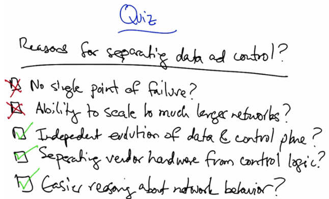

   Example: Data Centers — 20,000 servers/cluster in "Racks" of servers → 400,000 Virtual
   Machines. Layer 2 addressing ("flat"). Problem: Provisioning/migration in response to load.
   Solution: Program switch state from a central database. Must update switch state!

One example where SDN can provide huge wins, is in the data center. A data center typically
consists of many racks of servers, and any particular cluster might have as many as 20,000
servers. Assuming that each one of these servers can run about 200 virtual machines, that's
400,000 virtual machines in a cluster. A significant problem is provisioning or migrating these
virtual machines in response to varying traffic loads. SDN solves this problem by programming
the switch state from a central database. So, supposing I have two virtual machines within the
data center that need to communicate with one another, the forwarding state in the switches in
the data center ensures that traffic is forwarded correctly. If we need to provision additional
virtual machines or migrate a virtual machine from one server to another in the data center, the
state in these switches must be updated. Updating the state in this fashion is much easier to do
from a central controller or a central database. Facilitating this type of Virtual Machine
Migration in the data center is one of the early killer apps of software-defined networking. This
type of migration is also made easier by the fact that the servers are addressed with Layer two
Addressing, and the entire data center looks like a flat, layer two topology. What this means is
that a server can be migrated from one portion of the data center to another without requiring the
virtual machine to obtain new addresses. All that needs to happen for forwarding to work is the
state of these switches needs to be updated. The task of updating switch date in this fashion is
very easy to do when the control and data planes are separate.

Managing Data Centers
----------------------

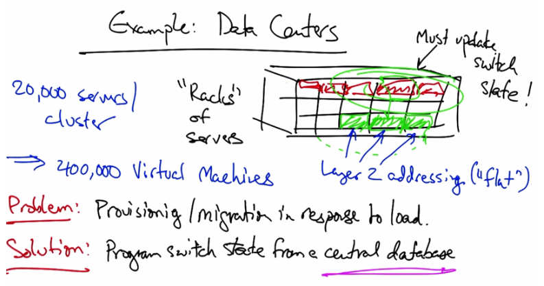

   Quiz: How does control/data separation make managing data centers easier? Monitoring/control
   of routes from a central point, Migrating VMs without renumbering host addresses, Fewer
   switches, Auto load balance.

Let's have another quiz on data centers. So how does the control/data plane separation make
managing data centers easier? The ability to monitor and control routes from a central point of
control? The ability to migrate virtual machines without renumbering host addresses? A
requirement for fewer switches? Or making load balance automatic? Please again check all that
apply.

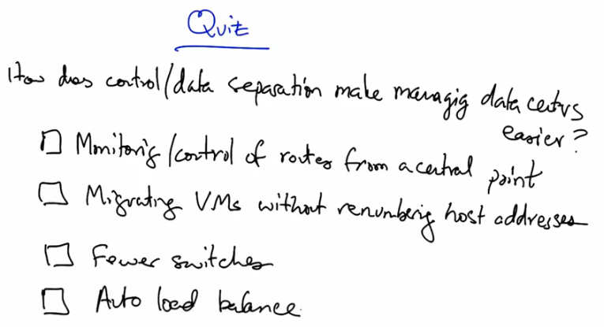

   Quiz solution: Monitoring/control of routes from central point (checked), Migrating VMs
   without renumbering (checked), Fewer switches (NOT checked), Auto load balance (NOT
   checked).

So as we discussed, control/data plane separation can make it easier to manage the data center by
monitoring and controlling routes from a central point and allowing virtual machines to be
migrated without renumbering host addresses. The control/data plane separation does not
inherently make it possible to build a data center with few switches nor does it automatically
balance load.

Challenges
-----------

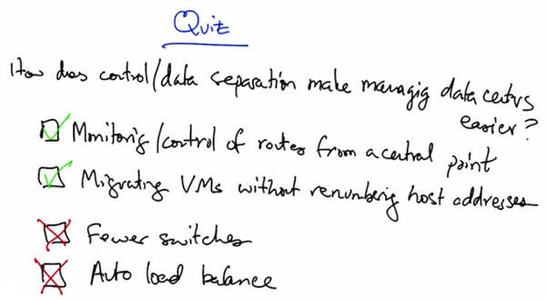

   Example: Backbone Security — Goal: Filter attack traffic. Diagram shows Attacker sending
   traffic toward Victim, with RCP installing a "null route" to block the attack traffic.

As another example where control and data plane separation comes in handy, let's look at the
security of internet backbones, where filtering attack traffic is a regular network management
task. Suppose that an attacker is sending lots of traffic towards a victim. In this case a
measurement system might detect the attack, identify the entry point, and a controller such as the
RCP might install what is called a null route to ensure that no more traffic reaches the victim
from the attacker.

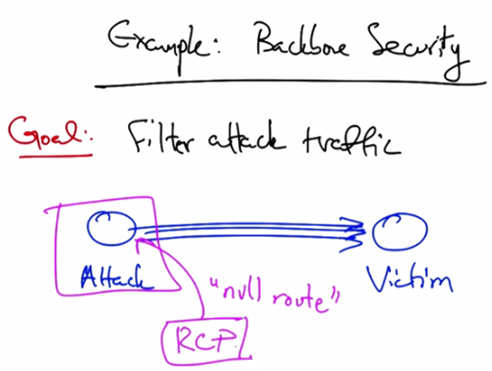

   Challenges — (1) Scalability: Hundreds to thousands of switches. (2) Consistency: Ensuring
   different replicas see same view. (3) Security/Robustness: Failure or compromise?

Two fundamental challenges with SDN are scalability and consistency. In an SDN, a single
control element might be responsible for many forwarding elements. So control elements might
be responsible for hundreds to thousands of switches. Of course, for redundancy and reliability,
typically we want to replicate the controller. So while the controller is logically centralized,
physically there may be many replicas. And in such a deployment scenario, we need to ensure
that different controller replicas see the same view of the network so that they make consistent
decisions when they're installing state in the data plane. A final challenge that's also worth
mentioning is security, or robustness. In particular, we want to make sure that the network
continues to function correctly in the event that a controller replica fails or is compromised.

Coping With Scalability
------------------------

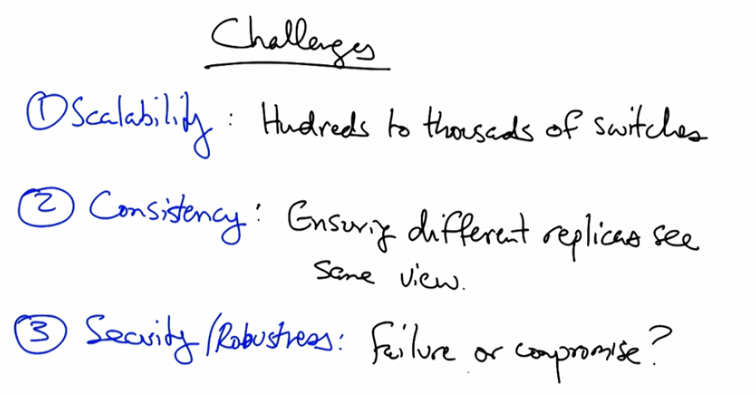

   Quiz: Ways to cope with scalability challenges? Eliminate redundant data structures, Only
   perform control-plane operations for a limited number of ops, Send all traffic to controller,
   Cache forwarding decisions in switches, Run multiple controllers.

So as a brief quiz or thought question, let's think about some approaches for coping with the
scalability associated with control and data plane separation. One could, for example, eliminate
redundant data structures in the controller. Or only performing control operations for a limited
number of network operations, such as only performing control operations for routing decisions.
One might send all traffic through the controller to minimize forwarding decisions that routers
and switches need to make. One could cache forwarding decisions in the switches, or run
multiple controllers.

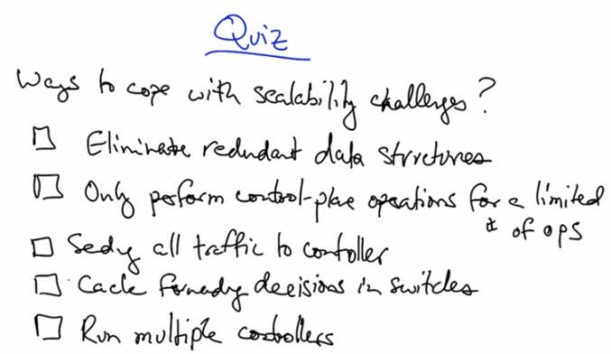

   Quiz solution: Eliminate redundant data structures (checked), Only perform control-plane ops
   for limited number of ops (checked), Send all traffic to controller (NOT checked), Cache
   forwarding decisions in switches (checked), Run multiple controllers (checked).

Eliminating redundant data structures can help save memory in the control program running at
the controller. Only performing a fixed number of network management operations, such as
routing, can insure that the controller doesn't have to do too much, thereby improving scalability.
Caching forwarding decisions that the control plane has already made in the switches can ensure
that not too much traffic is redirected to the controller. And running multiple controllers can
distribute the load of the control plane across multiple replicas. Sending all traffic to the
controller only increases the controller load, and would not help with scale ability.

Different SDN Controllers
--------------------------

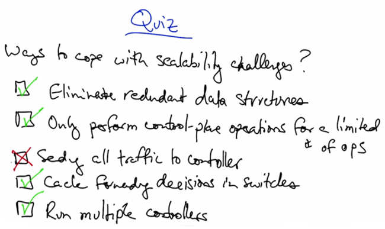

   Different SDN Controllers — NOX, Ryu, Floodlight, Pyretic, Frenetic (grouped as "Programming
   SDN"); Procera, RouteFlow, Trema.

Now that we have a better understanding of the benefits of separating the data and control plane,
let's now have a look at the many different options for SDN controllers. There are a number of
different SDN controllers that exist, including NOX, Ryu, Floodlight, Pyretic, Frenetic, Procera,
RouteFlow, Trema, and the list goes on. In this lesson, we will explore the merits of these three
controllers. And when we get to the lesson on Programming SDN, we will take a close look at
Frenetic and Pyretic. Let's now jump in and take a look at these three controllers.

NOX Overview
-------------

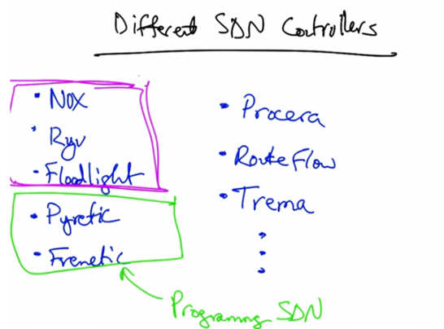

   NOX: Overview — First-generation OpenFlow controller (http://www.noxrepo.org/).
   Open-source, stable, widely used. Two flavors: "Classic" (C++/Python), "New Nox" (C++
   only, fast, clean).

Nox was a first generation open flow controller. It is open source, stable, and widely used. There
are two flavors of Nox, Classic Nox and the New Nox. Classic Nox was written in C++ and
Python and is no longer supported. The new Nox is C++ only. The Code base is fast, clean, and
well supported. More information about Nox is available at noxrepo.org.

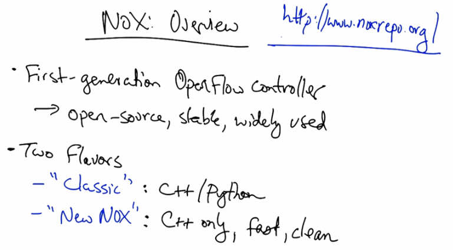

   NOX: Architecture — Components: (1) Switches, (2) Network-attached servers. Abstraction:
   Switch control. Control: Flow granularity (Flow = {srcIP, dstIP, src port, ...}). Apps and
   App Controller maintain a network view via OpenFlow to switches and servers.

In a Nox network, there may be a set of switches and various network-attached servers. The
controller maintains a network view and the controller may also run several applications that
operate on that network view. The basic abstraction that NOX supports is a switch control
abstraction where OpenFlow is the prevailing protocol. Control is defined at the granularity of
flows which are defined by a ten-tuple in the original OpenFlow specification. So depending on
whether a particular packet matches a subset of values specified as a flow rule, the controller
may make different decisions for packets that belong to different parts of flow space, or packets
that match different subsets of the fields defined by a flow.

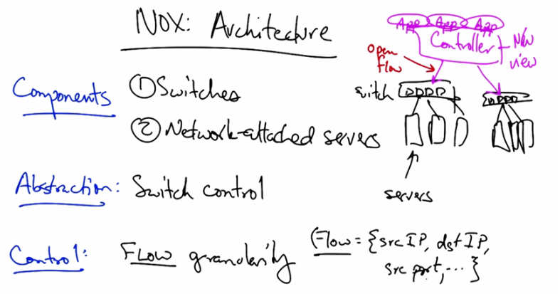

   NOX Operation — Flow: (header, counter, actions) based on 10-tuple. Switch receives packet,
   updates counters, applies corresponding actions: Forward, Drop, Send to controller.

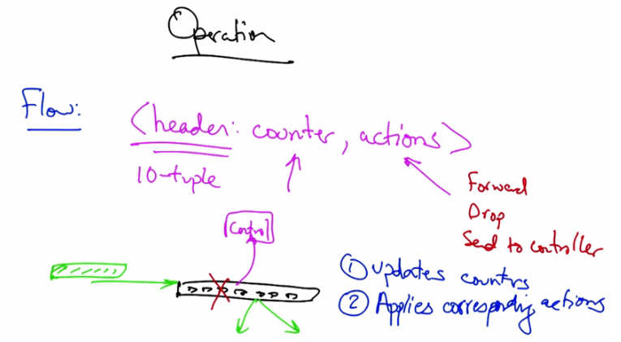

   NOX Programmatic Interface — Events: packet in, Join/Leave, stats. Controller maintains
   network view, speaks control protocol (OpenFlow) to switches.

A flow is defined by the header or the 10-tuple which I just alluded to, a counter which maintains
statistics, and actions that should be performed on packets that match this particular flow
definition. Actions might include forwarding the packet, dropping it, or sending it to the
controller. When a switch receives a packet, it updates its counters for counting packets that
belong to that flow and applies the correspondence actions for that flow, which might include
forwarding, dropping or sending to a controller.

The basic programmatic interface for the Nox controller is based on events. A controller knows
how to process different types of events, such as a switch, join, or leave; a packet in or packet
received event should the switch redirect packet to controller; as well as various statistics. The
controller also keeps tracks of a network view, which includes a view of the underlying network
topology, and it also speaks a control protocol to the switches in the network. That control
protocol effectively allows the controller to update the state in the network switches. The Nox
controller implements the OpenFlow protocol.

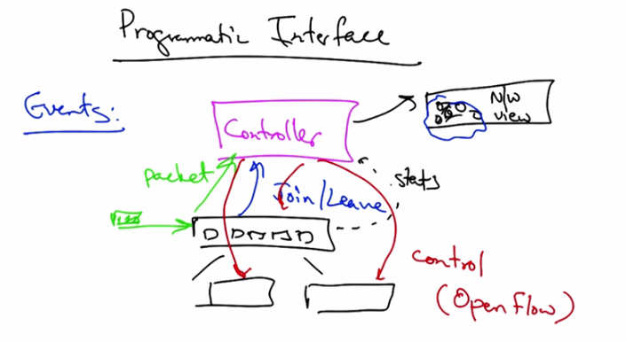

   NOX Characteristics — (1) C++, (2) OpenFlow 1.0 (CPQD: 1.1-1.3), (3) Model: Event based
   → Event handlers. Performance good but Low-level of C++ is a drawback. "Pox": Easy to
   use but lower Performance.

Nox is implemented in C++, and it supports OpenFlow 1.0. A fork of Nox called CPQD
supports versions 1.1, 1.2, and 1.3. The programming model is event based and a programmer
can write an application by writing even handlers for the Nox controller. NOX provides good
performance but requires you to understand and be comfortable with the facilities and semantics
of low level OpenFlow commands. Later in this module, we will explore controllers based on
pyretic and frenetic that do not have this characteristic. NOX also requires the programmer to
write the control application in C++, which can be slow for development and debugging. To
address the shortcomings that are associated with development in C++, Pox was developed. Pox
is widely used, maintained, and supported. It's also easy to use, and easy to read and write the
control programs. Of course, as might come with implementing a controller in python, the
performance of Pox is not as good as the performance of Nox.

When to Use Pox
----------------

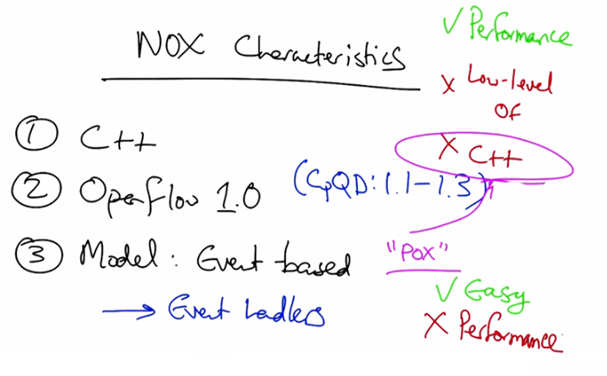

   Quiz: When to use Pox? Options: Class Project, Large internet data center, University research.

So as a quick quiz, when might you use Pox? In a class project? In a large internet data center?
Or in a university research project? Please check all that apply.

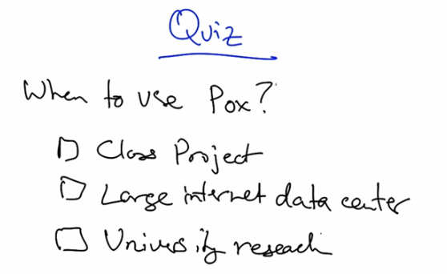

   Quiz solution: Class Project (checked), Large internet data center (NOT checked), University
   research (checked).

You might use Pox in a class project or in a university research project where there's a need to
quickly prototype and evaluate a brand new control application. Pox is less applicable in a large
internet data center because it does not perform as well as other controllers.

Ryu, Floodlight, Nox, and Pox
-------------------------------

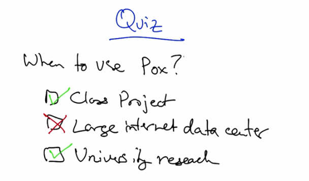

   Controller comparison — Ryu: Python, OF 1.0/1.2/1.3/Nicira, OpenStack, Performance.
   Floodlight: Java, OF 1.0, forked from "Beacon", Documentation/REST/Performance, Hard to
   learn. Nox: C++, OF 1.0, Performance, Slow programming/debugging. Pox: Python, OF 1.0,
   Performance, Easy to program.

Other controllers include Ryu, which is an open source Python controller. Ryu supports
OpenFlow 1.0, 1.2, and 1.3, as well as the Nicira extensions. It also works with Open Stack. The
support for the later versions of OpenFlow and the integration with the Open Stack, are
advantages over other SDN controllers. Because Ryu is implemented in Python, it still does not
perform as well other SDN controllers, such as Nox. Another popular SDN controller is
Floodlight. Floodlight is written in Java, it supports Overflow 1.0, and is a fork from the early
Beacon controller. Floodlight is maintained by big switch networks. Advantages include good
documentation, integration with the REST API, and good performance. Unfortunately, it also has
a fairly steep learning curve. So you should use Floodlight if you already know Java, if you need
production level performance and support and you will use the REST API to interact with the
controller. So we can compare these two controllers with the two controllers that we already
discussed, Nox and Pox. We have controllers in three different languages: Python, Java, and
C++. We have controllers that support later versions of OpenFlow, and support Open Stack. And
we have controllers that provide better performance, as well as controllers that are easier to use
for rapid prototyping. All of these controllers are still relatively hard to use because they entail
interacting directly with OpenFlow flow table modifications, which operate at a very low level of
matching, on flows and performing specific actions. As we'll see, it's possible to develop
programming languages on top of these controllers that make it much easier for a network
operator to reason about network behavior. Before we jump into higher level programming
languages, however, let's first see how we can use these existing control frameworks to
customize network control.

Customizing Control
--------------------

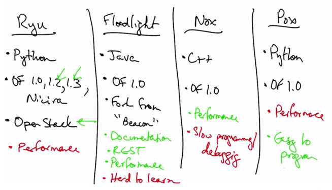

   Customizing Control — Review hub/switch. Pox controller with simple Mininet topology.
   Two types of control: Hub, Switch.

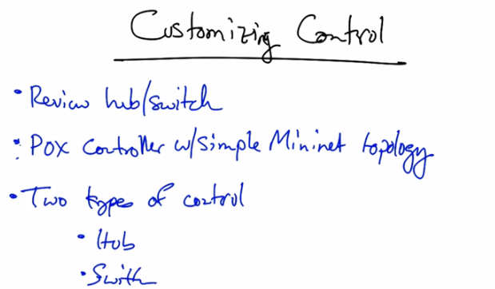

   Hub implementation in Pox showing Python code: def handle_ConnectionUp creates ofp_flow_mod,
   appends OFPP_FLOOD action, sends message back to switch. def launch registers ConnectionUp
   listener. Hub diagram showing Controller flooding packets to all ports.

In this lesson, we will learn how to write control programs to customize network control, we will
review the operation of a hub and a learning switch, then we will explore how to use the POX
controller to create a simple MiniNet topology, and then we will explore how to customize the
Pox controller to perform two types of network control.

As a review, when a host sends a packet to a hub, the hub maintains no state about which output
port a package should be forwarded to reach a particular destination. Therefore, the hub simply
forwards the input packet on every output port. In Pox, this code is fairly simple. When the
controller starts, it adds a listener that listens for a connection up, which is a connection from a
switch. When the switch connects, it simply sends an OpenFlow flow modification back to the
switch which says flood all packets out every output port. The first function here involved
creates the open-flow massage and the second sends that message back to the switch.

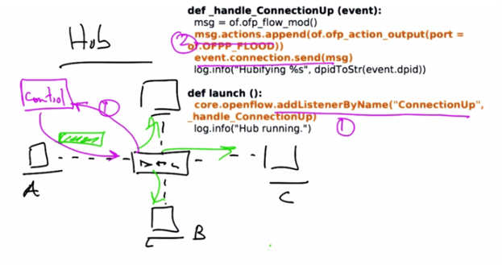

   Switch diagram and Pox Algorithm for Switch — (1) Update address/port table. (2) If
   multicast, flood. (3) If no table entry, flood. (4) If src=dst, drop. (5) Install flow table entry.

In contrast, a learning switch maintains a switch table that's initially empty. But when a packet
arrives on input port one, the switch creates a table that associates host A with output port one
such that whenever a subsequent packet is destined for destination A, the switch knows to
forward the packet via output port one. I won't show you the full Python code here, but it's fairly
simple, and you can go look at the Pox distribution to see the learning switch example. As
before, when the first packet arrives at the switch, it is diverted to the controller, at this point, the
controller maintains a hash table that maps the address to the output port. When it sees that first
packet from Host A, it updates the address and port table. If the packet's a multicast packet, the
controller makes a decision to flood that packet on all output ports. Likewise, if there's no table
entry for the destination for that packet, the controller also instructs the switch to forward the
packet on all output ports. If the source and destination address are the same, the controller
instructs the switch to drop the packet. Otherwise, the controller installs the flow table entry
corresponding to that destination address and output port. Installing that flow table entry in the
switch prevents future packets for that flow from being redirected to the controller. Rather, all
subsequent packets on that flow can be handled directly by the switch, since it now knows which
output port to send a packet for that particular destination.

Summary
--------

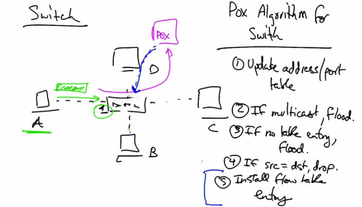

   Summary — Switching: {*, *, ... dst MAC, *} → output port. Flow Switching: {switch port,
   src MAC, dst MAC, type, VLAN, src IP, dst IP, ...} → output. Firewall: {src MAC, *, *, ...}
   → forward/drop. Modifying forwarding behavior is easy!

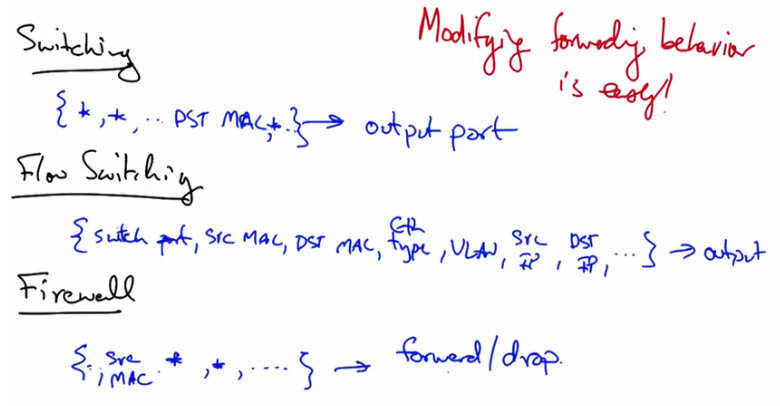

   Caching — (1) Packets only reach controller if no flow table entry at switch. (2) When
   controller decides on action, installs it in switch. (3) Decision/flow table entry is cached.

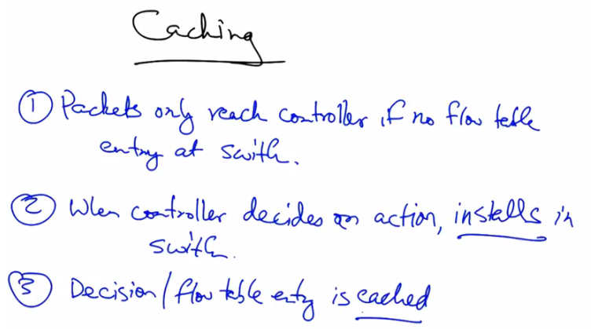

   Summary — Customizing control is easy! Turning switch to firewall takes less than 40 lines of
   code. Performance benefits of caching rules/decisions.

OpenFlow makes modifying forwarding behavior easy because forwarding decisions are based
on matches on the OpenFlow 10-tuple. Layer two switching is simply a match on the destination
Mac address which has a corresponding action of forwarding out a particular output port. If all of
the fields are specified for forwarding out a particular output port, then we have flow switching
behavior. If all of the flow specifications are wild carded except for, say, the source MAC
address to make a forwarding or drop decision, then we have a firewall. Constructing a firewall
is as simple as building a hash table that stores key value pairs, where the table maps a switch
and source MAC address to a true or false value depending on whether traffic should be
forwarded or dropped. The controller might then only decide to forward traffic if the firewall
entry maps to true.

It is important to emphasize the performance implications of caching the decisions at the switch.
So, packets only reach the controller if there's no flow table entry at the switch. If on the other
hand, there is a float table entry at the switch, then the switch can simply forward the packets
rather than sending them to the controller. So when a controller decides to take an action on a
packet, it installs that action as a flow table entry in the switch, and that decision or flow table
entry is cached until that flow table entry expires.

In summary, customizing control is easy. We've explored how to use the POX controller to
develop alternate control programs. And it's possible to turn a switch into a firewall in less than
40 lines of python code. We also explored the performance benefits of caching rules and
decisions to avoid sending too much traffic to the controller. As we know, forwarding
performance in a switch is as fast, but whenever we have to send traffic to the controller, it slows
things down. So whatever decisions we can cache in the switch will only serve to improve the
performance of the network.
