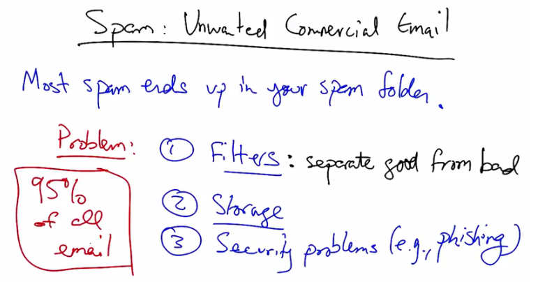
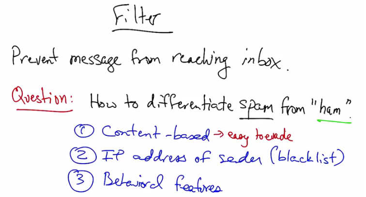
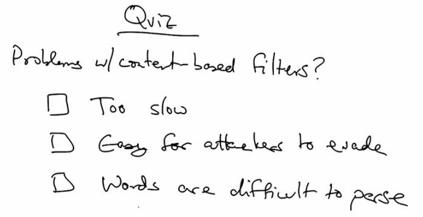
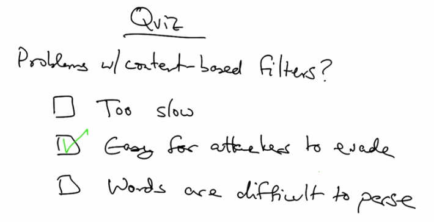
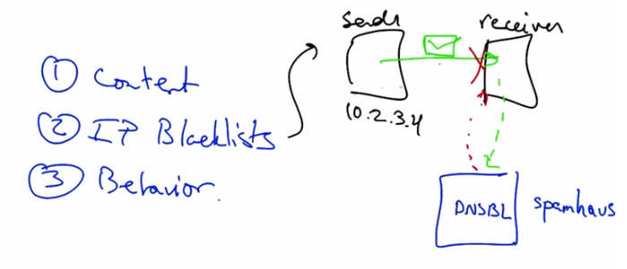
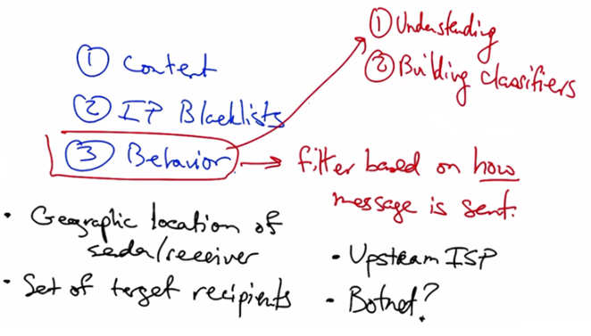
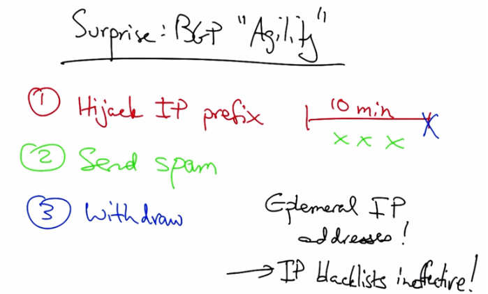
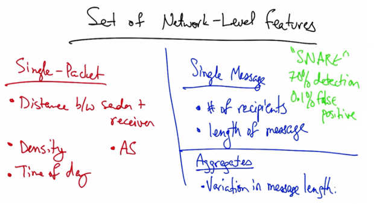

Spam
====

Lecture 11.2: Spam

Spam
-----

   Spam: Unwanted Commercial Email — Most spam ends up in your spam folder. Problems:
   (1) Filters: separate good from bad, (2) Storage, (3) Security problems (e.g., phishing).
   95% of all email is spam.

Okay, in this lesson, we will talk about spam or unwanted commercial email. Now, you might
not think that you receive a lot of spam, but the fact of the matter is that most of it goes to your
spam folder. So one might think, what's the problem? Well, in fact, spam remains a scourge for
network operators. In particular, someone has to design the filters that separate the good traffic
from the bad traffic. Additionally, even if email is classified as spam, if it's accepted for delivery,
the Internet's mail protocols dictate that the server has to keep the mail, because it's told the
receiver that it has accepted the mail. This creates the potential for spam to consume a significant
amount of storage space on email servers. Finally, spam can create security problems for users
who receive spam emails. If the spam messages contain a payload that could be harmful, such as
malware or a phishing attack, or an attempt to steal a user's private or sensitive information, such
as a password. Now even though you don't see the mail because of these filters, something like
95% of all email traffic is spam. Some reports from the Anti-Phishing Working Group suggests
that something like 1 in every 87 emails was a phishing attack. And there's something like
50,000 unique fishing attacks in a month.

   Filter — Prevent message from reaching inbox. Question: How to differentiate spam from
   "ham"? (1) Content-based (easy to evade), (2) IP address of sender (blacklist),
   (3) Behavioral features.

A common approach for getting rid of spam messages is to filter. In other words, prevent the
message from reaching the user's inbox in the first place. Now this begs the question of how to
differentiate spam, or the bad messages, from ham, or the legitimate messages. There are three
different ways to construct filters. One is content-based. In other words, you can look at what's
being said in the mail. For example, if the mail contains particular words, such as Viagra or
Rolex, a content-based filter might pick up on those terms and decide to filter the mail. Second, a
filter might make a decision about whether an email message is spam or ham based on the IP
address of the sender. This method is often called blacklisting. Third, we can construct filters
based on behavioral features, or how the mail is sent. So, for example, if the mail is sent at a
particular time of day, or if it's sent in a batch of emails that are all roughly the same size, then
we may be able to figure out that a message is likely spam simply based on the sender's sending
behavior. Now each of these approaches are complimentary, but content-based filtering and IP-
based filtering each have problems. Content-based filters are relatively easy for attackers to
evade. A recent large commercial mail operator recently told me that he saw something like
80,000 different spellings of Viagra. But additionally, messages can be carried not only in text,
but in images, Excel spreadsheets, or even MP3s or movies. Therefore, spammers can easily alter
the features of an email's content and adjust those features and change them to evade content-
based filters. On the flip side, those maintaining the filters suffer a relatively high cost, because
the filters must be continually updated as content changes and the means of carrying the content
becomes more sophisticated.

Content-based Email Filter Quiz
---------------------------------

   Quiz: Problems with content-based filters? Too slow, Easy for attackers to evade,
   Words are difficult to parse.

So, as a quick quiz, what are some problems with content-based email filters? Are they too slow?
Are they easy for attackers to evade? Or are words in texts of emails difficult to parse? In this
case, please choose the single best answer.

Content-based Email Filter Quiz Answer
----------------------------------------

   Quiz Answer: Easy for attackers to evade (checked). Spammers can embed messages in
   images, MP3s, Excel spreadsheets to bypass content filters.

As we discussed, content-based filters are easy for attackers to evade because they can very
easily change the content of the message that is carrying the spam that they wish to deliver. They
can embed their message in things like images, mp3's, Excel spreadsheets, and so forth, making
it relatively difficult for the filter maintainers to keep up.

IP Blacklisting
----------------

   IP Blacklisting — Sender sends email with IP 10.2.3.4. Receiver queries DNSBL (e.g.,
   Spamhaus) to check if IP is blacklisted before accepting message.

   Behavioral filtering — Filter based on how message is sent: Geographic location of
   sender/receiver, Set of target recipients, Upstream ISP, Botnet membership.
   Challenges: (1) Understanding network-level behavior, (2) Building classifiers.

So we've talked about problems with content-based filtering. What about IP blacklists? Well,
first, the way an IP blacklists works is that when a sender sends an email to the receiver, the
receiver sends a query for that IP address to a blacklist or a DNS-based blacklist sometimes
called a DNSBL such as spamhaus. Depending on whether or not that IP address appears in the
blacklist, the receiver can then decide to accept the message, or if the IP address turns out to be
on the blacklist, the receiver can decide to terminate the connection and not even accept the mail
in the first place, thereby saving the operator the trouble of even having to store the message.
The third approach is to filter a message on how it is sent. In particular, we can look at such
features as the geographic locations of the sender and receiver, the set of target recipients, the
sender's upstream ISP, or our inference as to whether the sender is a member of a botnet or a
network of comprised hosts that are doing the bidding of some command and control server.
Now the challenges of building a filter around this notion is first, understanding network level
behavior and second, building classifiers using network level features to execute the filtering.

Spam Blacklisting (cont)
-------------------------

   Surprise: BGP "Agility" — (1) Hijack IP prefix for 10 min, (2) Send spam,
   (3) Withdraw prefix. Ephemeral IP addresses make IP blacklists ineffective!

A surprising finding from our earlier work is that spammers can perform behavior on the
network that is extremely uncanny and unlikely to be performed by a legitimate network user.
For example, what we saw is that the spammer could hijack an IP prefix for a very short period
of time, such as 10 minutes, send the spam or potentially multiple spam messages from IP
addresses inside that IP prefix, and at the end of the attack, withdraw the prefix. This allows
attackers to use ephemeral IP addresses, essentially rendering IP blacklists ineffective. In fact,
we saw on any given day about 10% of the email senders are from previously unseen IP
addresses. This ephemerality or transience of the IP addresses of the spam senders makes it
particularly difficult to maintain a blacklist.

   Set of Network-Level Features — Single-Packet: Distance between sender and receiver,
   Density, Time of day, AS. Single Message: Number of recipients, Length of message.
   Aggregates: Variation in message length. "SNARE": 70% detection, 0.1% false positive.

In fact, we've found many single-packet features that tended to work well. In other words,
features that a receiver could make a decision on just based on the first packet that a sender
sends. Such single-packet features include the distance between the sender and the receiver, the
density in IP space in terms of how many other mail senders are nearby, and the local time of day
at the sender. Other features, such as the AS of the sender's IP, also worked well. If we're willing
to look beyond a single packet and look at a single message, the number of recipients, and the
length of the message also prove to be effective in distinguishing spammers from legitimate
senders. Finally, we can look at aggregates. For example, if we're willing to look at a group of
email messages, we can see how message length varies over time or across a group of different
messages. Putting these features together in a system called SNARE, or Spatiotemporal Network
Level Automated Reputation Engine, achieved a 70% detection rate for a false positive rate of
about one-tenth of 1%. This level of accuracy is good enough to be used in practice. It provides
comparable performance to state of the art IP-based blacklists such as spamhaus. But it only uses
network-level features, thus making it less susceptible to the ephemeral nature of IP-based
blacklisting.
