Approximation Algorithms
========================

*From Computability, Complexity & Algorithms — Charles Brubaker and Lance Fortnow*

* Refer to the class notes in this Shared Google Drive - https://drive.google.com/drive/folders/1N7WgkJFYJRK1TL7Hgx3msN7ukAYHU-gD?usp=sharing
* http://omscs.wikidot.com/courses:cs6505
* Source: https://s3.amazonaws.com/content.udacity-data.com/courses/gt-cs6505/approxalgs.html

----

Introduction
------------

Approximation algorithms provide efficient solutions to NP-complete problems when
polynomial-time exact solutions are unavailable. Rather than seeking an optimal answer,
they guarantee a solution within a specific *factor* of optimality.

**Core idea:** We might not be able to find the minimum vertex cover in polynomial time,
but we can find one that is at most twice as large as the optimal — in polynomial time.

When exact solutions appear intractable, ask: *is an approximate solution good enough?*

----

Minimum Vertex Cover Approximation
------------------------------------

A **vertex cover** is a set :math:`C \subseteq V` such that every edge has at least one
endpoint in :math:`C`. The goal is to find the smallest such set.

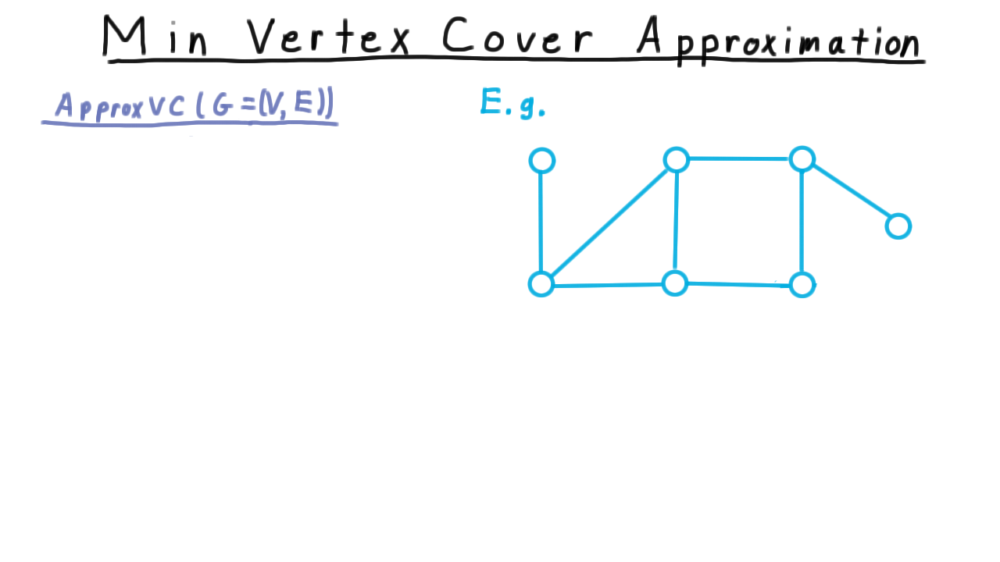

   Definition of the minimum vertex cover problem.

ApproxVC Algorithm
~~~~~~~~~~~~~~~~~~

.. code-block:: text

   C ← ∅
   while uncovered edges exist:
       pick an arbitrary uncovered edge (u, v)
       add u and v to C
       remove all edges incident to u or v
   return C

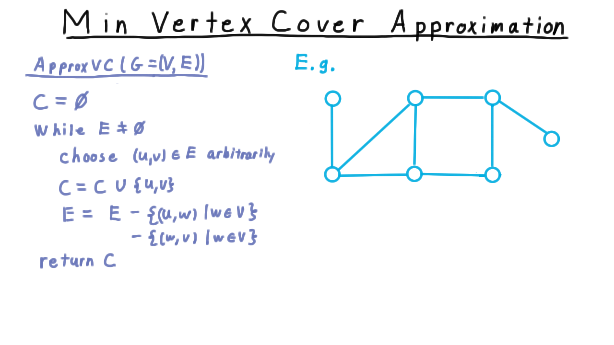

   Steps of the ApproxVC algorithm.

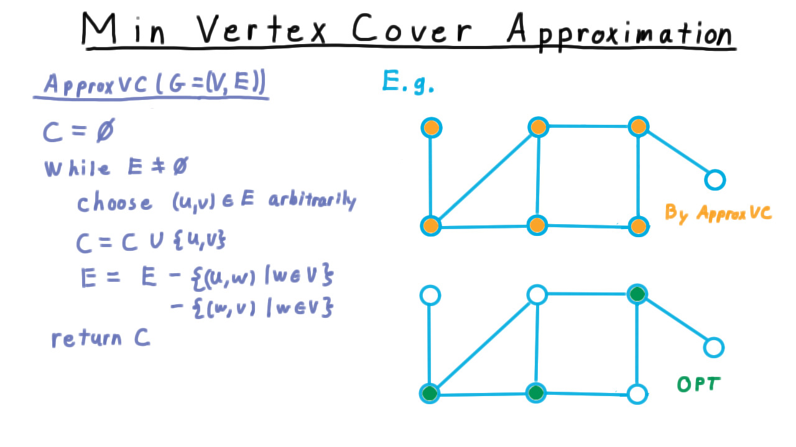

   Algorithm output (orange) vs. optimal cover (green) — the approximation can be
   suboptimal but is always within a factor of 2.

Performance Guarantee
~~~~~~~~~~~~~~~~~~~~~

**Theorem:** ApproxVC returns :math:`C` such that:

.. math::

   \frac{|C|}{|C^*|} \leq 2

where :math:`C^*` is the minimum vertex cover.

**Proof:**

Let :math:`M` be the set of edges selected by the algorithm (each chosen edge is added to
:math:`M` before its endpoints are added to :math:`C`). The edges in :math:`M` form a
*maximal matching* — no two share an endpoint.

   *Quiz:* Explore the relationship between :math:`C` and :math:`C^*`.

The challenge is bounding :math:`|C^*|` without knowing it directly.

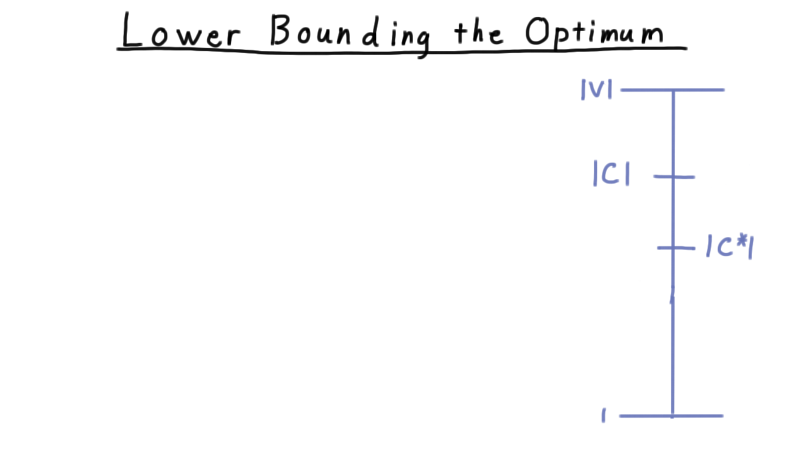

   How do we bound the optimum when we don't know it?

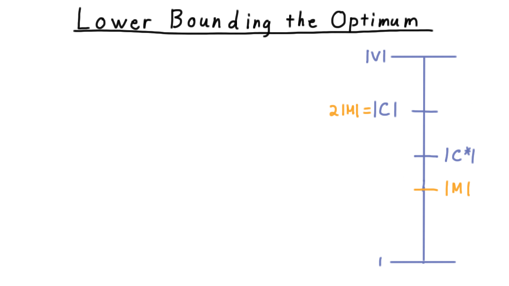

   Use a **lower bound** on :math:`|C^*|` to bound the ratio.

Key observations:

1. Any vertex cover must include at least one endpoint from each edge in :math:`M`, and
   since no two edges in :math:`M` share a vertex:

   .. math::

      |M| \leq |C^*|

2. The algorithm adds exactly 2 vertices per selected edge:

   .. math::

      |C| = 2|M|

3. Combining:

   .. math::

      |C| = 2|M| \leq 2|C^*|

Tightness
~~~~~~~~~

The factor-2 bound is **tight** — there exist graphs where the algorithm returns a cover
exactly twice the size of the optimal.

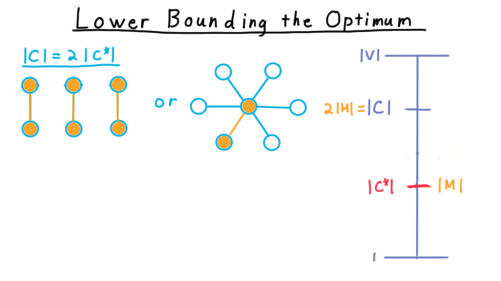

   Scenario where the approximation is exactly twice the optimal.

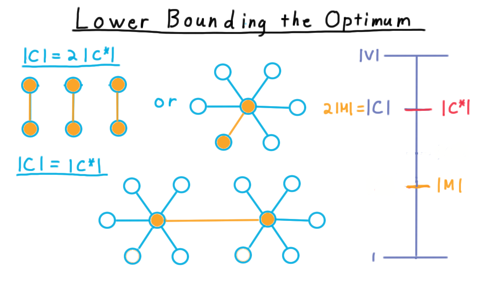

   Scenario where the algorithm finds an exact optimal solution.

----

Formal Definitions
------------------

Optimization Problems
~~~~~~~~~~~~~~~~~~~~~

An **optimization problem** consists of:

1. A set of valid **instances** (inputs).
2. A set of **feasible solutions** for each instance.
3. An **objective function** to minimize or maximize.

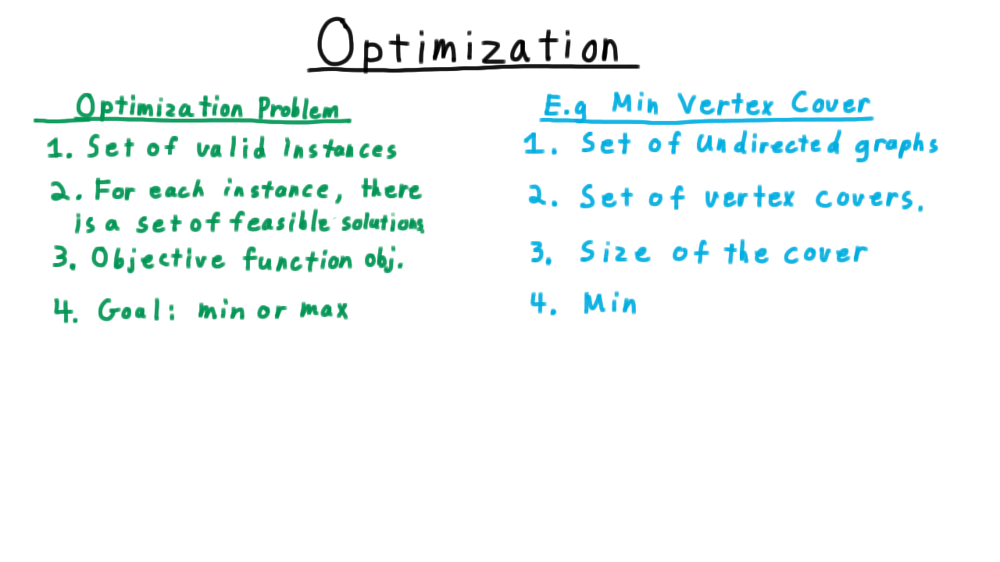

   Formal definition of an optimization problem.

An **NP-optimization** problem is one where all three components are computable in
polynomial time.

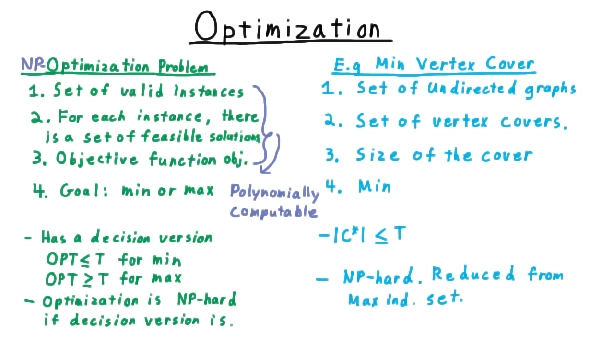

   NP-optimization: instances, solutions, and objective all poly-time computable.

Approximation Algorithm Definition
~~~~~~~~~~~~~~~~~~~~~~~~~~~~~~~~~~~

Algorithm :math:`A` is a **factor-**:math:`\delta` **approximation** for a minimization
problem if it runs in polynomial time and for every instance :math:`I`:

.. math::

   \frac{|A(I)|}{|OPT(I)|} \leq \delta

For a **maximization** problem the inequality reverses:

.. math::

   \frac{|A(I)|}{|OPT(I)|} \geq \delta

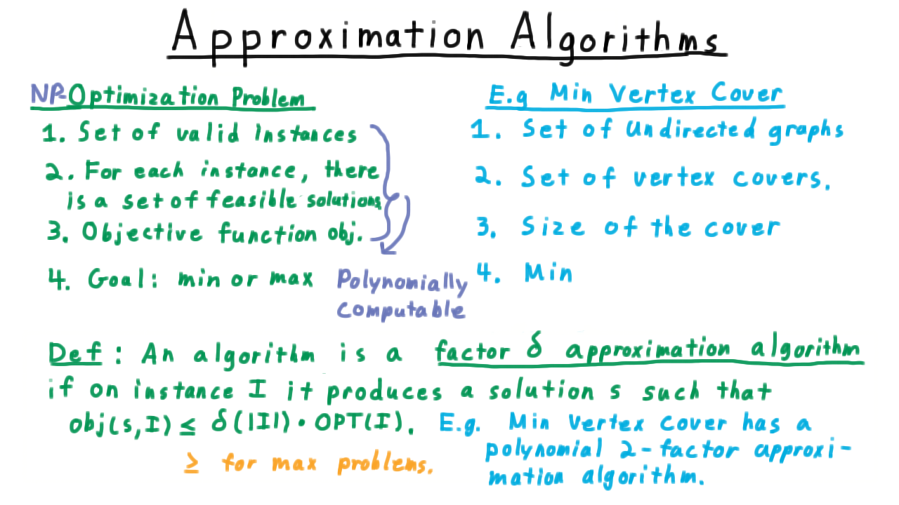

   Formal definition of a factor-:math:`\delta` approximation algorithm.

----

Subset Sum: An FPTAS
--------------------

**Problem:** Given a set of integers and a threshold :math:`t`, find a subset maximizing
the sum without exceeding :math:`t`.

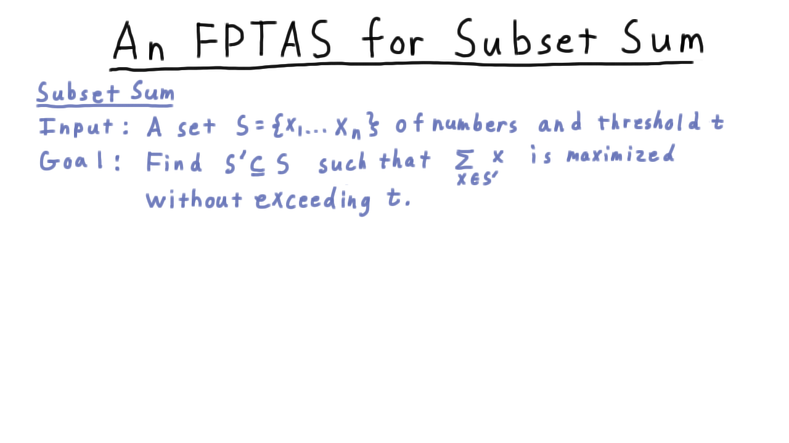

   Formal definition of the subset sum optimization problem.

**Key result:** For any :math:`\varepsilon > 0` there is an algorithm running in
:math:`O\!\left(\frac{n^2 \log t}{\varepsilon}\right)` time that is a factor
:math:`(1+\varepsilon)^{-1}` approximation.

Classification:

* **PTAS (Polynomial Time Approximation Scheme):** Running time polynomial in :math:`n`
  for every fixed :math:`\varepsilon > 0`.
* **FPTAS (Fully Polynomial Time Approximation Scheme):** Running time polynomial in
  both :math:`n` *and* :math:`1/\varepsilon`.

FPTAS is the strongest class of approximation result — subset sum admits one.

----

Traveling Salesman Problem
--------------------------

**Problem:** Given a complete weighted graph, find the minimum-cost Hamiltonian cycle
(a cycle visiting every vertex exactly once).

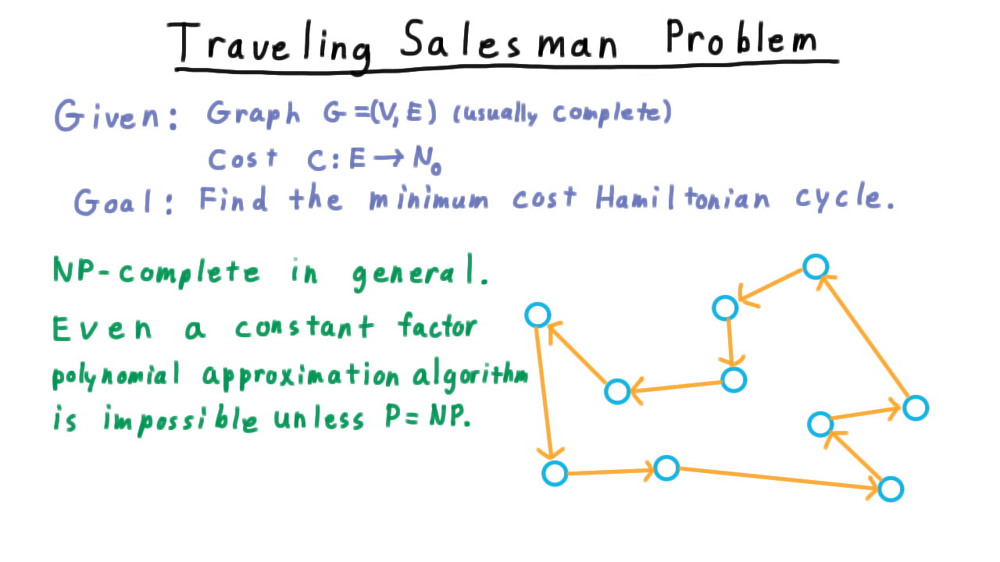

   Formal definition of the Traveling Salesman Problem.

Hardness of Approximation (General TSP)
~~~~~~~~~~~~~~~~~~~~~~~~~~~~~~~~~~~~~~~~~

**Theorem:** Unless :math:`P = NP`, no constant-factor polynomial-time approximation
exists for general TSP.

**Proof (reduction from Hamiltonian Cycle):**

Given graph :math:`G = (V, E)`, construct a complete weighted graph :math:`G'`:

.. math::

   w(u,v) =
   \begin{cases}
   1 & \text{if } (u,v) \in E \\
   \alpha|V| + 1 & \text{if } (u,v) \notin E
   \end{cases}

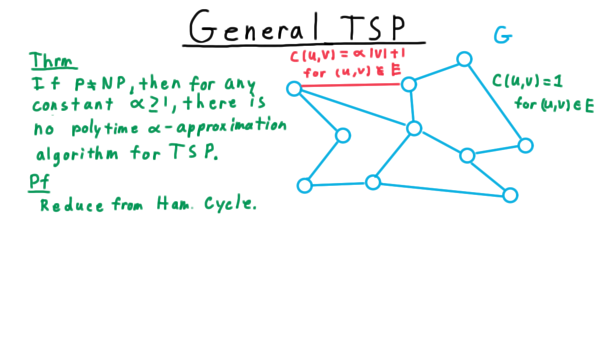

   Reduction from Hamiltonian Cycle to TSP by assigning edge weights.

Analysis:

* If :math:`G` has a Hamiltonian cycle: optimal TSP cost :math:`= |V|`.
* If :math:`G` has no Hamiltonian cycle: every tour uses at least one non-:math:`E` edge,
  so cost :math:`\geq (1 + \alpha)|V|`.

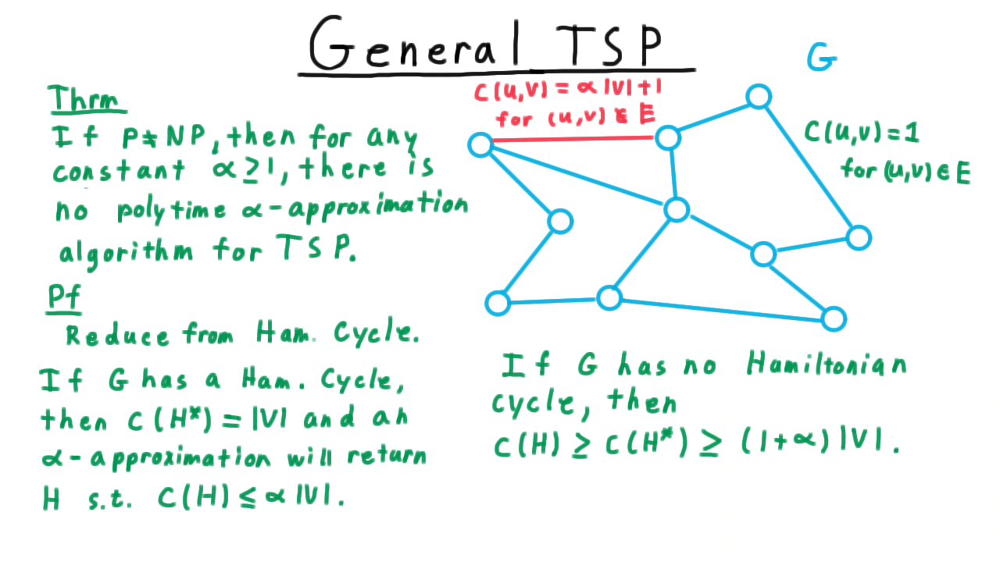

   A factor-:math:`\alpha` approximation would distinguish the two cases, solving
   an NP-complete problem in polynomial time.

A factor-:math:`\alpha` approximation algorithm would separate these two cases, which
would place Hamiltonian Cycle in P — contradicting :math:`P \neq NP`.

**Conclusion:** General TSP is inapproximable to any constant factor unless :math:`P = NP`.

----

Metric TSP
----------

**Restriction:** Require the edge weights to satisfy the **triangle inequality**:

.. math::

   w(u, v) \leq w(u, x) + w(x, v) \quad \forall\, u, v, x \in V

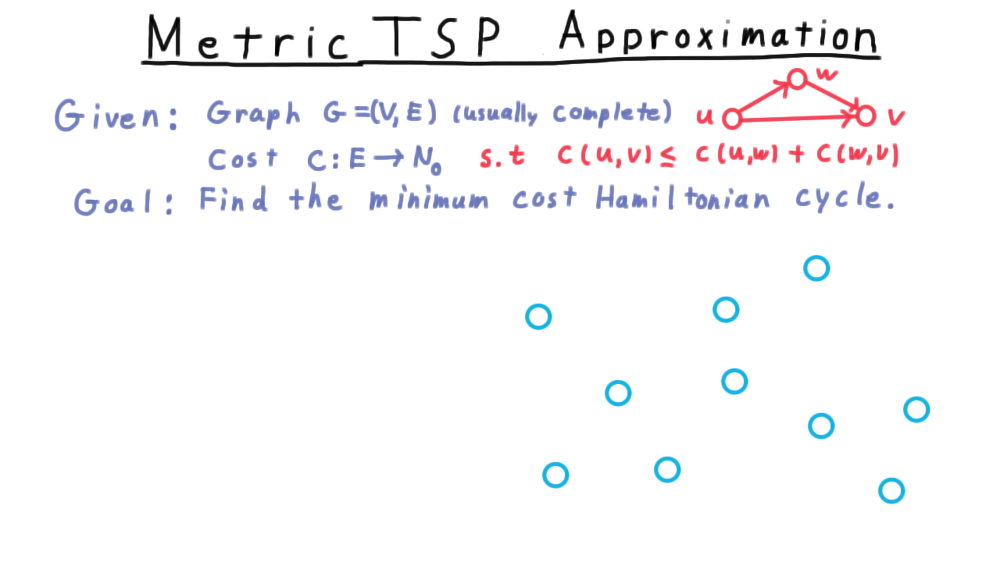

   Definition of metric TSP with the triangle inequality constraint.

ApproxMetricTSP Algorithm
~~~~~~~~~~~~~~~~~~~~~~~~~~

.. code-block:: text

   1. Build a minimum spanning tree T (Kruskal or Prim)
   2. Perform a depth-first search on T
   3. Output vertices in DFS discovery order as the tour

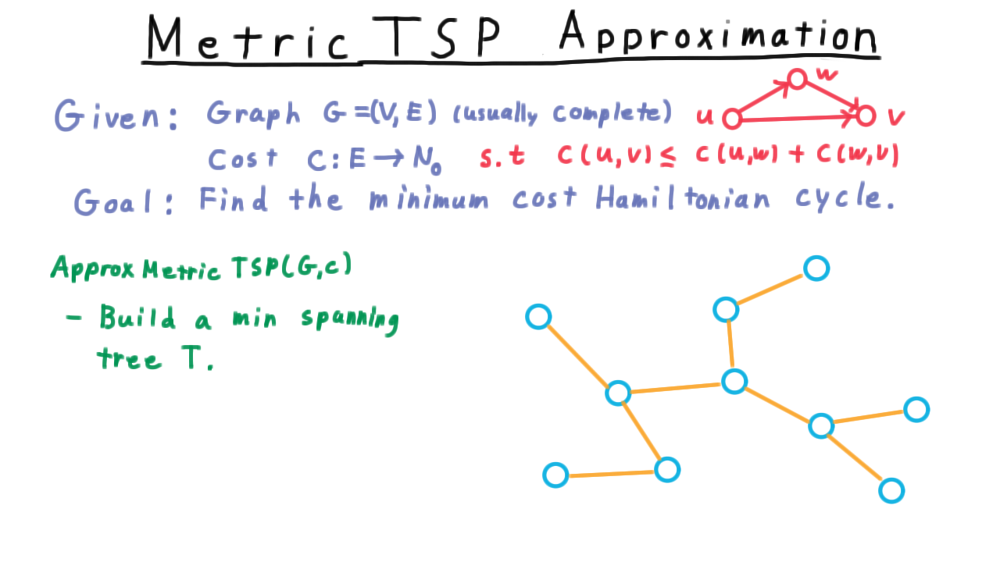

   Step 1: Construct the minimum spanning tree :math:`T`.

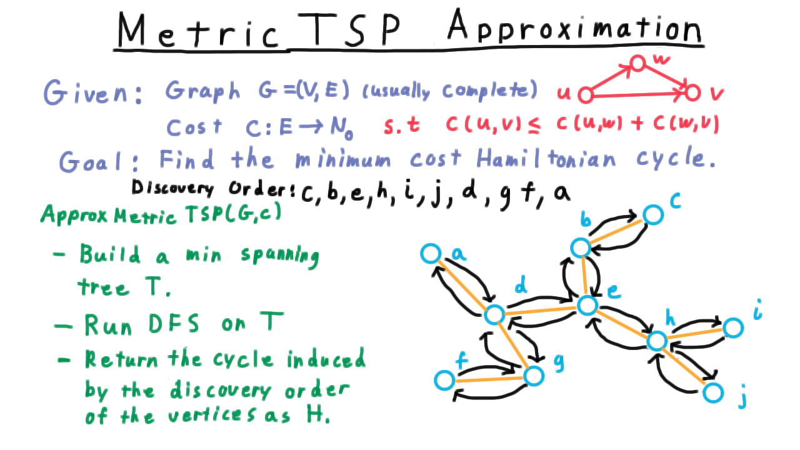

   Step 2–3: DFS discovery order gives the approximate tour.

**Running time:** :math:`O(V^2)` (dominated by MST construction on a complete graph).

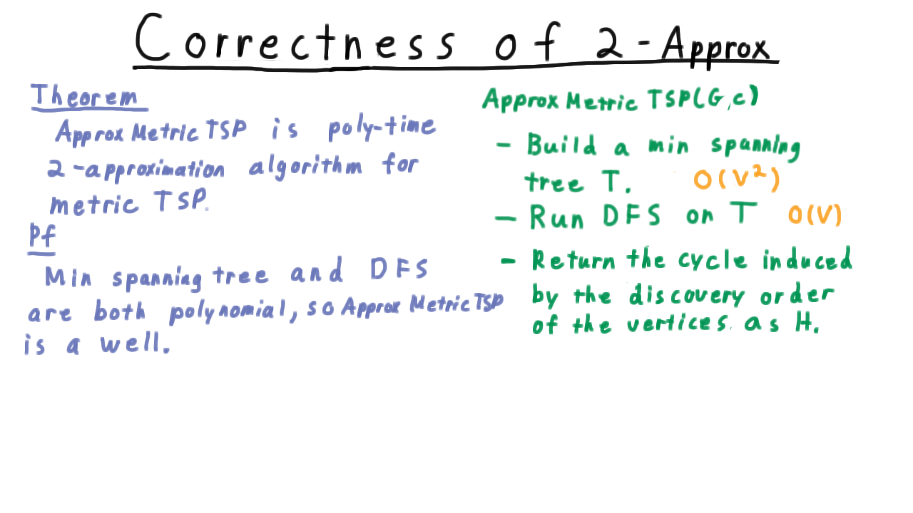

   Time complexity analysis of ApproxMetricTSP.

Performance Guarantee
~~~~~~~~~~~~~~~~~~~~~

**Theorem:** ApproxMetricTSP is a factor-2 approximation for metric TSP.

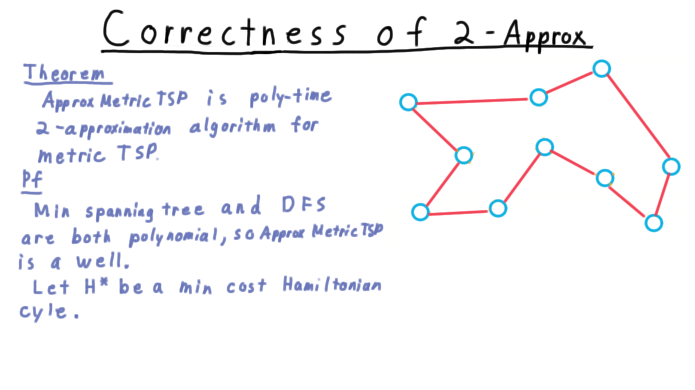

   Example graph used in the correctness proof.

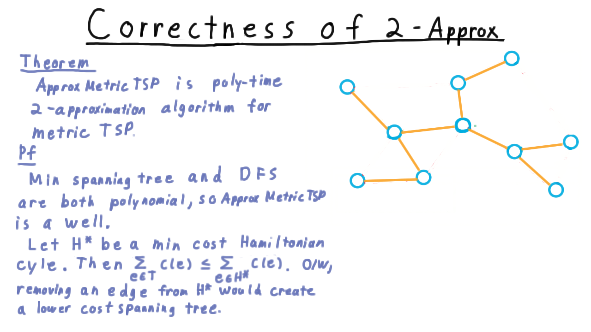

   Minimum spanning tree constructed from the example graph.

**Proof:**

Let :math:`T` be the MST and :math:`OPT` be the optimal tour cost.

1. **MST cost** :math:`\leq OPT`: Removing any single edge from the optimal tour yields a
   spanning tree, so :math:`w(T) \leq OPT`.

2. **DFS traversal cost** :math:`= 2 \cdot w(T)`: A full DFS traversal visits every edge
   of :math:`T` exactly twice.

3. **Shortcutting** repeated vertices (skipping already-visited nodes) does not increase
   cost under the triangle inequality.

Therefore:

.. math::

   w(\text{tour}) \leq 2 \cdot w(T) \leq 2 \cdot OPT

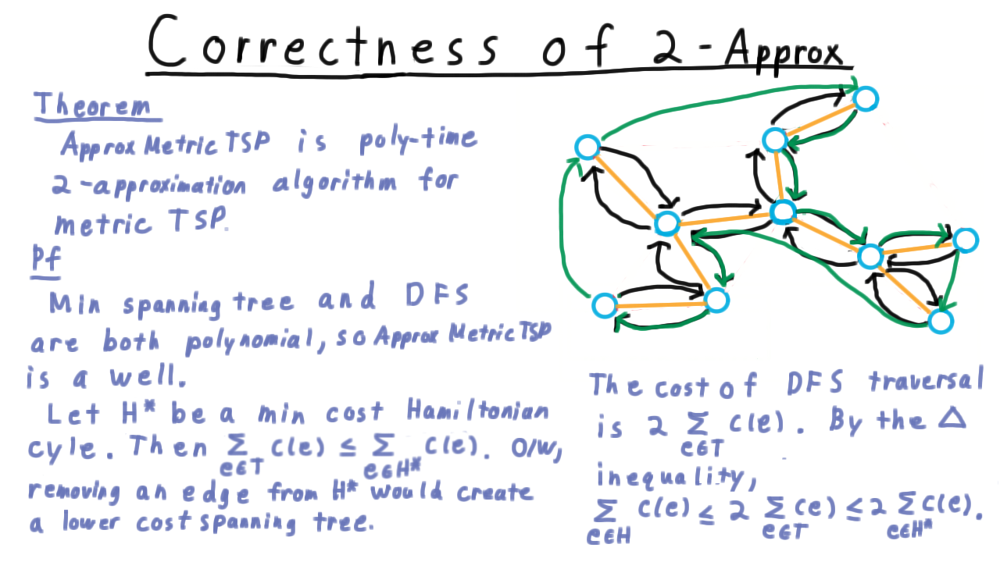

   Visualization of the factor-2 approximation proof.

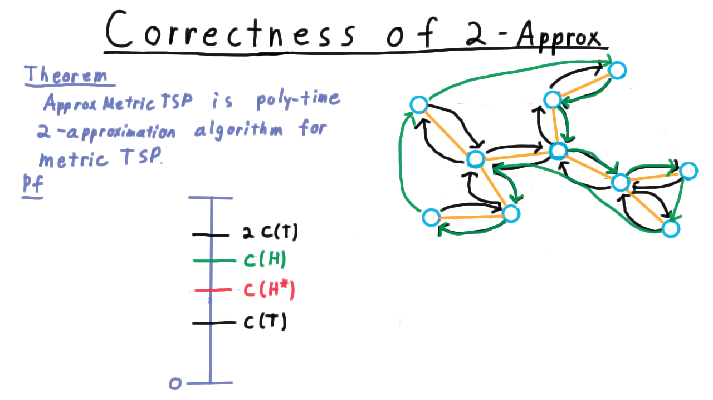

   Scale illustration of the cost relationships:
   :math:`w(\text{tour}) \leq 2 \cdot w(T) \leq 2 \cdot OPT`.

Tightness of the Factor-2 Bound
~~~~~~~~~~~~~~~~~~~~~~~~~~~~~~~~

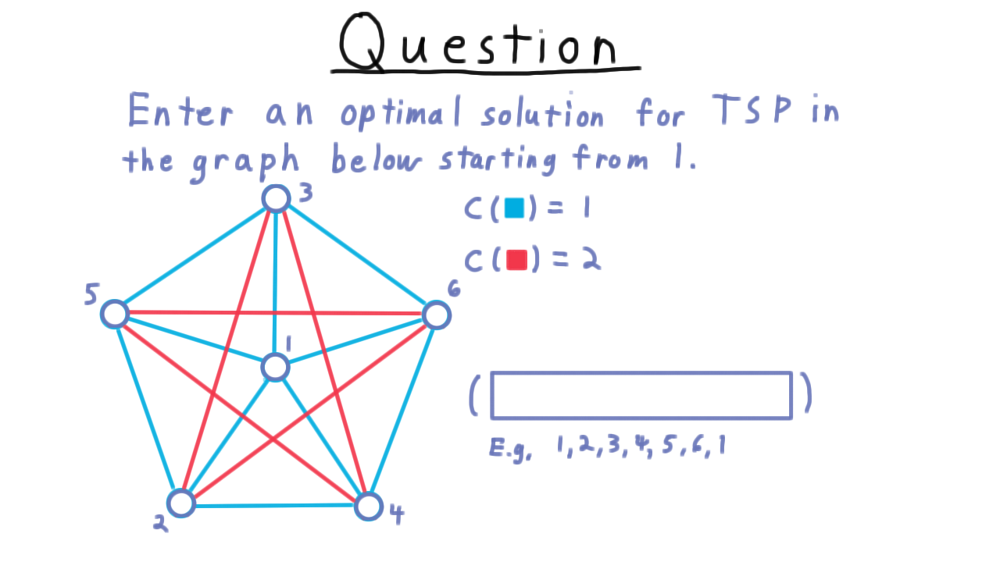

   *Quiz:* Analyze the tightness of the approximation on this example.

Consider a **star graph** with one center and :math:`n-1` leaves, where edge weights
satisfy the triangle inequality:

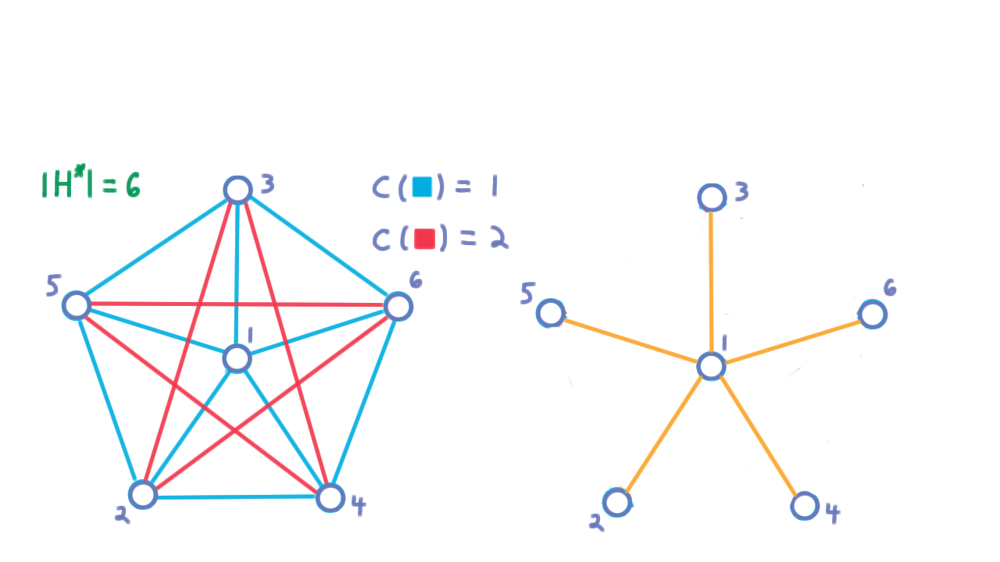

   Star-shaped MST: center connected to all :math:`n-1` leaves.

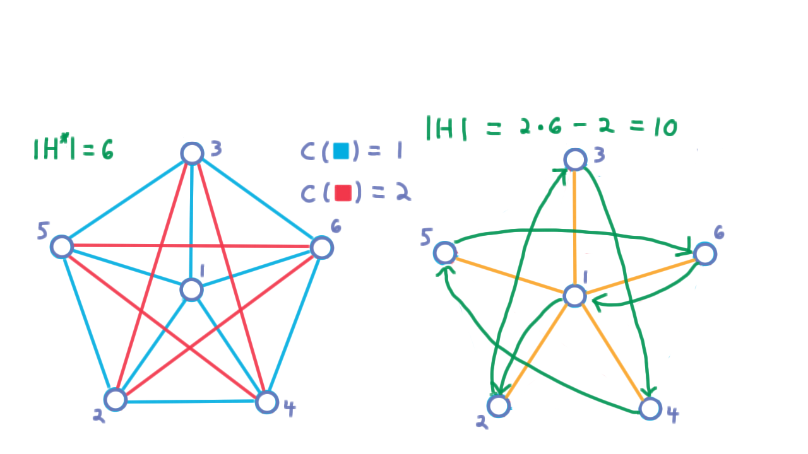

   Resulting DFS tour — the algorithm's cost approaches :math:`2 \cdot OPT` as
   :math:`n \to \infty`.

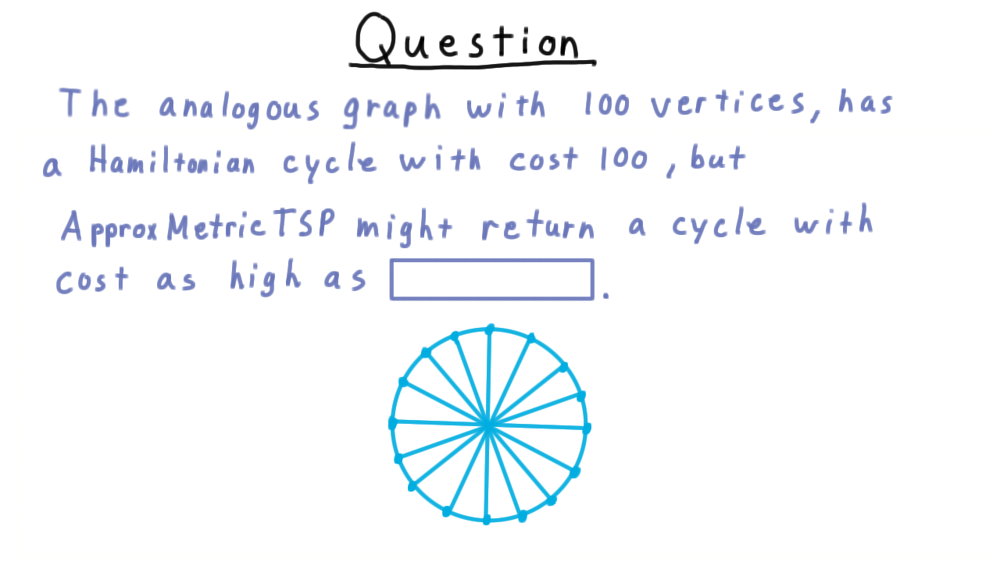

   *Quiz:* What is the worst-case approximation ratio for 100 vertices on this graph?

The bound is **tight**: for any :math:`n`, there exist metric instances where
ApproxMetricTSP returns a tour of cost approaching :math:`2 \cdot OPT`.

----

Summary of Results
------------------

.. list-table::
   :header-rows: 1
   :widths: 35 25 40

   * - Problem
     - Result
     - Notes
   * - Min Vertex Cover
     - Factor-2 approximation
     - Tight; uses maximal matching lower bound
   * - Subset Sum
     - FPTAS :math:`(1+\varepsilon)^{-1}`
     - Poly in :math:`n` and :math:`1/\varepsilon`
   * - General TSP
     - Inapproximable (any constant)
     - Unless :math:`P = NP`
   * - Metric TSP
     - Factor-2 approximation
     - Tight; uses MST lower bound

----

Key Formulas
------------

.. math::

   \frac{|A(I)|}{|OPT(I)|} \leq \delta \quad \text{(factor-}\delta\text{ approximation, minimization)}

.. math::

   |C| = 2|M| \leq 2|C^*| \quad \text{(vertex cover approximation ratio)}

.. math::

   w(T) \leq OPT \leq w(\text{tour}) \leq 2 \cdot w(T) \quad \text{(metric TSP proof chain)}

.. math::

   w(u,v) \leq w(u,x) + w(x,v) \quad \text{(triangle inequality)}

----

Further Reading
---------------

* Christofides algorithm: factor-:math:`\frac{3}{2}` approximation for metric TSP
* MAX-3SAT: randomized constant-factor approximation
* Hardness of approximation via PCP theorem
