Bipartite Matching
==================

*From Computability, Complexity & Algorithms — Charles Brubaker and Lance Fortnow*

* Refer to the class notes in this Shared Google Drive - https://drive.google.com/drive/folders/1N7WgkJFYJRK1TL7Hgx3msN7ukAYHU-gD?usp=sharing
* http://omscs.wikidot.com/courses:cs6505
* Source: https://s3.amazonaws.com/content.udacity-data.com/courses/gt-cs6505/bipartitematching.html

----

Bipartite Graphs
----------------

A graph :math:`G = (L, R, E)` is **bipartite** if its vertices can be partitioned into two disjoint
sets :math:`L` (left) and :math:`R` (right) such that every edge has one endpoint in :math:`L` and one in :math:`R`.

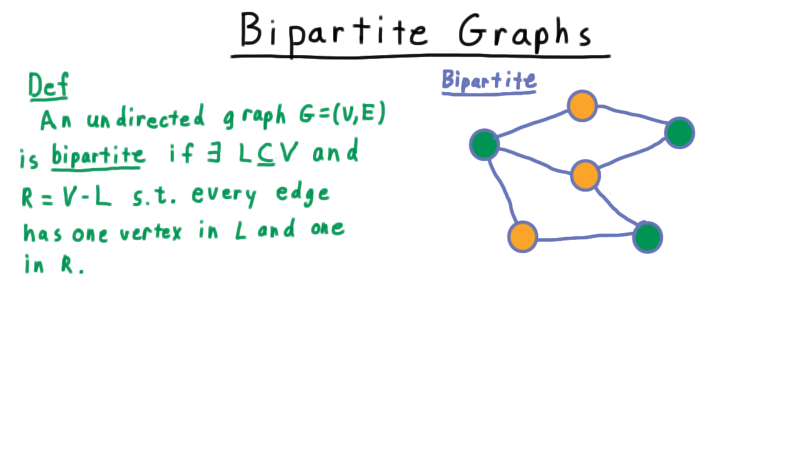

   Example bipartite graph — green vertices in :math:`L`, orange vertices in :math:`R`.

**Equivalent characterization:** A graph is bipartite if and only if it contains no odd-length
cycles, which is equivalent to being 2-colorable.

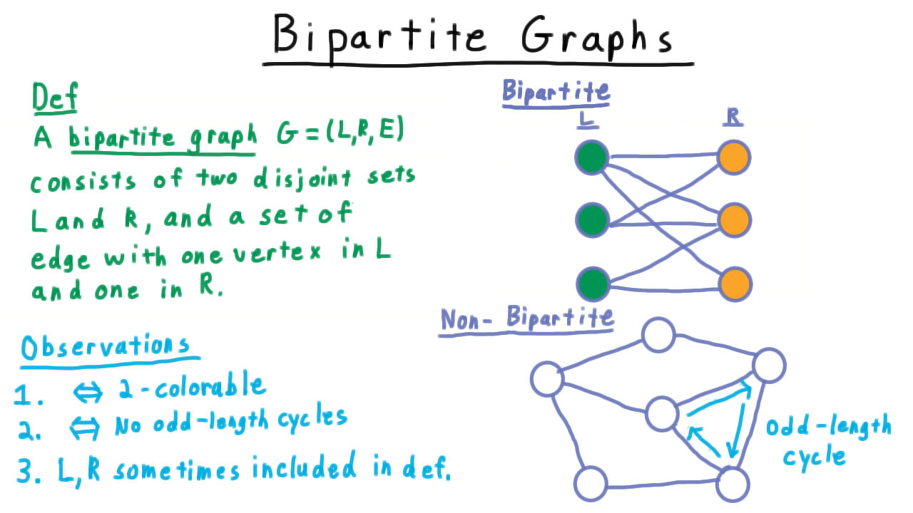

   Adding an edge that creates an odd-length cycle makes the graph non-bipartite.

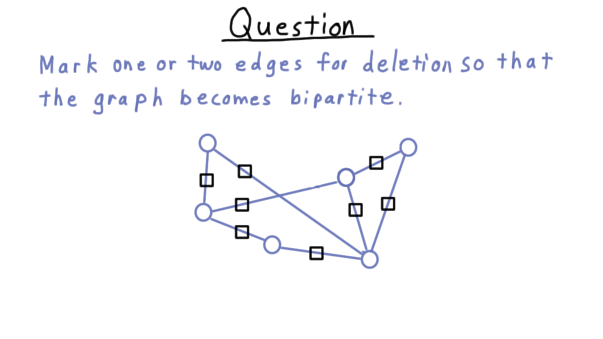

   *Quiz:* Which edges must be removed to make a non-bipartite graph bipartite?

----

Matching
--------

A **matching** :math:`M` is a subset of edges where no two edges share a vertex.

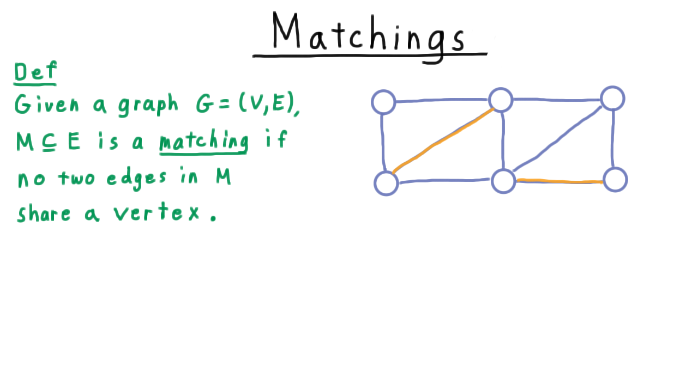

   Example matching — two edges highlighted in orange share no vertices.

Two important distinctions:

* **Maximal matching** — no additional edge can be added while preserving the matching
  property (locally optimal, but not necessarily globally optimal).
* **Maximum matching** — matching with the largest possible cardinality (globally optimal).

A maximal matching is *not necessarily* a maximum matching.

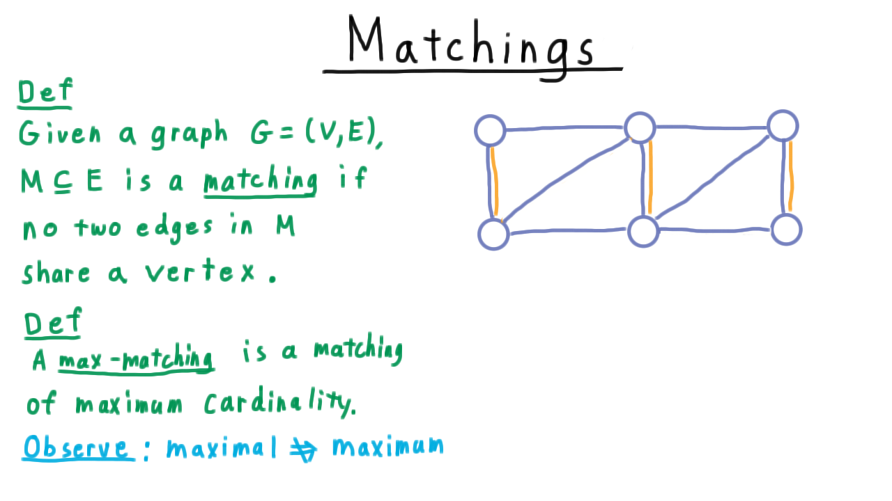

   A maximum matching can have greater cardinality than some maximal matchings.

Real-World Applications
~~~~~~~~~~~~~~~~~~~~~~~

Bipartite matching models many assignment problems:

* Compatible roommate pairings
* Taxi-to-customer assignment (minimizing pickup time)
* Professor-to-class scheduling
* Organ donor-to-patient matching

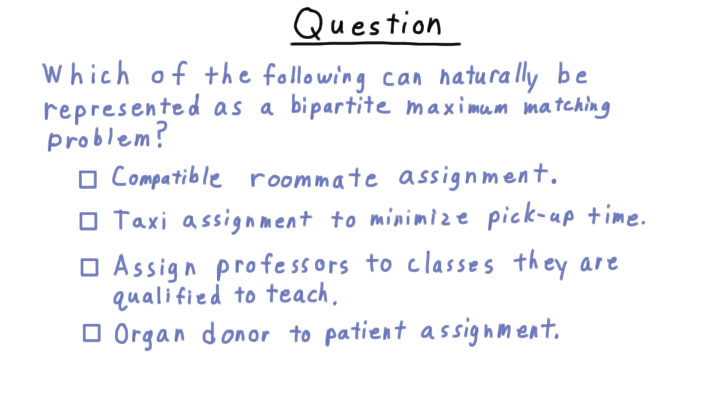

   *Quiz:* Identify which real-world scenarios reduce to maximum matching.

----

Reduction to Maximum Flow
--------------------------

Maximum bipartite matching reduces to maximum flow by constructing a flow network:

1. Add a **source** :math:`s` connected to every vertex in :math:`L` (capacity 1).
2. Add a **sink** :math:`t` connected from every vertex in :math:`R` (capacity 1).
3. Direct all original edges :math:`L \to R` (capacity 1).
4. Run **Ford-Fulkerson** on the resulting network.

Each unit of flow corresponds to one matched edge.

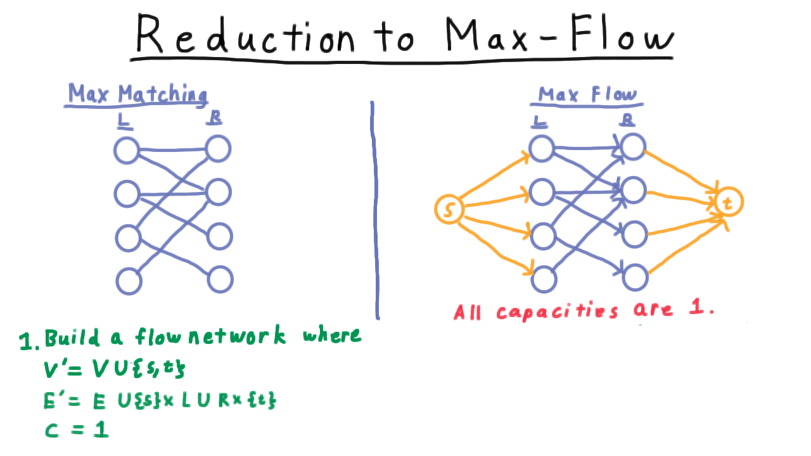

   Flow network construction from bipartite graph with unit capacities.

**Time complexity:** :math:`O(EV)` — the total flow is at most :math:`|V|`, and each augmenting path
costs :math:`O(E)` via BFS.

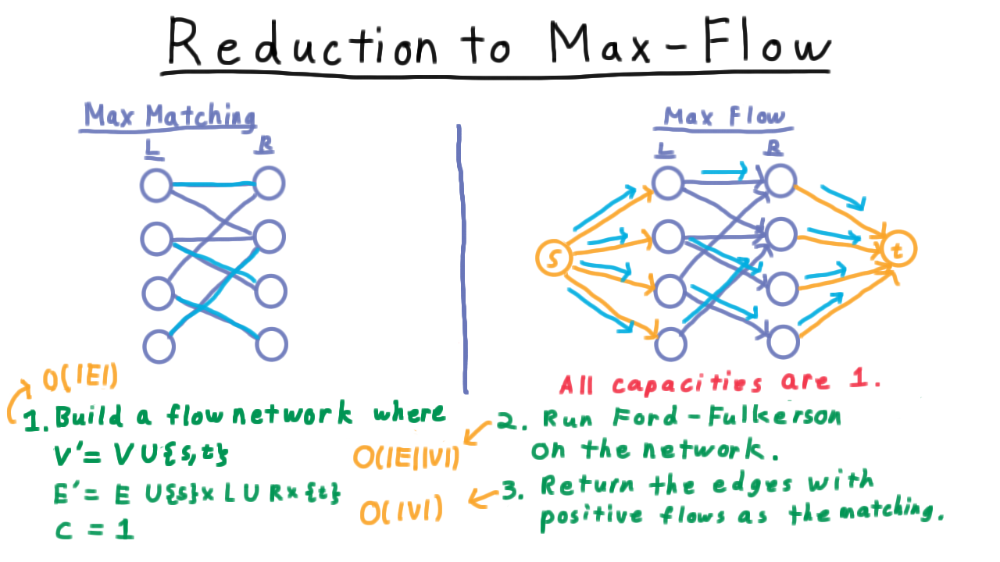

   Time complexity analysis of the Ford-Fulkerson reduction.

----

Augmenting Paths in Bipartite Graphs
--------------------------------------

In the residual flow network, augmenting paths correspond directly to alternating paths in
the original bipartite graph.

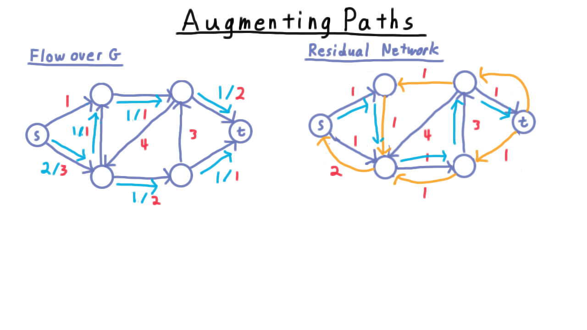

   Residual network showing augmenting paths in the maximum flow context.

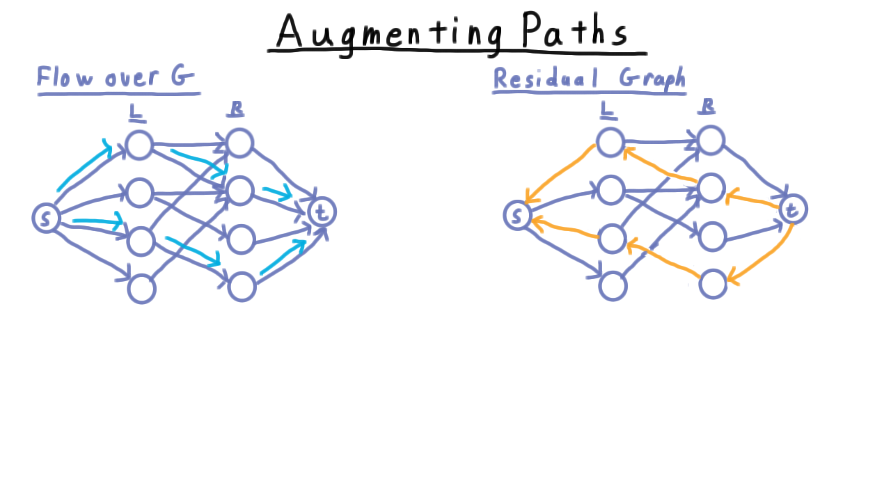

   Special properties of augmenting paths in bipartite residual networks.

An **alternating path** has edges alternately inside :math:`M` and outside :math:`M`.
An **augmenting path** is an alternating path whose first and last vertices are both unmatched.

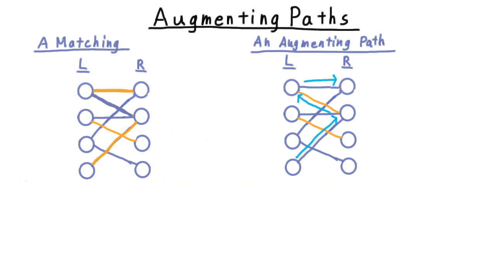

   An augmenting path (blue) in a bipartite graph, with matching edges in purple.

**Augmenting path algorithm:**

.. math::

   M \leftarrow \emptyset

.. math::

   \textbf{while } \exists \text{ augmenting path } p: \quad M \leftarrow M \oplus p

where the **symmetric difference** is defined as:

.. math::

   M \oplus p = (M \cup p) \setminus (M \cap p)

Applying :math:`M \oplus p` flips matched/unmatched edges along :math:`p`, increasing :math:`|M|` by exactly 1.

----

Vertex Cover and König's Theorem
----------------------------------

A **vertex cover** is a set :math:`S \subseteq V` such that every edge has at least one endpoint in :math:`S`.

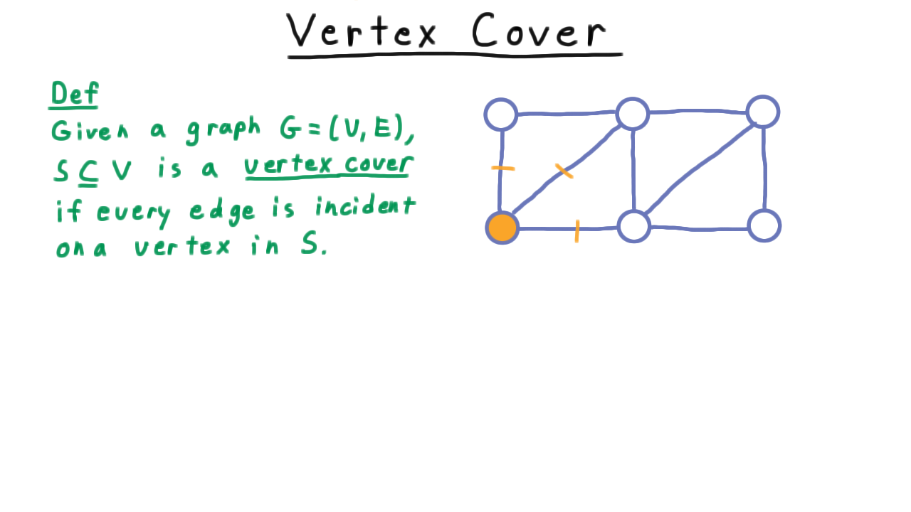

   A single vertex (orange) covering three edges.

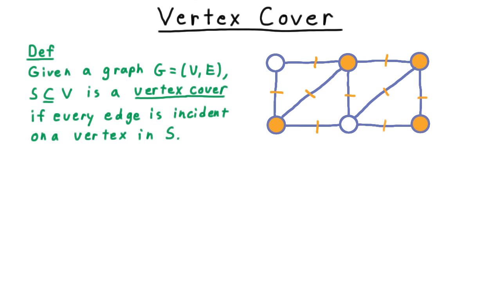

   A vertex cover that covers all edges in the graph.

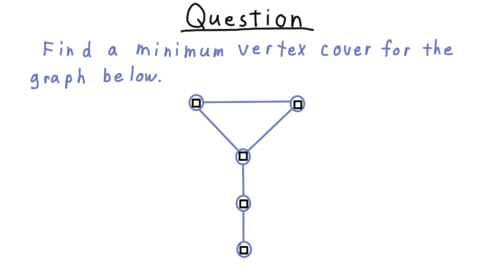

   *Quiz:* Find the minimum vertex cover of a given graph.

**Key observation:** :math:`|M| \leq |S|` for any matching :math:`M` and vertex cover :math:`S`, because each
matched edge needs at least one vertex in :math:`S`.

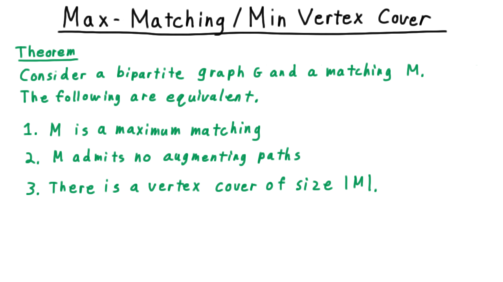

   **König's Theorem:** In any bipartite graph, the size of the maximum matching equals
   the size of the minimum vertex cover.

.. math::

   \max |M| = \min |S|

Proof Sketch
~~~~~~~~~~~~

Define the set :math:`H` as all vertices reachable via alternating paths from unmatched :math:`L`-vertices.

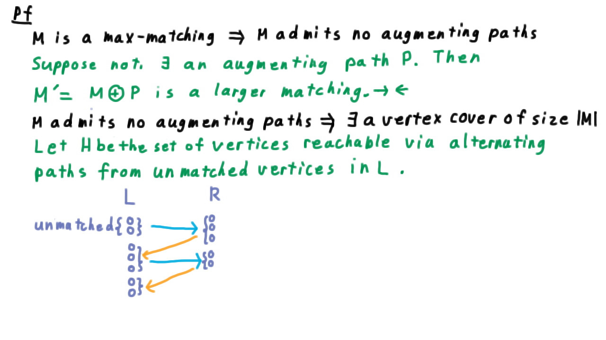

   Set :math:`H` — vertices reachable via alternating paths from unmatched vertices in :math:`L`.

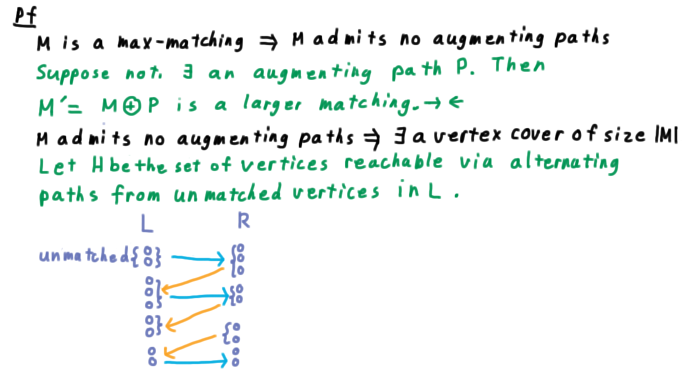

   Full partition showing :math:`H` and its complement in the graph.

Construct the vertex cover as :math:`(L \setminus H) \cup (R \cap H)`:

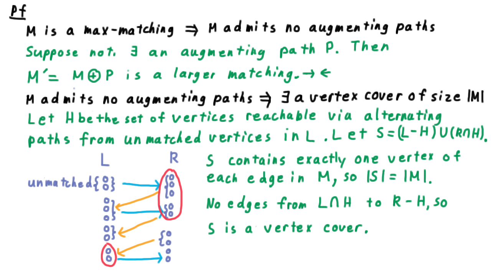

   Minimum vertex cover constructed from the partition of :math:`H` and its complement.

This cover has size equal to the maximum matching, proving König's theorem.

----

Hall's Marriage Theorem
------------------------

The **neighborhood** :math:`N(X)` of a set :math:`X \subseteq L` is the set of all vertices in :math:`R` adjacent to
at least one vertex in :math:`X`.

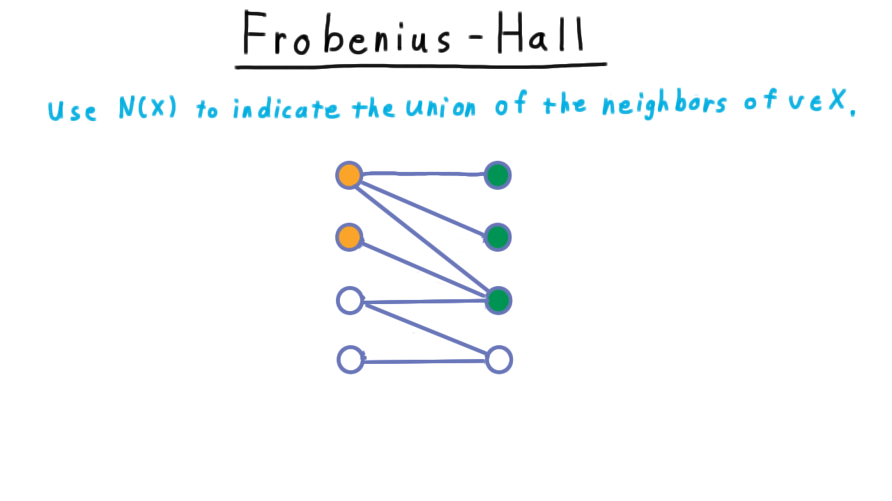

   Neighborhood :math:`N(X)` — green vertices adjacent to orange subset :math:`X`.

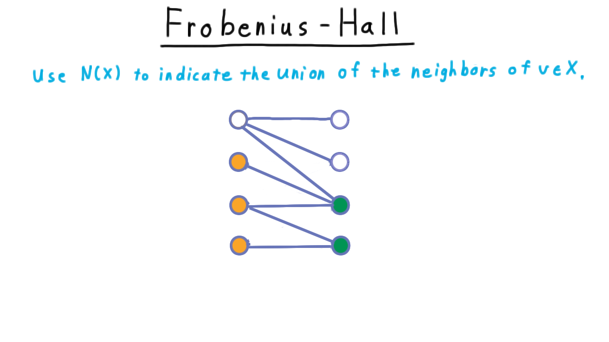

   When Hall's condition fails, no perfect matching can exist.

**Hall's Theorem (Frobenius-Hall):**

   A matching of size :math:`|L|` exists **if and only if**:

   .. math::

      \forall\, X \subseteq L,\quad |N(X)| \geq |X|

A **perfect matching** satisfies :math:`|M| = |L| = |R|`, matching every vertex on both sides.

Forward direction (:math:`\Rightarrow`):
  If a matching of size :math:`|L|` exists, then for any :math:`X \subseteq L` the matched partners form a
  set :math:`Y \subseteq N(X)` with :math:`|Y| = |X|`, so :math:`|N(X)| \geq |X|`.

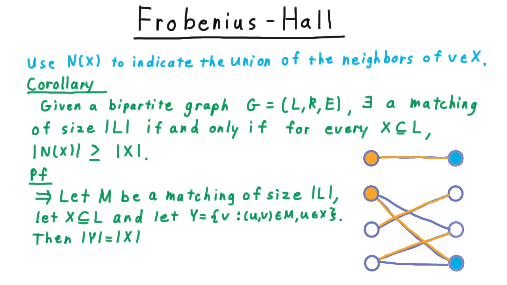

   Matched vertices :math:`Y \subseteq N(X)` certify :math:`|N(X)| \geq |X|` in the forward direction.

Backward direction (:math:`\Leftarrow`):
  By contrapositive — if no matching of size :math:`|L|` exists, use set :math:`H` to find :math:`X` with
  :math:`|N(X)| < |X|`.

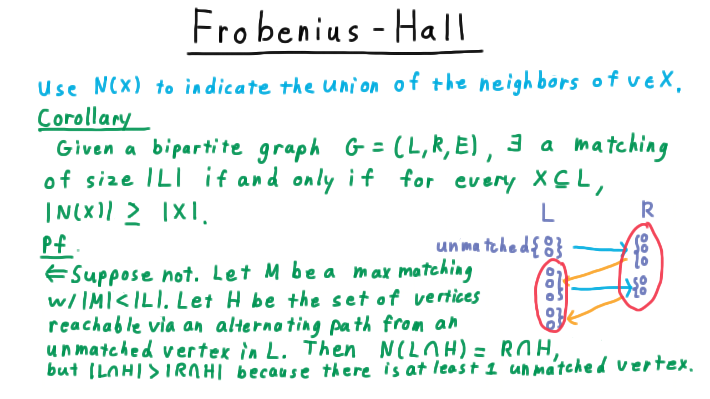

   Set :math:`H` construction for the backward direction of Hall's theorem proof.

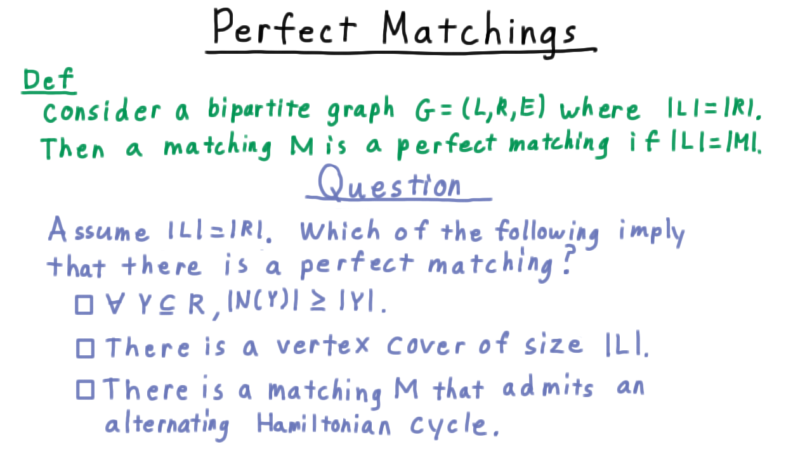

   *Quiz:* Which conditions guarantee a perfect matching?

----

Hopcroft-Karp Algorithm
------------------------

Hopcroft-Karp improves on the basic augmenting-path approach by finding *multiple*
augmenting paths simultaneously per phase.

**Time complexity:** :math:`O(E\sqrt{V})`

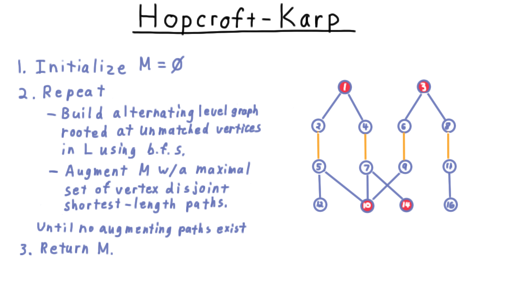

   Pseudocode for the Hopcroft-Karp algorithm.

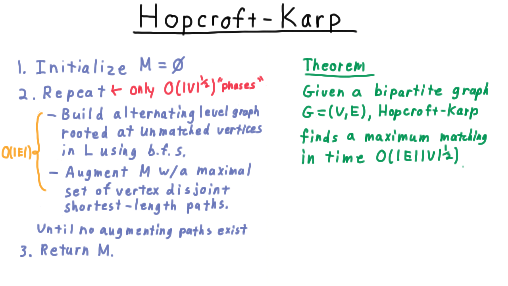

   Theorem stating the :math:`O(E\sqrt{V})` time complexity of Hopcroft-Karp.

Algorithm (each phase):

1. BFS from all unmatched :math:`L`-vertices to build an **alternating level graph**.
2. Find a **maximal** set of vertex-disjoint shortest augmenting paths via DFS.
3. Augment :math:`M` along all found paths simultaneously: :math:`M \leftarrow M \oplus \text{paths}`.
4. Delete traversed vertices and orphaned edges; repeat.

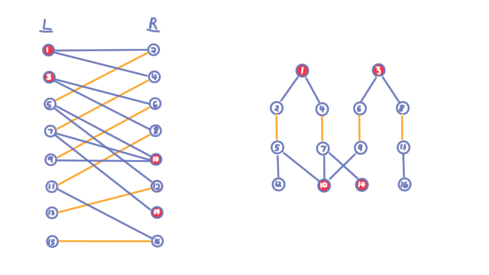

   Original graph (left) and its alternating level graph built by BFS (right).

Key Lemmas
~~~~~~~~~~

**Matching differences lemma:** If :math:`M^*` is a maximum matching and :math:`M` is any matching, then
:math:`M^* \oplus M` contains exactly :math:`|M^*| - |M|` vertex-disjoint augmenting paths.

**Shortest augmenting path lemma:** Augmenting along shortest augmenting paths never
decreases the length of the shortest remaining augmenting path.

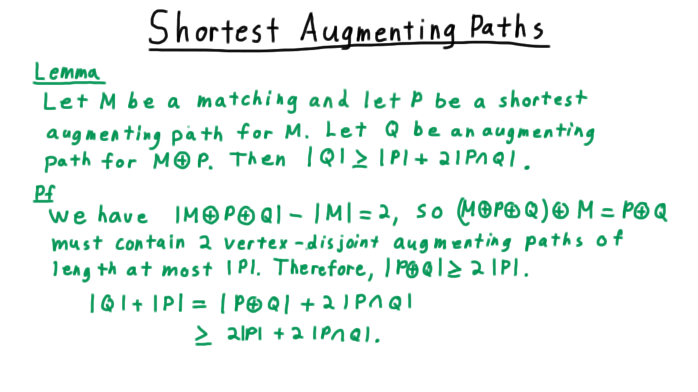

   Lemma: augmenting via shortest paths does not decrease the minimum subsequent path length.

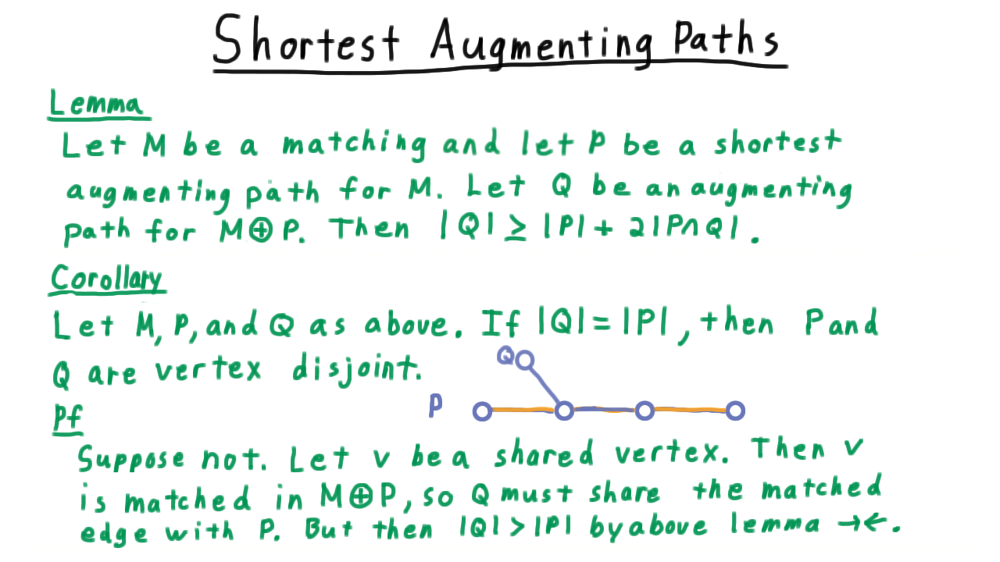

   Corollary to the shortest augmenting path lemma.

**Phase count lemma:** Each phase increases the length of the shortest augmenting path by
at least 2, so the number of phases is :math:`O(\sqrt{V})`.

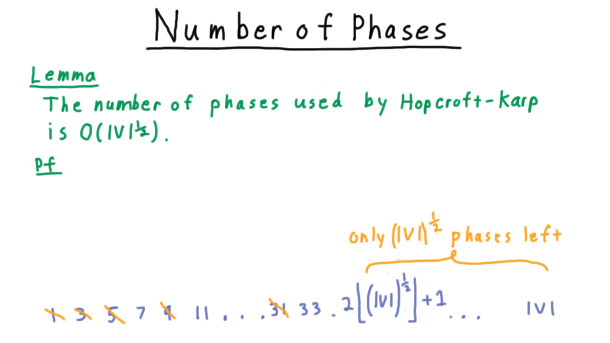

   Distribution of augmenting path lengths across phases.

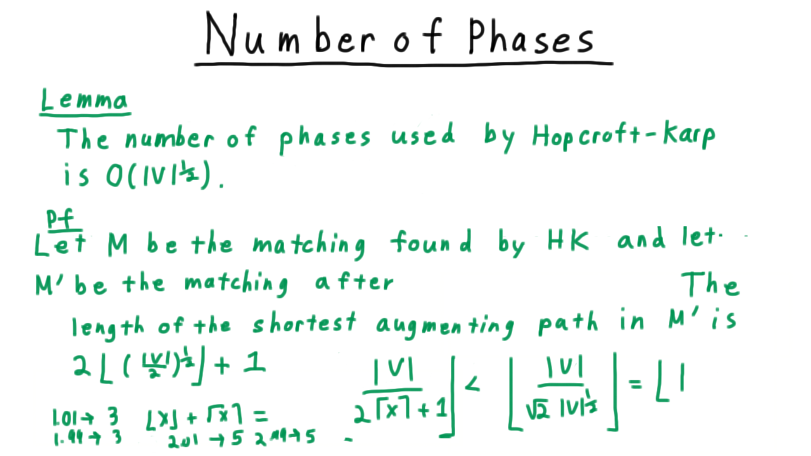

   Proof summary: :math:`O(\sqrt{V})` phases, each taking :math:`O(E)` → total :math:`O(E\sqrt{V})`.

After :math:`\lceil\sqrt{V}\rceil` phases the shortest augmenting path has length
:math:`\geq 2\lceil\sqrt{V}\rceil + 1`, and the remaining matching deficit is
:math:`\leq \lceil\sqrt{V}\rceil`, so at most :math:`\lceil\sqrt{V}\rceil` additional
single-path augmentations suffice.

----

Complexity Summary
------------------

.. list-table::
   :header-rows: 1
   :widths: 50 50

   * - Algorithm
     - Time Complexity
   * - Ford-Fulkerson reduction
     - :math:`O(EV)`
   * - Hopcroft-Karp
     - :math:`O(E\sqrt{V})`

----

Key Formulas
------------

.. math::

   G = (L, R, E), \quad \text{every edge between } L \text{ and } R

.. math::

   M \oplus p = (M \cup p) \setminus (M \cap p) \quad \text{(symmetric difference)}

.. math::

   \forall\, X \subseteq L,\quad |N(X)| \geq |X| \quad \text{(Hall's condition)}

.. math::

   |M| = |L| = |R| \quad \text{(perfect matching)}

.. math::

   \max|M| = \min|S| \quad \text{(König's theorem, bipartite graphs only)}

.. math::

   O(\sqrt{V}) \text{ phases} \times O(E) \text{ per phase} = O(E\sqrt{V}) \quad \text{(Hopcroft-Karp)}

----

Further Reading
---------------

* General graph matchings (non-bipartite)
* Minimum cost matching via the Hungarian algorithm
