Dynamic Programming
===================

*From Computability, Complexity & Algorithms — Charles Brubaker and Lance Fortnow*

* Refer to the class notes in this Shared Google Drive - https://drive.google.com/drive/folders/1N7WgkJFYJRK1TL7Hgx3msN7ukAYHU-gD?usp=sharing
* http://omscs.wikidot.com/courses:cs6505
* Source: https://s3.amazonaws.com/content.udacity-data.com/courses/gt-cs6505/dynamicprogramming.html

----

Introduction
------------

Dynamic programming is a design technique for solving optimization problems efficiently
by exploiting **optimal substructure** — expressing a hard problem as combinations of
optimal solutions to smaller, similar subproblems.

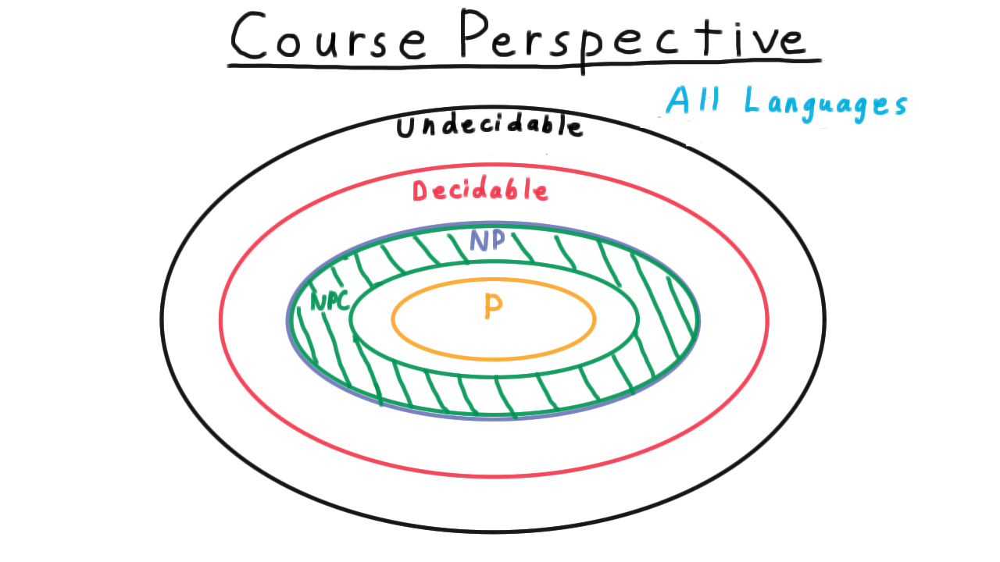

   Context: polynomial-time algorithms sit inside the broader landscape of decidable,
   NP, and NP-complete problems.

Rather than recomputing subproblems via naive recursion, DP either:

* **Memoizes** results on first computation, or
* **Fills a table** in dependency order (bottom-up).

**Motivating example — Fibonacci:**
Computing :math:`F(n) = F(n-1) + F(n-2)` naively recomputes each subproblem
roughly :math:`\varphi^k` times (where :math:`\varphi` is the golden ratio), giving
exponential time. Filling a table bottom-up reduces this to :math:`O(n)`.

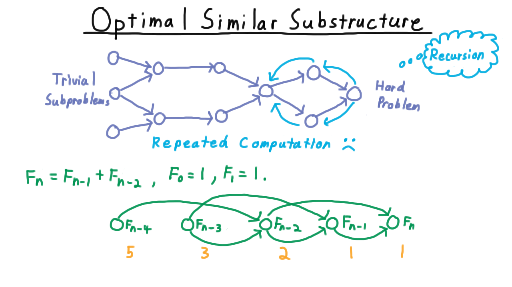

   Recursion tree for Fibonacci — identical subtrees are recomputed repeatedly.

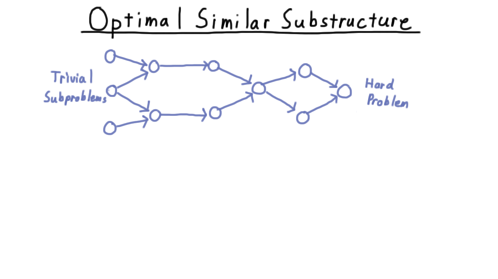

   Subproblem dependency DAG — solving in topological order avoids redundant work.

----

Problem 1: Sequence Alignment (Edit Distance)
----------------------------------------------

**Goal:** Find the minimum-cost alignment between two sequences :math:`X` and :math:`Y`
(e.g., DNA strings).

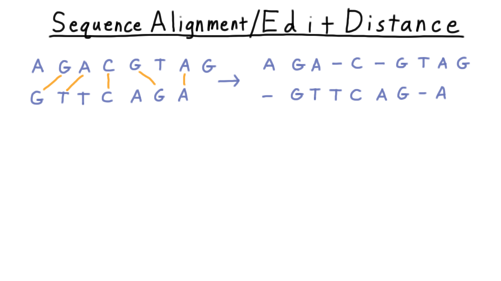

   Example alignment between two genetic sequences.

Cost Function
~~~~~~~~~~~~~

An alignment :math:`A` pairs characters from :math:`X` and :math:`Y` (possibly with gaps).
The total cost combines:

* **Gap penalty** for unmatched characters (insertions / deletions):
  :math:`n + m - 2|A|`
* **Mismatch penalty** for matched-but-different characters:
  :math:`\sum_{(i,j)\in A} \alpha(X_i, Y_j)`

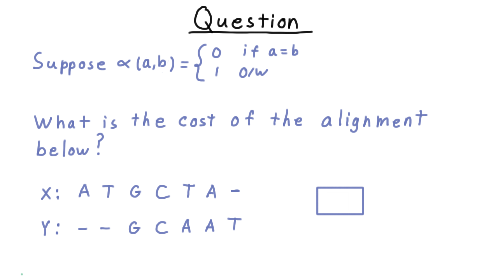

   *Quiz:* Calculate the alignment cost for a given pair of sequences.

Recurrence
~~~~~~~~~~

Let :math:`c(i, j)` = minimum cost of aligning the first :math:`i` characters of
:math:`X` with the first :math:`j` characters of :math:`Y`.

At each step there are three cases:

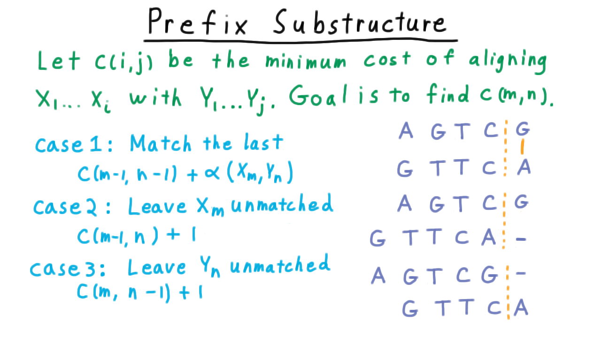

   Three cases: match/mismatch the last characters, or introduce a gap in :math:`X`
   or :math:`Y`.

.. math::

   c(i, j) = \min \begin{cases}
     c(i-1,\, j-1) + \alpha(X_i,\, Y_j) & \text{(match/mismatch last chars)} \\
     c(i-1,\, j) + 1                     & \text{(gap in } Y \text{)} \\
     c(i,\, j-1) + 1                     & \text{(gap in } X \text{)}
   \end{cases}

**Base cases:**

.. math::

   c(0, j) = j \qquad c(i, 0) = i

Algorithm
~~~~~~~~~

Fill an :math:`(m+1) \times (n+1)` grid in row-major (scanline) order so that
:math:`c(i-1, j-1)`, :math:`c(i-1, j)`, and :math:`c(i, j-1)` are always available.

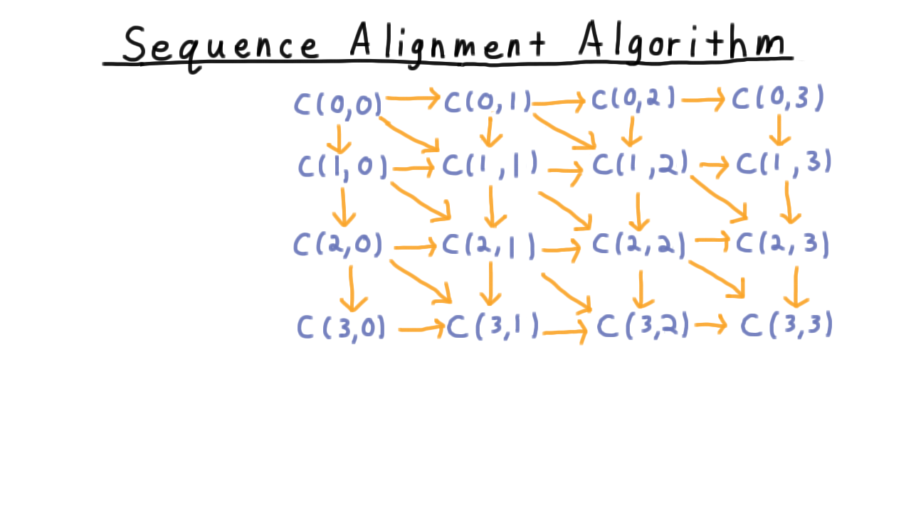

   Grid structure — each cell depends on the cell above-left, above, and to the left.

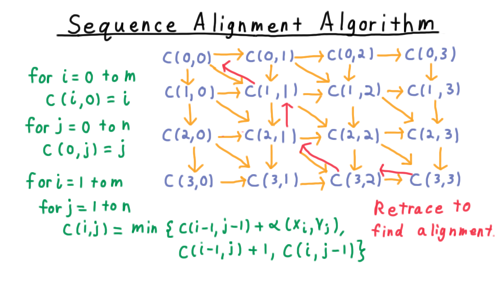

   Pseudocode for the sequence alignment / edit-distance algorithm.

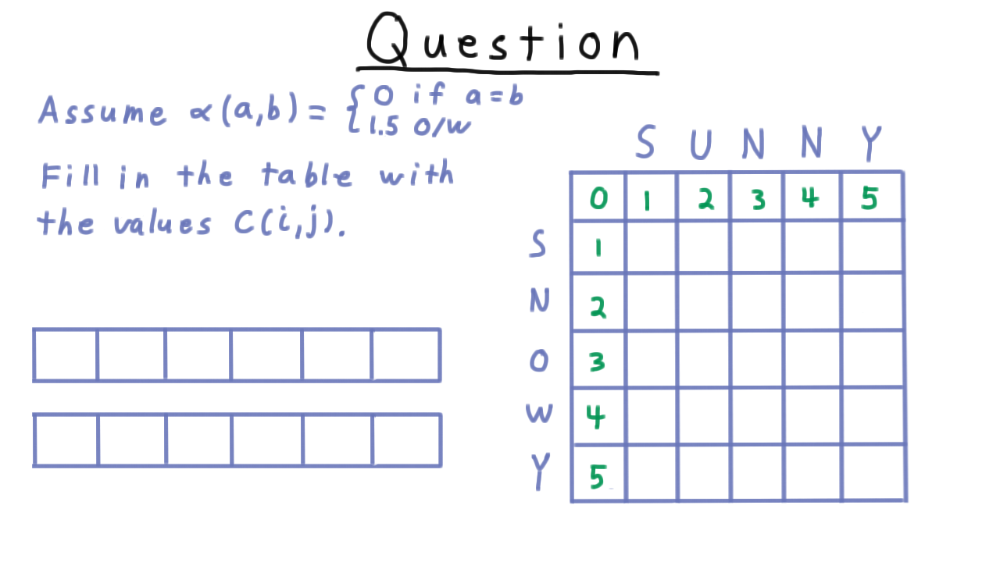

   *Quiz:* Align ``"snowy"`` with ``"sunny"`` using the recurrence.

Backtrack through the table to reconstruct the actual alignment.

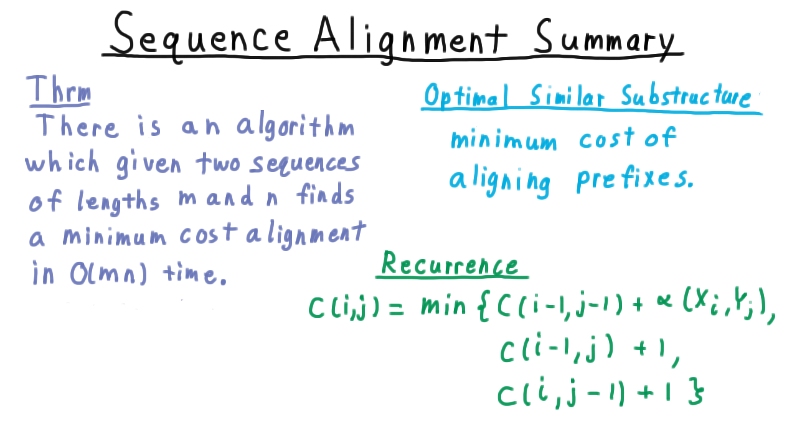

   Summary: :math:`O(mn)` time and space; backtracking gives the optimal alignment.

**Time complexity:** :math:`O(mn)`

----

Problem 2: Chain Matrix Multiplication
----------------------------------------

**Goal:** Find the optimal parenthesization of a matrix chain
:math:`A_1 \times A_2 \times \cdots \times A_n` to minimize total scalar multiplications.

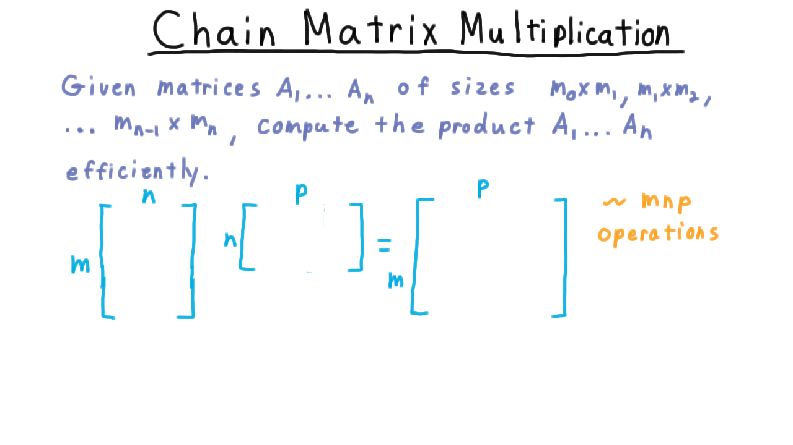

   Multiplying an :math:`m \times n` matrix by an :math:`n \times p` matrix costs
   :math:`mnp` scalar multiplications.

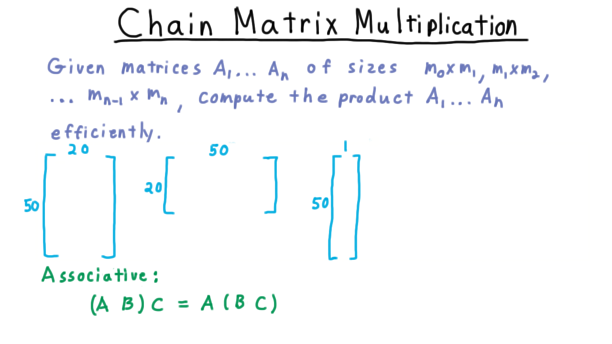

   Two different parenthesizations of the same chain can differ dramatically in cost.

Key Insight
~~~~~~~~~~~

Matrix multiplication is **associative** but not commutative. The order of parenthesization
does not change the result but can change the number of operations by orders of magnitude.

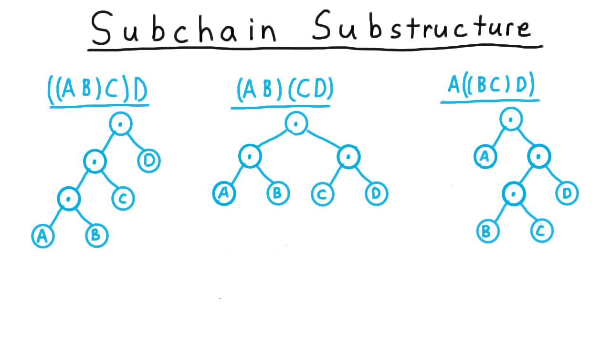

   Expression trees for different parenthesizations of :math:`A_1 A_2 A_3 A_4`.

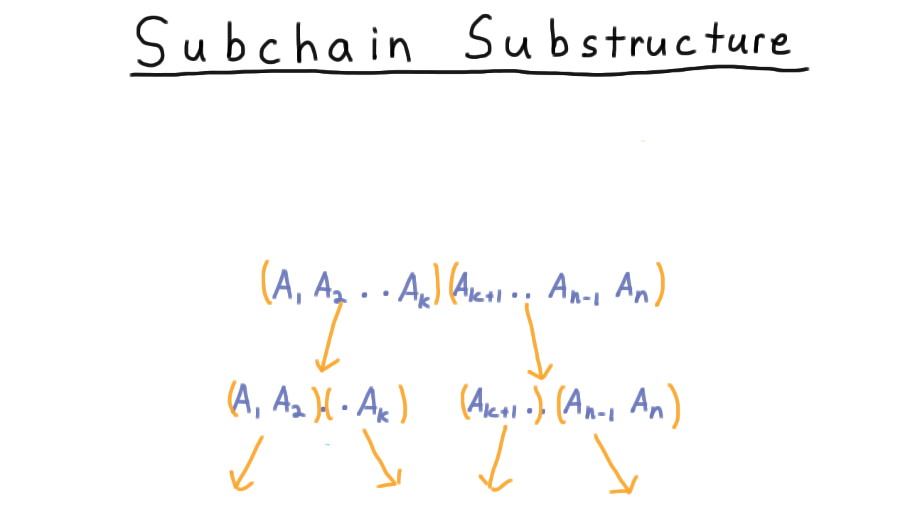

   Recursive split strategy: choose a split point :math:`k` and solve each half.

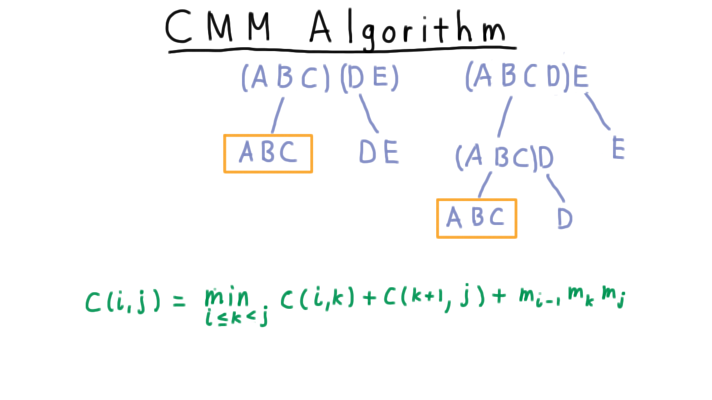

   Naive recursion recomputes overlapping subproblems — DP avoids this.

Recurrence
~~~~~~~~~~

Let :math:`C(i, j)` = minimum cost of multiplying matrices :math:`A_i` through
:math:`A_j`, where matrix :math:`A_i` has dimensions :math:`m_{i-1} \times m_i`.

.. math::

   C(i, j) = \min_{i \leq k < j} \bigl\{ C(i,\, k) + C(k+1,\, j) + m_{i-1} \cdot m_k \cdot m_j \bigr\}

**Base case:**

.. math::

   C(i, i) = 0

The term :math:`m_{i-1} \cdot m_k \cdot m_j` is the cost of multiplying the two
resulting subchain matrices together.

Algorithm
~~~~~~~~~

Fill an :math:`n \times n` table along **diagonals** from the main diagonal toward the
upper-right corner. Each entry :math:`C(i,j)` depends only on entries strictly below
(smaller subchains).

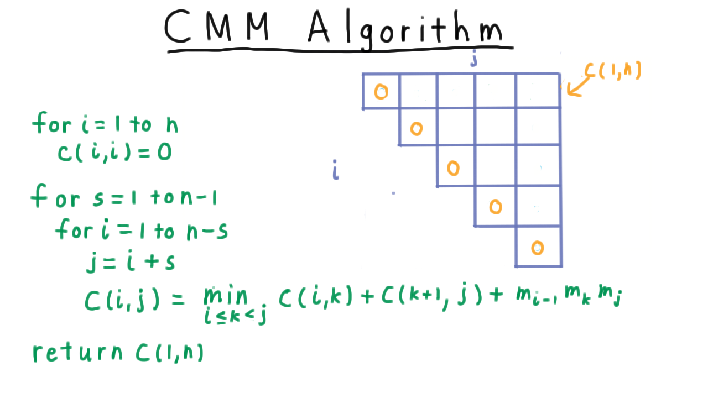

   Diagonal fill order — entries depend on cells below and to the left.

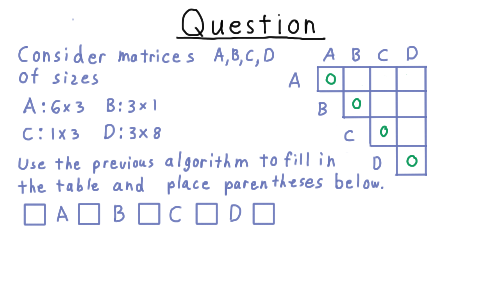

   *Quiz:* Compute the optimal parenthesization cost for matrices :math:`A, B, C, D`.

Record the split point :math:`k` that achieves each minimum to reconstruct the
parenthesization.

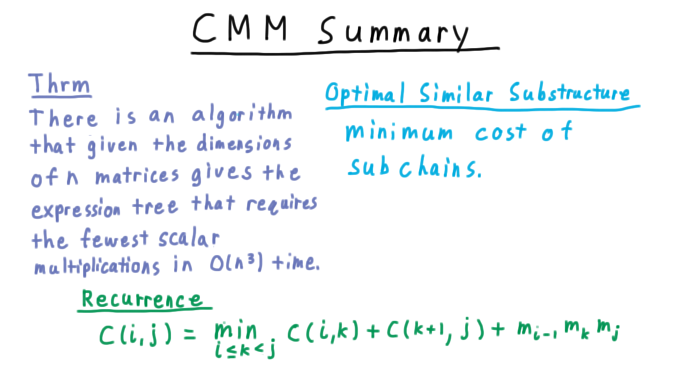

   Summary: :math:`O(n^2)` subproblems, :math:`O(n)` work each → :math:`O(n^3)` total.

**Time complexity:** :math:`O(n^3)`

----

Problem 3: All-Pairs Shortest Paths (Floyd-Warshall)
------------------------------------------------------

**Goal:** Find the shortest-path weight :math:`\delta(u, v)` between every pair of
vertices in a weighted directed graph.

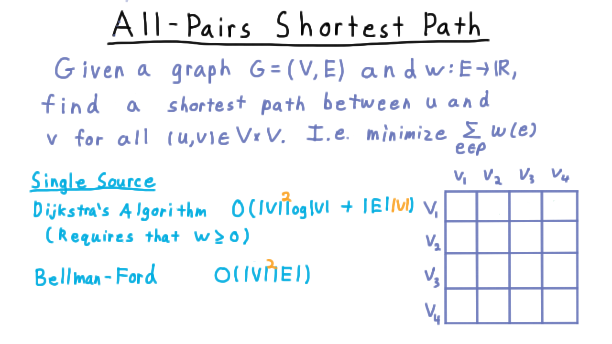

   Running a single-source algorithm from every vertex costs
   :math:`O(V \cdot E \log V)` with Dijkstra — Floyd-Warshall achieves :math:`O(V^3)`.

Optimal Substructure
~~~~~~~~~~~~~~~~~~~~

Subpaths of shortest paths are themselves shortest paths (**cut-and-paste argument**).

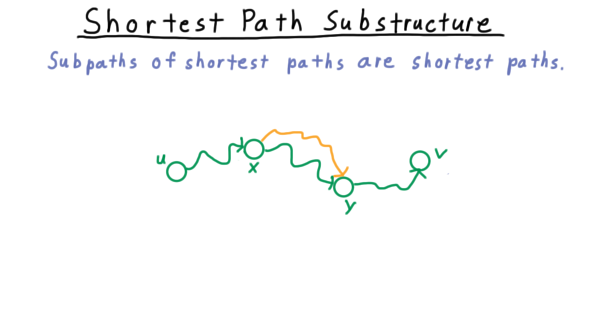

   If a subpath were not optimal, replacing it would yield a shorter overall path —
   contradiction.

The naive approach indexes paths by number of edges, leading to a matrix-multiplication
formulation.

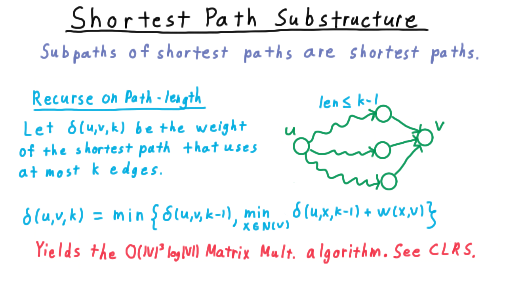

   Matrix-multiplication approach to all-pairs shortest paths (slower alternative).

Floyd-Warshall instead indexes by the **set of allowed intermediate vertices**,
eliminating circular dependencies.

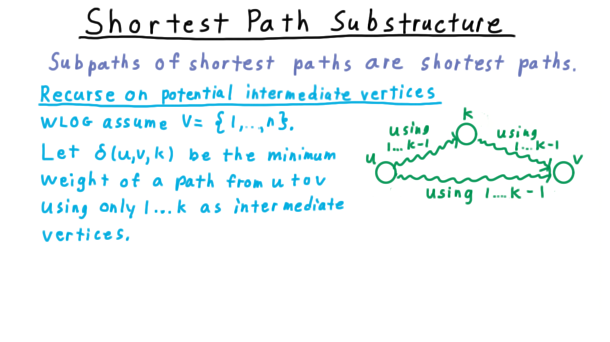

   Floyd-Warshall recurrence: restrict intermediate vertices to :math:`\{1, \ldots, k\}`.

Recurrence
~~~~~~~~~~

Let :math:`\delta(u, v, k)` = minimum-weight path from :math:`u` to :math:`v` using only
vertices :math:`\{1, \ldots, k\}` as intermediates.

.. math::

   \delta(u, v, k) = \min \begin{cases}
     \delta(u,\, v,\, k-1)                        & \text{(don't use vertex } k \text{)} \\
     \delta(u,\, k,\, k-1) + \delta(k,\, v,\, k-1) & \text{(route through vertex } k \text{)}
   \end{cases}

**Base case:**

.. math::

   \delta(u, v, 0) = \begin{cases} w(u, v) & \text{if edge } (u,v) \text{ exists} \\ \infty & \text{otherwise} \end{cases}

Algorithm
~~~~~~~~~

Initialize a :math:`V \times V` distance matrix with direct edge weights (and
:math:`\infty` for missing edges). For each :math:`k = 1` to :math:`V`, update every
pair :math:`(u, v)`:

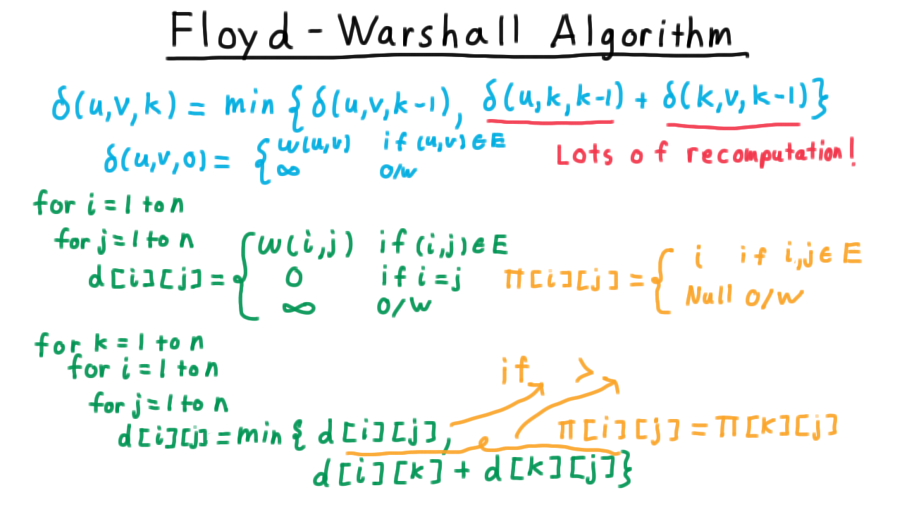

   Floyd-Warshall pseudocode — three nested loops, updating in-place.

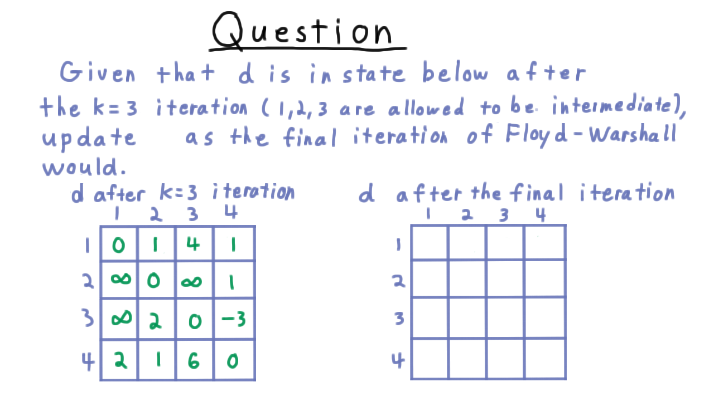

   *Quiz:* Complete the distance matrix after the :math:`k = 4` iteration.

Maintain a predecessor matrix alongside the distance matrix to reconstruct actual paths.

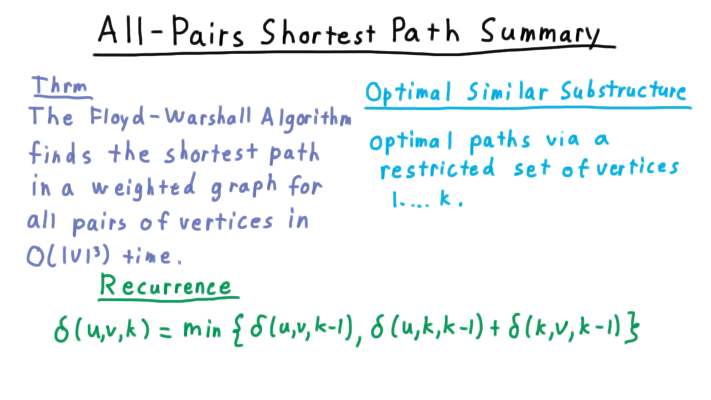

   Summary: :math:`O(V^3)` time, :math:`O(V^2)` space.

**Time complexity:** :math:`O(V^3)`

Transitive Closure
~~~~~~~~~~~~~~~~~~

The same structure computes the **transitive closure** of a relation — whether a path
*exists* rather than its weight — by replacing weights with booleans:

.. math::

   t(u, v, k) = t(u,\, v,\, k-1) \;\lor\; \bigl(t(u,\, k,\, k-1) \land t(k,\, v,\, k-1)\bigr)

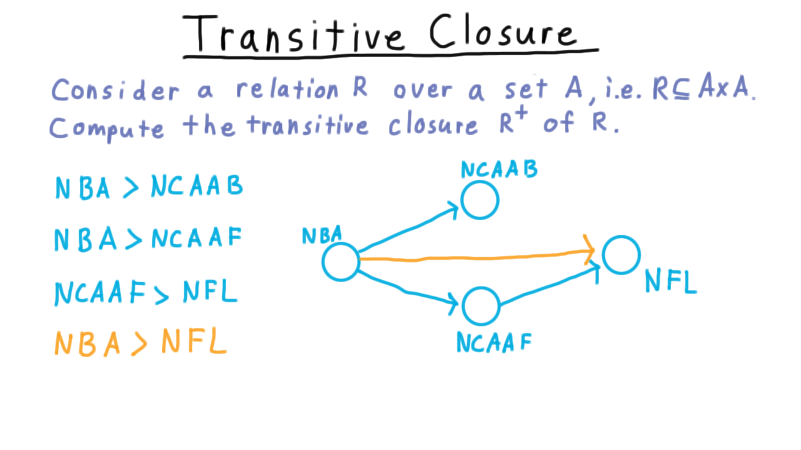

   Directed graph example: does player :math:`u` (transitively) prefer sport :math:`v`?

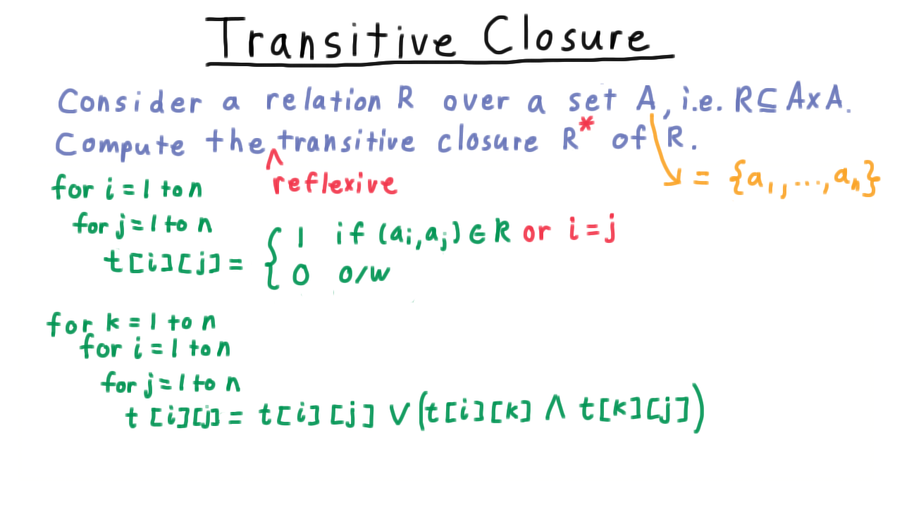

   Boolean Floyd-Warshall computes the full transitive closure in :math:`O(V^3)`.

----

DP Design Recipe
-----------------

1. **Identify substructure** — express the optimum recursively in terms of smaller
   subproblems.
2. **Write the recurrence** — define :math:`OPT(i, \ldots)` and how it decomposes.
3. **State base cases** — trivial instances with known answers.
4. **Choose fill order** — arrange computation so every dependency is already solved.
5. **Implement iteratively** — build a table; avoid recursion to prevent recomputation.
6. **Reconstruct solution** — trace back through stored decisions.

----

Limitations
-----------

DP does not guarantee polynomial time for all recursively-defined problems. For example,
**SAT** has a valid recursive formulation (try :math:`x_i = \text{true}` / :math:`\text{false}`
and recurse), yet no polynomial DP is known — subproblem overlap is insufficient for
exploitation unless :math:`P = NP`.

----

Complexity Summary
------------------

.. list-table::
   :header-rows: 1
   :widths: 40 30 30

   * - Problem
     - Subproblems
     - Time
   * - Sequence Alignment
     - :math:`O(mn)`
     - :math:`O(mn)`
   * - Chain Matrix Multiplication
     - :math:`O(n^2)`
     - :math:`O(n^3)`
   * - All-Pairs Shortest Paths
     - :math:`O(V^2)`
     - :math:`O(V^3)`
   * - Transitive Closure
     - :math:`O(V^2)`
     - :math:`O(V^3)`

----

Key Recurrences
---------------

**Sequence alignment:**

.. math::

   c(i, j) = \min\bigl\{\, c(i-1,j-1) + \alpha(X_i, Y_j),\quad c(i-1,j)+1,\quad c(i,j-1)+1 \,\bigr\}

**Chain matrix multiplication:**

.. math::

   C(i, j) = \min_{i \leq k < j}\bigl\{\, C(i,k) + C(k+1,j) + m_{i-1} m_k m_j \,\bigr\}

**Floyd-Warshall:**

.. math::

   \delta(u,v,k) = \min\bigl\{\, \delta(u,v,k-1),\quad \delta(u,k,k-1) + \delta(k,v,k-1) \,\bigr\}
