Fast Fourier Transform
======================

*From Computability, Complexity & Algorithms — Charles Brubaker and Lance Fortnow*

* Source: https://s3.amazonaws.com/content.udacity-data.com/courses/gt-cs6505/fft.html

----

Introduction: Convolution and Polynomial Multiplication
---------------------------------------------------------

The Fast Fourier Transform (FFT) enables efficient **convolution** of sequences,
reducing the naive :math:`O(nm)` cost to :math:`O(N \log N)` where
:math:`N = n + m - 1` is the output length.

Convolution arises in signal processing, image filtering, and polynomial multiplication.
The :math:`k`-th coefficient of the convolution of sequences :math:`a` and :math:`b` is:

.. math::

   c_k = \sum_{j} a_j \cdot b_{k-j}

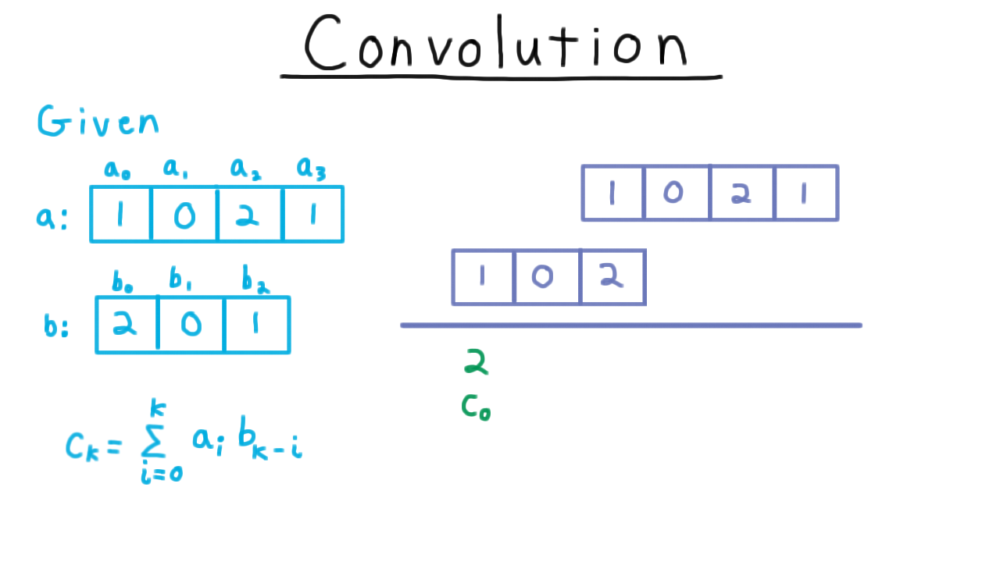

   Initial alignment of the two sequences for convolution at :math:`k = 0`.

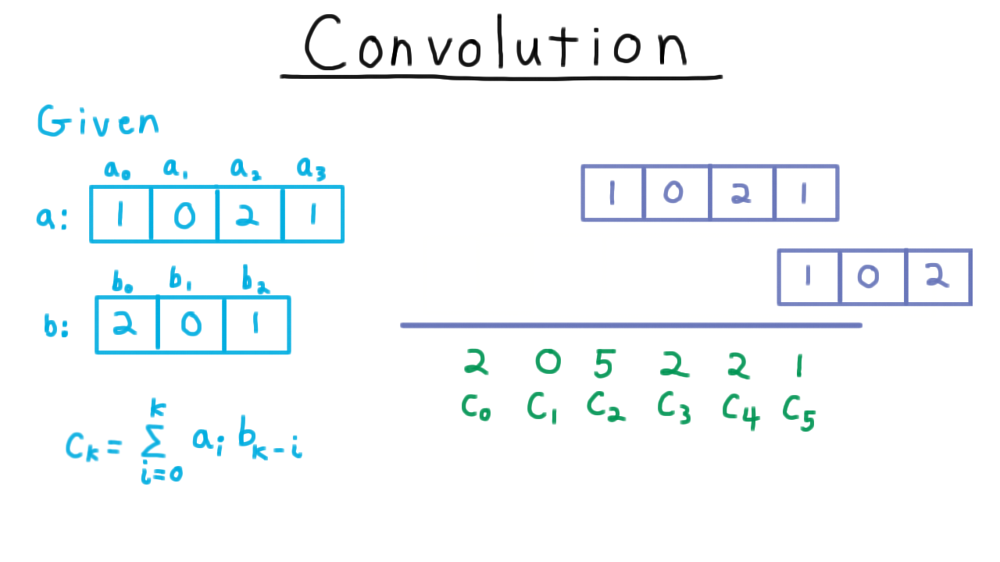

   Final state after sliding the reversed sequence through the convolution.

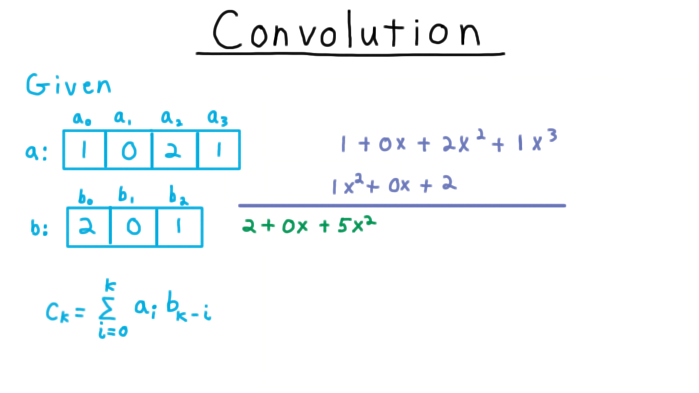

   Alignment demonstrating calculation of the :math:`x^2` term in polynomial multiplication.

Convolution of :math:`a` and :math:`b` is equivalent to **multiplying the corresponding
polynomials** :math:`A(x)` and :math:`B(x)`.

----

Polynomial Representations
----------------------------

A degree-:math:`n` polynomial :math:`A(x) = a_0 + a_1 x + a_2 x^2 + \cdots + a_{n-1} x^{n-1}`
can be represented in two ways:

* **Coefficient form:** the vector :math:`(a_0, a_1, \ldots, a_{n-1})`.
* **Value form:** the values :math:`A(x_0), A(x_1), \ldots, A(x_{N-1})` at :math:`N`
  distinct points (requires :math:`N \geq n`).

Conversion from coefficients to values at :math:`N` points uses the **Vandermonde matrix**:

.. math::

   \begin{pmatrix} 1 & x_0 & x_0^2 & \cdots \\ 1 & x_1 & x_1^2 & \cdots \\ \vdots & & & \end{pmatrix}
   \begin{pmatrix} a_0 \\ a_1 \\ \vdots \end{pmatrix}
   =
   \begin{pmatrix} A(x_0) \\ A(x_1) \\ \vdots \end{pmatrix}

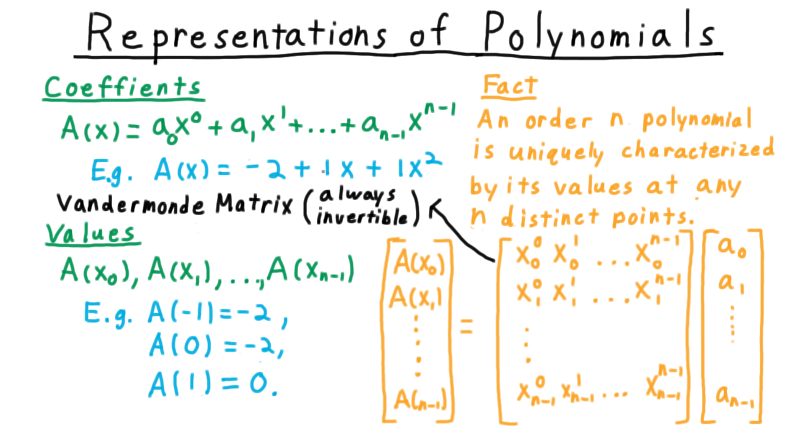

   Vandermonde matrix converting polynomial coefficients to point values.

**Key observation:** In value form, pointwise multiplication of two degree-:math:`N`
polynomials costs only :math:`O(N)`:

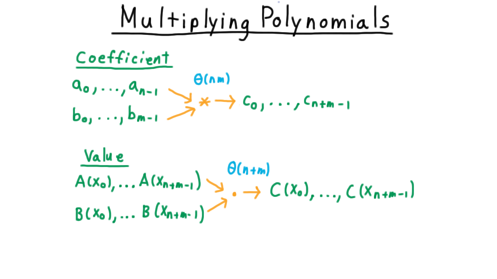

   Multiplication is :math:`O(N^2)` in coefficient form but :math:`O(N)` in value form.

----

The Three-Step FFT Process
---------------------------

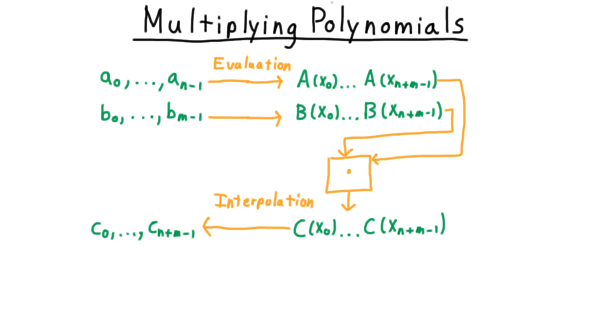

   **Evaluate → Multiply → Interpolate**: convert to values, multiply pointwise,
   convert back to coefficients.

1. **Evaluate** :math:`A` and :math:`B` at :math:`N` chosen points → value representations.
2. **Multiply** pointwise: :math:`C(x_i) = A(x_i) \cdot B(x_i)` for each :math:`i` — cost :math:`O(N)`.
3. **Interpolate** the product values back to coefficients of :math:`C`.

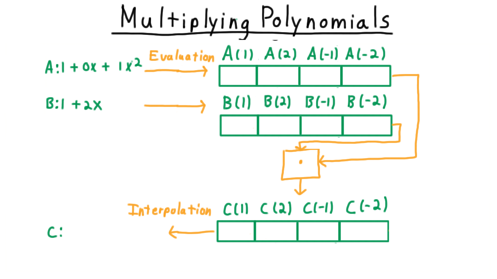

   *Quiz:* Multiply two polynomials using value representation.

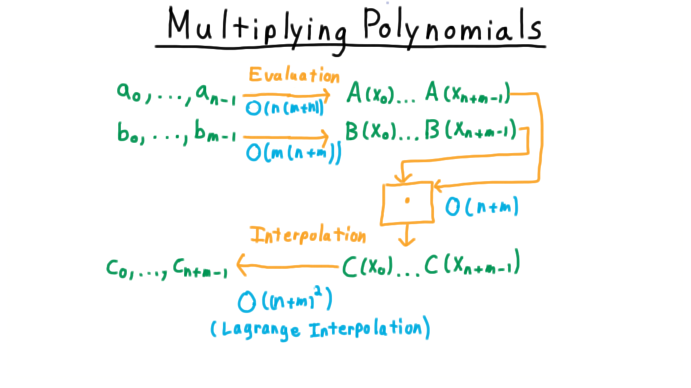

   Time complexity of each stage — the bottleneck is evaluation and interpolation.

The naive evaluation at :math:`N` arbitrary points costs :math:`O(N^2)` (one Horner
evaluation per point). The FFT achieves :math:`O(N \log N)` by choosing the evaluation
points cleverly.

----

Even-Odd Decomposition
-----------------------

Split :math:`A(x)` into even- and odd-indexed coefficients:

.. math::

   A_e(x) = a_0 + a_2 x + a_4 x^2 + \cdots \qquad A_o(x) = a_1 + a_3 x + a_5 x^2 + \cdots

Then:

.. math::

   A(x)  &= A_e(x^2) + x \cdot A_o(x^2) \\
   A(-x) &= A_e(x^2) - x \cdot A_o(x^2)

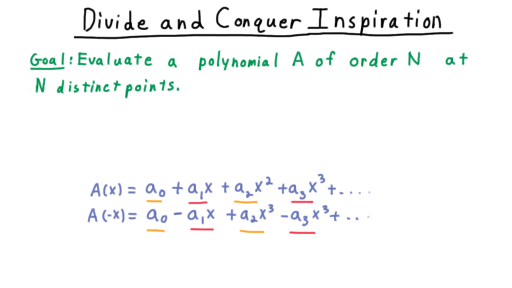

   Evaluating at :math:`+x` and :math:`-x` shares the computation of
   :math:`A_e(x^2)` and :math:`A_o(x^2)`.

**Saving:** One recursive call at :math:`x^2` gives both :math:`A(x)` and :math:`A(-x)` —
halving the work at each level.

----

Roots of Unity
--------------

To apply the even-odd trick recursively, choose evaluation points as the
:math:`N`-th **roots of unity**:

.. math::

   \omega_N = e^{2\pi i / N}, \qquad \omega_N^0, \omega_N^1, \ldots, \omega_N^{N-1}

These satisfy the key **cancellation property**:

.. math::

   \omega_N^{j + N/2} = -\omega_N^j

so the positive-negative pairing needed by the even-odd split is automatically present.

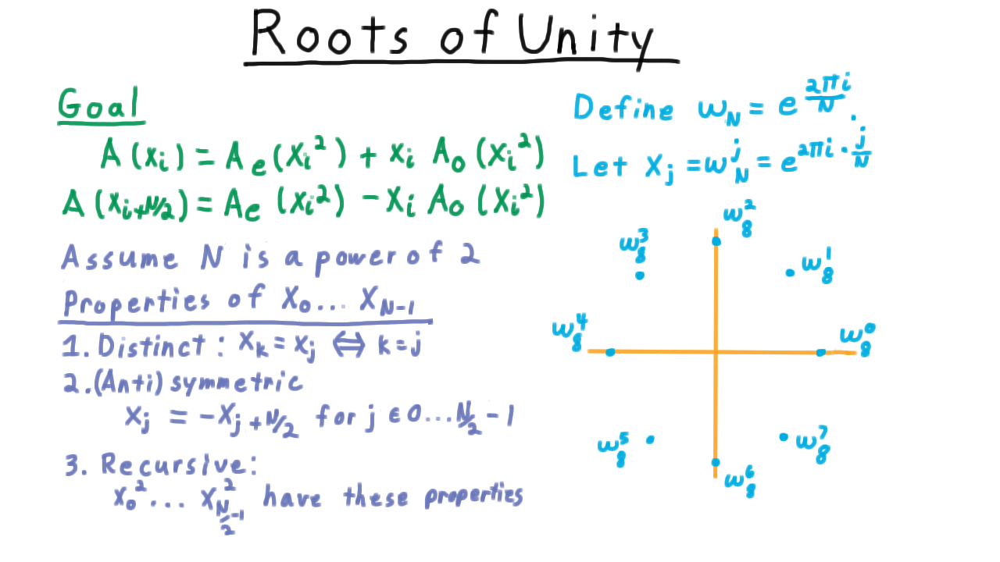

   The 8th roots of unity arranged on the unit circle in the complex plane.

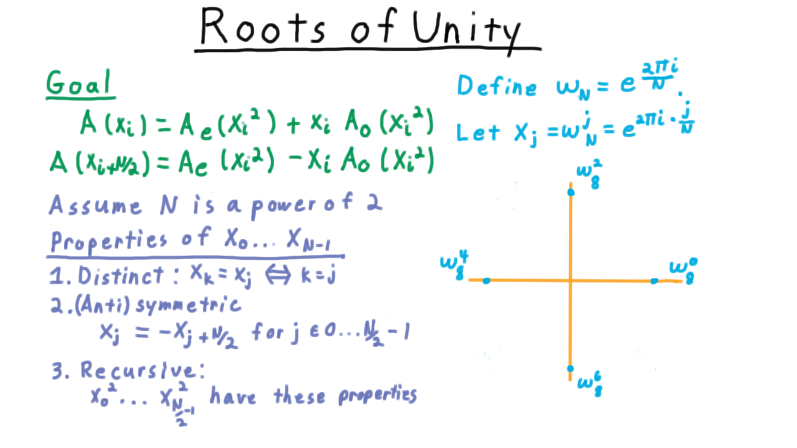

   Squaring the 8th roots of unity yields the 4th roots of unity.

----

Recursive FFT Structure
------------------------

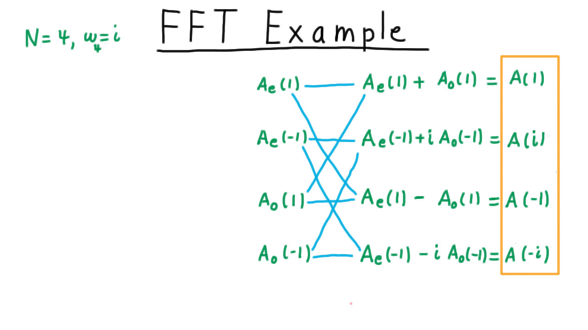

   First decomposition level: evaluate at 8th roots → two sub-problems at 4th roots.

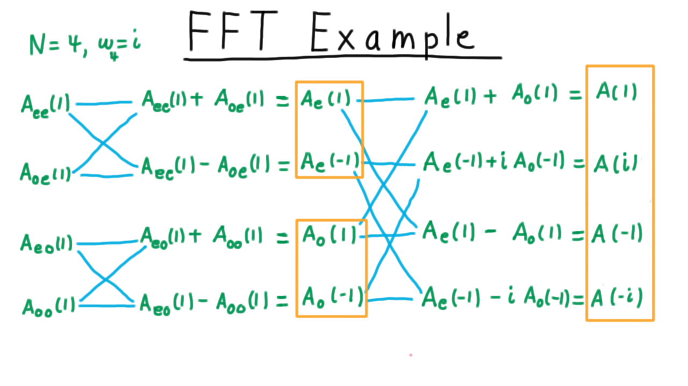

   Second decomposition level: 4th roots → two sub-problems at 2nd roots (base case).

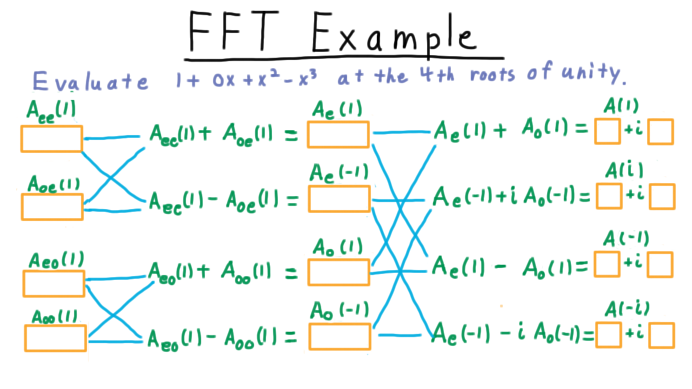

   *Quiz:* Apply FFT to evaluate a polynomial at the four 4th roots of unity.

FFT Algorithm
~~~~~~~~~~~~~

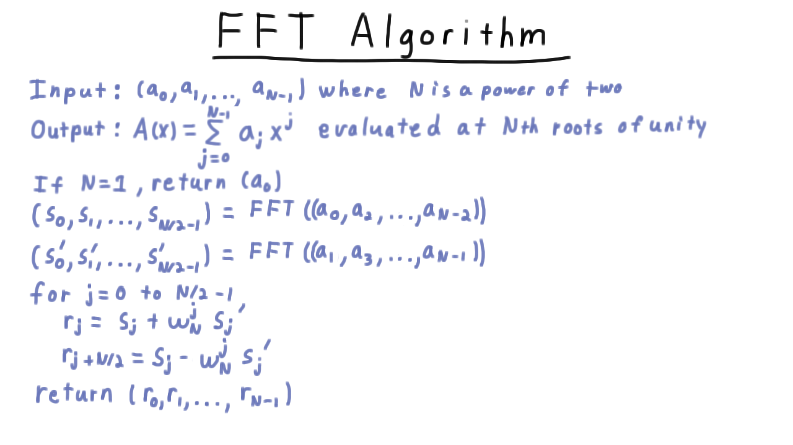

   Formal recursive FFT pseudocode.

.. code-block:: text

   FFT(a, ω):          # a = coefficient vector, ω = primitive N-th root
       if N == 1: return a[0]
       a_e = [a[0], a[2], ..., a[N-2]]
       a_o = [a[1], a[3], ..., a[N-1]]
       y_e = FFT(a_e, ω²)
       y_o = FFT(a_o, ω²)
       for j = 0 to N/2 - 1:
           y[j]       = y_e[j] + ω^j · y_o[j]
           y[j + N/2] = y_e[j] - ω^j · y_o[j]
       return y

**Recurrence:**

.. math::

   T(N) = 2T(N/2) + \Theta(N) \;\Longrightarrow\; T(N) = \Theta(N \log N)

by the Master Theorem.

----

Butterfly Network
-----------------

The FFT computation can be visualised as a **butterfly network** — a circuit of
:math:`\log N` layers each performing :math:`N/2` butterfly operations.

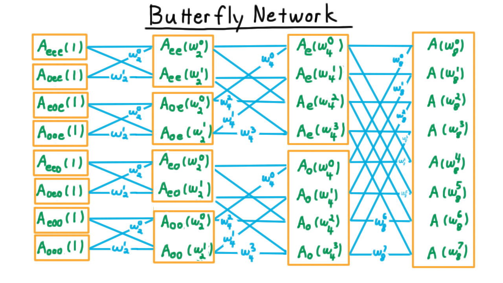

   Butterfly network showing the data flow and computation dependencies.

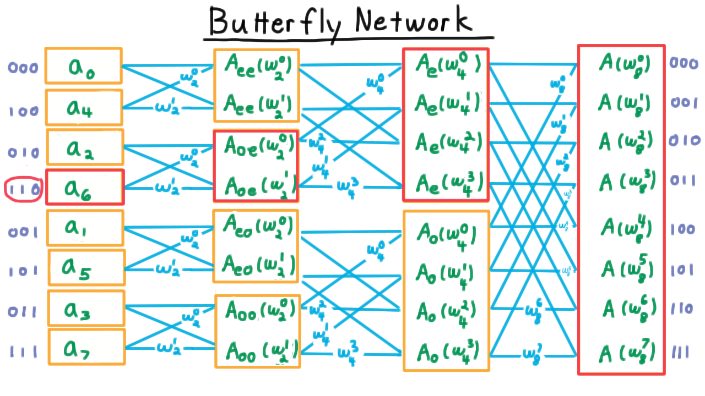

   Right-to-left paths encode the **bit-reversal** permutation of input indices.

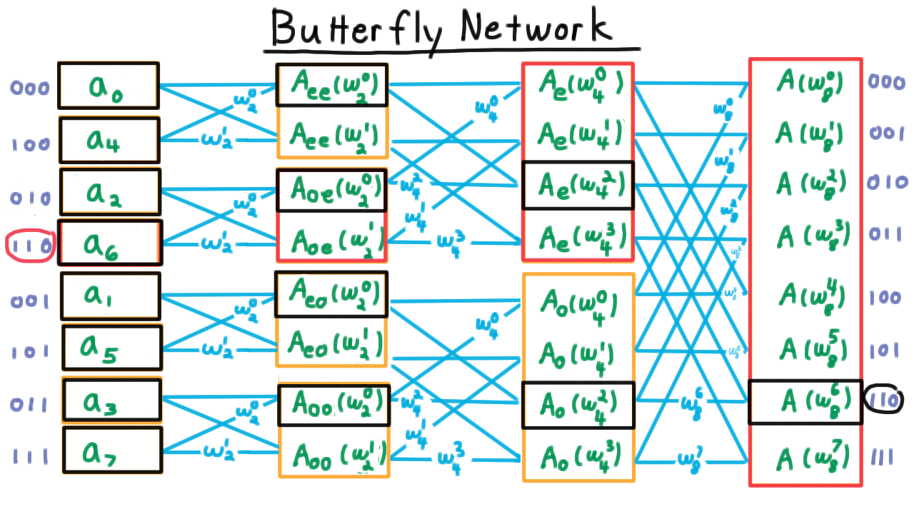

   Left-to-right paths encode the **twiddle-factor** :math:`\omega^j` multiplications.

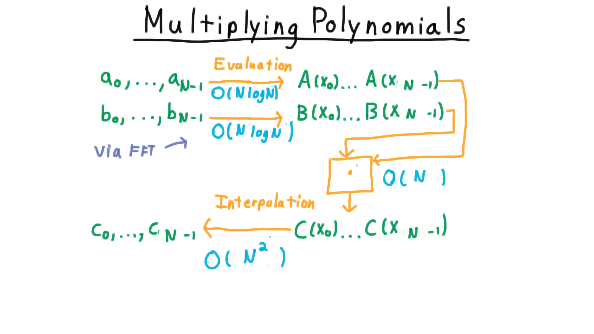

   Updated running time: evaluation and interpolation both cost :math:`O(N \log N)`,
   giving overall :math:`O(N \log N)` polynomial multiplication.

----

Inverse FFT (Interpolation)
----------------------------

Given the values :math:`A(\omega^0), \ldots, A(\omega^{N-1})`, recover the coefficients
using the **inverse DFT**. The Vandermonde matrix at roots of unity has a convenient
inverse:

.. math::

   a_j = \frac{1}{N} \sum_{k=0}^{N-1} A(\omega^k) \cdot \omega^{-jk}

This is simply FFT evaluated at the **conjugate** roots :math:`\bar{\omega} = \omega^{-1}`,
followed by scaling by :math:`1/N`.

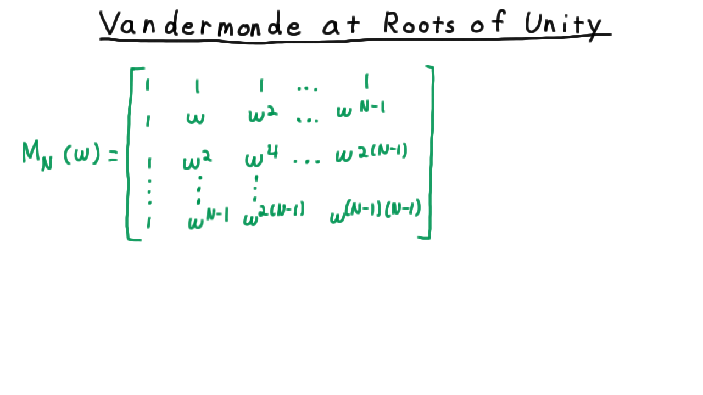

   Vandermonde matrix structure at the :math:`N`-th roots of unity and its inverse.

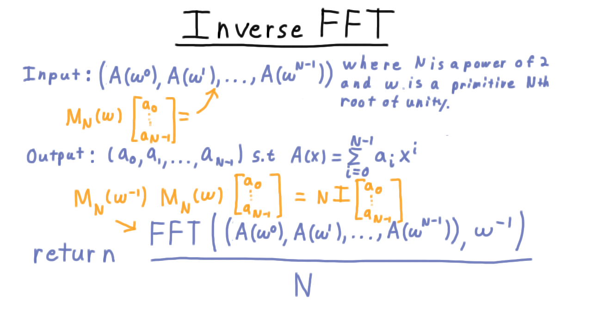

   Inverse FFT algorithm: run FFT with :math:`\omega^{-1}` then divide by :math:`N`.

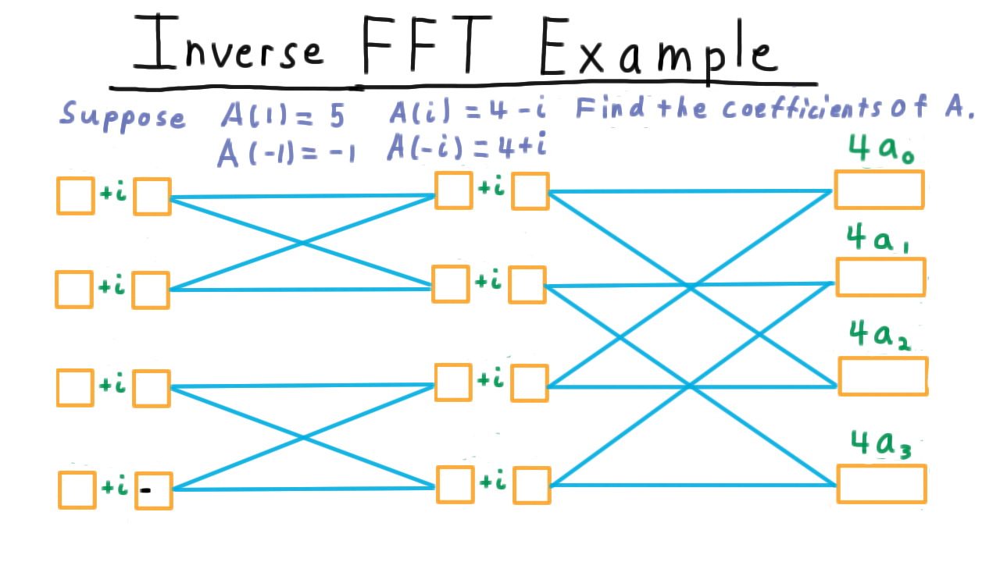

   *Quiz:* Recover polynomial coefficients from their values at roots of unity.

----

Complete Process
----------------

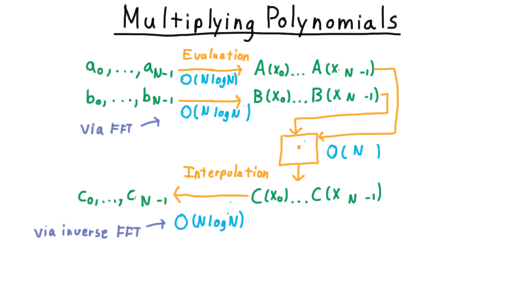

   Full polynomial multiplication pipeline achieving :math:`O(N \log N)` overall.

**Summary of costs:**

.. list-table::
   :header-rows: 1
   :widths: 45 30 25

   * - Stage
     - Naive cost
     - FFT cost
   * - Evaluate :math:`A`, :math:`B` at :math:`N` points
     - :math:`O(N^2)`
     - :math:`O(N \log N)`
   * - Pointwise multiply
     - :math:`O(N)`
     - :math:`O(N)`
   * - Interpolate :math:`C` from values
     - :math:`O(N^2)`
     - :math:`O(N \log N)`
   * - **Total**
     - :math:`O(N^2)`
     - :math:`O(N \log N)`

----

Key Formulas
------------

**Even-odd split:**

.. math::

   A(x) = A_e(x^2) + x \cdot A_o(x^2), \qquad A(-x) = A_e(x^2) - x \cdot A_o(x^2)

**Primitive** :math:`N`-th **root of unity:**

.. math::

   \omega_N = e^{2\pi i / N}

**Cancellation property:**

.. math::

   \omega_N^{j + N/2} = -\omega_N^j

**FFT recurrence:**

.. math::

   T(N) = 2T(N/2) + \Theta(N) = \Theta(N \log N)

**Inverse DFT:**

.. math::

   a_j = \frac{1}{N} \sum_{k=0}^{N-1} \hat{a}_k \cdot \omega_N^{-jk}

----

Further Reading
---------------

* Cooley-Tukey iterative (in-place) FFT implementation
* Number-theoretic transforms (FFT over finite fields)
* Applications: signal processing, image convolution, fast integer multiplication
