Randomized Algorithms
=====================

*From Computability, Complexity & Algorithms — Charles Brubaker and Lance Fortnow*

* Source: https://s3.amazonaws.com/content.udacity-data.com/courses/gt-cs6505/randomizedalgs.html

----

Introduction
------------

Randomization is a fundamental algorithmic tool. Rather than always making the same
deterministic choices, randomized algorithms flip coins — and often achieve better
expected performance or simpler analysis than their deterministic counterparts.

----

Polynomial Identity Testing
----------------------------

**Problem:** Given two polynomial representations :math:`A` and :math:`B` (each of
degree :math:`\leq d`), determine whether :math:`A \equiv B`.

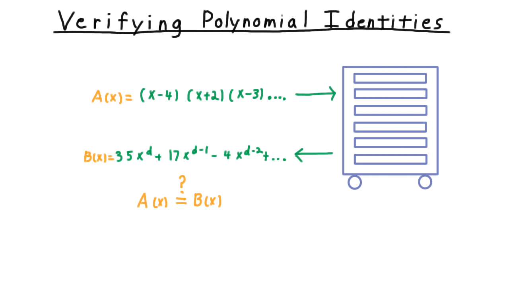

   Polynomial identity testing: evaluate both polynomials at a random point.

**Randomized algorithm:**

1. Pick a random integer :math:`r` uniformly from :math:`\{1, \ldots, 100d\}`.
2. Evaluate :math:`A(r)` and :math:`B(r)`.
3. If :math:`A(r) = B(r)`, declare equal; otherwise declare unequal.

**Why it works — Fundamental Theorem of Algebra:**

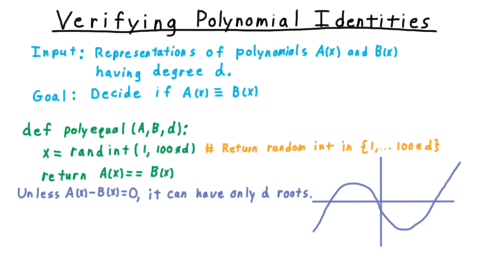

   A non-zero polynomial of degree :math:`d` has at most :math:`d` roots.

If :math:`A \not\equiv B`, then :math:`A - B` is a non-zero polynomial of degree
:math:`\leq d`, so it has at most :math:`d` roots. The probability of a false positive is:

.. math::

   \Pr[\text{false positive}] \leq \frac{d}{100d} = \frac{1}{100}

----

Discrete Probability
--------------------

A **discrete probability space** consists of:

* **Sample space** :math:`\Omega` — a finite or countably infinite set of outcomes.
* **Probability function** :math:`\Pr : 2^\Omega \to [0,1]` satisfying:

  .. math::

     \Pr(E) \geq 0, \quad \Pr(\Omega) = 1, \quad \Pr\!\left(\bigcup_i E_i\right) = \sum_i \Pr(E_i) \text{ (disjoint events)}

For **uniform distributions**: :math:`\Pr(S) = |S| / |\Omega|`.

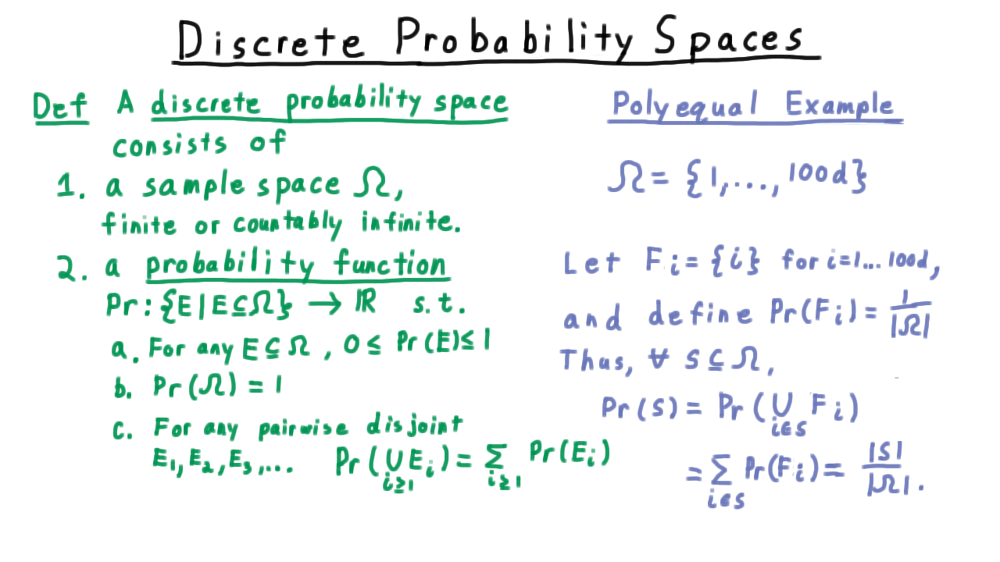

   Formal definition of a discrete probability space.

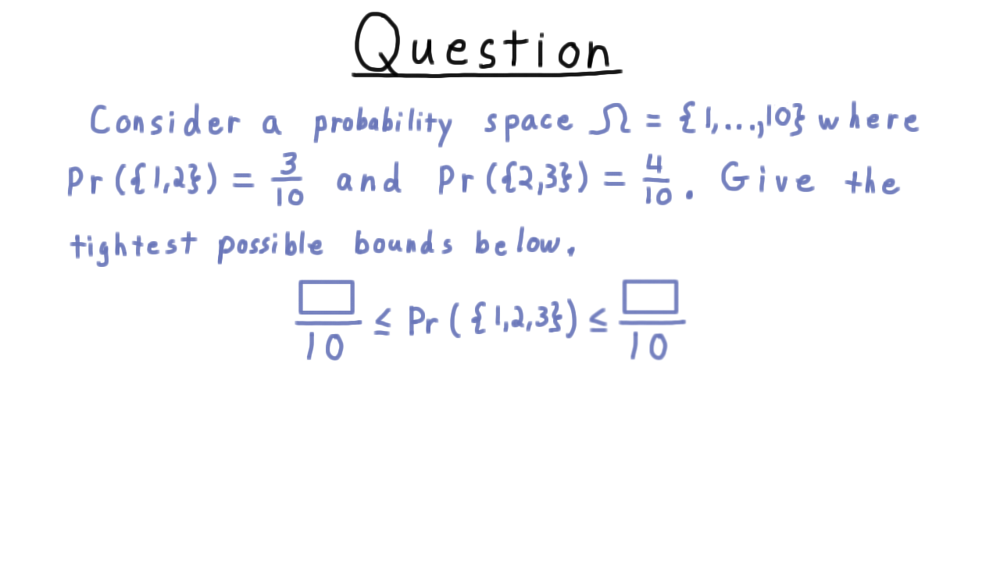

   *Quiz:* Bound the probability of an event in a given sample space.

Repeated Trials
~~~~~~~~~~~~~~~

When running an algorithm :math:`k` times independently, the probability that *at
least one* trial succeeds (given per-trial success probability :math:`p`) is:

.. math::

   \Pr[\text{at least one success}] = 1 - (1-p)^k

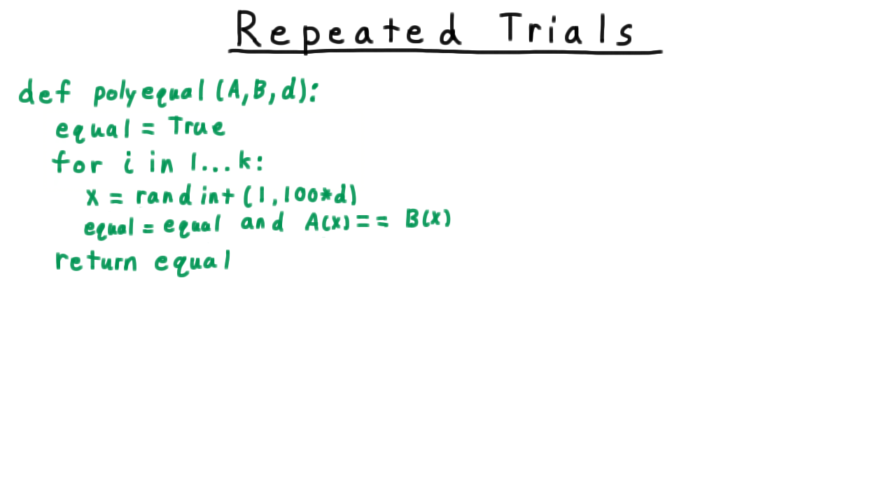

   Repeated trials algorithm pseudocode.

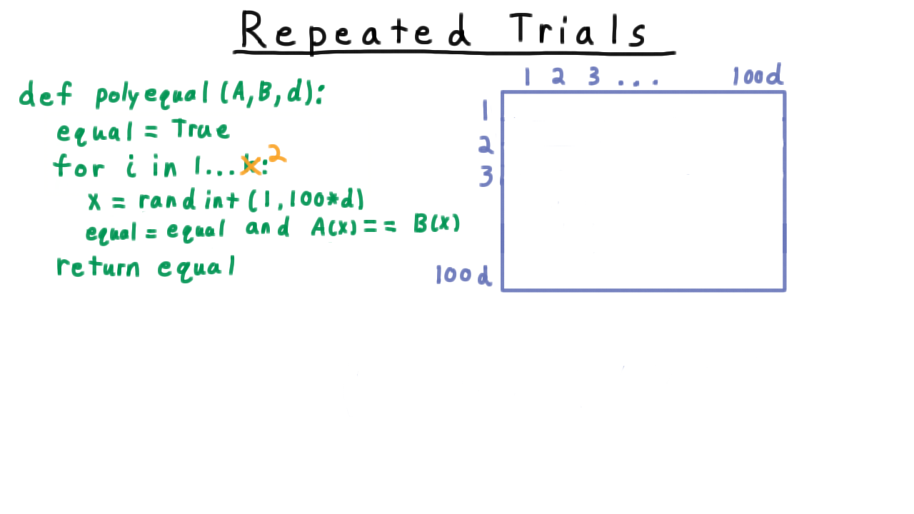

   Two-dimensional sample space for two independent trials.

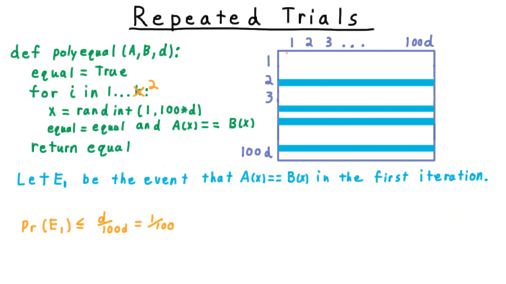

   Event :math:`E_1` as rows in the sample space grid.

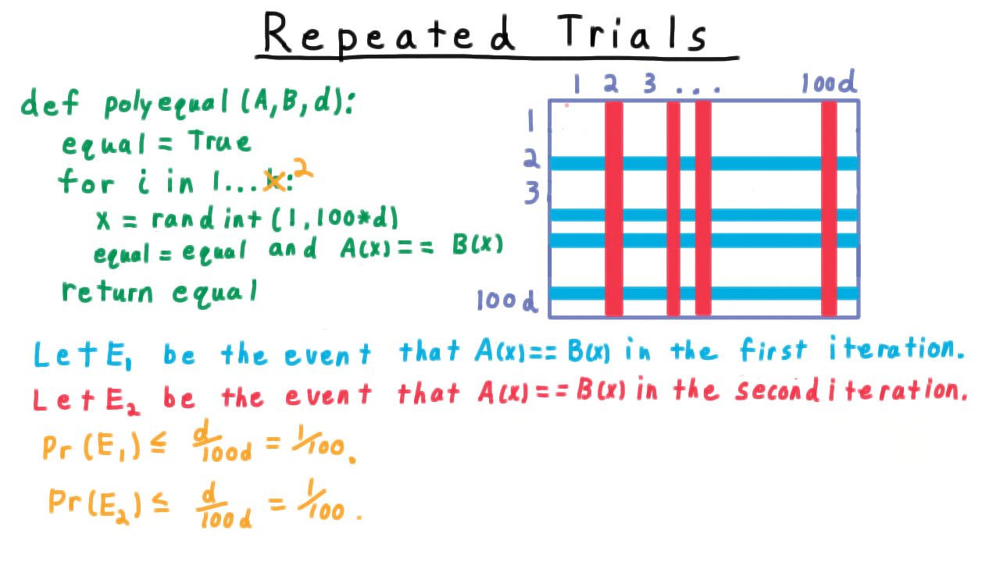

   Event :math:`E_2` as columns in the sample space grid.

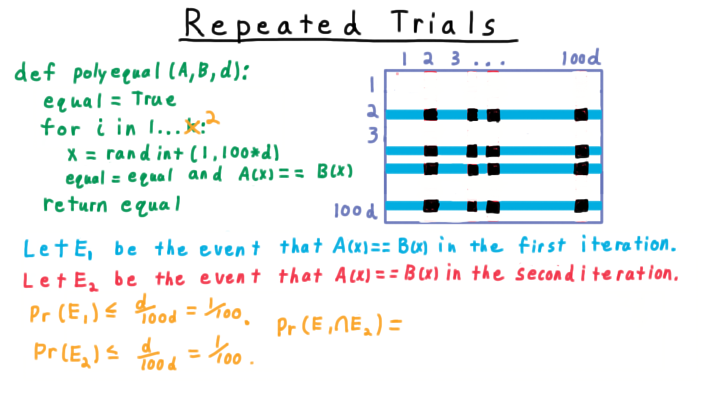

   Intersection :math:`E_1 \cap E_2` for independent events.

Conditional Probability and Independence
~~~~~~~~~~~~~~~~~~~~~~~~~~~~~~~~~~~~~~~~

**Conditional probability:**

.. math::

   \Pr(E \mid F) = \frac{\Pr(E \cap F)}{\Pr(F)}

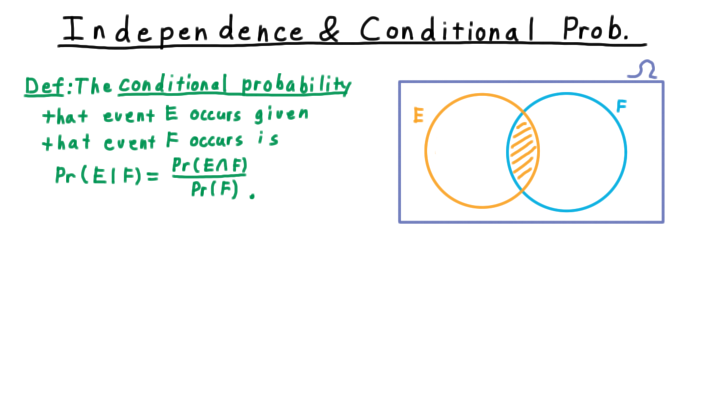

   Venn diagram illustration of conditional probability.

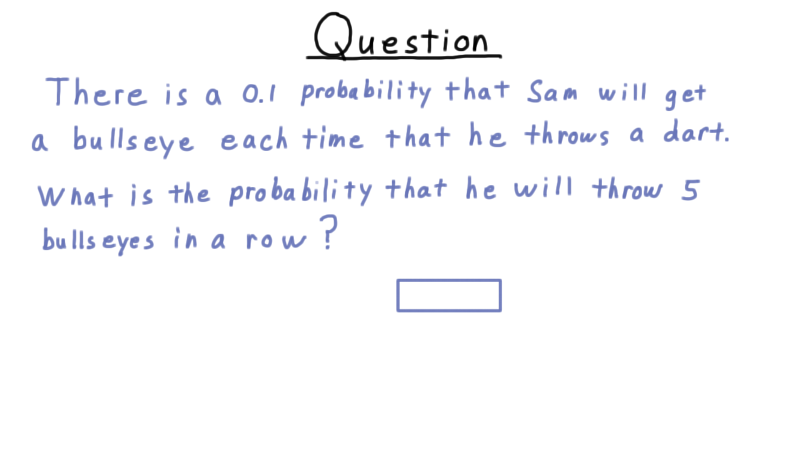

   *Quiz:* Dart-throwing probability exercise using conditional probability.

**Independence:** Events :math:`E` and :math:`F` are independent if:

.. math::

   \Pr(E \cap F) = \Pr(E) \cdot \Pr(F)

----

Monte Carlo vs. Las Vegas Algorithms
--------------------------------------

**Monte Carlo algorithms** may return incorrect answers but with bounded error probability:

* *One-sided error:* errors only on one type of input (e.g., declaring unequal polynomials equal, never vice versa).
* *Two-sided error:* errors possible on either type of input.

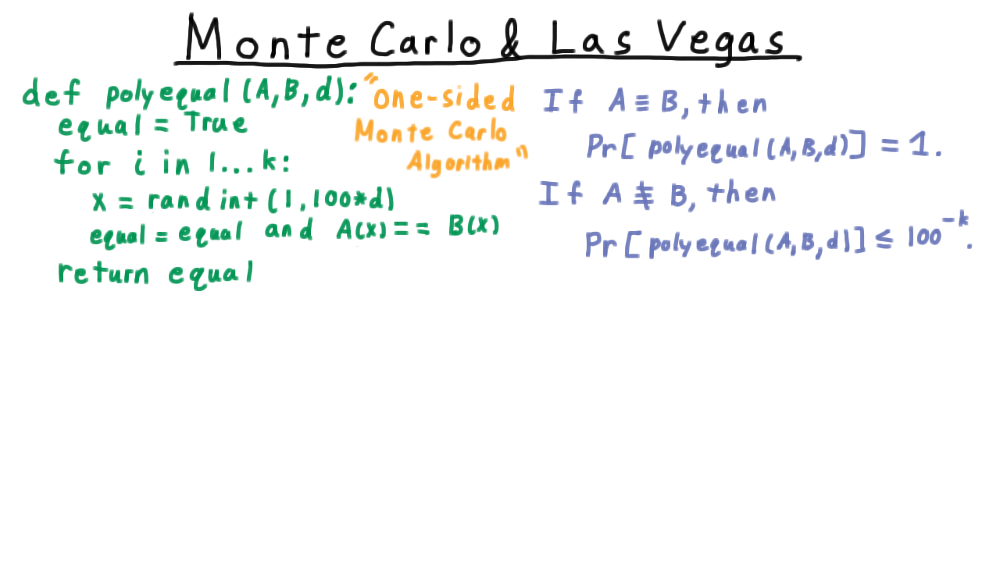

   One-sided Monte Carlo: never wrong when polynomials are truly equal.

**Las Vegas algorithms** are always correct; randomness only affects *running time*.

**Example:** Polynomial identity testing can be made Las Vegas by sampling *without
replacement* from :math:`\{1, \ldots, 100d\}`. After choosing :math:`d+1` distinct
points, at least one must be a non-root if :math:`A \not\equiv B`.

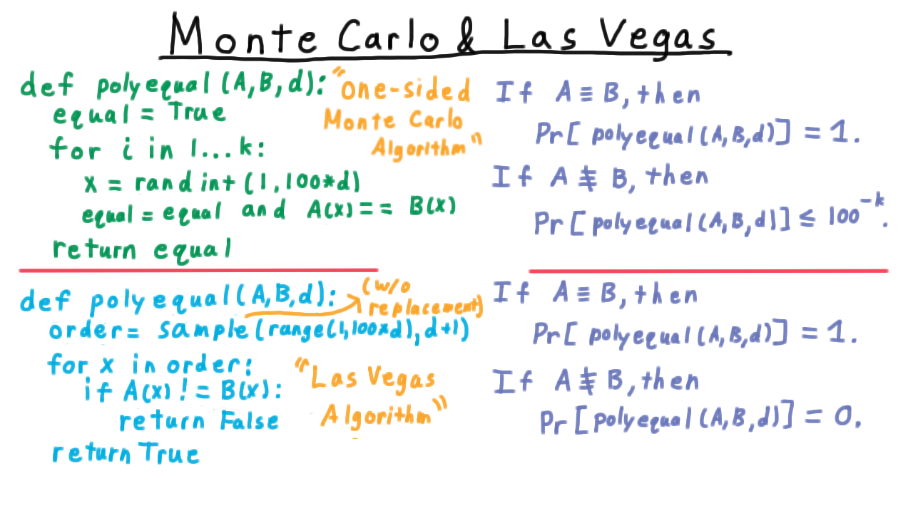

   Las Vegas variant: sampling without replacement guarantees correctness.

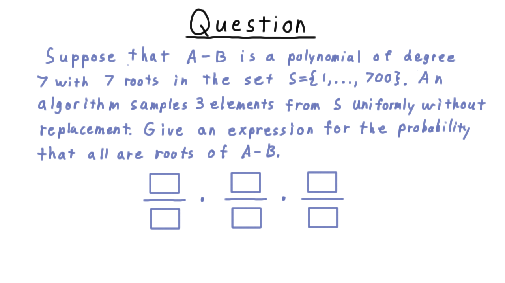

   *Quiz:* Compute the success probability when sampling without replacement.

----

Random Variables and Expectation
----------------------------------

A **random variable** :math:`X : \Omega \to \mathbb{R}` assigns a real value to each outcome.

**Expectation:**

.. math::

   \mathbb{E}[X] = \sum_{v \in X(\Omega)} v \cdot \Pr(X = v)

**Linearity of expectation** (holds even for *dependent* random variables):

.. math::

   \mathbb{E}[X + Y] = \mathbb{E}[X] + \mathbb{E}[Y], \qquad \mathbb{E}[aX] = a\,\mathbb{E}[X]

This is the key tool for analyzing randomized algorithms.

----

Randomized Quicksort
----------------------

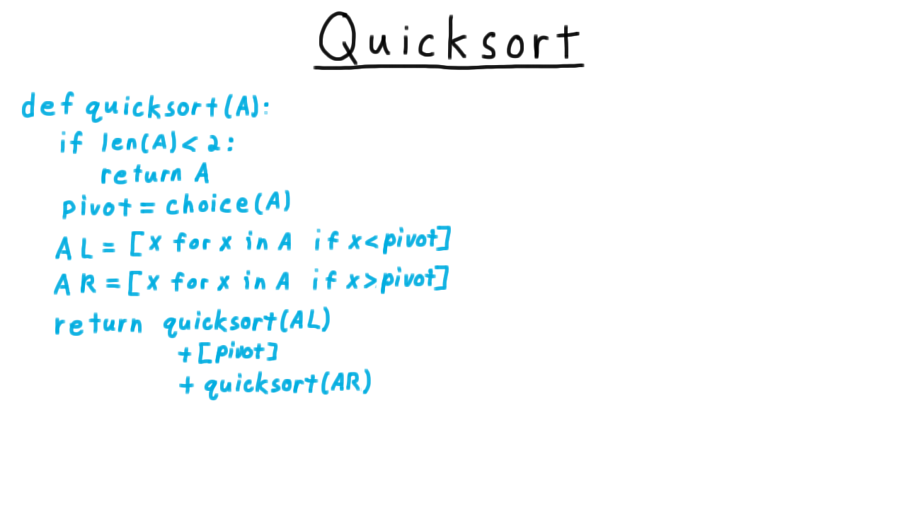

   Quicksort pseudocode with random pivot selection.

* **Best case** (ideal pivots): :math:`O(n \log n)`
* **Worst case** (always min/max pivot): :math:`O(n^2)`

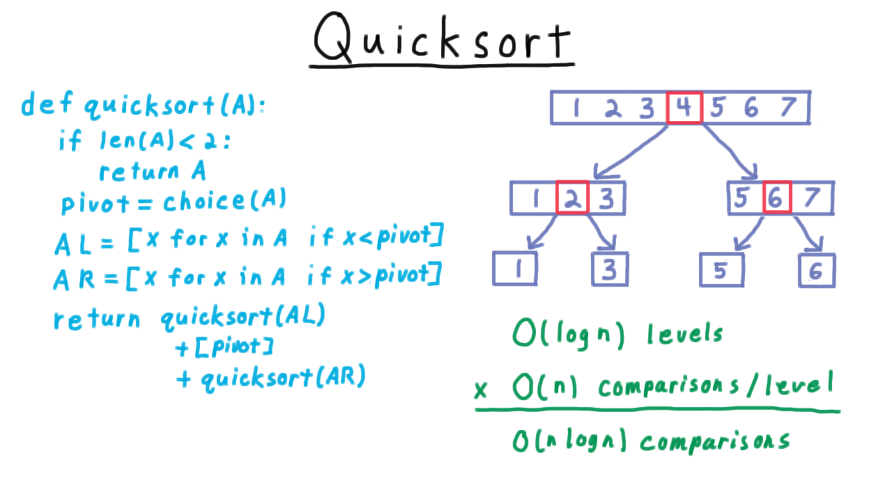

   Balanced recursion tree with near-median pivots.

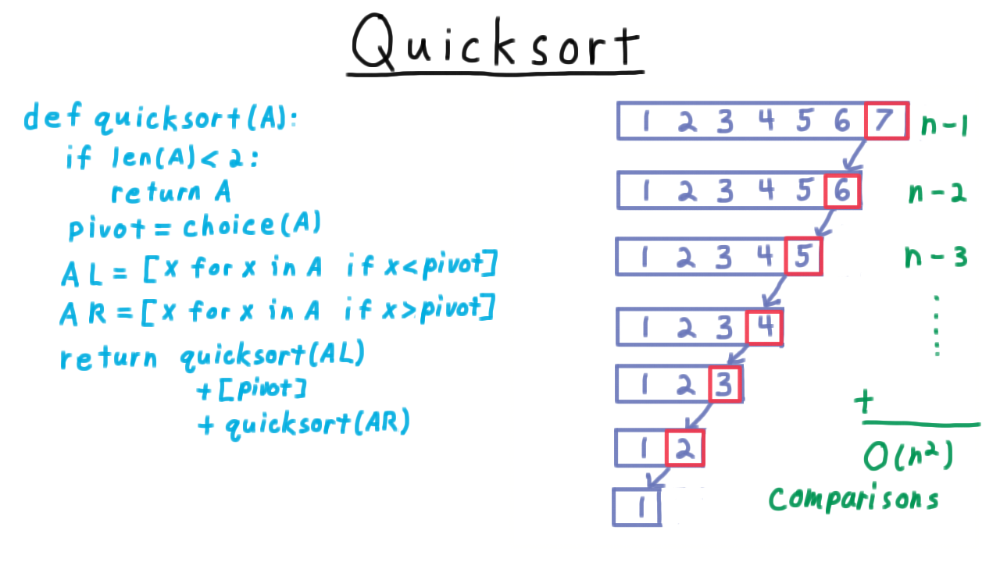

   Unbalanced recursion tree when the pivot is always extreme.

Expected-Case Analysis
~~~~~~~~~~~~~~~~~~~~~~

Let :math:`X_{ij} = 1` if elements :math:`z_i` and :math:`z_j` (with :math:`i < j`) are
ever compared, and 0 otherwise.

Two elements :math:`z_i` and :math:`z_j` are compared if and only if one of them is
chosen as the pivot before any element strictly between them. By symmetry:

.. math::

   \Pr(X_{ij} = 1) = \frac{2}{j - i + 1}

Total expected comparisons:

.. math::

   \mathbb{E}\!\left[\sum_{i < j} X_{ij}\right]
   = \sum_{i < j} \frac{2}{j-i+1}
   = \sum_{k=2}^{n} \frac{2(n-k+1)}{k}
   \leq 2n \sum_{k=1}^{n} \frac{1}{k}
   = O(n \log n)

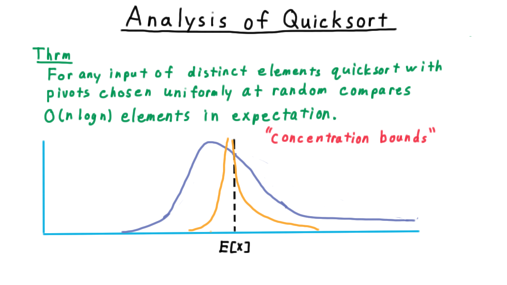

   Running time concentrates tightly around :math:`O(n \log n)` — large deviations
   are exponentially unlikely.

----

Karger's Minimum Cut Algorithm
--------------------------------

**Problem:** Given an undirected graph :math:`G = (V, E)`, find the minimum-sized set
of edges whose removal disconnects :math:`G`.

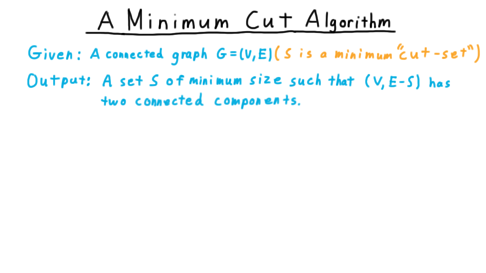

   Definition of a minimum cut.

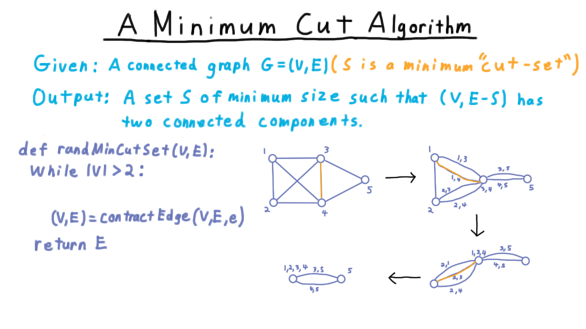

   Edge contraction example — merging two vertices into one.

**Algorithm (Karger's contraction):**

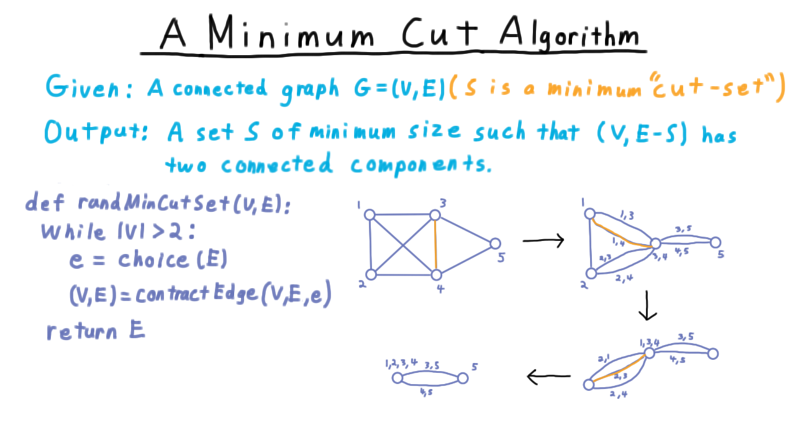

   Karger's algorithm pseudocode.

.. code-block:: text

   while |V| > 2:
       pick a random edge (u, v)
       contract u and v into a single vertex
       remove self-loops
   return the remaining edges (the cut)

Success Probability
~~~~~~~~~~~~~~~~~~~

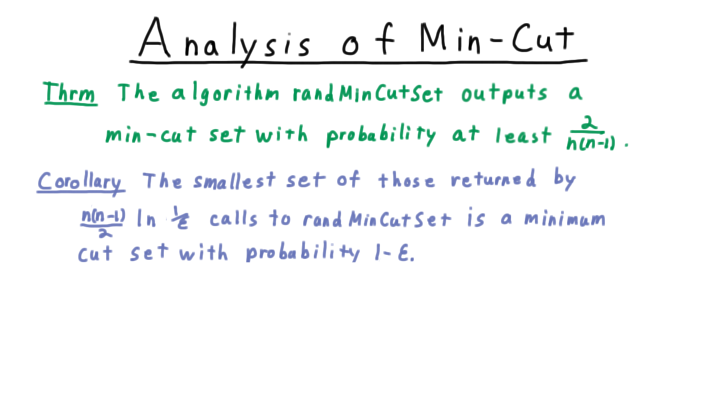

   Probability analysis for Karger's algorithm.

Let :math:`C` be a minimum cut of size :math:`k`. At contraction step :math:`j`
(when :math:`n - j` vertices remain), the probability that no edge of :math:`C` is
contracted is:

.. math::

   \Pr(E_{j+1} \mid E_1 \cap \cdots \cap E_j) \geq \frac{n - j - 2}{n - j}

Telescoping over all :math:`n - 2` steps:

.. math::

   \Pr[\text{success}] \geq \prod_{j=0}^{n-3} \frac{n-j-2}{n-j}
   = \frac{2}{n(n-1)}

**Amplification:** Run :math:`n(n-1)\ln(1/\varepsilon)` independent trials and return
the smallest cut found. Failure probability drops to at most :math:`\varepsilon`:

.. math::

   \Pr[\text{all fail}] \leq \left(1 - \frac{2}{n(n-1)}\right)^{n(n-1)\ln(1/\varepsilon)} \leq \varepsilon

----

Maximum 3-SAT
-------------

**Problem:** Given a 3-CNF formula with :math:`m` clauses, find an assignment
maximising the number of satisfied clauses.

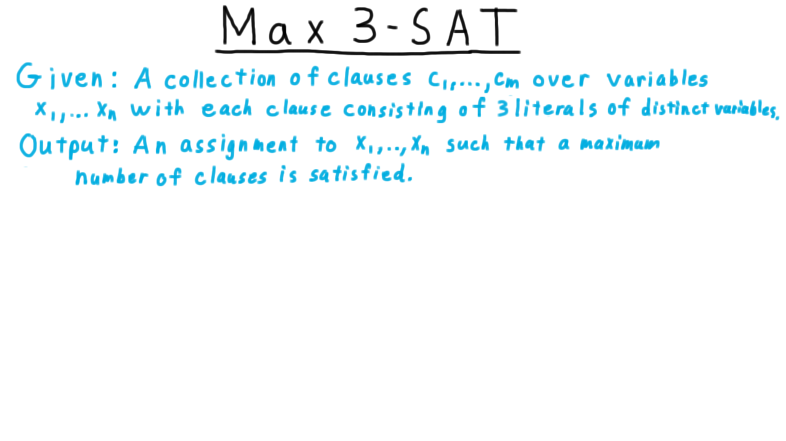

   Maximum 3-SAT problem definition.

**Theorem:** Every 3-CNF formula has an assignment satisfying at least :math:`7m/8`
clauses.

**Proof via expectation:** Each clause has exactly one out of :math:`2^3 = 8`
assignments that *fails* it. For a uniformly random assignment:

.. math::

   \Pr[\text{clause } C_i \text{ satisfied}] = \frac{7}{8}

By linearity of expectation:

.. math::

   \mathbb{E}[\text{satisfied clauses}] = \frac{7m}{8}

Since the expectation is :math:`7m/8`, some assignment must achieve at least this.

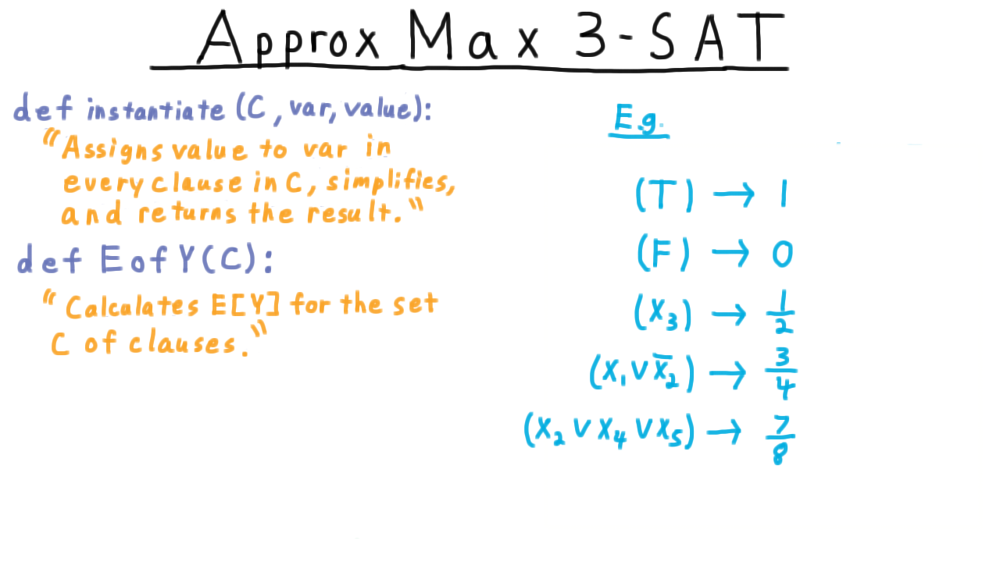

   Expected number of satisfied clauses equals :math:`7m/8`.

Derandomization via Method of Conditional Expectations
~~~~~~~~~~~~~~~~~~~~~~~~~~~~~~~~~~~~~~~~~~~~~~~~~~~~~~~~

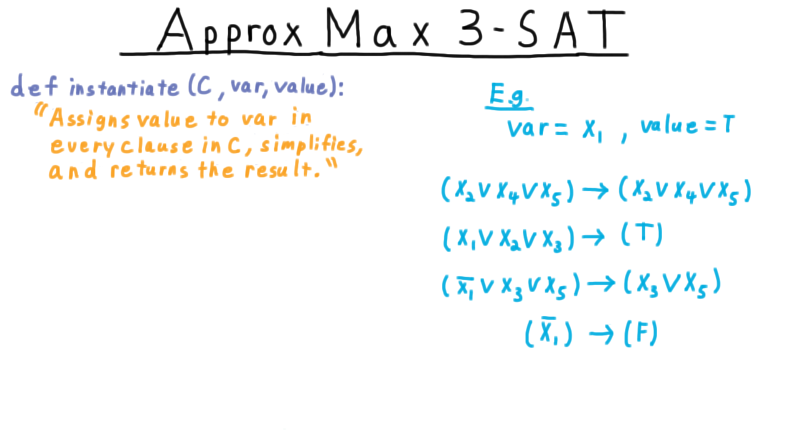

   Instantiate one variable at a time, choosing the value that maximises the
   conditional expected number of satisfied clauses.

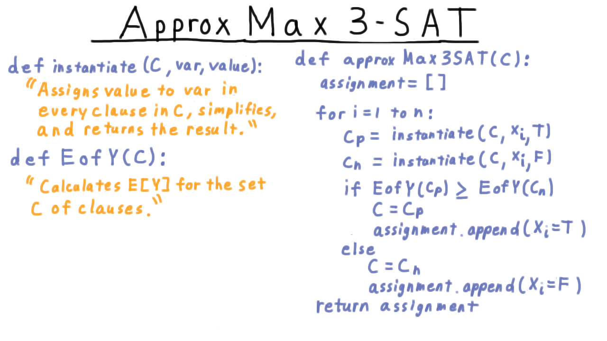

   Derandomized Max-3-SAT algorithm pseudocode.

.. code-block:: text

   for each variable x_i:
       compute E[satisfied | x_1,...,x_{i-1}, x_i = True]
       compute E[satisfied | x_1,...,x_{i-1}, x_i = False]
       set x_i to whichever gives the higher expectation

**Invariant:** At each step the conditional expectation :math:`\geq 7m/8`.

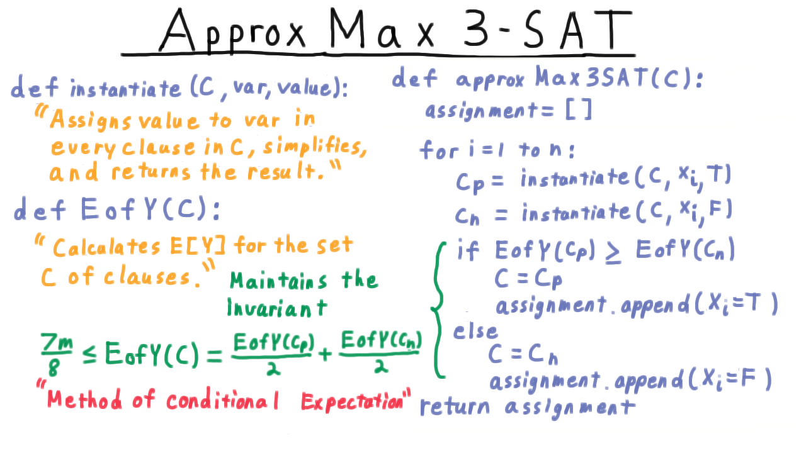

   Analysis: the greedy choice maintains :math:`\geq 7m/8` satisfied clauses throughout,
   giving a deterministic polynomial-time :math:`7/8`-approximation.

----

Hardness of Approximation and the PCP Theorem
----------------------------------------------

**Question:** Can we do better than :math:`7/8` for Max-3-SAT?

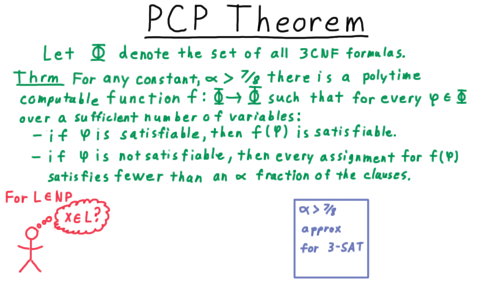

   Setup: what does a better approximation imply?

**PCP Theorem:** For any :math:`\alpha > 7/8` there exists a polynomial-time
reduction :math:`f` mapping 3-CNF formulas such that:

* Satisfiable formulas map to satisfiable formulas.
* Unsatisfiable formulas map to instances where *no* assignment satisfies more than
  an :math:`\alpha` fraction of clauses.

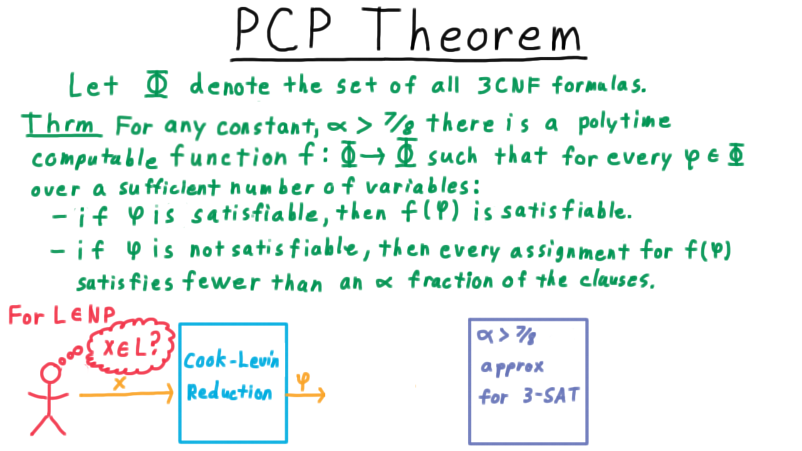

   Apply Cook-Levin to reduce an arbitrary NP language to SAT.

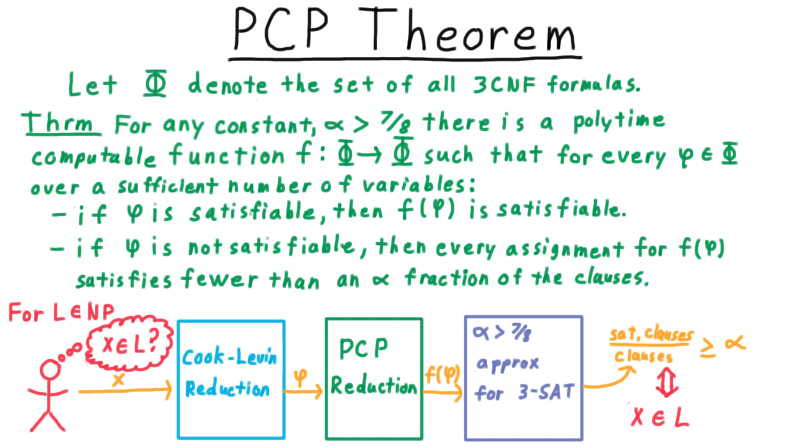

   Apply the PCP transformation, then use the approximation algorithm to
   distinguish the two cases — solving NP-complete problems in polynomial time.

**Conclusion:** An :math:`\alpha`-approximation for Max-3-SAT with :math:`\alpha > 7/8`
would imply :math:`P = NP`. The :math:`7/8` ratio is **tight**.

----

Complexity Classes
------------------

* **RP (Randomized Polynomial time):** One-sided Monte Carlo algorithms; always correct
  on "No" instances, correct on "Yes" instances with probability :math:`\geq 1/2`.
* **BPP (Bounded-error Probabilistic Polynomial time):** Two-sided Monte Carlo;
  correct on any instance with probability :math:`\geq 2/3`.
* **ZPP (Zero-error Probabilistic Polynomial time):** Las Vegas algorithms with
  expected polynomial runtime.

**Open question (P vs. BPP):** Whether every language decidable by a two-sided Monte
Carlo polynomial algorithm can also be decided deterministically in polynomial time
remains unresolved.

.. math::

   P \subseteq RP \subseteq BPP, \qquad ZPP = RP \cap \text{co-RP}

----

Key Formulas
------------

**Polynomial identity testing error bound:**

.. math::

   \Pr[\text{false positive}] \leq \frac{d}{|\text{domain}|}

**Linearity of expectation:**

.. math::

   \mathbb{E}\!\left[\sum_i X_i\right] = \sum_i \mathbb{E}[X_i]

**Quicksort expected comparisons:**

.. math::

   \mathbb{E}[\text{comparisons}] = \sum_{1 \leq i < j \leq n} \frac{2}{j-i+1} = O(n \log n)

**Karger's success probability:**

.. math::

   \Pr[\text{success}] \geq \frac{2}{n(n-1)}

**Max-3-SAT expectation:**

.. math::

   \mathbb{E}[\text{satisfied clauses}] = \frac{7m}{8}

----

Further Reading
---------------

* Chernoff bounds and tail inequalities for concentration results
* Universal hashing and randomized data structures
* Randomized rounding of LP relaxations
* Lovász Local Lemma for sparse dependency graphs
