Undecidability
==============

*From Computability, Complexity & Algorithms — Charles Brubaker and Lance Fortnow*

* Source: https://s3.amazonaws.com/content.udacity-data.com/courses/gt-cs6505/undecidability.html

----

Introduction
------------

Some problems are simply *impossible* to solve algorithmically — no compiler, no
computer, no quantum machine can decide them. The **halting problem** is the canonical
example: determining whether arbitrary code terminates on a given input is undecidable.

----

Diagonalization
---------------

The **diagonalization technique** constructs undecidability proofs by generating
self-referential paradoxes.

Motivating Example: Heterological Words
~~~~~~~~~~~~~~~~~~~~~~~~~~~~~~~~~~~~~~~~

An English adjective is **autological** if it describes itself (e.g., "short" is short)
and **heterological** if it does not (e.g., "long" is not long).

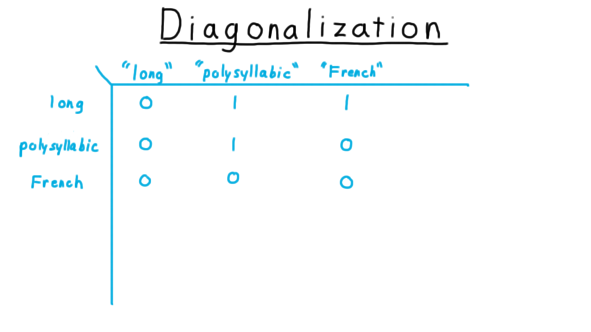

   Table of adjectives — rows are adjectives, columns are properties. A 1 means the
   adjective possesses that property.

**Paradox:** Is the word "heterological" itself heterological?

* If yes (it is heterological) → it describes itself → it is autological — contradiction.
* If no (it is autological) → it does not describe itself → it is heterological — contradiction.

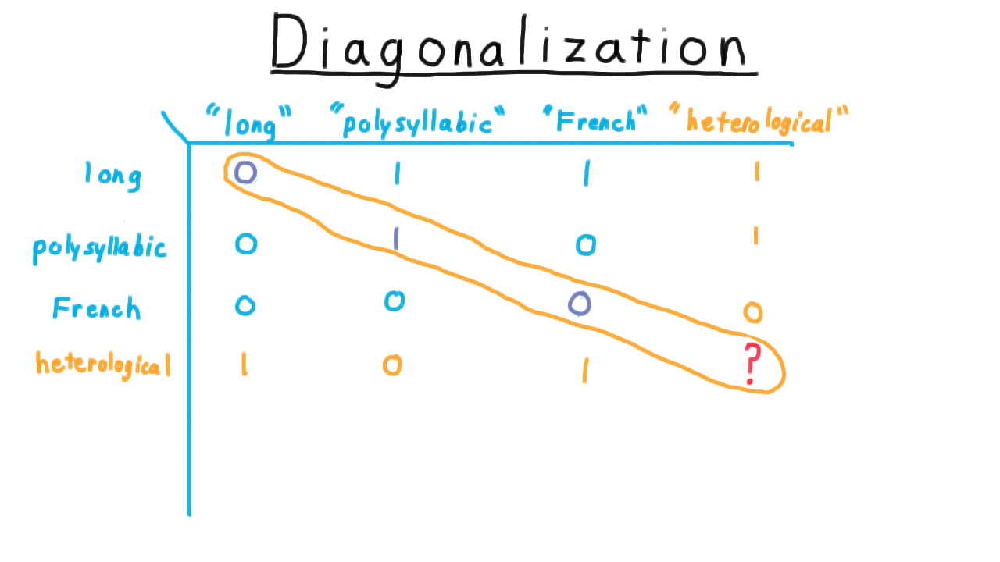

   The diagonal entry for "heterological" produces the paradox.

Application to Turing Machines
~~~~~~~~~~~~~~~~~~~~~~~~~~~~~~~~

Enumerate all Turing machines :math:`M_1, M_2, \ldots` and all their encodings
:math:`\langle M_1 \rangle, \langle M_2 \rangle, \ldots`

Build a table where entry :math:`(i, j) = 1` if :math:`M_i` accepts :math:`\langle M_j \rangle`.

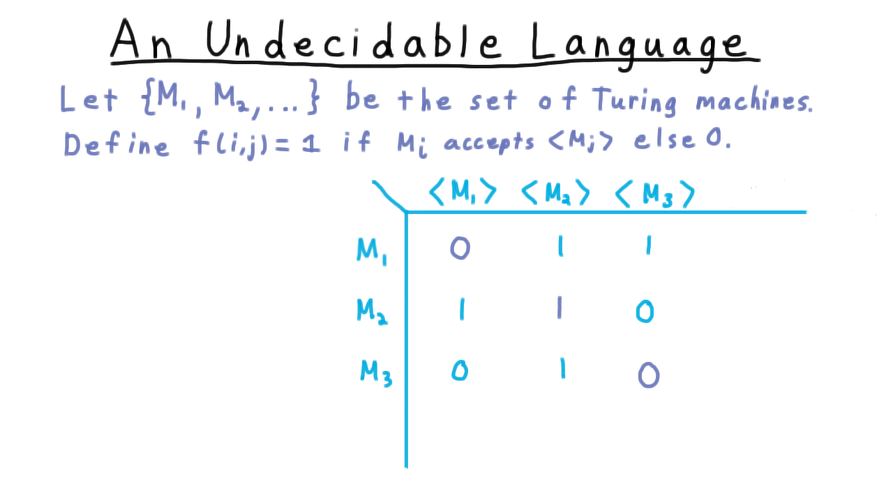

   Turing machine acceptance table — rows are machines, columns are encodings.

Define the **diagonal language**:

.. math::

   L = \{ \langle M \rangle \mid \langle M \rangle \notin L(M) \}

Suppose machine :math:`M_L` recognises :math:`L`. Is :math:`\langle M_L \rangle \in L(M_L)`?

* If yes → :math:`\langle M_L \rangle \in L` → :math:`\langle M_L \rangle \notin L(M_L)` — contradiction.
* If no → :math:`\langle M_L \rangle \notin L` → :math:`\langle M_L \rangle \in L(M_L)` — contradiction.

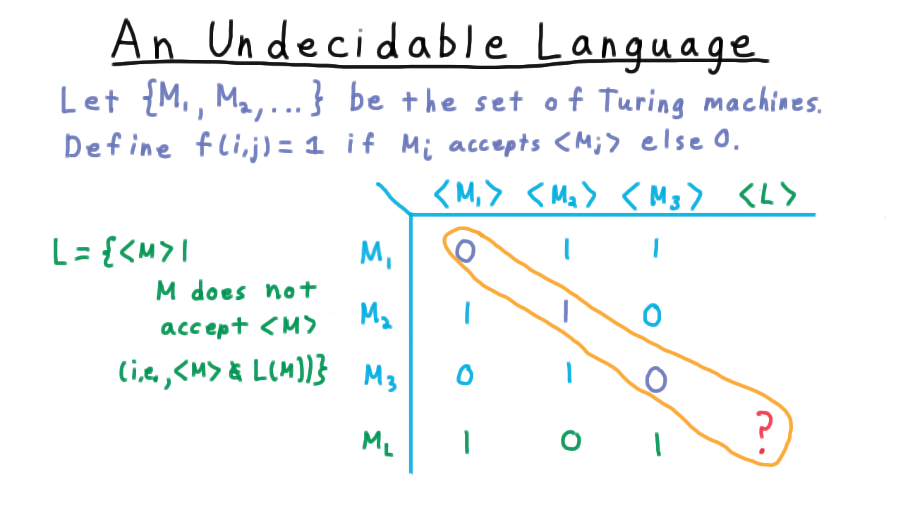

   The diagonal element for :math:`M_L` yields the contradiction — :math:`M_L` cannot exist.

**Conclusion:** :math:`L` is **not recognisable** (not even semi-decidable).

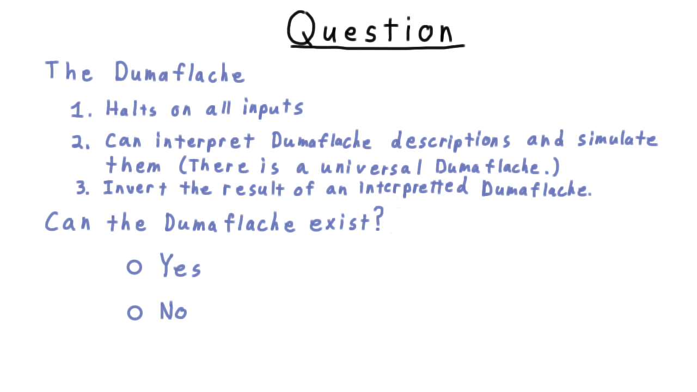

   *Quiz:* Does the argument apply to other computational models?

----

The Diagonal Language :math:`D_{TM}`
--------------------------------------

Define the complement:

.. math::

   D_{TM} = \{ \langle M \rangle \mid \langle M \rangle \in L(M) \}

Since :math:`L` (its complement) is unrecognisable, :math:`D_{TM}` is **not decidable**.
(A language is decidable iff both it and its complement are recognisable.)

----

Mapping Reductions
------------------

**Definition:** Language :math:`A` is **mapping-reducible** to language :math:`B`,
written :math:`A \leq_m B`, if there exists a computable function :math:`f` such that:

.. math::

   w \in A \iff f(w) \in B

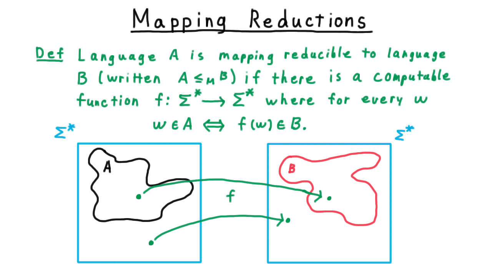

   Mapping reduction: a computable :math:`f` translates membership in :math:`A` to
   membership in :math:`B`.

Consequences
~~~~~~~~~~~~

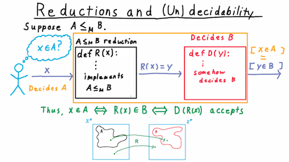

   Composing a reduction with a decider / recogniser for :math:`B` gives one for :math:`A`.

If :math:`A \leq_m B` then:

1. :math:`B` decidable :math:`\Rightarrow` :math:`A` decidable.
2. :math:`B` recognisable :math:`\Rightarrow` :math:`A` recognisable.
3. :math:`A` undecidable :math:`\Rightarrow` :math:`B` undecidable. *(contrapositive of 1)*
4. :math:`A` unrecognisable :math:`\Rightarrow` :math:`B` unrecognisable. *(contrapositive of 2)*

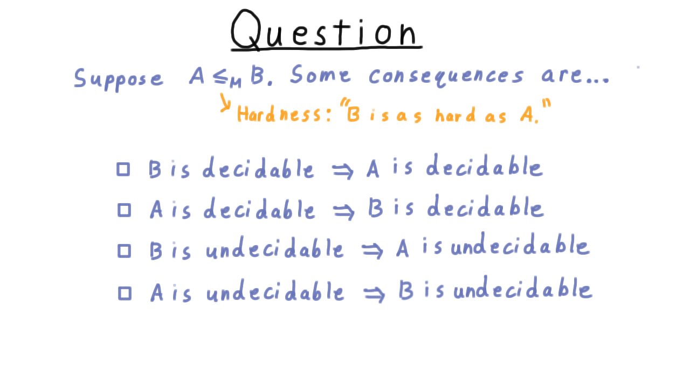

   *Quiz:* Which decidability / recognisability conclusions follow from given reductions?

Simple Reduction Pattern
~~~~~~~~~~~~~~~~~~~~~~~~

To show language :math:`B` is undecidable, reduce :math:`D_{TM} \leq_m B`:

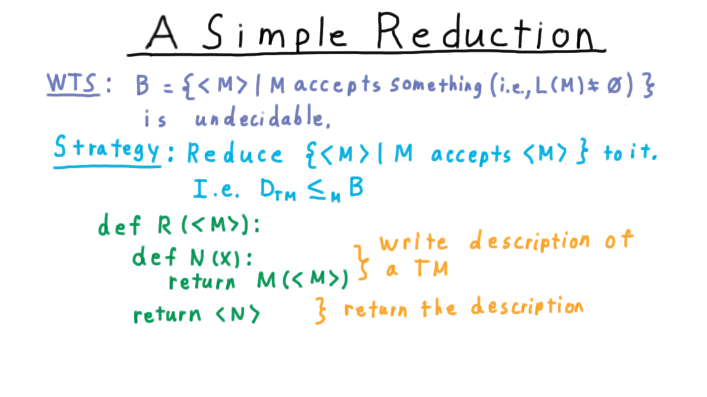

   Code structure for the reduction: given :math:`\langle M \rangle`, construct an
   input :math:`f(\langle M \rangle)` for :math:`B`.

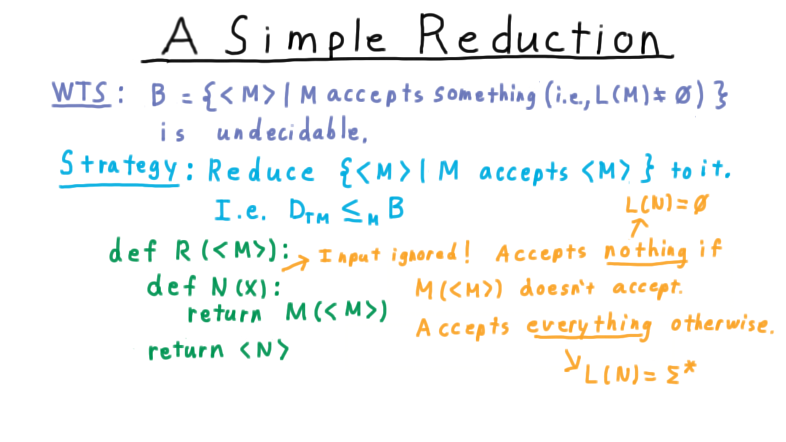

   Proof that :math:`B` is undecidable via the reduction.

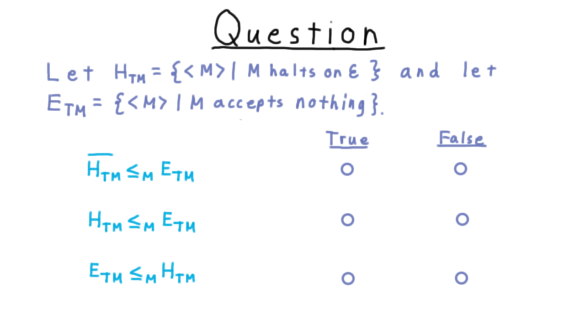

   *Quiz:* Which reduction directions are valid for the given problems?

----

The Halting Problem
-------------------

**Formal definition:**

.. math::

   H_{TM} = \{ \langle M \rangle \mid M \text{ halts on } \varepsilon \}

**Theorem:** :math:`H_{TM}` is undecidable.

**Proof (reduction** :math:`D_{TM} \leq_m H_{TM}`\ **):**

Given :math:`\langle M \rangle`, construct machine :math:`N`:

.. code-block:: text

   N on input w:
       ignore w
       run M on ⟨M⟩
       if M accepts ⟨M⟩: accept
       if M rejects ⟨M⟩: reject

Then :math:`\langle M \rangle \in D_{TM}` iff :math:`M` accepts :math:`\langle M \rangle`
iff :math:`N` halts on :math:`\varepsilon` iff :math:`\langle N \rangle \in H_{TM}`.

So :math:`f(\langle M \rangle) = \langle N \rangle` is the required computable reduction.

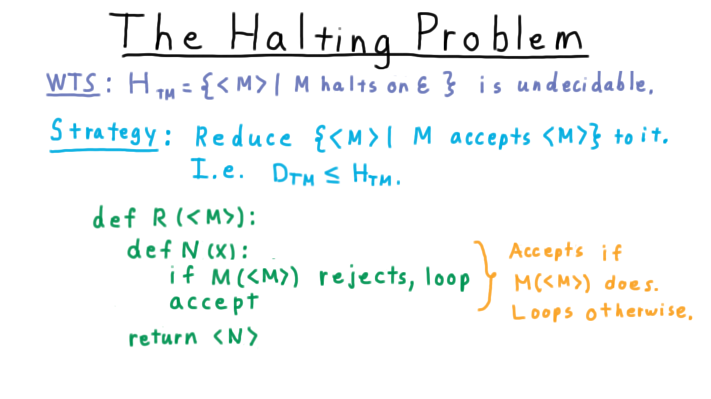

   Reduction machine :math:`N` demonstrating the undecidability of :math:`H_{TM}`.

**Significance:** No algorithm — on any hardware, including quantum computers — can
decide whether an arbitrary program halts on an arbitrary input.

Filtering
~~~~~~~~~

Some reductions cannot simply accept or reject everything; they must inspect the input
and conditionally simulate another machine:

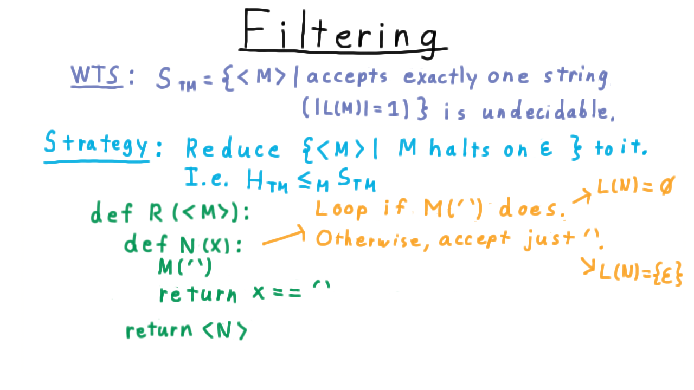

   Filtering technique: the reduction machine examines its input before deciding
   which computation to simulate.

----

Rice's Theorem
--------------

**Setup:** A **semantic property** of Turing machines is a set :math:`L` of TM
encodings such that :math:`L(M_1) = L(M_2) \Rightarrow (\langle M_1 \rangle \in L \iff \langle M_2 \rangle \in L)`.
In other words, :math:`L` depends only on *what* a machine computes, not *how* it computes it.

**Theorem (Rice):** Every non-trivial semantic property of Turing machines is undecidable.

*Non-trivial* means :math:`L` is neither empty nor the set of all TM encodings —
there exist machines both inside and outside :math:`L`.

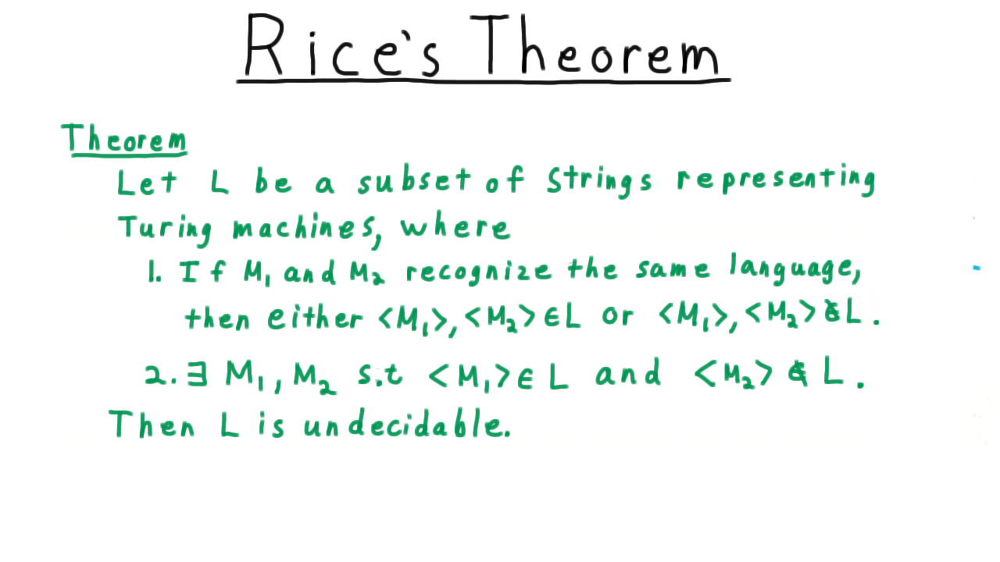

   Formal statement of Rice's theorem.

Proof Sketch (two cases)
~~~~~~~~~~~~~~~~~~~~~~~~

Let :math:`M_\emptyset` be a TM that immediately rejects everything
(:math:`L(M_\emptyset) = \emptyset`).

**Case 1:** :math:`\langle M_\emptyset \rangle \notin L`.
Let :math:`M_A \in L` (exists by non-triviality). Given :math:`\langle M \rangle`,
construct :math:`N`:

.. code-block:: text

   N on input x:
       run M on ⟨M⟩
       if M accepts ⟨M⟩: run M_A on x and return its answer
       else: reject

If :math:`\langle M \rangle \in D_{TM}`, then :math:`N` simulates :math:`M_A`,
so :math:`L(N) = L(M_A)` and :math:`\langle N \rangle \in L`.
Otherwise :math:`L(N) = \emptyset` and :math:`\langle N \rangle \notin L`.

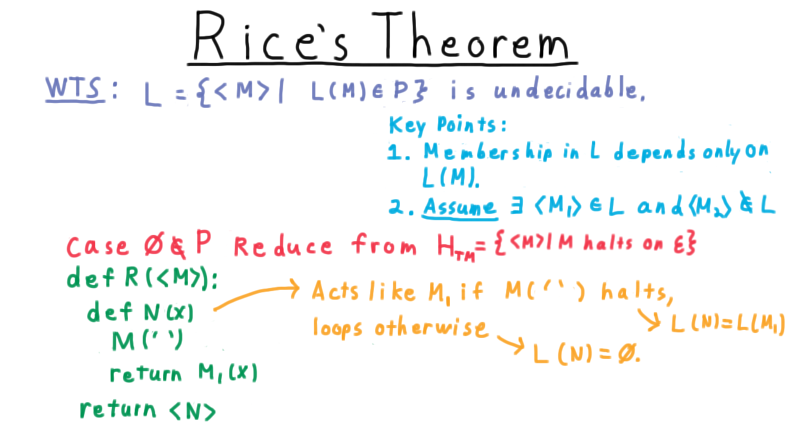

   Case 1 of Rice's theorem proof.

**Case 2:** :math:`\langle M_\emptyset \rangle \in L`.
Apply Case 1 to the complement :math:`\overline{L}` (also a non-trivial semantic
property), concluding :math:`\overline{L}` is undecidable, hence :math:`L` is undecidable.

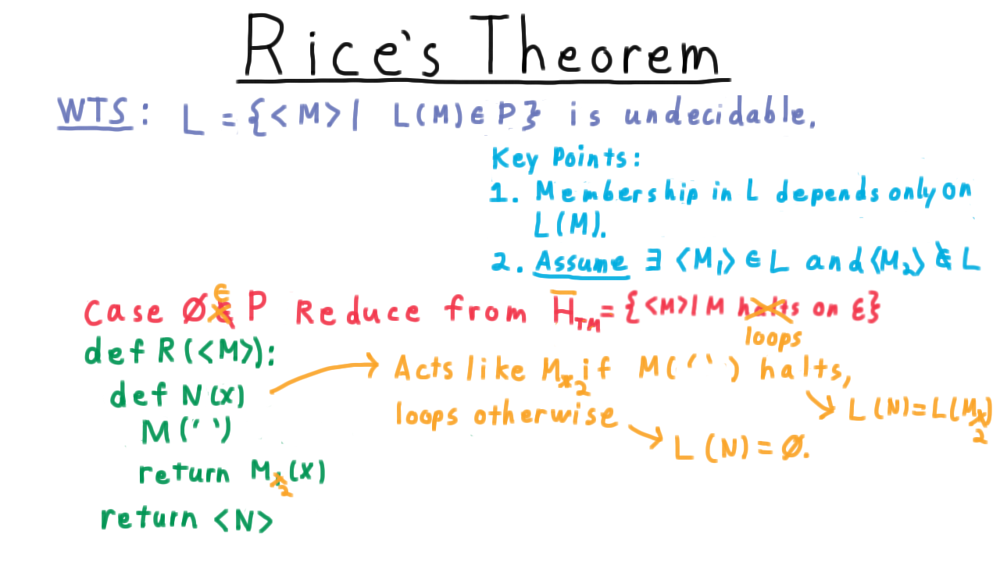

   Case 2 of Rice's theorem proof — apply Case 1 to the complement.

**Practical implication:** Any property of a program's *behaviour* — does it accept
the empty string? does it halt on all inputs? does it output "hello"? — is undecidable.

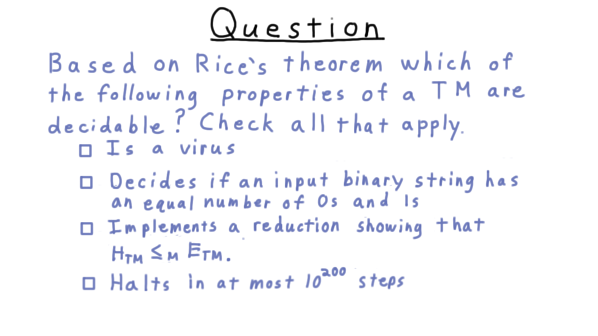

   *Quiz:* Apply Rice's theorem to classify properties as decidable or undecidable.

.. figure:: images/undecidability/HSClassroom.png
   :alt: HSClassroom

   Concluding remarks.

----

Proof Strategy Summary
-----------------------

To show language :math:`B` is undecidable:

1. Choose a known undecidable language :math:`A` (typically :math:`D_{TM}` or :math:`H_{TM}`).
2. Construct a computable function :math:`f` such that :math:`w \in A \iff f(w) \in B`.
3. Argue correctness: if a decider for :math:`B` existed, composing with :math:`f` would
   decide :math:`A` — contradiction.

----

Key Definitions
---------------

.. list-table::
   :header-rows: 1
   :widths: 30 70

   * - Term
     - Definition
   * - Decidable
     - A TM halts and accepts/rejects every input correctly.
   * - Recognisable (semi-decidable)
     - A TM accepts every string in the language; may loop on strings not in it.
   * - :math:`A \leq_m B`
     - Computable :math:`f` with :math:`w \in A \iff f(w) \in B`.
   * - Semantic property
     - Depends only on the language recognised, not the TM's implementation.
   * - Non-trivial property
     - Holds for some TMs and fails for others.

----

Key Results
-----------

.. math::

   L = \{ \langle M \rangle \mid \langle M \rangle \notin L(M) \} \quad \text{— unrecognisable (diagonalisation)}

.. math::

   D_{TM} = \{ \langle M \rangle \mid \langle M \rangle \in L(M) \} \quad \text{— undecidable}

.. math::

   H_{TM} = \{ \langle M \rangle \mid M \text{ halts on } \varepsilon \} \quad \text{— undecidable}

.. math::

   A \leq_m B,\ A \text{ undecidable} \;\Longrightarrow\; B \text{ undecidable}

.. math::

   \text{Rice's Theorem: every non-trivial semantic property is undecidable}

----

Further Reading
---------------

* Post Correspondence Problem — another natural undecidable problem
* Reducibility and the arithmetical hierarchy (:math:`\Sigma_1`, :math:`\Pi_1`, …)
* Gödel's incompleteness theorems — undecidability in formal logic
