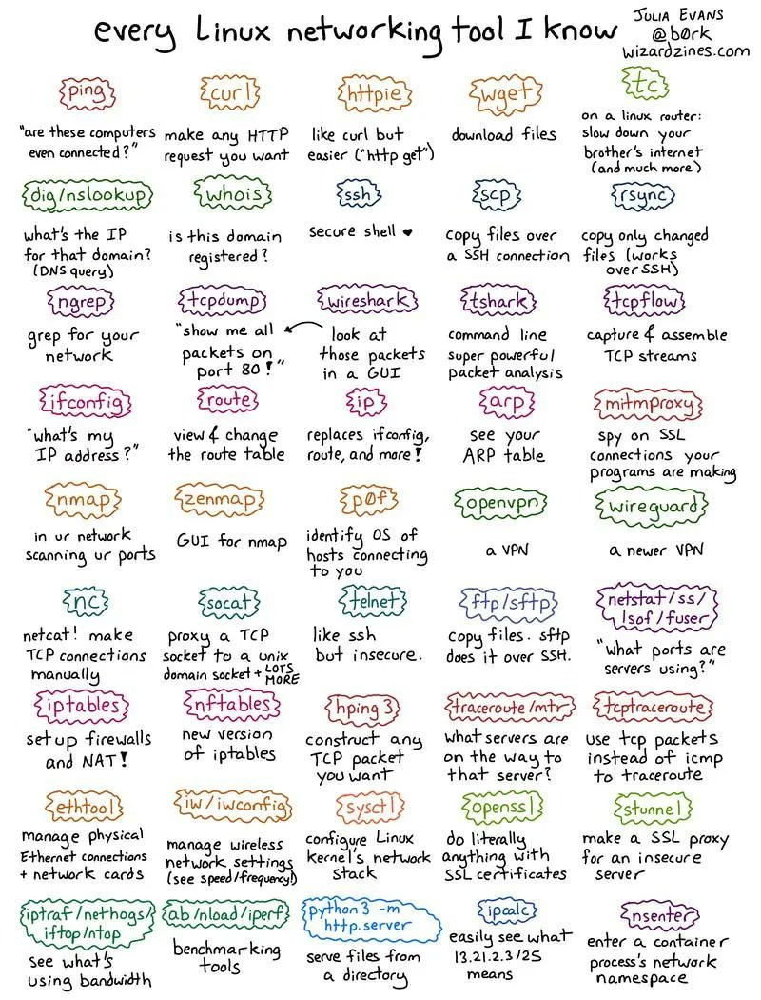

Resources
=========

* https://free-for.dev/#/

Visualization, Understanding and Playing
----------------------------------------

* Visualizing Algorithms: https://visualgo.net/
* Data Structure Visualizations: https://www.cs.usfca.edu/~galles/visualization/Algorithms.html
* Competitive Programming: https://cpbook.net/
* PyAlgo Viz: https://pyalgoviz.appspot.com/
* Fast Fourier Transform explained visually: http://acko.net/files/gltalks/toolsforthought/#0
* Free Programming Resources: https://www.thefreecountry.com/
* My Physics Lab: https://www.myphysicslab.com

Self Learning Functional CS
---------------------------

* https://functionalcs.github.io/curriculum/ - Entire multi-year curriculum for Functional thinking in Computer Science.

.. todo::

   **Visualization, Understanding and Playing**

   * `Visualizing Algorithms <https://visualgo.net/>`_
   * `Data Structure Visualizations <https://www.cs.usfca.edu/~galles/visualization/Algorithms.html>`_
   * `Fast Fourier Transform explained visually <http://acko.net/files/gltalks/toolsforthought/#0>`_

